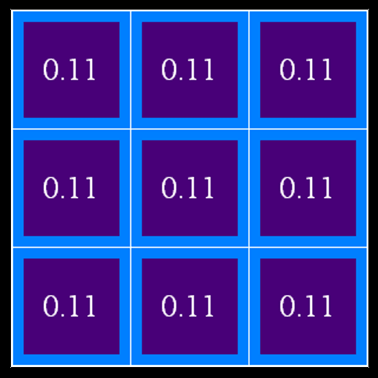
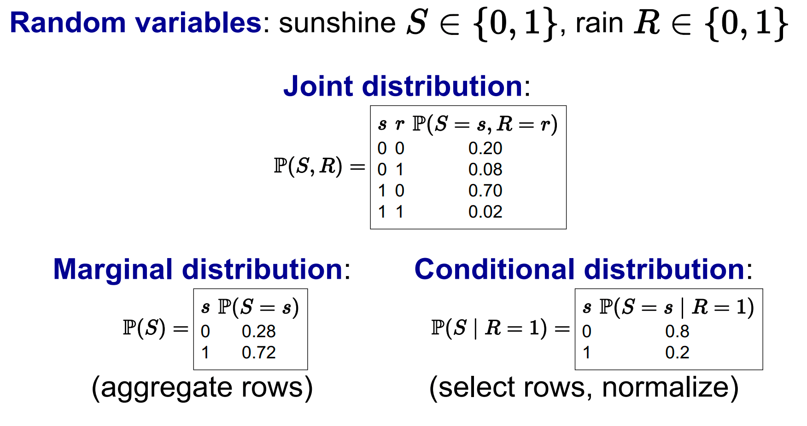
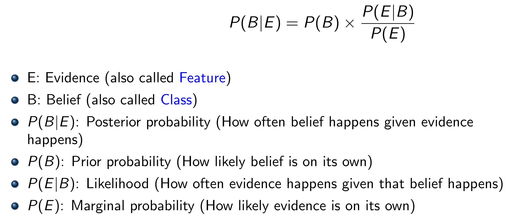

# 贝叶斯（一）— 概率基础与贝叶斯规则

> [!abstract] 本节导览
> 本部分（第 12–13 章）研究**不确定性的量化**与**概率推理**。本节打基础：为什么需要概率（逻辑的局限）、概率的基本定律、**随机变量与联合/边缘/条件分布**、**通过枚举做推理**，以及核心工具 **贝叶斯规则**。为后续 贝叶斯网络 做准备。

## 为什么需要概率：不确定性

> [!important] 逻辑处理不确定性的困难
> 牙痛诊断：`Toothache ⇒ Cavity` 不正确（也可能是牙龈病）；`Cavity ⇒ Toothache` 也不对（不是所有洞都痛）。用逻辑的两大困难：
> - **惰性（Laziness）**：列出完整前提/结论集合工作量太大；
> - **无知（Ignorance）**：理论认知不全、有些测试无法进行。
> 现实充满不确定性（部分可观察、嘈杂传感器、复杂性、动态未知）。**概率断言总结了无知与惰性的影响**。

> [!example] 鬼位置的概率分布（信念）
> 在没有任何观测前，鬼可能在任意格子——先验是**均匀分布**：每个格子概率均为 $1/9\approx0.11$。随着传感器读数到来，再用概率推理更新这张「信念分布表」。
>
> 

> [!note] 概率 + 效用 = 决策论
> 理性 agent 结合概率论与效用论，**最大化期望效用**：
> $$a^* = \arg\max_a \sum_s P(s\mid a)\,U(s)$$

## 基本概率定律

> [!important] 概率模型
> - 可能世界集合 $\Omega$（如骰子 {1,...,6}）；概率模型给每个世界 $w$ 赋 $P(w)$，满足 $0\le P(w)\le 1$、$\sum_{w}P(w)=1$。
> - **事件** = $\Omega$ 的子集；事件概率 = 其世界概率之和：$P(A)=\sum_{w\in A}P(w)$。
> - **De Finetti 定理**：违反这些定律下注的人必然每次都赔钱。

> [!important] 随机变量与分布
> - **随机变量** $X$ 是 $w$ 的确定性函数（如 Odd、Temperature、LGhost）。
> - **概率分布** $P(X)$ 给每个取值 $x$ 赋概率 $P(X=x)=\sum_{w:X(w)=x}P(w)$，整体视为向量/表格。
> - $n$ 个域大小为 $d$ 的变量 ⟹ 概率分布大小 $d^n$。

## 联合、边缘、条件分布

> [!important] 三种分布的关系
> - **联合分布 $P(X,Y)$**：每组取值的总概率，包含所有信息。
> - **边缘化（求和消元）**：$P(X=x) = \sum_y P(X=x, Y=y)$。
> - **条件概率**：$P(a\mid b) = \dfrac{P(a,b)}{P(b)}$。

> [!example] Temperature × Weather 联合分布
> 由联合表可算任意事件：$P(\text{hot})=\sum_W P(\text{hot},W)$；$P(W=\text{sun}\mid T=\text{cold})=\frac{P(\text{sun,cold})}{P(\text{cold})}=\frac{0.15}{0.50}=0.3$。
> 容斥：$P(A\vee B)=P(A)+P(B)-P(A\wedge B)$。

> [!note] 归一化 Trick
> 求条件分布 $P(W\mid T=c)$ 时：① 选出与证据 $T=c$ 匹配的联合条目；② 归一化（乘 $\alpha=1/\sum$ 使其和为 1）。

> [!important] 乘法原则与链式规则
> - **乘法原则**：$P(a,b)=P(a\mid b)P(b)=P(b\mid a)P(a)$。
> - **链式规则**：$P(x_1,\dots,x_n)=\prod_{i=1}^n P(x_i\mid x_1,\dots,x_{i-1})$。

## 通过枚举进行推理（Inference by Enumeration）

> [!important] 三步法
> 已知联合分布 $P(X_1,\dots,X_n)$。设查询变量 $Q$、证据 $E_1{=}e_1,\dots$、隐藏变量 $H_1,\dots,H_r$，求 $P(Q\mid e_1,\dots,e_k)$：
> 1. **选**出与证据一致的条目；
> 2. **求和消去隐藏变量** $H$：$P(Q,e_1,\dots,e_k)=\sum_{h_1,\dots,h_r}P(Q,h_1,\dots,h_r,e_1,\dots,e_k)$；
> 3. **归一化**：$P(Q\mid e_1,\dots,e_k)=\alpha\,P(Q,e_1,\dots,e_k)$。

> [!example] S(season)×T×W 例
> $P(W{=}\text{sun})=0.3+0.1+0.1+0.15=0.65$；$P(W{=}\text{sun}\mid \text{winter})=\frac{0.1+0.15}{0.5}=0.5$；$P(W{=}\text{sun}\mid \text{winter,hot})=\frac{0.1}{0.15}=0.67$。

> [!warning] 枚举的复杂度
> $n$ 个域大小 $d$ 的变量：时间/空间均 $O(d^n)$，需 $O(d^n)$ 数据点估计——**指数级**！这正是引入贝叶斯网络的动机。

## 贝叶斯规则（Bayes' Rule）

> [!important] 核心公式
> 由乘法原则 $P(a\mid b)P(b)=P(b\mid a)P(a)$，两边除以 $P(b)$：
> $$P(a\mid b) = \frac{P(b\mid a)\,P(a)}{P(b)}$$
> - **作用**：逆向构建条件——一个方向棘手，另一个相对简单（如已知"病→症状"求"症状→病"）。
> - 描述从**先验 $P(a)$** 到**后验 $P(a\mid b)$** 的更新；是语音识别、机器翻译等众多 AI 系统的基础。
> - 术语：$P(a\mid b)$=后验、$P(a)$=先验、$P(b\mid a)$=似然、$P(b)$=边缘概率（证据）。

> [!example] 医学诊断
> M=脑膜炎，S=脖子僵硬。$P(s\mid m)=0.8, P(m)=0.0001, P(s)=0.01$：
> $$P(m\mid s)=\frac{0.8\times0.0001}{0.01}=0.008$$
> 后验仍很小——**因为先验 $P(m)$ 极低**（基率效应），但仍值得检查脖子。

> [!example] 病毒检测（基率谬误）
> 0.1% 感染；感染者测试 99% 阳性；未感染者 95% 阴性（即 5% 假阳性）。测试阳性的真实感染概率：
> $$P(v\mid +)=\frac{P(+\mid v)P(v)}{P(+)}=\frac{0.99\times0.001}{0.99\times0.001+0.05\times0.999}\approx 0.019$$
> **概率很低**——因为健康人基数大，5% 假阳性产生的阳性远多于真阳性。

## 本章小结

> [!summary] 要点回顾
> - 概率用来**量化不确定性**，弥补逻辑面对惰性/无知的不足；理性 = 最大化期望效用。
> - 基本定律：$0\le P(w)\le1$、$\sum P(w)=1$；**边缘化**求和消元、**条件** $P(X|Y)=P(X,Y)/P(Y)$、**链式规则**。
> - **枚举推理**三步（选条目→求和隐变量→归一化），但 $O(d^n)$ 指数级。
> - **贝叶斯规则** $P(a|b)=\frac{P(b|a)P(a)}{P(b)}$ 实现先验→后验更新；注意**基率效应**导致后验可能反直觉地低。

## 自测题

> [!question] 检验你的理解
> 1. 用逻辑处理不确定性有哪两大困难？为什么用概率？
> 2. 写出边缘化、条件概率、乘法原则、链式规则的公式。
> 3. 枚举推理的三步是什么？时间复杂度为何是指数级？
> 4. 写出贝叶斯规则，并标出先验、似然、后验、证据各项。
> 5. 病毒检测例中，为什么测试阳性的真实感染概率却很低？
> 6. 归一化 Trick 如何从联合分布求条件分布？
