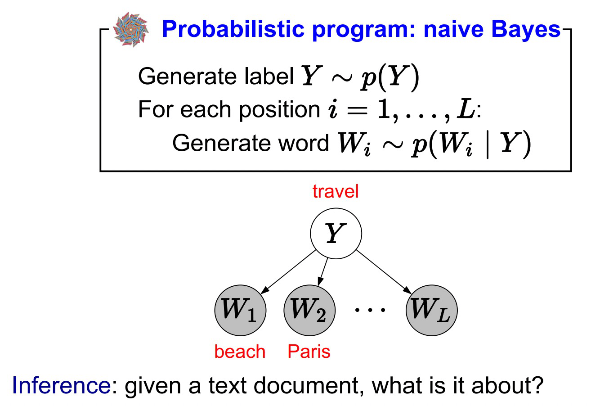
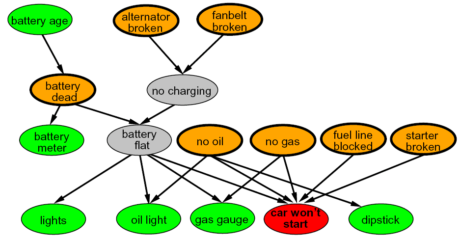
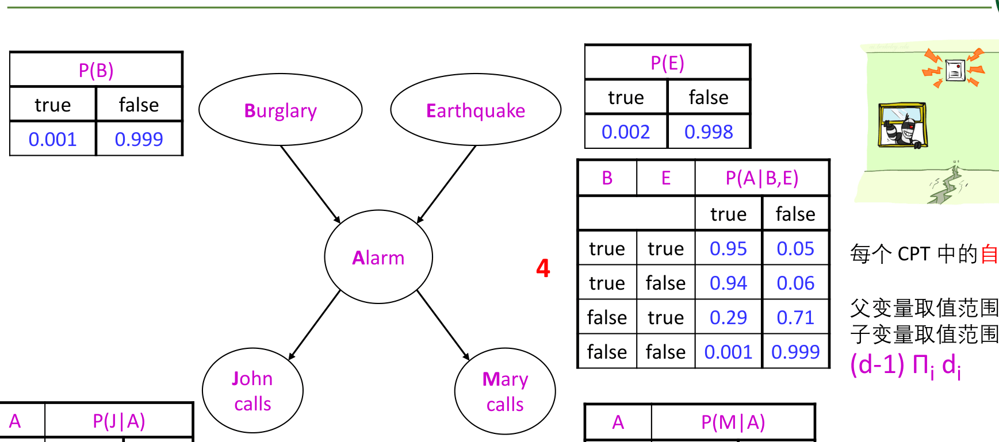

# 贝叶斯（二）— 独立性、朴素贝叶斯与贝叶斯网络

> [!abstract] 本节导览
> 承接 [[第10周星期三-贝叶斯1_概率基础与贝叶斯规则_笔记|概率基础]]。枚举推理 $O(d^n)$ 不可行，关键突破口是**独立性**与**条件独立性**。本节由此引出 **朴素贝叶斯（Naïve Bayes）** 分类器，并正式定义 **贝叶斯网络** 的语法（DAG + CPT）与语义。

## 独立性（Independence）

> [!important] 绝对独立
> $X,Y$ **独立** ⟺ $\forall x,y:\ P(x,y)=P(x)P(y)$，等价于 $P(x\mid y)=P(x)$。
> - 联合分布可分解为更简单分布的乘积。如 $n$ 次独立抛硬币：$P(X_1,\dots,X_n)=\prod_i P(X_i)$，表示从 $2^n$ 降到 $O(n)$ 个参数。
> - **问题**：变量两两独立极少见——只要有任何间接联系，独立性就不成立。

## 条件独立性（Conditional Independence）

> [!important] 定义
> 给定 $Z$，$X$ **条件独立于** $Y$ ⟺
> $$\forall x,y,z:\ P(x\mid y,z)=P(x\mid z) \quad\Longleftrightarrow\quad P(x,y\mid z)=P(x\mid z)P(y\mid z)$$
> 这是关于不确定环境**最基本、最强大**的知识表示。

> [!example] 牙科例子
> 
>
> 给定 Cavity（蛀牙），Catch（探针卡入）条件独立于 Toothache（牙痛）：
> $$P(\text{Catch}\mid \text{Toothache, Cavity})=P(\text{Catch}\mid \text{Cavity})$$
> $$P(\text{Toothache, Catch}\mid \text{Cavity})=P(\text{Toothache}\mid\text{Cavity})P(\text{Catch}\mid\text{Cavity})$$
> 其他例子：给定 Raining，Traffic 与 Umbrella 条件独立；给定 Fire，Smoke 与 Alarm 条件独立。

## 朴素贝叶斯模型（Naïve Bayes）

> [!important] Ghostbusters 的启发
> 联合分布 $P(G, C_{1,1},\dots,C_{3,3})$ 有 $9\times4^9\approx 236$ 万条目！但每个传感器 $C_{x,y}$ 只依赖到鬼的距离，**给定 G 时各传感器条件独立**。用链式规则 + 条件独立简化：
> $$P(G, C_{1,1},\dots,C_{3,3}) = P(G)\prod_{x,y} P(C_{x,y}\mid G)$$
> 把指数级条目降到**二元级**。

> [!important] 朴素贝叶斯模型结构
> - 一个**查询变量/类变量** $C$（如鬼位置 G）；
> - 多个**证据变量** $x_1,\dots,x_d$；
> - **给定类变量时，所有证据变量条件独立**（各自独立地影响类）。
> - 联合：$P(C, x_1,\dots,x_d)=P(C)\prod_i P(x_i\mid C)$。

> [!note] 朴素贝叶斯分类器
> 分类任务：把样本 $\mathbf{x}$ 分到使后验最大的类：
> $$P(c\mid\mathbf{x}) = \frac{P(c)P(\mathbf{x}\mid c)}{P(\mathbf{x})}, \quad P(\mathbf{x}\mid c)=\prod_{i=1}^d P(x_i\mid c)$$
> - **生成式模型**：先建模联合 $P(\mathbf{x},c)$ 再得后验（vs. 判别式直接建模 $P(c\mid\mathbf{x})$，如决策树/SVM/神经网络）。
> - 估计：$P(c)=\frac{|D_c|}{|D|}$（类先验），$P(x_i\mid c)=\frac{|D_{c,x_i}|}{|D_c|}$。$P(\mathbf{x})$ 与类无关，仅作归一化。

> [!summary] 朴素贝叶斯优劣与应用
> - **优点**：实现简单、计算高效、可多分类、适合文本分类（垃圾邮件、情感分析）、实时预测、推荐系统。
> - **缺点**：**特征独立的强假设**在现实中几乎不成立；小数据集精度下降；预测概率（而非分类）时结果偏颇。

## 贝叶斯网络（Bayes Nets）

> [!important] Big Picture
> 贝叶斯网络用**简单的条件分布**描述**复杂的联合分布**，属于图模型，利用**局部因果关系/条件独立性**。

> [!important] 语法 = 拓扑（图）+ 局部条件概率
> - **结点**：变量（可观测/未观测）。
> - **有向边**：变量间的"直接影响"，编码条件独立信息。
> - 用**有向无环图（DAG）** 刻画依赖关系，每个结点配一张**条件概率表（CPT）**：每行给出"给定父变量值时子变量的分布"。

> [!example] 警报贝叶斯网络（经典）
> 结点：Burglary(B), Earthquake(E), Alarm(A), JohnCalls(J), MaryCalls(M)。结构 B→A←E, A→J, A→M。
> - CPT 自由参数数 = $(d-1)\prod_i d_i$（$d$ 子变量域大小，$d_i$ 父变量域大小）。每行总和为 1，故 $P(M{=}\text{true}\mid A)$ 给定后 false 自动确定。
>
> 

> [!important] 全局语义：联合分布的分解
> $$P(X_1,\dots,X_n) = \prod_i P(X_i\mid \text{Parents}(X_i))$$

> [!example] 计算联合概率
> 警报网络中：
> $$P(b,\neg e,a,\neg j,\neg m) = P(b)P(\neg e)P(a\mid b,\neg e)P(\neg j\mid a)P(\neg m\mid a)$$
> $$= 0.001\times0.998\times0.94\times0.1\times0.3 = 0.000028$$

> [!tip] 稀疏贝叶斯网络的表示优势
> $n$ 个变量、最大域 $d$、最多 $k$ 个父结点：完整联合需 $O(d^n)$，而贝叶斯网络只需 $O(n\cdot d^k)$。
> 例 $n=30, k=5, d=2$：$2^{30}\approx 10^9$ vs. $30\times2^5=960$——**天壤之别**。

## 本章小结

> [!summary] 要点回顾
> - **独立性** $P(x,y)=P(x)P(y)$ 罕见；**条件独立** $P(x|y,z)=P(x|z)$ 是最强大的知识表示。
> - **朴素贝叶斯**：给定类变量时证据条件独立，$P(c|\mathbf{x})\propto P(c)\prod_i P(x_i|c)$，是高效的生成式分类器（特征独立假设虽强但实用）。
> - **贝叶斯网络** = DAG（拓扑）+ CPT（局部条件概率），全局语义 $P(X_1,\dots,X_n)=\prod_i P(X_i|\text{Parents}(X_i))$。
> - 稀疏网络把表示从 $O(d^n)$ 降到 $O(n d^k)$。

## 自测题

> [!question] 检验你的理解
> 1. 绝对独立与条件独立的定义分别是什么？为什么条件独立更有用？
> 2. 朴素贝叶斯的核心假设是什么？写出其分类后验公式。
> 3. 生成式模型与判别式模型有何区别？朴素贝叶斯属于哪类？
> 4. 贝叶斯网络的语法由哪两部分组成？CPT 每行需满足什么约束？
> 5. 写出贝叶斯网络的全局语义公式，并用警报网络算一个联合概率。
> 6. 稀疏贝叶斯网络相比完整联合分布在参数量上有何优势（给出量级）？
