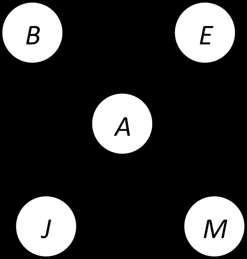
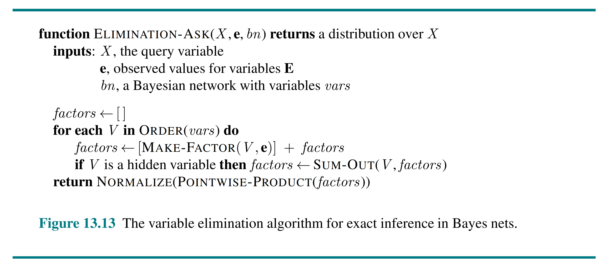
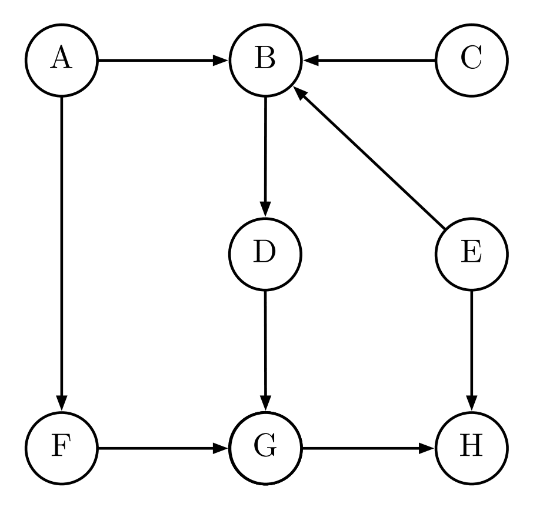
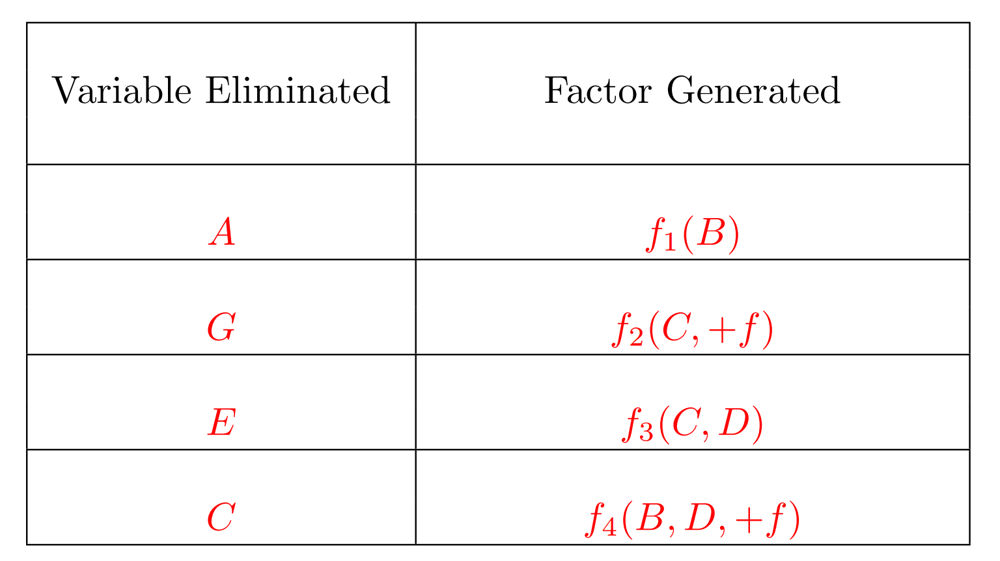

# 贝叶斯（三）— 条件独立性与变量消元

> [!abstract] 本节导览
> 承接 [[第10周星期五-贝叶斯2_独立性朴素贝叶斯与贝叶斯网络_笔记|贝叶斯网络语法语义]]。本节先讲贝叶斯网络蕴含的**条件独立性**（含**马尔科夫覆盖**），再讲精确推理：枚举推理为何指数级，以及高效的 **变量消元法（Variable Elimination）**——核心是**因子（factor）**的逐点相乘与求和消元，最后引出近似推理（采样）。

## 贝叶斯网络的条件独立性

> [!important] 从全局语义推出独立性
> 对比全局语义 $P(X_1,\dots,X_n)=\prod_i P(X_i\mid\text{Parents}(X_i))$ 与链式法则 $\prod_i P(X_i\mid X_1,\dots,X_{i-1})$：
> 若按拓扑序排列（父结点在前），则 $\text{Parents}(X_i)\subseteq\{X_1,\dots,X_{i-1}\}$，故
> $$P(X_i\mid X_1,\dots,X_{i-1}) = P(X_i\mid \text{Parents}(X_i))$$
> 即**给定父结点，一个结点条件独立于它的其他祖先**。
> 更一般地：**给定父变量，每个变量条件独立于它的所有非后代**。

> [!important] 马尔科夫覆盖（Markov Blanket）
> 一个结点的**马尔科夫覆盖**包括：它的**父结点、子结点、以及子结点的其他父结点**。
> **给定其马尔科夫覆盖，该变量条件独立于网络中所有其他变量。**
> （注意：子结点的父结点也要包含——因为"共因"会通过子结点产生关联。）

## 精确推理：枚举的困境

> [!note] 推理什么
> - **后验边缘概率** $P(Q\mid e_1,\dots,e_k)$（如"我可能得什么病"）；
> - **最可能解释** $\arg\max_{q,r,s}P(Q,R,S\mid e)$（如"他说了什么"）。

> [!warning] 枚举推理指数级
> $$P(B\mid j,m)=\alpha\sum_{e,a}P(B)P(e)P(a\mid B,e)P(j\mid a)P(m\mid a)$$
> 是"许多数字乘积的求和"，但**乘积项指数级多**，最坏需对所有变量求和。

> [!tip] 关键观察：提取公因子
> 类比 $uwy+uwz+\dots+vxz$（16 乘 7 加）可重写为 $(u+v)(w+x)(y+z)$（2 乘 3 加）。求和式中有**大量重复子表达式**——把求和项**尽量向内移动**：
> $$P(B\mid j,m)=\alpha\,P(B)\sum_e P(e)\sum_a P(a\mid B,e)P(j\mid a)P(m\mid a)$$

## 变量消元法（Variable Elimination）

> [!important] 核心数据结构：因子（Factor）
> 因子是以**参变量取值为索引**的多维表，标记涉及特定变量的 P 值。"Factor Zoo"：
> - $P(A,J)$：联合（所有取值，和为 1）；$P(a,J)$：部分实例化；
> - $P(Y\mid x)$：单条件（固定 x，和为 1）；$P(Y\mid X)$：条件族（每行和为 1）。

> [!important] 操作 1：逐点相乘（Pointwise Product）
> 注意**不是矩阵乘法**。新因子变量集 = 两因子变量的并集；每个条目 = 对应条目的乘积。
> - 例：$P(J\mid A)\times P(A) = P(A,J)$；$P(A,J)\times P(A,M)=P(A,J,M)$。
> - **因子膨胀**：$P(U,V)\times P(V,W)\times P(W,X)=P(U,V,W,X)$，$[10,10]$ 级别合成 $[10,10,10,10]$——300 个数膨胀成 10000 个！膨胀使消元代价昂贵。

> [!important] 操作 2：求和消元（Summing Out）
> 把某变量从因子中消去（缩小因子）。$\sum_J P(A,J)=P(A,j)+P(A,\neg j)=P(A)$。
> 从因子乘积中消元：把变量固定为各取值得到子矩阵，再相加。
> $$\sum_a P(a\mid B,e)P(j\mid a)P(m\mid a)$$

> [!important] 变量消元算法
> 求 $P(Q\mid E_1{=}e_1,\dots)$：
> 1. 从初始因子开始（被证据实例化的局部 CPT）；
> 2. 对每个**隐藏变量** $H_j$：把所有含 $H_j$ 的因子**逐点相乘**，再**求和消元** $H_j$；
> 3. 剩余因子逐点相乘并**归一化**。
> 例（求 $P(B\mid j,m)$）：先消 A（合 $P(A|B,E),P(j|A),P(m|A)$ 得 $P(j,m|B,E)$），再消 E（得 $P(j,m|B)$），最后与 $P(B)$ 合并归一化。

> [!warning] 消元顺序的影响
> 计算/空间复杂度由**最大因子**决定，而消元顺序**极大影响**最大因子规模。
> - 例（星形网络 Z→{A,B,C,D}）：按 Z,A,B,C,D 序最大因子仅 2 变量；按 A,B,C,D,Z 序最大因子达 4 变量。一般 $n$ 个子结点最坏最大因子 $2^n$。
> - **能否找到最优消元顺序？No**（NP-hard）。

> [!example] 消元练习：在该网络上算 $P(B,D\mid +f)$
> 对下面这张含 8 个结点的贝叶斯网络，按消元顺序 **A、C、E、G** 求 $P(B,D\mid +f)$：
>
> 
>
> 依次消去各变量、记录每步产生的新因子，可见**因子规模随消元推进而变化**：
>
> 

> [!tip] 多形树（Polytree）
> 精确推理复杂度依赖网络结构。**多形树**（任两结点间至多一条无向路径）的变量消元**时间/空间与网络规模线性**；多连通网络最坏指数级（可用聚类/联合树算法优化）。

## 引向近似推理：采样

> [!note] 为什么采样
> 大规模连通网络精确推理不实际（指数级），故需**近似推理**。采样通用思路：从分布 $S$ 采 $N$ 个样本，算近似后验，论证其接近真实 $P$。
> - **优点**：通常很快得到不错的近似；算法简单通用；只需 $O(n)$ 内存；适用于精确算法会爆炸的大模型。
> - **离散分布采样**：取 $[0,1)$ 均匀样本 $u$，按各结果的 $P(x)$ 大小划分子区间映射（如 $u=0.83$ → blue）。

## 本章小结

> [!summary] 要点回顾
> - 贝叶斯网络蕴含：**给定父结点，结点条件独立于非后代**；**给定马尔科夫覆盖（父+子+子的父）**，条件独立于其余所有变量。
> - 枚举推理指数级；**变量消元**通过**因子的逐点相乘 + 求和消元**提取公因子，大幅加速。
> - **消元顺序**决定最大因子规模（影响复杂度），最优顺序 NP-hard；多形树可线性求解。
> - 大网络转向**采样近似推理**（快、省内存、通用）。

## 自测题

> [!question] 检验你的理解
> 1. 给定父结点，结点条件独立于哪些变量？什么是马尔科夫覆盖？
> 2. 为什么枚举推理是指数级的？变量消元如何用"提取公因子"加速？
> 3. 因子的逐点相乘与求和消元各做什么？为什么逐点相乘不是矩阵乘法？
> 4. 写出变量消元算法的三个步骤（用 $P(B|j,m)$ 举例）。
> 5. 消元顺序为什么重要？能否总能找到最优顺序？
> 6. 为什么大规模网络要用采样？离散分布如何采样？
