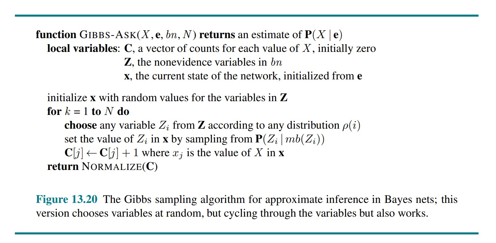
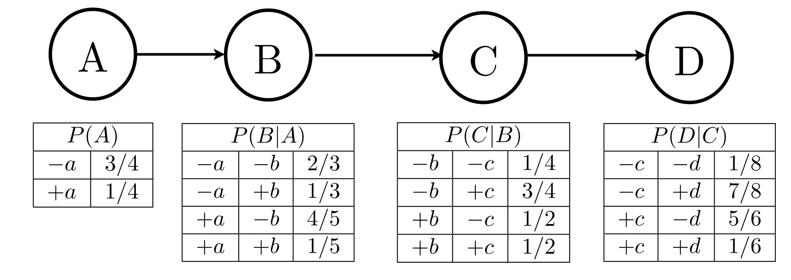

# 贝叶斯（四）— 采样近似推理

> [!abstract] 本节导览
> 承接 [[第11周星期三-贝叶斯3_条件独立性与变量消元_笔记|变量消元]]。大网络精确推理指数级不可行，本节讲四种**采样近似推理**，层层递进解决前者的缺陷：**直接采样 → 拒绝采样 → 似然加权 → 吉布斯采样（MCMC）**。

## 为什么采样

> [!important] 采样的优点
> 从分布 $S$ 采 $N$ 个样本，算近似后验。**快**（通常很快得到不错近似）、**简单通用**、**省内存 $O(n)$**、**适用大模型**（精确算法会爆炸的那种）。

## 直接采样（Prior Sampling）

> [!note] 按联合分布生成样本
> 按拓扑序对每个 $X_i$ 从 $P(X_i\mid\text{parents}(X_i))$ 采样，返回完整事件 $(x_1,\dots,x_n)$。
> ```
> for i = 1..n (拓扑序):
>     Sample x_i ~ P(X_i | parents(X_i))
> return (x_1,...,x_n)
> ```

> [!important] 一致性（Consistency）
> 生成特定事件的概率 $S_{PS}(x_1,\dots,x_n)=\prod_i P(x_i\mid\text{parents}(X_i))=P(x_1,\dots,x_n)$。
> 大样本极限下，样本频率 $N_{PS}/N \to P$——**采样一致**（估计值收敛到精确值）。
> - 例：5 个样本中 4 个 w → $P(W)=\langle 0.8, 0.2\rangle$。
> - 求条件 $P(C\mid r,w)$ 时，不满足 $r,w$ 的样本"没必要采"——引出拒绝采样。

## 拒绝采样（Rejection Sampling）

> [!note] 丢弃不符证据的样本
> 直接采样的简单修改：统计时**忽略（拒绝）不符合证据的样本**。
> ```
> for i = 1..n:
>     Sample x_i ~ P(X_i | parents(X_i))
>     if x_i 与证据不一致: 拒绝，本轮不产生样本
> ```
> 对条件概率也**一致**。

> [!warning] 拒绝采样的问题
> **若证据本身不太可能出现，会拒绝大量样本**（浪费），且采样时没利用已知证据。

## 似然加权（Likelihood Weighting）

> [!important] 固定证据 + 加权
> **思路**：固定证据变量（不采样），只对其余变量采样；用**给定父结点时证据变量的概率**给每个样本加权。
> ```
> w = 1.0
> for i = 1..n:
>     if X_i 是证据变量:
>         x_i = 观测值; w = w * P(x_i | parents(X_i))
>     else:
>         Sample x_i ~ P(X_i | parents(X_i))
> return (x_1,...,x_n), w
> ```

> [!important] 一致性（重要性采样）
> 采样分布 $S_{WS}(z,e)=\prod_j P(z_j\mid\text{parents}(Z_j))$，权重 $w(z,e)=\prod_k P(e_k\mid\text{parents}(E_k))$，二者相乘 $=P(z,e)$——**一致**。
> 似然加权是**重要性采样（importance sampling）**的一种：难从 $P$ 采样时借助易采样的 $Q$，用 $P(x)/Q(x)$ 加权。

> [!warning] 似然加权的优劣
> - **优点**：所有样本都派上用场；非证据变量的采样受其**祖先**证据影响。
> - **缺点**：上游非证据变量的采样**不受下游证据影响**——变量没能"看到全部证据"；证据变量增多时**权重指数级减小**，可能一个幸运样本主导结果。
> - **适用**：证据在**上游**的查询（如 $P(D\mid A)$，A 在上游）比 $P(A\mid D)$ 更合适。

## 吉布斯采样（Gibbs Sampling / MCMC）

> [!important] MCMC 思想
> **MCMC**（Markov Chain Monte Carlo）= "随机游走一阵，对所见取平均"。马尔科夫链=按前一状态随机选下一状态的序列；Monte Carlo=基于采样、可能有误差的算法。

> [!important] 吉布斯采样
> 一种特殊的 MCMC：状态是对所有变量的完整赋值，**证据变量固定**，每次选一个非证据变量，根据其余所有变量重采样：
> $$X_i' \sim P(X_i\mid x_1,\dots,x_{i-1},x_{i+1},\dots,x_n) = P(X_i\mid \text{markov\_blanket}(X_i))$$
> - 用**马尔科夫覆盖**计算：$P(X_i\mid mb(X_i)) = \alpha\,P(X_i\mid\text{parents}(X_i))\prod_j P(y_j\mid\text{parents}(Y_j))$（$Y_j$ 是 $X_i$ 的子结点）。
> - 这些 P 值**贝叶斯网络 CPT 直接给出**！倾向于走向高概率状态，但也可能走向低概率状态。
> - **一致**（各吉布斯分布不取 0/1、变量选择公平时）。



> [!example] 吉布斯采样流程 P(S|r)
> 1. 固定证据 R=true；2. 随机初始化其他变量；3. 重复：选一个非证据变量 X，从 $P(X\mid mb(X))$ 重采样。
> 如 `Sample S ~ P(S|c,r,¬w) = α P(S|c)P(¬w|S,r)`。

> [!tip] 吉布斯采样的优势与原理
> - 样本**很快反映网络中的所有证据**（上游下游都行），最终从真正后验采样——这正是它优于似然加权之处。
> - **平稳分布**：长期运行后 $\pi_{t+1}=K\pi_t$，平衡时 $K\pi=\pi$，唯一解 $\pi=P(x_1,\dots,x_n\mid e)$——故足够久后样本来自真实后验（"足够久"取决于 CPT，接近确定性时更慢）。
> - **实践**：大型贝叶斯网络最常用（BUGS/JAGS/STAN），可每秒上亿样本、可并行；许多认知科学家认为大脑以 MCMC 机制运行。

## 四种采样总结

> [!summary] 对比
> | 方法 | 做法 | 求什么 |
> | --- | --- | --- |
> | **Prior Sampling** | 按联合分布生成样本，直接分类统计 | $P(Q)$ |
> | **Rejection Sampling** | 生成样本，拒绝不符证据的，再统计 | $P(Q\mid e)$ |
> | **Likelihood Weighting** | 固定证据只采样其余，附权重统计 | $P(Q\mid e)$ |
> | **Gibbs Sampling** | 每次改一个非证据变量，迭代生成 | $P(Q\mid e)$ |
>
> 递进关系：拒绝采样解决直接采样"求条件"问题但浪费样本；似然加权解决拒绝浪费但下游证据无法影响上游；吉布斯采样让每个变量都"看到"全部证据。

> [!example] 习题要点
> 以下习题都基于这张链式贝叶斯网络（$A\to B\to C\to D$，各结点附完整 CPT）：
>
> 
>
> - 直接采样：$P(+c)$ = 符合的样本比例（如 5/8）。
> - 拒绝采样：$P(+c\mid+a,-d)$ = 拒绝不符 $+a,-d$ 的样本后比例（如 2/3）。
> - 似然加权：权重 = 证据变量在其父结点下的概率之积；$P(-a\mid+b,-d)=\frac{\sum_{-a}w}{\sum w}$。
> - 吉布斯序列：相邻样本**最多改一个变量**且不改证据变量。

## 本章小结

> [!summary] 概率推理全景
> - 不确定性源于**惰性与无知**；贝叶斯规则用因果方向条件概率算未知概率；条件独立性分解联合分布（朴素贝叶斯）。
> - **贝叶斯网络**编码联合分布与条件独立性。
> - **精确推理**：变量消元法；**近似推理**：似然加权、MCMC（吉布斯采样）。

## 自测题

> [!question] 检验你的理解
> 1. 四种采样方法各自的做法是什么？它们的递进关系如何？
> 2. 拒绝采样的主要问题是什么？似然加权如何改进？
> 3. 写出似然加权的权重计算式，为什么它是重要性采样？
> 4. 为什么似然加权偏好证据在上游的查询？
> 5. 吉布斯采样如何用马尔科夫覆盖重采样？为什么它能让变量"看到"全部证据？
> 6. 吉布斯采样生成的相邻样本有什么约束？
