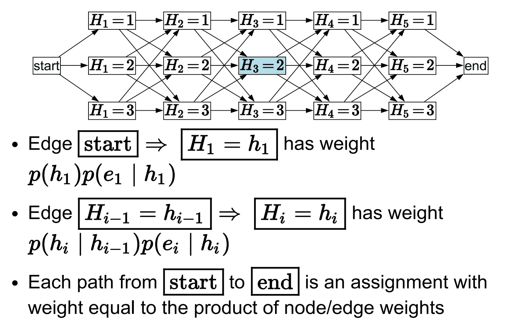

# 马尔可夫模型（二）— 平滑与维特比

> [!abstract] 本节导览
> 承接 [[第12周星期三-马尔可夫模型1_马尔可夫链与HMM滤波_笔记|滤波]]。本节先把滤波写成简洁的**线性代数形式**，再讲两个新推理任务：**平滑（前向-后向算法）** 求过去状态、**最可能解释（维特比算法）** 求最优状态序列。

## 滤波的线性代数表示

> [!important] 矩阵形式的前向算法
> 定义转移矩阵 $T_{ij}=P(X_{t+1}{=}j\mid X_t{=}i)$，观察矩阵 $O_t$（对角阵，第 $i$ 个对角元 $=P(e_t\mid X_t{=}i)$）。则滤波：
> $$f_{1:t+1} = \alpha\, O_{t+1}\, T^{\top}\, f_{1:t}$$
> 对比马尔可夫模型的纯预测 $P_{t+1}=T^\top P_t$——滤波多了 $O_{t+1}$（用证据重加权）和归一化 $\alpha$。

> [!example] Weather HMM 滤波
> 转移 sun→sun 0.9；传感器 $P(U{=}\text{true}\mid\text{rain})=0.9$；初始 $\langle0.5,0.5\rangle$。
> 观察到 $U_1{=}U_2{=}$ true：$f$ 从 $\langle0.5,0.5\rangle$ → predict $\langle0.6,0.4\rangle$ → update（带伞，下雨可能增大）→ $\langle0.25,0.75\rangle$ → … → $\langle0.154,0.846\rangle$。**带伞 ⟹ 下雨可能性增加**。

## 平滑（Smoothing）

> [!important] 用未来证据修正过去
> **平滑** $P(X_k\mid e_{1:t})$（$0\le k<t$）：给定至今所有证据，求**过去某状态**的后验。对学习至关重要。
> 推理算法：**前向-后向（Forward-Backward）算法**。
> - 例：给定本周对带伞的所有观察，计算"上周三下雨"的概率。

> [!example] 平滑的现实应用
> 平滑是"事后诸葛亮"，适合不强调实时但要求历史准确的场景：
> - **GPS 轨迹离线纠偏**（运动结束后用完整序列重算更贴合路网）；
> - **基因序列寻找**（用整条 DNA 前后信息判定编码/非编码区）；
> - **语音识别后期校验**（用整句语境修正前半句同音字）；
> - **量化交易市场状态复盘**（用完整历史回推牛市/熊市）。
> "未来的观测，改变了我们对过去的推断"——改第 5 天观测会瞬间改变前几天的**平滑概率**，但**滤波概率不变**。

> [!important] 前向-后向算法（格图视角）
> 用格图（Lattice）表示，路径权重 = 边权重之积（边权 $P(h_t\mid h_{t-1})P(e_t\mid h_t)$）：
>
> 
> - **Forward $F_k$**：从 start 到某状态的所有路径权重之和；
> - **Backward $B_k$**：从某状态到 end 的所有路径权重之和；
> - 平滑目标：$P(H_k\mid E{=}e)\propto F_k(H_k)\cdot B_k(H_k)$（经过该状态的所有路径权重之和）。
> 复杂度：$n$ 个状态、每个 $K$ 取值，每个 $F_i/B_i$ 需 $K$ 个值、每值 $K$ 项求和 → $O(K^2 n)$。

## 最可能解释（Most Likely Explanation）

> [!important] 求最优状态序列
> **最可能解释** $\arg\max_{x_{1:t}}P(x_{1:t}\mid e_{1:t})$：给定观察序列，找最可能生成它的**状态序列**。用于语音识别、噪声信道解码。
> 推理算法：**维特比（Viterbi）算法**。
> - 例：前三天带伞、第四天没带，最可能解释是前三天下雨、第四天没下。

> [!important] 状态网格与最优路径
> 状态网格：每条边 $x_{t-1}\to x_t$ 权重 $P(x_t\mid x_{t-1})P(e_t\mid x_t)$（初始边 $P(x_0)$）。路径权重乘积正比于该序列的概率：
> $$\arg\max_{x_{1:t}} P(x_0)\prod_t P(x_t\mid x_{t-1})P(e_t\mid x_t)$$

> [!important] Forward vs. Viterbi（求和 vs. 取max）
> | | Forward（滤波） | Viterbi（最可能解释） |
> | --- | --- | --- |
> | 对每个状态记录 | 到它的所有路径**总概率** | 到它的任何路径的**最大概率** |
> | 递归 | $f_{1:t+1}=\alpha P(e_{t+1}\mid X_{t+1})\sum_{x_t}P(X_{t+1}\mid x_t)f_{1:t}$ | $m_{1:t+1}=P(e_{t+1}\mid X_{t+1})\max_{x_t}P(X_{t+1}\mid x_t)m_{1:t}$ |
>
> **关键洞察**：到达 $X_{t+1}$ 的最优路径，由到达各 $x_t$ 的最优路径 + 一步转移构成（动态规划）。

> [!note] 复杂度与负对数空间
> - 时间 $O(|X|^2 T)$、空间 $O(|X|T)$、路径数 $O(|X|^T)$（但维特比不枚举）。
> - **数值下溢问题**：路径概率连乘越来越小。解法——转到**负对数空间**：
> $$\arg\max \prod P = \arg\min \sum(-\log P) = \text{最小代价路径}$$
> **乘法变加法、最大化变最小化** ⟹ 维特比本质上是带权图的**广度优先/一致代价搜索**！记录父节点以回溯最优路径。

> [!tip] 维特比算法的应用
> 由 Andrew Viterbi 1967 年提出，用于数字通信解卷积纠错（CDMA/GSM/卫星/深空/Wi-Fi），现广泛用于：拼音输入法（同音字转汉字）、语音识别（音频→音素→单词）、计算语言学、生物信息学。

## 本章小结

> [!summary] 要点回顾
> - 滤波线代形式：$f_{1:t+1}=\alpha O_{t+1}T^\top f_{1:t}$。
> - **平滑** $P(X_k\mid e_{1:t})$ 用**前向-后向算法**（$F_k\cdot B_k$），用未来证据修正过去。
> - **最可能解释** $\arg\max P(x_{1:t}\mid e_{1:t})$ 用**维特比算法**（取 max 而非求和，动态规划）。
> - 维特比在负对数空间 = 最小代价路径搜索（避免数值下溢），$O(|X|^2T)$。

## 自测题

> [!question] 检验你的理解
> 1. 写出滤波的线性代数形式，说明 $O_{t+1}$、$T^\top$、$\alpha$ 各自的作用。
> 2. 平滑任务计算什么？为什么适合"事后"场景？举两个应用。
> 3. 前向-后向算法如何用 $F_k$ 和 $B_k$ 求平滑概率？
> 4. Forward 与 Viterbi 算法的核心区别是什么（求和 vs. max）？
> 5. 维特比为什么能用动态规划而非枚举所有路径？
> 6. 为什么要转到负对数空间？此时维特比等价于什么搜索算法？
