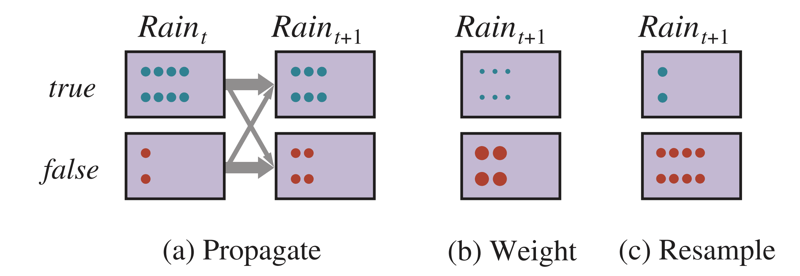

# 马尔可夫模型（三）— DBN 与粒子滤波

> [!abstract] 本节导览
> 承接 [[第12周星期五-马尔可夫模型2_平滑与维特比_笔记|平滑与维特比]]。HMM 每片只有一个状态变量和一个证据变量；本节用**动态贝叶斯网络（DBN）**支持任意多变量，并讲解大状态空间下的近似推理利器——**粒子滤波（Particle Filtering）**。

## 动态贝叶斯网络（DBN）

> [!important] 定义
> **DBN**：每个时间片可有任意数量的状态变量和证据变量，思路是**每次重复一个固定的贝叶斯网络结构**。用于多变量、多证据源的跟踪。

> [!note] DBN 与 HMM 的关系
> - 每个 HMM 可表示为只有一个状态变量、一个证据变量的 DBN；
> - 每个离散 DBN 可表示为 HMM（把所有状态变量合并成一个，取值为各变量取值的元组）。
> - **关键区别**：DBN **重用时序模型的稀疏性**减少参数。
>   - 例：20 个布尔状态变量、各有 3 个父结点 → DBN 转移模型 $20\times2^3=160$ 个参数；合并成 HMM 则需 $(2^{20}-1)\times2^{20}\approx10^{12}$ 个参数。

> [!example] DBN 应用：ICU 监护
> 状态=患者生理状态变量；证据=监控设备读数；转移模型=生理状态演变；查询=病理生理状况。可推测实时心率与静态心率（融合心电图与脉搏血氧计读数）。

## DBN 的推理

> [!note] 精确推理（变量消元）
> - **离线**：展开 T 个时间步的贝叶斯网络，用变量消元求 $P(X_T\mid e_{1:T})$。
> - **在线**：消除前一时间步所有变量，只存当前因子。
> - **问题**：最大因子含当前时间步所有变量，复杂度仍是变量数的指数级。

> [!warning] 似然加权完全失败
> 对 DBN/HMM 用似然加权：所需样本数**随 T 指数增长**。原因：状态变量的祖先不含证据 → 生成的样本完全不依赖证据 → 与真实状态接近的样本比例随 t 指数下降。

## 粒子滤波（Particle Filtering）

> [!important] 核心思想
> 用一组**样本（粒子）**表示信念状态 $P(X_T\mid e_{1:T})$，用取值为 $x$ 的粒子数近似 $P(x)$。
> - 用 $N\ll|X|$ 个粒子，每时间步计算量与粒子数线性。
> - 通常求低维边缘（"鬼 1 在哪"而非"三只鬼联合位置"），需要的粒子更少。
> - 解决似然加权问题的关键：**重采样（resampling）/ 适者生存（SOF）**——舍弃低权重样本、复制高权重样本，使样本群停留在高概率区域。

> [!important] 粒子滤波三步循环
> 1. **预测（Prediction）**：每个粒子按转移模型采样新状态 $x_{t+1}^{(j)}\sim P(X_{t+1}\mid x_t^{(j)})$。
> 2. **更新/加权（Update/Weight）**：观察到 $e_{t+1}$ 后，按证据似然给每个粒子加权 $w^{(j)}=P(e_{t+1}\mid x_{t+1}^{(j)})$，归一化。
> 3. **重采样（Resample）**：从加权分布中有放回地采样 N 个新粒子替代旧粒子（权重重置为 1），进入下一时间步。
> - **优势**：同样数量的粒子在每个时间步都能较准推理，**不像似然加权那样随 t 需指数级增多样本**。

> [!example] 温度粒子滤波实例
> $T_1$ 的 10 个粒子 `[15,12,12,10,18,14,12,11,11,10]`。
> - **预测**：用随机数 + 转移模型 → `[15,13,13,11,17,15,13,12,12,10]`。
> - **更新**：传感器 $P(F_t\mid T_t)$ 正确 80%，给定 $F=13$ 算各粒子权重。
> - **重采样**：按权重 + 随机数 → 新粒子 `[13,13,13,13,13,13,13,15,13,13]`，集中到高概率状态。

> [!note] 粒子数的影响
> 粒子越多越准；粒子太少（如 1 个）可能完全偏离。粒子滤波**一致**（粒子数→∞ 时收敛到真实后验）。

## 机器人定位与 SLAM

> [!important] 机器人定位（Localization）
> 已知地图但不知位置，观察是测距仪读数向量。状态空间和读数通常**连续**（巨大），无法精确表示后验 → **粒子滤波是主要技术**。粒子数会动态减少（聚集到高概率位置后冗余粒子被淘汰）。

> [!note] SLAM（同步定位与建图）
> **Simultaneous Localization And Mapping**：机器人既不知地图也不知位置。状态 $x_t^{(j)}$ = 位置+方向+地图（每张地图通常可由采样的位置序列推断）。

> [!tip] 卡尔曼滤波器（Kalman Filter）
> 拓展方法：用**高斯分布**表示转移模型和传感器模型，适合连续状态空间的精确递归滤波。

## 本章小结

> [!summary] 要点回顾
> - **马尔可夫假设**：给定当前状态，未来不再依赖过去；时序模型含转移模型 + 传感器模型。
> - 主要推理任务：滤波、预测、平滑、最可能解释，递归算法运行时间与序列长度线性。
> - 时序模型例子：HMM、卡尔曼滤波、**DBN**（重用稀疏性省参数）。
> - **粒子滤波**（预测+更新+重采样）是实践中有效的近似算法，解决似然加权样本数随 T 指数爆炸的问题。

## 自测题

> [!question] 检验你的理解
> 1. DBN 与 HMM 的关系是什么？DBN 在参数量上的优势体现在哪？
> 2. 为什么似然加权对 DBN/HMM 会失败（样本数随 T 指数增长）？
> 3. 粒子滤波的三个步骤是什么？重采样解决了什么问题？
> 4. 粒子滤波为什么不像似然加权那样需要随 t 增多样本？
> 5. 机器人定位为什么主要用粒子滤波？SLAM 的状态包含什么？
> 6. 卡尔曼滤波器用什么分布表示模型？
