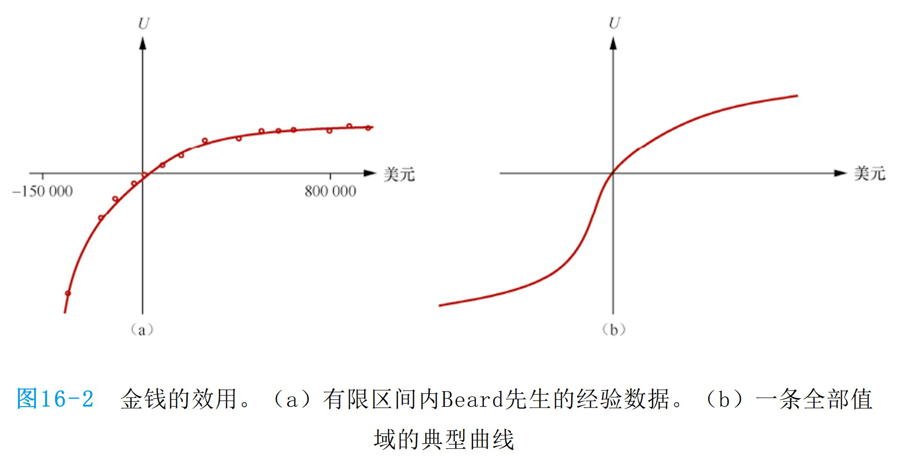

# 简单决策 — 效用、决策网络与信息价值

> [!abstract] 本节导览
> 本章（教材第 16 章）研究**一次性决策**：概率论 + 效用论 = 决策论。讲解**效用函数**的公理基础与性质（金钱效用、风险规避）、用**决策网络**建模决策问题、以及衡量"该不该先获取某信息"的**完全信息价值（VPI）**。与序列决策的 [[第7周星期三-马尔可夫决策1_MDP建模_笔记|MDP]] 相对。

## 理性决策与效用

> [!important] 最大期望效用（MEU）
> 决策论 = 概率论 + 效用论。理性 agent 选择**最大化期望效用**的行动：
> $$a^* = \arg\max_a \sum_s P(s\mid a)\,U(s)$$
> **效用函数** $U$ 把结果（世界状态）映射到描述 agent 偏好的实数，总结了 agent 的目标。**定理**：任何"理性"的偏好都可概括为效用函数。

## 理性偏好的公理

> [!important] 六条公理
> 偏好记号：$A\succ B$（偏好 A）、$A\sim B$（无差异）、彩票 $L=[p,A;\ 1-p,B]$。理性偏好须满足：
> - **有序性（Orderability）**：$A\succ B$、$B\succ A$、$A\sim B$ 三者必居其一。
> - **传递性（Transitivity）**：$A\succ B \wedge B\succ C \Rightarrow A\succ C$。（违反者会被"抽钱循环"诱导输光。）
> - **连续性（Continuity）**：$A\succ B\succ C \Rightarrow \exists p,\ [p,A;1-p,C]\sim B$。
> - **可替换性（Substitutability）**：$A\sim B \Rightarrow [p,A;1-p,C]\sim[p,B;1-p,C]$。
> - **单调性（Monotonicity）**：$A\succ B \Rightarrow (p\ge q \Leftrightarrow [p,A;1-p,B]\succeq[q,A;1-q,B])$。
> - **可分解性（Decomposability）**：复合彩票可展开为等价的简单彩票。

> [!important] 效用存在定理（von Neumann & Morgenstern, 1944）
> 满足上述公理的偏好，**存在实值函数 $U$** 使得：
> $$U(A)\ge U(B)\Leftrightarrow A\succeq B, \quad U([p_1,S_1;\dots;p_n,S_n])=\sum_i p_i U(S_i)$$
> - 效用在**正仿射变换** $U'=aU+b\ (a>0)$ 下最优行为不变（无绝对尺度）。
> - 评估人的效用：用**标准彩票** $L_p=[p,u_\top;1-p,u_\bot]$，调 $p$ 使 $A\sim L_p$，则 $p$ 即 A 的归一化效用。

## 金钱的效用与风险态度

> [!important] 金钱 ≠ 效用（风险规避）
> 彩票 $L=[p,\$X;1-p,\$Y]$：期望货币值 $EMV(L)=pX+(1-p)Y$，但效用 $U(L)=pU(\$X)+(1-p)U(\$Y)$。
> 通常 $U(L)<U(EMV(L))$——人们**规避风险（risk-averse）**。
> - 例：$L=[0.5,¥250000;0.5,¥0]$，$EMV=¥125000$，但你可能只愿付 ¥75000。
> - **确定性等价（Certainty Equivalent）** $CE(L)$：使 $CE(L)\sim L$ 的现金（此例 ¥75000）。
>
> 
> - **保险费（Insurance Premium）** $= EMV(L)-CE(L)$（此例 ¥50000）。风险中性者保险费为 0。

> [!warning] 优化者的诅咒与认知效应
> - **Optimizer's Curse**：选效用估计最大的动作，倾向于过于乐观（误差正偏），在基金、药效、论文显著性等领域是严重问题。
> - **确定性效应**：人偏好确定收益；**框架效应**：偏好乐观表述（"90% 生还" vs "10% 死亡"）；**锚效应**：偏好相对评价（高价酒衬托）。

## 决策网络（Decision Networks）

> [!important] 决策网络 = 贝叶斯网络 + 动作 + 效用
> 三类节点：
> - **机会节点（Chance，椭圆）**：随机变量，同贝叶斯网络。
> - **动作节点（Action，矩形）**：无父节点，由算法设定固定值。
> - **效用节点（Utility，钻石）**：依赖动作和机会节点。

> [!example] 决策算法（带伞例）
> ```
> 设定证据 e
> for 动作节点每个可能值 a:
>     设动作节点 = a
>     对效用节点父节点 W 计算后验 P(W | e, a)   # 贝叶斯网络推理！
>     计算期望效用 EU(a|e) = Σ_w P(w|e,a) U(a,w)
> 返回最高效用的行动
> ```
> 带伞例（F=bad）：$EU(\text{leave}\mid bad)=0.34\times100+0.66\times0=34$；$EU(\text{take}\mid bad)=0.34\times20+0.66\times70=53$ → **最优决策 = take**。
> 注意：必须用 $P(W\mid e,a)$ 而非先验 $P(W)$。

## 完全信息价值（VPI）

> [!important] 信息价值的定义
> VPI = 观察某变量值对决策质量的**预期改进**。决策网络包含计算它所需的一切：
> $$\text{VPI}(E'\mid e) = \Big[\sum_{e'}P(e'\mid e)\max_a EU(a\mid e',e)\Big] - \max_a EU(a\mid e)$$
> - $E'$ 是**未测量前**的随机变量（给定其分布）；先获取 $E'$ 再行动的 MEU，减去现在就行动的 MEU。
> - 等式右边两项的最优 $a$ 不一定相同。

> [!example] 天气预报与石油钻探
> - **天气预报**：不看预报 MEU=70；看预报后期望效用 $0.65\times89+0.35\times53=76.4$ → **VPI = 76.4−70 = 6.4**。
> - **石油钻探**：A/B 恰一处有油价值 k，先验各 0.5。不调查 MEU=k/2；知道 OilLoc 则 MEU=k → **VPI(OilLoc)=k−k/2=k/2**。

> [!important] VPI 的性质
> - **非负**：$\text{VPI}(E_i\mid e)\ge 0$（最坏可忽略该信息）。
> - **不可累加**：$\text{VPI}(E_i,E_j\mid e)\ne\text{VPI}(E_i\mid e)+\text{VPI}(E_j\mid e)$（证据可能相互约束）。
> - **与次序无关**：$\text{VPI}(E_i,E_j\mid e)=\text{VPI}(E_i\mid e)+\text{VPI}(E_j\mid E_i,e)=\dots$

> [!tip] 信息何时有价值
> 信息在**可能导致计划改变**（或使新计划远好于旧计划）时才有价值。
> - 若不论结果都不改变决策（如两种汤都不点）→ **价值为 0**。
> - 若信息能区分高低悬殊的选择 → **高价值**。
> - 关于不影响决策的变量（如石油例的 Weather）→ VPI = 0。

> [!note] 未知偏好的决策
> 现实中无法写下机器优化的确切偏好；优化**错误偏好**的机器会出问题。机器的效用必须与人类效用一致才能真正做出"更好"的决定。

## 本章小结

> [!summary] 要点回顾
> - 决策论 = 概率论（该信什么）+ 效用论（想要什么）；理性 agent 选**最大期望效用**行动。
> - 理性偏好满足六公理 ⟹ 存在效用函数；**金钱非线性**，人**风险规避**（$CE<EMV$）。
> - **决策网络** = 贝叶斯网络 + 动作节点 + 效用节点。
> - **VPI** 衡量先获取信息再决策的期望效用提升；**非负、不可累加、与次序无关**；信息能改变决策时才有价值。

## 自测题

> [!question] 检验你的理解
> 1. 写出最大期望效用准则。为什么任何理性偏好都对应一个效用函数？
> 2. 列举理性偏好的几条公理，说明传递性被违反的后果。
> 3. 什么是风险规避？解释确定性等价与保险费（用具体数字）。
> 4. 决策网络的三类节点分别是什么？写出决策算法。
> 5. 写出 VPI 公式，说明为什么 $E'$ 是随机变量。
> 6. VPI 的三个性质是什么？什么情况下信息价值为 0？
