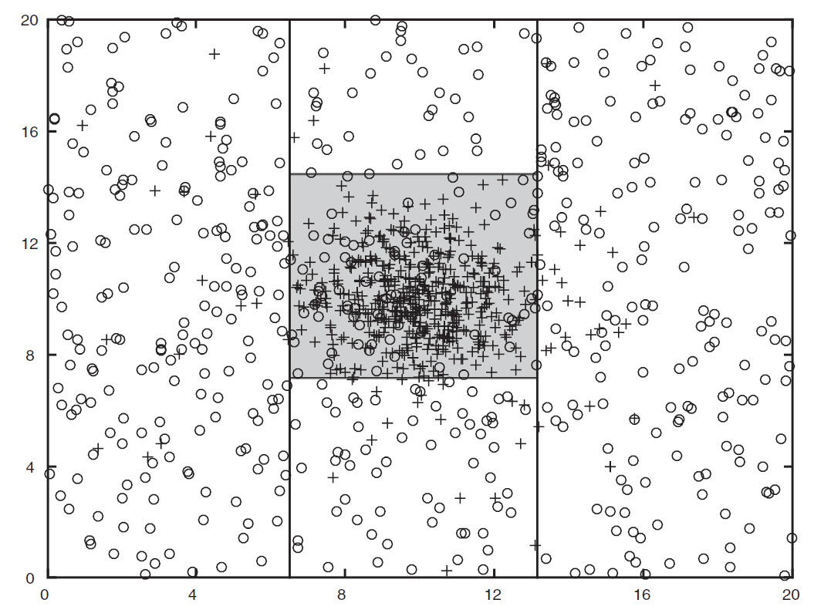

# 机器学习（一）— 监督学习入门

> [!abstract] 本节导览
> 前半补完 [[第13周星期五-简单决策_效用与决策网络_笔记|简单决策]]的 **VPI 习题与零价值判据**，后半开启**机器学习**（第 19 章样例学习）：为什么需要学习、学习型 agent 的设计、三类学习范式，以及**监督学习**的核心概念——分类与回归。

## VPI 补充：何时信息价值为零

> [!important] VPI 零价值判据
> **若在已知当前证据下，新变量 $Z$ 与直接决定效用的节点 $\text{Parents}(U)$ 条件独立，则 $\text{VPI}(Z)=0$**——额外获取 $Z$ 对提升期望效用毫无帮助。
> - 例（石油钻探）：$\text{VPI}(\text{OilLoc})=k/2$；$\text{VPI}(\text{ScoutingReport})\in[0,k/2]$（猜测不如确切位置）；$\text{VPI}(\text{Weather})=0$（与效用父节点独立）。

> [!example] VPI 习题要点（葡萄干/气味/空气质量）
> 效用 $U$ 直接连 E（气味）和 R（葡萄干）：
> - 给定 $\{\}$ 时 A 与 R 独立 → $\text{VPI}(A)=0$；给定 S 时 A 与 R 不独立 → $\text{VPI}(A\mid S)\ge0$。
> - 知道 R 就够了，多知道 Q 或 S 无额外价值；Q、R 不独立时 $\text{VPI}(Q)\ge0$。
> - 关键：用条件独立性快速判断 VPI 是否为 0。

# 第 19 章 — 机器学习入门

## 为什么需要学习

> [!important] 学习的意义
> 我们已学会用模型（贝叶斯网络、马尔可夫模型等）做决策，但**模型从哪来？需要机器学习**。
> - 学习什么：**参数**（如概率）、**结构**（如贝叶斯网）、**隐藏概念**（如聚类、神经网络）。
> - 从哪学：**数据、经历**。
> - 图灵（1950）："与其模拟成人思维，不如模拟儿童思维再施以教育"——学习是把系统"暴露于现实"而非"写死规则"的构建方法。

> [!note] 学习型 Agent 的四个关键问题
> 1. **设计（Design）**：实现所需表现的 agent 设计是什么？
> 2. **表示（Representation）**：改进哪个部件、用什么表示？
> 3. **数据（Data）**：有哪些相关可用数据？
> 4. **知识（Knowledge）**：已具备什么预备知识？

> [!important] 三类学习范式
> - **监督学习（Supervised）**：每个训练样例有正确答案（标注样例）。
> - **强化学习（Reinforcement）**：有回报序列，无正确答案。
> - **无监督学习（Unsupervised）**："just make sense of the data"（无标注样例）。

## 监督学习的形式化

> [!important] 任务定义
> 学习一个未知的**目标函数 $f$**：
> - **输入**：含标注样本 $(x_j, y_j)$ 的**训练集**，其中 $y_j=f(x_j)$（如 $x_j$ 是图像，$f(x_j)$ 是标签"长颈鹿"）。
> - **输出**：函数 $h$ 近似 $f$，能准确预测新样例（**测试集**）。
> - **假设空间 $\mathcal{H}$**：决策树、线性模型、逻辑回归、神经网络等。
> - **分类（Classification）**：$f$ 输出**离散**（类标签）；**回归（Regression）**：$f$ 输出**数值**（实数）。

> [!example] 引入习题
> - **去不去踢球**（分类）：根据天气/温度/湿度/风的历史记录，预测"晴天、舒适、高湿、有风"是否踢球。
> - **咖啡杯数预测分数**（回归）：6 个数据点近似一条直线，预测喝 3.5 杯能考多少分。
> - 核心问题：① 这是什么 ML 问题？② 用什么模型？③ 怎么判断模型好坏？④ 怎么从数据求参数？

## 分类（Classification）

> [!example] 分类任务举例
> - **垃圾邮件过滤**：输入邮件 → 输出 spam/ham；**特征**=词语（Free!）、文本模式（$dd、CAPS）等。
> - **数字识别**：输入像素网格 → 输出 0-9；MNIST 数据集 60K 人工标注图像；特征=像素、形状模式。
> - **物体识别**：图像 → 长颈鹿/羊驼。
> - 其他：医疗诊断、自动论文评分、诈骗识别、邮件分发、果蔬检验。

> [!important] 决策边界与过拟合
> 决策树例（二分类，高斯分布 + 噪声）：
> - 4 个节点的决策树 vs. 50 个节点的决策树——**哪个更好？**
> - 节点越多，训练误差越低，但可能**过拟合**（学到噪声），测试误差反而上升。
> - 这引出模型复杂度与泛化能力的权衡（后续详述）。
>
> 

## 本章小结

> [!summary] 要点回顾
> - **VPI 零价值判据**：新变量与效用父节点条件独立时 VPI=0。
> - **机器学习**用于从数据/经历学习参数、结构、隐藏概念。
> - 三类范式：**监督**（有标注）、**强化**（有回报）、**无监督**（无标注）。
> - **监督学习**：从标注训练集学 $h\approx f$，分**分类**（离散输出）与**回归**（数值输出）；需在假设空间中选模型，警惕过拟合。

## 自测题

> [!question] 检验你的理解
> 1. 什么情况下 VPI 为零？用条件独立性说明。
> 2. 学习型 agent 的四个关键问题是什么？
> 3. 监督、强化、无监督学习的核心区别是什么？
> 4. 监督学习的输入、输出、假设空间分别是什么？
> 5. 分类与回归有何区别？各举一例。
> 6. 决策树节点增多对训练误差和测试误差有何影响？这说明什么问题？
