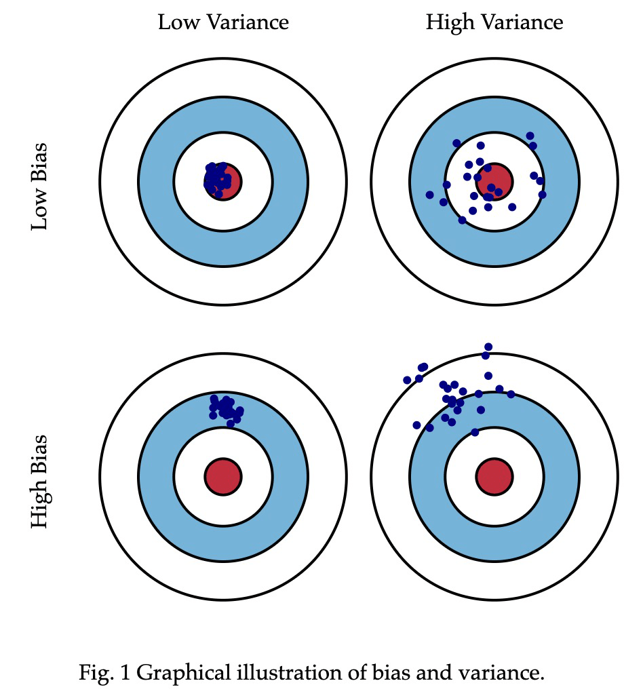
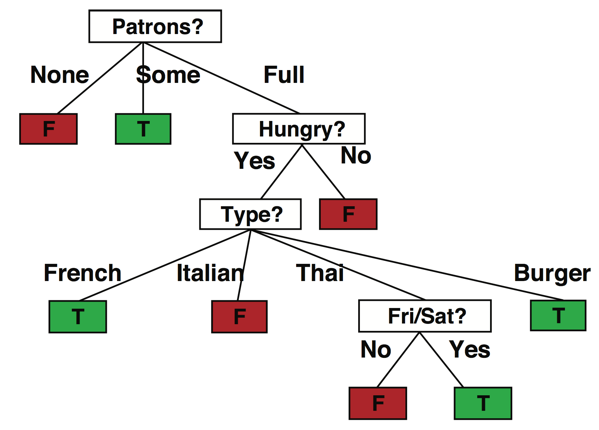

# 机器学习（二）— 决策树与线性分类

> [!abstract] 本节导览
> 承接 [[第14周星期三-机器学习入门_监督学习与分类_笔记|监督学习入门]]。先讲模型选择的根本权衡——**偏差 vs. 方差、过拟合 vs. 欠拟合、奥卡姆剃刀**；再深入**决策树**（用**信息增益/熵**选属性）；最后引出**线性分类器与感知器**（通向神经网络）。

## 模型选择：一致性 vs. 简单性

> [!important] 奥卡姆剃刀（Occam's Razor）
> 给定多个与数据一致的假设（如分段线性、12 次多项式都能拟合），**选择与数据一致的最简单假设**。

> [!important] 偏差（Bias）vs. 方差（Variance）
> - **偏差**：不同训练集上，假设预测值偏离真实值的平均趋势。偏差大 = **欠拟合（underfitting）**（找不到数据中的模式）。
> - **方差**：训练数据波动导致的假设变化量。方差大 = **过拟合（overfitting）**（过度关注特定训练集，未见数据上表现差）。
> - **权衡**：更复杂的假设偏差小但方差大；更简单的假设方差小、可能泛化更好。



> [!tip] 实现"简单性"的方法
> - 缩小假设空间（更多假设，如朴素贝叶斯的独立性假设）；
> - 特征选择（更少、更好的特征）；
> - 结构限制（决策列表 vs. 树）；
> - **正则化**（显式惩罚复杂假设）。
> 启示："不要为了复杂而复杂"——若决策树/线性回归能很好解决，何必非用深度学习。

## 决策树（Decision Tree）

> [!important] 表达能力
> 离散决策树可表达**任何命题逻辑输入的函数**（为真值表每行构建一条根到叶路径）。
> - $n$ 个布尔属性的不同函数数 = $2^{2^n}$（真值表有 $2^n$ 行，每行输出可 T/F）。$n=6$ 已有约 $1.8\times10^{19}$ 个函数——空间巨大，需精巧算法学习。

> [!important] 学习决策树：选属性（信息增益）
> 目标：找（大致）拟合数据的**最小**决策树。迭代选择**信息增益最高**的属性拆分（贪婪）。
> - **熵（Entropy）**衡量不确定性：$H(\langle p_1,\dots,p_n\rangle)=\sum_i -p_i\log p_i$。二分类 $B(p)=-p\log p-(1-p)\log(1-p)$。公平硬币 $p=0.5$ 时熵 = 1 bit；熵越高不确定性越大。
> - **信息增益**（根处 $p$ 正例、$n$ 负例，属性把样例分成子集 $E_k$）：
> $$\text{Gain} = B\!\left(\tfrac{p}{p+n}\right) - \sum_k \frac{p_k+n_k}{p+n}B\!\left(\tfrac{p_k}{p_k+n_k}\right)$$
> 即"熵的期望减少"。

> [!example] 餐馆问题（12 样例，p=n=6，需 1 bit）
> - $\text{Gain(Patrons)} = 1 - [\tfrac{2}{12}B(0)+\tfrac{4}{12}B(1)+\tfrac{6}{12}B(\tfrac26)] = 0.541$ bit。
> - $\text{Gain(Type)} = 1 - [\dots] = 0$ bit。
> → **Patrons 更有区分力**，优先拆分。


> 注：ID3 用信息增益（偏好取值多的属性）；C4.5 用增益率；CART 用基尼系数。

> [!note] 决策树学习算法（DTL）
> ```
> function DTL(examples, attributes, parent_examples):
>     if examples 空: return Plurality-Value(parent_examples)
>     else if examples 同类: return 该分类
>     else if attributes 空: return Plurality-Value(examples)
>     else:
>         A ← argmax_a Importance(a, examples)   # 信息增益最高
>         tree ← 以 A 为根的新树
>         for A 的每个取值 v:
>             exs ← examples 中 A=v 的子集
>             subtree ← DTL(exs, attributes−A, examples)
>             加分支 (A=v) → subtree
>         return tree
> ```

> [!summary] 决策树优缺点
> - **优点**：易理解可解释、可视化、能处理缺失属性/不相关特征、运行快。
> - **缺点**：易**过拟合**（改进：前剪枝/后剪枝、**随机森林**）；易忽略属性间关联。
> - **集成方法**：随机森林（Bagging，放回抽样+随机特征，减方差）；XGBoost（Boosting，减偏差，串行调整样本权重）。

## 线性分类器与感知器

> [!important] 线性回归 vs. 线性分类
> - 线性回归：$h_w(x)=w_0+w_1 x$。
> - **线性分类**：给线性函数设阈值（激活函数 $g$）：
> $$h_w(x) = \begin{cases}1 & w_0+w_1 x\ge 0\\ 0 & \text{否则}\end{cases}$$

> [!important] 二元决策规则与超平面
> 阈值输出 $y=h_w(x)=1$ 当 $w\cdot x\ge0$，否则 0。
> - 样例是输入空间中的点 $x$；方程 $w\cdot x=0$ 定义一个**超平面**，一侧 $y=1$、另一侧 $y=0$。
> - 例（垃圾邮件）：$w_0{=}-3, w_{free}{=}4, w_{money}{=}2$，邮件含 free、money 各 1 次 → $w\cdot x=-3+4+2=3>0$ → SPAM。

> [!note] 感知器（Perceptron）
> 灵感来自神经元：输入特征值 → 各特征乘权重 → 加权求和 → 激活函数。
> - 激活值正 → 输出 +1；负 → 输出 −1。
> - **从输入文本提取的 $x$ 就是特征向量**；$w\cdot x$ 的正负从向量空间看 = 点在超平面哪一侧。
> - **训练 = 从样例推导权重向量 $w$**（下一节神经网络详述如何学习权重）。

## 本章小结

> [!summary] 要点回顾
> - **奥卡姆剃刀**：选最简单的一致假设；权衡**偏差（欠拟合）**与**方差（过拟合）**。
> - **决策树**用**信息增益**（熵的期望减少）贪婪选属性；易过拟合，可用剪枝/随机森林改进。
> - **线性分类器/感知器**：$w\cdot x$ 加阈值，$w\cdot x=0$ 是分隔超平面；训练即学权重 $w$。

## 自测题

> [!question] 检验你的理解
> 1. 偏差和方差分别对应什么拟合问题？奥卡姆剃刀如何指导模型选择？
> 2. 写出熵和信息增益的公式。为什么餐馆例中 Patrons 比 Type 好？
> 3. 复述决策树学习算法 DTL 的递归结构。
> 4. 决策树的优缺点是什么？随机森林和 XGBoost 各减少什么误差？
> 5. 线性分类器如何用超平面 $w\cdot x=0$ 做二分类？
> 6. 感知器的结构是什么？训练感知器要学什么？
