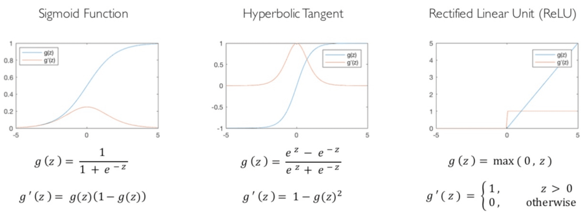
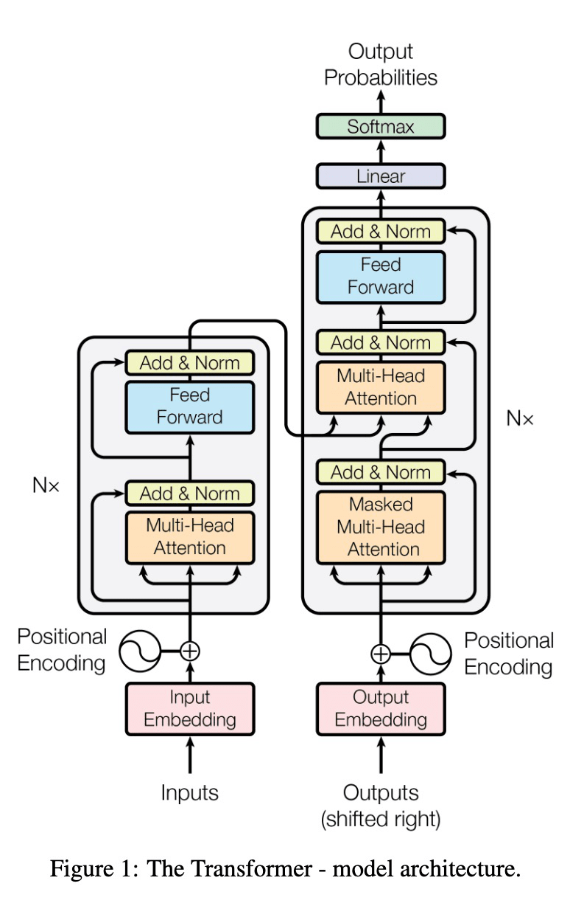

# 机器学习（三）— 感知器与神经网络

> [!abstract] 本节导览
> 承接 [[第14周星期五-机器学习2_决策树与线性分类_笔记|线性分类器]]。本节先讲**感知器学习规则**（如何从样例学权重）及其局限（XOR），再系统讲**神经网络**：神经元模型、激活函数、网络的矩阵表示与 batch、通用函数逼近定理，以及训练流程（损失函数 + 梯度下降）。

## 感知器学习规则

> [!important] 从错误中学习
> 训练时已知输入特征向量 + 正确标签，目标是更新权重 $w$ 拟合数据。
> - 若 $w\cdot x<0$ 但应 $y=1$（**假阴性**）：要让 $w\cdot x$ 更大 → $x_i>0$ 时增 $w_i$、$x_i<0$ 时减 $w_i$。
> - 若 $w\cdot x>0$ 但应 $y=0$（**误报**）：要让 $w\cdot x$ 更小 → 反向调整。

> [!important] 感知器学习规则
> $$w \leftarrow w + \alpha\,(y - h_w(x))\,x$$
> - $\alpha$ 是**学习速率**；$(y-h_w(x))$ 取值 +1、−1 或 0（无错误）。
> - **巧妙之处**：一个公式同时处理两种错误 + 不犯错的情况。
> - 例：$w=(-3,4,2)$，输入 $x=(1,1,1)$ 预测 SPAM（$y=1$）但真实 HAM（$y=0$），$\alpha=0.5$：
>   $$w\leftarrow(-3,4,2)+0.5(0-1)(1,1,1)=(-3.5,3.5,1.5)$$

> [!important] 感知器收敛定理
> - **线性可分**：存在超平面恰好分开正负样例。
> - **可分时**：反复应用感知器规则**最终收敛到完美分离器**。
> - **不可分时**：只要 $\alpha$ 随循环适当衰减（如 $\alpha=1/t$），收敛到**极小误差解**。

> [!warning] 感知器的局限
> - **无法学习 XOR**（异或）——它不是线性可分的。
> - **噪声**：不可分时权重可能颠簸（改进：averaged perceptron）。
> - **平庸泛化**：勉强分离的解，即使靠近边界也给出确定的 0/1（改进：概率化决定）。
> - **过度训练**：测试准确率先升后降（过拟合）。

## 神经网络：神经元模型

> [!important] 单个神经元（McCulloch & Pitts, 1943）
> 结点 $j$ 的输入 $a_i$ 来自其他结点，每条链接有权重 $w_{i,j}$；额外的哑输入 $a_0=1$（偏置权重 $w_{0,j}$）。
> - 总输入 $in_j=\sum_i w_{i,j}a_i$；输出 $a_j=g(in_j)=g(w\cdot a)$，$g$ 是**激活函数**。

> [!note] 激活函数（Activation Function）
> - **阈值（Threshold）**：硬阈值（感知器）。
> - **Sigmoid**：$g(x)=\frac{1}{1+e^{-x}}$，平滑可导。
> - 好特性：可导（便于梯度下降）、引入非线性。
>
> 

> [!example] 神经网络的威力：Transformer
> 现代大模型的核心架构 Transformer（《Attention Is All You Need》, 2017）正是由多层"注意力 + 前馈 + 残差归一化"神经元堆叠而成。
> 

> [!important] 深度网络 = 同时学习特征
> 手动设计特征 $f_i(x)$ 需要领域专业知识与努力。**用神经网络自动学特征**：前面的层学习"最终层的输入特征"，输出层（如 softmax）做分类。

## 神经网络的矩阵表示

> [!important] 层的矩阵运算
> 一层把输入转为输出：
> $$\text{输入 }(batch, \dim x) \times \text{权重 }(\dim x, \dim y) = (batch, \dim y) \xrightarrow{g} (batch, \dim y)$$
> - **主要思想**：权重矩阵的形状由该层**输入与输出的维度**决定。
> - 多层：前一层输出作为后一层输入，层层链接。
> - 例（3 层）：Layer1 权重 $(\dim x, \dim L_1)$、Layer2 $(\dim L_1, \dim L_2)$、Layer3 $(\dim L_2, \dim y)$。

> [!note] Batch Size（批次大小）
> $(1,\dim x)$ 中的"1"可换成任意 $|batch|$：把多个输入**堆叠**在一起一次性分类，输出也堆叠。
> - $(batch,\dim x)\times(\dim x,\dim y)=(batch,\dim y)$；权重乘法和非线性**分别作用于每一行**（每个数据点）。
> - 没改变网络架构，只是并行处理多个输入。

## 神经网络的性质与训练

> [!important] 通用函数逼近定理
> **具有足够数量神经元的两层神经网络，可以将任何连续函数逼近到任意精度**（Cybenko 1989, Hornik 1991）。
> - 可看作网络在学习一些特征；
> - 但大量神经元有**过拟合**危险。

> [!important] 训练神经网络的三步
> 1. **向前计算（Forward）**：对每个输入 $x$，用当前权重预测 $y$。
> 2. **求损失（Loss）**：用**损失函数**比较预测与真实 $y$（损失越低模型越好）。
>    - 零一损失（错分数量）、**对数损失（log loss，源自极大似然）**、误差平方和（回归）。
> 3. **向后更新（Backward）**：用**梯度下降**等数值方法最小化损失。损失是权重的函数，目标是找最小化损失的权重。

> [!note] 对数损失函数（Log Loss）
> 二元分类的对数损失 = 最小化负对数似然：
> $$\text{Loss} = -\sum_i \big[y_i\log p_i + (1-y_i)\log(1-p_i)\big]$$
> - $y_i$ 真实类别，$p_i$ 分类器预测的正类概率。
> - 改变权重会改变 $p_i$（$y_i$ 不变）；**最大似然学习**目标是找使观测数据概率最大的 $w$。

## 本章小结

> [!summary] 要点回顾
> - **感知器学习规则** $w\leftarrow w+\alpha(y-h_w(x))x$：可分时收敛到完美分离器，不可分时衰减 $\alpha$ 收敛到极小误差；**不能学 XOR**。
> - **神经元** = 加权和 + 激活函数（Sigmoid 平滑可导）；**深度网络自动学特征**。
> - 网络用**矩阵运算**表示，权重形状由层输入/输出维度决定；**batch** 堆叠多输入并行处理。
> - **通用逼近定理**：两层足够神经元可逼近任意连续函数。
> - 训练三步：**前向预测 → 损失（对数损失）→ 梯度下降更新**。

## 自测题

> [!question] 检验你的理解
> 1. 写出感知器学习规则，说明它如何同时处理假阴性和误报。
> 2. 感知器收敛定理在可分/不可分情况下分别说什么？为什么学不了 XOR？
> 3. 单个神经元的输出如何计算？Sigmoid 激活函数有什么好处？
> 4. 为什么说深度网络"同时学习特征"？
> 5. 一层神经网络的矩阵运算是什么？权重矩阵形状由什么决定？batch 起什么作用？
> 6. 训练神经网络的三个步骤是什么？写出对数损失函数。
