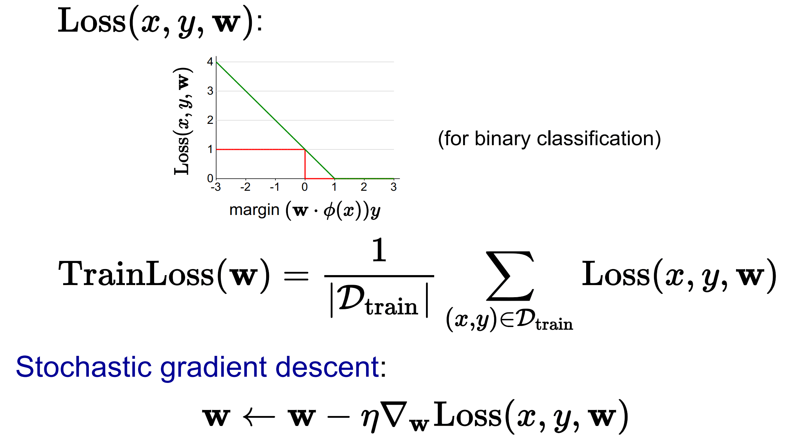
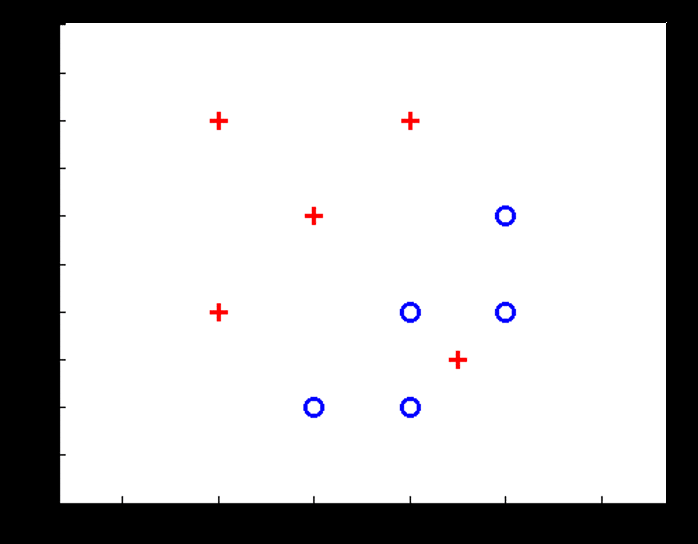

# 机器学习（四）— 反向传播与逻辑回归

> [!abstract] 本节导览
> 承接 [[第15周星期三-机器学习3_感知器与神经网络_笔记|神经网络]]。本节深入训练的核心机制：**对数损失函数**、**反向传播（计算图 + 链式法则）**、**梯度下降**，训练/验证/测试与过拟合，最后用**逻辑斯蒂回归**与**极大似然估计**统一概率化分类。

## 对数损失函数（Log Loss）

> [!important] 二分类对数损失
> $$\text{Loss} = -\sum_i \big[y_i\log p_i + (1-y_i)\log(1-p_i)\big]$$
> 单点分析：
> - **真实 $y=1$**：损失 $=-\log p$。$p\to1$（自信猜对）损失低；$p\to0$（自信猜错）损失高。
> - **真实 $y=0$**：损失 $=-\log(1-p)$。$p\to0$ 损失低；$p\to1$ 损失高。

> [!example] 计算例
> - 点1：$y=1, p=0.1$ → $-\log(0.1)=1$。
> - 点2：$y=0, p=0$ → $-\log(1.0)=0$。
> - 点3：$y=1, p=0.8$ → $-\log(0.8)=0.1$。
> - 总损失 $=1+0+0.1=1.1$。目标：找最小化损失的权重。

## 梯度下降与反向传播

> [!important] 如何求导：链式法则
> 损失是权重的函数，用**梯度下降**最小化。若网络函数 $f$ 不是常见函数，用**链式法则**：
> $$\text{若 } z=f(y), y=g(x), \text{ 则 } \frac{dz}{dx}=\frac{dz}{dy}\frac{dy}{dx}$$

> [!note] 自动微分与反向传播
> **自动微分软件**（Theano、TensorFlow、PyTorch）只需写函数 $g(x,y,w)$，即可自动算所有权重导数。
> - 通过前向传递缓存信息、再执行反向传递 = **反向传播（backpropagation）**。
> - 计算成本与前向传播相当。

> [!example] 反向传播实例：$g(w)=w_1^2 w_2 + 3w_1$，在 $w=[2,3]$ 求梯度
> 用**计算图**（节点=基本运算）：$a=w_1^2=4$（注：图中前向值），$b=a\cdot w_2$，$c=3w_1$，$g=b+c=30$。反向传播：
> - $\frac{\partial g}{\partial g}=1$；$\frac{\partial g}{\partial b}=1, \frac{\partial g}{\partial c}=1$。
> - $\frac{\partial g}{\partial a}=\frac{\partial g}{\partial b}\frac{\partial b}{\partial a}=1\cdot w_2=3$。
> - $a=w_1^2$ 路径：$\frac{\partial g}{\partial w_1}\big|_a=3\cdot3w_1^2=...$（用 $w_1=2$）；$c=3w_1$ 路径：$\frac{\partial g}{\partial w_1}\big|_c=1\cdot3=3$。
> - **累加两条路径**：$\frac{\partial g}{\partial w_1}=36+3=39$；$\frac{\partial g}{\partial w_2}=1\cdot a=8$。
> - 梯度 $\nabla g=[39, 8]$。

> [!important] 梯度下降更新
> $$w \leftarrow w - \alpha\nabla_w \text{Loss}(w)$$
> 沿梯度反方向（损失下降最快方向）迭代。最大似然时也可"梯度上升"求最大化。
>
> 

## 训练、验证、测试与过拟合

> [!important] 经验风险最小化
> 想要真实分布上最好的模型，但真实分布未知，只能在**训练集**上选最好——主要担忧是**过拟合**。减少过拟合：① 增加训练数据；② 限制假设复杂度（正则化/缩小假设空间）。

> [!note] 三部分数据划分
> - **训练集（Training）**：学参数。
> - **验证集（Validation / Held-out）**：调超参数（如随机森林子树数、最大深度）。
> - **测试集（Test）**：算准确率——**训练中绝不偷窥测试集**。
> 评估指标：Accuracy、Recall、Precision、F1。
> - **过拟合**：训练拟合极好但泛化差；**欠拟合**：训练集都拟合不好。

> [!note] 激活函数的作用与选择
> - 权重 $w$ 控制激活函数的**陡峭程度**；偏置 $\theta$ 控制激活函数**左右平移**。
> - 所有隐藏层通常用相同激活函数；**输出层激活函数取决于预测类型**（如分类用 softmax）。

## 逻辑斯蒂回归（Logistic Regression）

> [!important] 从硬阈值到概率化决定
> 带硬阈值的线性分类器（$w\cdot x\ge0$ → 1）问题：勉强分离的解，靠近边界也给出确定 0/1，且数据不可分时至少犯一错。**改进：概率化决定**——不下绝对结论，允许一定概率分到另一类。

> [!important] Sigmoid / Logistic 函数
> $$\phi(z) = \frac{1}{1+e^{-z}}, \quad z = w\cdot f(x)$$
> - $z$ 很大正数 → 正类概率接近 1；很小负数 → 接近 0。
> - 例：$w=[-3,4,2], x=[1,2,0]$，$w\cdot x=5$ → 正类概率 $\frac{1}{1+e^{-5}}=0.9933$，负类 0.0067。

> [!important] 极大似然估计（MLE）求最优 w
> 选择使观测（训练）数据概率最大的 $w$。连乘取对数变求和：
> $$\max_w \ell\ell(w) = \max_w \sum_i \log P(y^{(i)}\mid x^{(i)}; w)$$
> 其中（逻辑回归）：
> $$P(y^{(i)}{=}+1\mid x^{(i)};w)=\frac{1}{1+e^{-w\cdot f(x^{(i)})}}, \quad P(y^{(i)}{=}-1\mid x^{(i)};w)=1-\frac{1}{1+e^{-w\cdot f(x^{(i)})}}$$
> **最大化对数似然 = 最小化对数损失（负对数似然）**。用梯度上升/下降求解。

## 学习板块小结

> [!summary] Learning I–III 全景
> - **监督学习**：决策树、线性分类与回归、模型选择与优化、神经网络、概率模型学习。
> - **对数损失**衡量概率化预测好坏；**反向传播（计算图+链式法则）**高效求梯度；**梯度下降**更新权重。
> - **训练/验证/测试**三划分防过拟合；经验风险最小化 + 正则化/增数据。
> - **逻辑斯蒂回归**用 Sigmoid 把 $w\cdot x$ 转概率，用**极大似然**学权重（= 最小化对数损失）。
> - 著名架构：CNN（AlexNet）、ResNet、注意力机制、Transformer。

## 自测题

> [!question] 检验你的理解
> 1. 写出对数损失函数，分析 $y=1$ 和 $y=0$ 时它如何惩罚错误预测。
> 2. 反向传播如何用计算图 + 链式法则求梯度？为什么要累加多条路径？
> 3. 训练集、验证集、测试集各自的用途是什么？为什么不能偷窥测试集？
> 4. 权重和偏置分别如何影响激活函数的形状？
> 5. 为什么用 Sigmoid 做概率化决定？写出逻辑回归的概率公式。
> 6. 极大似然估计的目标是什么？为什么"最大化对数似然 = 最小化对数损失"？
