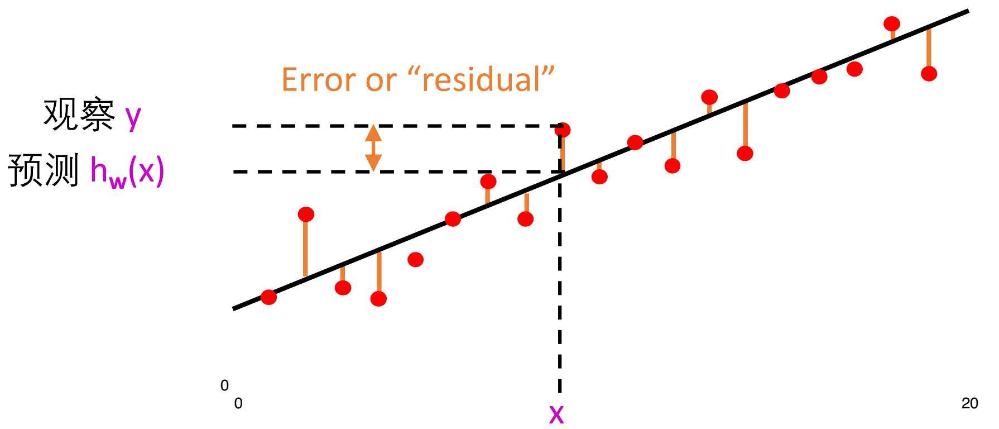
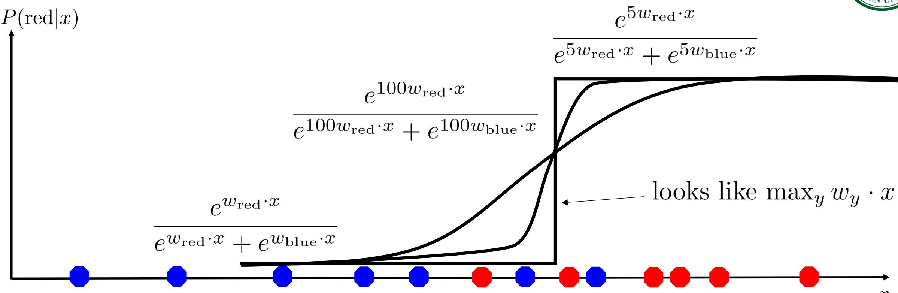
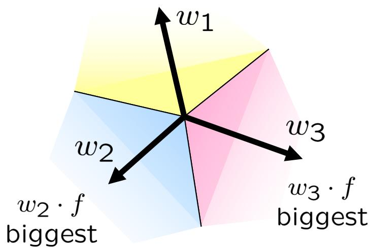
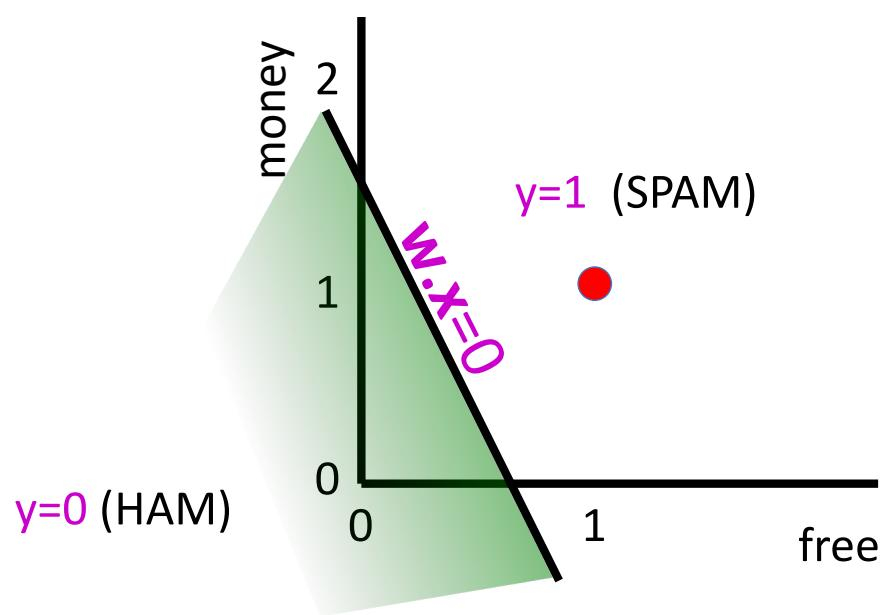
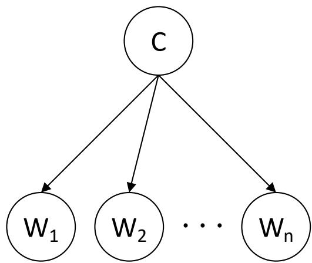

# 机器学习（五）— 优化、统计学习与朴素贝叶斯

> [!abstract] 本节导览
> 本节是「样例学习（第 19 章）」的综合收尾，把前几讲的线索全部串起来，并接上**统计学习**这条新线：
> 1. 先用一道**反向传播单步算例**复习 [[第15周星期五-机器学习4_反向传播与逻辑回归_笔记|机器学习4]] 的梯度下降；
> 2. **线性回归**的闭式正规方程解；
> 3. **逻辑斯蒂回归 / Softmax 多分类**及其概率含义；
> 4. **SVM 最大间隔**思想；
> 5. 连续空间的**优化**：梯度上升、随机梯度下降（SGD）、mini-batch；
> 6. 转入 **Learning III 统计学习**：极大似然估计（MLE）、最大后验（MAP）、**拉普拉斯平滑**；
> 7. **朴素贝叶斯**（垃圾邮件分类）与**全贝叶斯学习**（糖果袋例子）。
>
> 本节例题极多，是期末重点，务必逐题动手算。

---

## 一、热身：反向传播单步算例（复习梯度下降）

> [!example] 例题（单神经元一步更新，选择题）
> 考虑一个有两个输入特征的**单个神经元**，输入 $x_1,x_2$，权重 $w_1,w_2$，暂不考虑偏置。
> - 前向传播：加权和 $z=w_1x_1+w_2x_2$，再过 Sigmoid 得 $\hat y=\sigma(z)=\dfrac{1}{1+e^{-z}}$。
> - 损失：平方损失 $L=\tfrac12(\hat y-y)^2$。
> - 已知 Sigmoid 导数 $\sigma'(z)=\hat y(1-\hat y)$。
>
> **当前状态**：$x_1=1,\ x_2=2$；真实标签 $y=0.9$；当前权重 $w_1=2,\ w_2=-1$；学习率 $\eta=0.1$。
> 经过单步反向传播和梯度下降更新后，更新后的 $w_2$ 是多少？
> A. −0.92　B. −1.08　C. −1.04　D. −0.96　（正确答案 **−0.98**，注意四个选项都不对，是陷阱题）

> [!note] 解答（链式法则三段相乘）
> **① 前向**：$z=w_1x_1+w_2x_2=2\cdot1+(-1)\cdot2=0$，故 $\hat y=\sigma(0)=\dfrac{1}{1+e^0}=0.5$。
>
> **② 反向（求 $\partial L/\partial w_2$）**：损失对 $w_2$ 的梯度由三部分相乘——
> $$\frac{\partial L}{\partial w_2}=\underbrace{(\hat y-y)}_{\text{输出误差}}\times\underbrace{\hat y(1-\hat y)}_{\text{Sigmoid 导数}}\times\underbrace{x_2}_{\text{对应特征输入}}$$
> - 输出误差：$\hat y-y=0.5-0.9=-0.4$
> - Sigmoid 导数：$0.5\times(1-0.5)=0.25$
> - 代入：$\dfrac{\partial L}{\partial w_2}=(-0.4)\times0.25\times2=-0.2$
>
> **③ 更新**：$w_{2,\text{new}}=w_2-\eta\cdot\dfrac{\partial L}{\partial w_2}=-1-0.1\times(-0.2)=-1+0.02=\boxed{-0.98}$。
>
> 这正是 [[第15周星期五-机器学习4_反向传播与逻辑回归_笔记|机器学习4]]「计算图 + 链式法则」的最小实例：**误差 × 激活导数 × 输入** 是单层网络反向传播的通用模板。

---

## 二、线性回归（Linear Regression）

### 2.1 模型与损失

单变量线性回归用一条直线拟合数据（例：房屋面积 $x$ → 房价 $y$）：
$$h_w(x)=w_0+w_1x$$
一个样例的误差（残差）为 $y-h_w(x)$。

定义 **L2 损失函数**（所有样例的误差平方和）：
$$\text{Loss}(h_w)=\sum_{j=1}^N\big(y_j-h_w(x_j)\big)^2=\sum_{j=1}^N\big(y_j-(w_0+w_1x_j)\big)^2$$
目标：找最小化损失的参数 $w^*$。

### 2.2 闭式解（正规方程）

在 $w^*$ 处，损失对每个权重的偏导为零：
$$\frac{\partial\text{Loss}}{\partial w_0}=-2\sum_j(y_j-(w_0+w_1x_j))=0,\qquad
\frac{\partial\text{Loss}}{\partial w_1}=-2\sum_j(y_j-(w_0+w_1x_j))x_j=0$$
解出 $N$ 个样例的**精确解**：
$$w_1=\frac{N\sum_j x_jy_j-(\sum_j x_j)(\sum_j y_j)}{N\sum_j x_j^2-(\sum_j x_j)^2},\qquad
w_0=\frac1N\Big[\sum_j y_j-w_1\sum_j x_j\Big]$$

> [!important] 多变量线性回归的矩阵正规方程
> 当 $x$ 是 $n$ 维向量时，设 $\mathbf X$ 为数据矩阵（每行一个样例）、$\mathbf y$ 为标签列，则：
> $$\mathbf w^*=(\mathbf X^\top\mathbf X)^{-1}\mathbf X^\top\mathbf y$$
> **思考**：用线性模型拟合，直接套上式求参数即可？是的。但在其他模型（如神经网络）中，损失对参数往往**没有闭式零点解**，需要不依赖"解导数零点"的方法——这就引出了**梯度下降/上升**（见第五节），它对各种模型都通用。

---

## 三、逻辑斯蒂回归与 Softmax 多分类

### 3.1 从感知器得分到概率

感知器打分 $z=w\cdot f(x)$：$z$ 是很大正数 → 应判为正类（概率接近 1）；$z$ 是很小负数 → 概率接近 0。线性函数无法建模这种"挤到 0~1 区间"的 S 形需求，于是引入 **Logistic / Sigmoid 函数**（读作 "phi"）：
$$\phi(z)=\frac{1}{1+e^{-z}},\qquad z=\text{感知器输出},\quad \phi(z)=\text{判为 }+1\text{ 类的概率}$$

### 3.2 极大似然估计求 $w$

**极大似然估计（MLE）**：选择使观察到训练数据的概率最大的 $w$。
$$\text{Likelihood}=P(\text{training data}\mid w)=\prod_i P(y^{(i)}\mid x^{(i)};w)$$
连乘不好操作，取对数变求和（不改变极值点位置）：
$$\text{LogLikelihood}=\sum_i\log P(y^{(i)}\mid x^{(i)};w)$$
二分类逻辑回归中，每个样本的概率：
$$P(y^{(i)}{=}{+}1\mid x^{(i)};w)=\frac{1}{1+e^{-w\cdot f(x^{(i)})}},\qquad
P(y^{(i)}{=}{-}1\mid x^{(i)};w)=1-\frac{1}{1+e^{-w\cdot f(x^{(i)})}}$$

> [!example] 例题（二分类逻辑回归的优化目标）
> 给定三个训练点：$[2,1]$ 是 +1 类，$[0,-2]$ 是 +1 类，$[-1,-1]$ 是 −1 类。要最大化的目标函数是：
> $$\underset{w}{\arg\max}\Big[\log\tfrac{1}{1+e^{-(2w_1+w_2)}}+\log\tfrac{1}{1+e^{-(-2w_2)}}+\log\big(1-\tfrac{1}{1+e^{-(-w_1-w_2)}}\big)\Big]$$
> 三项分别是：第一点为 +1 的对数概率、第二点为 +1 的对数概率、第三点为 −1 的对数概率。**把每个样本的"判对真实类别的概率"取对数再求和**，正是逻辑回归的训练目标。

### 3.3 Softmax 多分类

多分类时每个类有自己的权重向量 $w_y$，类得分 $w_y\cdot f(x)$，确定性分类取得分最高者 $y=\arg\max_y w_y\cdot f(x)$。要把得分转成概率，需满足"所有类概率和为 1"且"得分越大概率越大"，故用 **Softmax**：
$$z_1,z_2,z_3\ \to\ \frac{e^{z_1}}{\sum_k e^{z_k}},\ \frac{e^{z_2}}{\sum_k e^{z_k}},\ \frac{e^{z_3}}{\sum_k e^{z_k}}$$

> [!example] 例题（确定性 vs 概率化多分类）
> 设 $w_1=[-3,4,2],\ w_2=[2,2,7],\ w_3=[0,-1,0],\ x=[1,2,0]$。
> - **确定性分类**：$w_1\cdot x=5,\ w_2\cdot x=6,\ w_3\cdot x=-2$ → $w_2\cdot x$ 最大，分为**第 2 类**。
> - **概率化分类**（Softmax）：
>   - $P(\text{类1})=\dfrac{e^5}{e^5+e^6+e^{-2}}=0.2689$
>   - $P(\text{类2})=\dfrac{e^6}{e^5+e^6+e^{-2}}=0.7310$
>   - $P(\text{类3})=\dfrac{e^{-2}}{e^5+e^6+e^{-2}}=0.0002$

> [!example] 例题（Softmax 计算 + MAP 决策，选择题）
> 三分类（$y\in\{1,2,3\}$）逻辑回归，对某输入 $\mathbf x$ 算得三个未归一化得分（logits）：$z_1=2.0,\ z_2=1.0,\ z_3=0.0$。已知 $P(y{=}k\mid\mathbf x)=\dfrac{e^{z_k}}{\sum_j e^{z_j}}$，提示常数 $e^2\approx7.39,\ e^1\approx2.72,\ e^0=1.00$。
> 问：样本属于类别 1 的概率？按最大后验（MAP）规则最终预测哪类？
> A. 约 0.667，预测类别 1　B. 约 0.665，预测类别 1　C. 约 0.245，预测类别 2　D. 约 0.090，预测类别 3
>
> **解**：分母 $=7.39+2.72+1.00=11.11$；$P(y{=}1)=7.39/11.11\approx0.665$。三个概率中类 1 最大，故 MAP 预测**类别 1**。答案 **B**（0.667 是用更精确 $e$ 值的近似，本题按给定提示常数得 0.665）。

> [!note] 二分类是多分类的特例
> 令 +1 类权重为 $w$（待学），−1 类权重恒为 0，则 Softmax 退化为 Sigmoid：
> $$P(\text{red}\mid x)=\frac{e^{w_{\text{red}}\cdot x}}{e^{w_{\text{red}}\cdot x}+e^{w_{\text{blue}}\cdot x}}\xrightarrow{w_{\text{blue}}=0}\frac{1}{1+e^{-wx}}$$

### 3.4 SVM 与最大间隔（了解）

> [!note] 支持向量机（SVM）
> 感知器只要把训练数据分开就"满足"了，但勉强分开的边界泛化差。**SVM 的思想：最大化决策边界与最近样本点之间的间隔（margin）**，得到更稳健的分隔超平面。这是另一类线性分类器的优化目标。

---

## 四、连续空间的优化：梯度上升与 SGD

逻辑回归 / 多分类的目标 $\max_w\ ll(w)=\max_w\sum_i\log P(y^{(i)}\mid x^{(i)};w)$ 没有闭式解，需用**爬山法**思想优化。但参数是**连续空间**、邻居**无穷多**，无法枚举邻居（对比离散 [[第3周星期三-A星一致性与局部搜索_笔记|局部搜索]] 的爬山法）。

> [!important] 用梯度指引上坡方向
> 分析导数 $\dfrac{\partial g(w_0)}{\partial w}=\lim_{h\to0}\dfrac{g(w_0+h)-g(w_0-h)}{2h}$ 告诉我们往哪走。对最大化问题，**沿梯度方向上坡**，斜率越陡步长越大：
> $$w\leftarrow w+\alpha\,\nabla_w g(w),\qquad \nabla_w g(w)=\Big[\tfrac{\partial g}{\partial w_1},\tfrac{\partial g}{\partial w_2},\dots\Big]^\top$$
> $\alpha$ 是**学习率**——需谨慎选择的超参数。

> [!note] 三种梯度法的对比（重点）
> 设目标 $g(w)=\sum_i\log P(y^{(i)}\mid x^{(i)};w)$。
>
> | 方法 | 每步更新 | 特点 |
> |---|---|---|
> | **批梯度上升** | $w\leftarrow w+\alpha\sum_i\nabla\log P(y^{(i)}\mid x^{(i)};w)$ | 用全部数据；$\alpha$ 足够小可收敛到全局唯一极值；但每步遍历全集、慢 |
> | **随机梯度上升（SGD）** | 随机挑一个 $j$：$w\leftarrow w+\alpha\nabla\log P(y^{(j)}\mid x^{(j)};w)$ | 一次只用一个样本；常比批量快；固定 $\alpha$ 不保证收敛、会在极值附近游离；递减学习率序列可保证收敛 |
> | **小批量（mini-batch）** | 随机子集 $J$：$w\leftarrow w+\alpha\sum_{j\in J}\nabla\log P(y^{(j)}\mid x^{(j)};w)$ | 折中，可并行，深度学习标配 |
>
> 逻辑回归目标是**凹函数**，只要 $\alpha$ 足够小，批梯度上升能收敛到**全局唯一极大值**。

---

## 五、深度学习与通用逼近（衔接）

> [!summary] 从优化到深度神经网络
> - **深度神经网络 = 分层计算图**：最后一层是输出层，之前的层在"计算特征"——这些特征是**学习**出来的，而非手工设计。常见架构：CNN、RNN、LSTM、Transformer。
> - **通用函数逼近定理**：若神经网络足够大，可以以任意精度表示输入到输出的**任何连续映射**。
> - 但要避免**过拟合/死记训练数据**——用 early stopping（早停）等手段。
> - 现成的**自动微分**程序高效给出导数（呼应 [[第15周星期五-机器学习4_反向传播与逻辑回归_笔记|反向传播]]）。

---

## 六、统计学习（Learning III）：从数据直接估参数

前面神经网络是"一步步更新优化"参数。**统计学习换一条路：直接从数据用概率方法学参数。** 核心视角：Learning = 对假设空间 $H$ 上的概率分布做**贝叶斯更新**（先验 $P(H)$ 用参数 $\theta$ 表示，训练数据 $X$）。

### 6.1 极大似然估计（MLE）

$$\theta_{ML}=\underset{\theta}{\arg\max}\,P(\mathbf X\mid\theta)=\underset{\theta}{\arg\max}\prod_i P_\theta(X_i)$$
判别式建模常用**极大条件似然**：$\theta^*=\arg\max_\theta\prod_i P_\theta(y_i\mid x_i)$。

> [!example] 例题（抛硬币估计正面概率 $\theta$）
> 抛一枚硬币 3 次，观察 $X_1=\text{正},X_2=\text{正},X_3=\text{反}$，估计正面概率 $\theta$。
> - 似然：$P(X_1{=}\text{正},X_2{=}\text{正},X_3{=}\text{反};\theta)=\theta^2(1-\theta)$
> - 对数似然：$L(x;\theta)=\log P=2\log\theta+\log(1-\theta)$（取 log 把连乘变求和，更易微分）
> - 求导置零：$\dfrac{\partial L}{\partial\theta}=\dfrac{2}{\theta}-\dfrac{1}{1-\theta}=0\Rightarrow\theta_{ML}=\dfrac23$
>
> **一般结论**：$h$ 个正面、$t$ 个反面时 $\theta_{ML}=\dfrac{h}{h+t}$。即 **相对频率就是极大似然估计**：$P_{ML}(x)=\dfrac{\text{count}(x)}{\text{total samples}}$。

### 6.2 最大后验估计（MAP）

另一种思路：求给定数据后最可能的参数（融入先验 $P(\theta)$）：
$$\theta_{MAP}=\underset{\theta}{\arg\max}\,P(\theta\mid\mathbf X)=\underset{\theta}{\arg\max}\,P(\mathbf X\mid\theta)P(\theta)$$
（分母 $P(\mathbf X)$ 与 $\theta$ 无关，可略去。）MAP 在似然之外乘上先验，能缓解纯频率估计的过拟合。

### 6.3 拉普拉斯平滑（Laplace Smoothing）

> [!warning] 为什么需要平滑：相对频率会过拟合
> 纯 MLE 用相对频率，会给"训练集中没出现过的事件"零概率——这很危险。
> - 看到 3 次正面就估 $\theta_{ML}=0$（永不反面）是不合理的；
> - 朴素贝叶斯里，某词在某类训练样本里没出现，就给 $P(\text{词}\mid\text{类})=0$，导致整条乘积变 0（对数为 $-\infty$）。

> [!important] 拉普拉斯平滑公式
> 带强度 $\alpha$ 的平滑 = **假装开始前每个结果都已见过 $\alpha$ 次**：
> $$\theta_{\text{Lap}}=\frac{h+\alpha}{(h+\alpha)+(t+\alpha)}$$
> 对 $K$ 值变量：
> $$\theta_k=\frac{N_k+\alpha}{\sum_k(N_k+\alpha)}=\frac{N_k+\alpha}{N+K\alpha}$$
> - $\alpha\gg N$：$\theta_k\to\dfrac1K$（趋于均匀先验）；
> - $\alpha\ll N$：$\theta_k\to\dfrac{N_k}{N}$（趋于 ML 估计）。

> [!example] 例题（红/蓝球 r=2,b=1 的平滑）
> 观察 2 红 1 蓝：
> - $P_{ML}(X)=\langle\tfrac23,\tfrac13\rangle$
> - $P_{\text{Lap},\alpha=1}(X)=\langle\tfrac{2+1}{3+2},\tfrac{1+1}{3+2}\rangle=\langle\tfrac35,\tfrac25\rangle$
> - $P_{\text{Lap},\alpha=100}(X)=\langle\tfrac{102}{203},\tfrac{101}{203}\rangle$（强平滑把估计拉向 $\tfrac12$）

---

## 七、朴素贝叶斯（Naive Bayes）

### 7.1 生成式 vs 判别式

分类任务：$N$ 类 $Y=\{c_1,\dots,c_N\}$，要把 $x$ 判给后验 $P(c\mid x)$ 最大的类。
- **判别式模型**：直接建模 $P(c\mid x)$。例：决策树、BP 神经网络、SVM。
- **生成式模型**：先建联合分布 $P(x,c)$，再由贝叶斯公式得后验：
$$P(c\mid x)=\frac{P(x,c)}{P(x)}=\frac{P(c)\,P(x\mid c)}{P(x)}$$
其中 $P(c)$ 是**类先验**，$P(x\mid c)$ 是**类条件概率（似然）**，$P(x)$ 是与类无关的归一化"证据"因子。

### 7.2 朴素贝叶斯假设与推理

> [!important] 核心假设：给定类别，各属性条件独立
> 这正是 [[第10周星期五-贝叶斯2_独立性朴素贝叶斯与贝叶斯网络_笔记|贝叶斯2]] 中朴素贝叶斯的延续。推理公式：
> $$\mathbf P(C\mid x_1,\dots,x_n)=\alpha\,\mathbf P(C)\prod_i\mathbf P(x_i\mid C)$$
> 假设 2 类、$n$ 个布尔属性 $X_i$，参数为 $\theta=P(C{=}\text{true})$ 及每个 $\theta_{i1}=P(X_i{=}\text{true}\mid C{=}\text{true})$、$\theta_{i2}=P(X_i{=}\text{true}\mid C{=}\text{false})$，用极大似然（计数）估计。

### 7.3 垃圾邮件分类（Bag-of-Words）

> [!example] 例题（朴素贝叶斯垃圾邮件分类）
> 文档是垃圾邮件 $C=\text{spam}$ 或正常 $C=\text{ham}$。**词袋模型**：文档每个词 $W_i$ 由类别分布 $P(W_i\mid C)$ 独立生成（这是朴素贝叶斯的一例）。
> $$P(C,W_1,\dots,W_n)=P(C)\prod_i P(W_i\mid C)$$
> 对每个类别求 $P(C\mid w_1,\dots,w_n)=\alpha P(C)\prod_i P(W_i\mid C)$（用对数累加避免下溢）。一封含 "Stuart would you like to lose weight while you sleep" 的邮件，逐词累加 $\log P(W\mid C)$ 得到：
> $$\alpha[e^{-76.0},\ e^{-80.5}]=[0.989,\ 0.011]$$
> 即判为 **spam 的概率 0.989**。
>
> 参数估计：先验 $P(C)$ 用训练集相对频率；$P(W_i\mid C)=\theta_{k\mid c}$（如 $\theta_{\text{"you"}\mid\text{spam}}=0.00881,\ \theta_{\text{"you"}\mid\text{ham}}=0.00304$）也用频率估计，但**必须拉普拉斯平滑**——许多词不会出现在训练集里，否则零概率毁掉整条乘积。

> [!note] 优势比（odds ratio）看哪些词最"垃圾"
> 平滑后看 $\dfrac{P(W\mid\text{spam})}{P(W\mid\text{ham})}$ 最大的词：verdana(28.8)、Credit(28.4)、ORDER(27.2)、money(26.5)…——这些词确实直觉上很"垃圾"，验证了模型合理性。

---

## 八、全贝叶斯学习（Bayesian Learning）

### 8.1 思想：不选单一最佳假设，而对所有假设加权

> [!important] 贝叶斯预测 = 按后验加权平均所有假设
> 给定训练数据 $X=x_1,\dots,x_N$，每个假设 $h_k$ 有后验：
> $$P(h_k\mid X)=\alpha\,P(X\mid h_k)P(h_k)=\alpha\times\text{似然}\times\text{先验}$$
> 预测新数据 $x_{N+1}$ 时，用**似然加权平均**（而非只用单个"最佳"假设）：
> $$P(x_{N+1}\mid X)=\sum_k P(x_{N+1}\mid h_k)\,P(h_k\mid X)$$
> 这样学习就归约为概率推断。**贝叶斯预测是最优的**。缺点：当假设空间 $H$ 很大时 $\sum_k$ 难算。

### 8.2 经典例题：五种糖果袋

> [!example] 例题（糖果袋 h1–h5，连取 5 个 lime）
> 五种袋子装樱桃(cherry)/酸橙(lime)糖，外观无法区分。参数 $\theta=$ 袋中 cherry 比例。先验已知：
>
> | 假设 | cherry 比例 $\theta$ | 先验 $P(h)$ |
> |---|---|---|
> | h1 | 1.00（全 cherry） | 0.1 |
> | h2 | 0.75 | 0.2 |
> | h3 | 0.50 | 0.4 |
> | h4 | 0.25 | 0.2 |
> | h5 | 0.00（全 lime） | 0.1 |
>
> **问题 1（后验）**：连续取出 5 个都是 lime，它来自哪种袋子？用 $P(h_k\mid X)=\alpha P(X\mid h_k)P(h_k)$，其中 $P(\mathbf d\mid h_i)=\prod_j P(d_j\mid h_i)$（lime 概率 $=1-\theta$）：
> - $P(h_1\mid 5\text{ lime})=\alpha\cdot0^5\cdot0.1=0$
> - $P(h_2\mid\cdot)=\alpha\cdot0.25^5\cdot0.2=0.000195\alpha$
> - $P(h_3\mid\cdot)=\alpha\cdot0.5^5\cdot0.4=0.0125\alpha$
> - $P(h_4\mid\cdot)=\alpha\cdot0.75^5\cdot0.2=0.0475\alpha$
> - $P(h_5\mid\cdot)=\alpha\cdot1.0^5\cdot0.1=0.1\alpha$
> - 归一化 $\alpha=1/(0+0.000195+0.0125+0.0475+0.1)=6.2424$
> - 后验：$P(h_1)=0,\ P(h_2)=0.0012,\ P(h_3)=0.078,\ P(h_4)=0.296,\ P(h_5)=\mathbf{0.624}$ → 最可能是 **h5（全 lime 袋）**。
>
> **问题 2（预测下一个）**：第 6 个糖是 lime 的概率：
> $$P(\text{lime}_6\mid 5\text{ lime})=\sum_k P(\text{lime}\mid h_k)P(h_k\mid X)$$
> $$=0\times0+0.25\times0.0012+0.5\times0.078+0.75\times0.296+1.0\times0.624=\mathbf{0.886}$$
> 注意这里**没有先挑出一个最佳假设**，而是对全部 5 个假设加权——这就是全贝叶斯预测。

> [!example] 例题（三硬币贝叶斯预测，两道选择题）
> 桌上三枚硬币对应三种假设，投正面(H)概率不同。先验与参数：
>
> | 假设 | 物理意义 | 先验 $P(h_i)$ | $P(\text{正}\mid h_i)$ | $P(\text{反}\mid h_i)$ |
> |---|---|---|---|---|
> | h1 | 均匀硬币 | 0.5 | 0.5 | 0.5 |
> | h2 | 偏正面 | 0.3 | 0.8 | 0.2 |
> | h3 | 双面正（魔术） | 0.2 | 1.0 | 0.0 |
>
> 随机拿一枚投 5 次，得 $D=\{H,H,T,H,H\}$（4 正 1 反）。
>
> **小问 1**：哪个假设后验最大？
> A. h1　B. h2　C. h3　D. h1 与 h2 一样大
> **解**：似然 $P(D\mid h_i)=P(\text{正})^4P(\text{反})^1$。h3 含一个反面，$P(\text{反}\mid h3)=0$ → 似然为 0，**排除 h3**。
> - h1：$0.5^4\cdot0.5\cdot0.5=0.5^5\cdot0.5=0.015625$（未归一化 $\times$ 先验 $0.5$）→ $0.5^5\times0.5=0.015625$
> - h2：$0.8^4\cdot0.2\cdot0.3=0.4096\cdot0.2\cdot0.3=0.024576$
> - h2 的未归一化后验更大 → 答案 **B（h2 后验最大）**。
>
> **小问 2**：用全贝叶斯预测第 6 次投出正面的概率 $P(X_6{=}\text{正}\mid D)$？
> A. 0.500　B. 0.650　C. 0.683　D. 0.800
> **解**：先归一化后验（$Z=0.015625+0.024576=0.040201$）：$P(h_1\mid D)=0.3887,\ P(h_2\mid D)=0.6113$（h3 为 0）。再加权：
> $$P(\text{正}_6\mid D)=0.5\times0.3887+0.8\times0.6113\approx0.194+0.489=0.683$$
> 答案 **C（0.683）**。

> [!note] 频率派 vs 贝叶斯派（世界观对比）
> - **频率派**：真理（参数 $\Theta$）是唯一确定的常数，只是未知；问"如果真理是 $\Theta$，我观测到数据 $X$ 的概率是多少"——这就是 MLE 的视角。
> - **贝叶斯派**：唯一真实的是眼前数据 $X$，参数 $\Theta$ 是随机、不确定、符合某种分布的；问"看过数据 $X$ 后，真实规律 $\Theta$ 最可能是什么"——MAP 与全贝叶斯的视角。

---

## 本章小结

> [!summary] 样例学习全景（呼应教材 19 章总结）
> - **监督学习**任务是学 $y=h(x)$；离散输出叫分类，连续输出叫回归。
> - **决策树**能表示所有布尔函数；信息增益帮助找简单一致的树（见 [[第14周星期五-机器学习2_决策树与线性分类_笔记|机器学习2]]）。
> - **线性回归**用得很广，可用正规方程闭式解或梯度下降求最优参数。
> - **感知器**（硬阈值线性分类器）用简单权重更新规则训练，能拟合线性可分数据。
> - **逻辑回归**用软阈值（Sigmoid/Softmax）取代硬阈值，对非线性可分、含噪数据，梯度下降表现更好；用**极大似然**学权重（= 最小化对数损失）。
> - **神经网络**用线性阈值单元网表示复杂非线性函数；反向传播在参数空间做梯度下降以最小化输出误差。
> - **贝叶斯学习**把学习建模为概率推理：用观测更新假设的先验分布；**极大似然学习**直接选最大化数据似然的假设；**拉普拉斯平滑**防止零概率过拟合。
> - **朴素贝叶斯**（生成式 + 类内条件独立）是文本分类的经典基线。

> [!question] 自测题
> 1. 写出单神经元平方损失下 $\partial L/\partial w_i$ 的"误差×激活导数×输入"三段式，并复算热身例题为何答案是 −0.98。
> 2. 多变量线性回归的正规方程是什么？为什么神经网络不能这样直接解？
> 3. Sigmoid 与 Softmax 各把什么转成概率？二分类为何是多分类的特例？
> 4. 用 $z_1=2,z_2=1,z_3=0$ 和 $e^2{\approx}7.39$ 等常数，算 Softmax 三个概率并给出 MAP 预测。
> 5. 批梯度、SGD、mini-batch 三者的更新式与收敛性差异？为什么逻辑回归能收敛到全局最优？
> 6. 抛硬币 2 正 1 反，推导 $\theta_{ML}=2/3$ 的全过程（写出对数似然与求导）。
> 7. 为什么朴素贝叶斯必须做拉普拉斯平滑？写出 $K$ 值变量的平滑公式并分析 $\alpha\to0$ 与 $\alpha\to\infty$ 的极限。
> 8. 糖果袋例题：连取 5 个 lime 后，h5 的后验为何是 0.624？第 6 个是 lime 的概率 0.886 怎么来的？
> 9. 三硬币例题：为什么 h3 被直接排除？复算第 6 次为正面的贝叶斯预测 0.683。
> 10. 用一句话区分频率派与贝叶斯派的世界观，并对应到 MLE 与 MAP。

> [!note] 相关章节
> - 上一讲：[[第15周星期五-机器学习4_反向传播与逻辑回归_笔记|机器学习（四）— 反向传播与逻辑回归]]
> - 概率基础：[[第10周星期三-贝叶斯1_概率基础与贝叶斯规则_笔记|贝叶斯（一）]]、[[第10周星期五-贝叶斯2_独立性朴素贝叶斯与贝叶斯网络_笔记|贝叶斯（二）— 朴素贝叶斯]]
> - 优化思想源头：[[第3周星期三-A星一致性与局部搜索_笔记|局部搜索与爬山法]]
> - 全课程总复习：[[第17周星期三+五-期末复习_笔记|期末复习]]
