# 期末复习 — 全课程总结与真题精讲

> [!abstract] 本笔记说明
> 本篇是全课程（搜索 → 逻辑 → 概率推理 → 决策 → 学习）的**总复习 + 真题精讲**，每道例题都**完整写出题目与解题过程**，并双链到对应章节的详解笔记。建议配合各章节笔记一起复习。
>
> **考试信息**：闭卷，2026-07-02（星期四）09:30–11:30，珠海 C203/C205。题型为「以知识点为基础的大题」，每道大题下含选择、填空、计算题，与作业题型相近。建议带计算器（不涉及 $e^{xxx}$、$\log$ 的精确计算）。**需要计算才能解答的题目约占 50%**。

> [!important] 试卷结构与分值分布
> | 大题 | 主题 | 分值 | 核心考点 |
> |---|---|---|---|
> | 第一题 | 搜索 | — | 一致代价/A\*/图搜索/树搜索的节点扩展顺序 |
> | 第二题 | Minimax 与决策网络 | 13 | ExpectiMiniMax、完全信息价值 VPI |
> | 第三题 | 贝叶斯网络 | 18 | 联合/条件概率、条件独立、直接/拒绝/似然加权/吉布斯采样 |
> | 第四题 | 逻辑 | 6 | CNF 转换、可满足性、一阶逻辑选择 |
> | 第五题 | 粒子滤波 | 14 | 预测、更新与权重归一化、重采样 |
> | 第六题 | 样例学习 | 21 | 感知器更新、决策树信息增益、神经网络梯度/反向传播、贝叶斯学习 |
> | 第七题 | 强化学习 | 10 | 直接效用评估、时序差分、Q-Learning、近似 Q-Learning |
>
> 老师强调：**知识点之间是有相关性的！** 例如 Expectimax→MDP→强化学习是一条主线；贝叶斯网络→采样→粒子滤波是另一条主线。

---

## 一、搜索复习

> 详解见 [[第2周星期三-搜索2_无信息搜索_笔记|无信息搜索]]、[[第2周星期五-搜索3_启发式搜索A星_笔记|A\* 搜索]]、[[第3周星期三-A星一致性与局部搜索_笔记|A\* 一致性]]。

### 1.1 树搜索 vs 图搜索

> [!note] 两种搜索框架
> - **树搜索**：允许访问重复结点，节省存储空间，但可能陷入死循环。
> - **图搜索**：用 explored 集记录已扩展结点，**不允许访问重复结点**，不会陷入死循环。
> - 评价维度：**完备性**（有解时能否找到）、**最优性**（能否找到最优解）、**时间复杂度**、**空间复杂度**。
> - 复杂度因素：$b$=分支因子（最多后继数），$m$=最大路径长度，$d$=最浅目标深度。
> - 满 $b$ 叉树结点总数：$1+b+b^2+\dots+b^m=\dfrac{b^{m+1}-1}{b-1}=O(b^m)$。

### 1.2 真题：搜索算法的节点扩展顺序

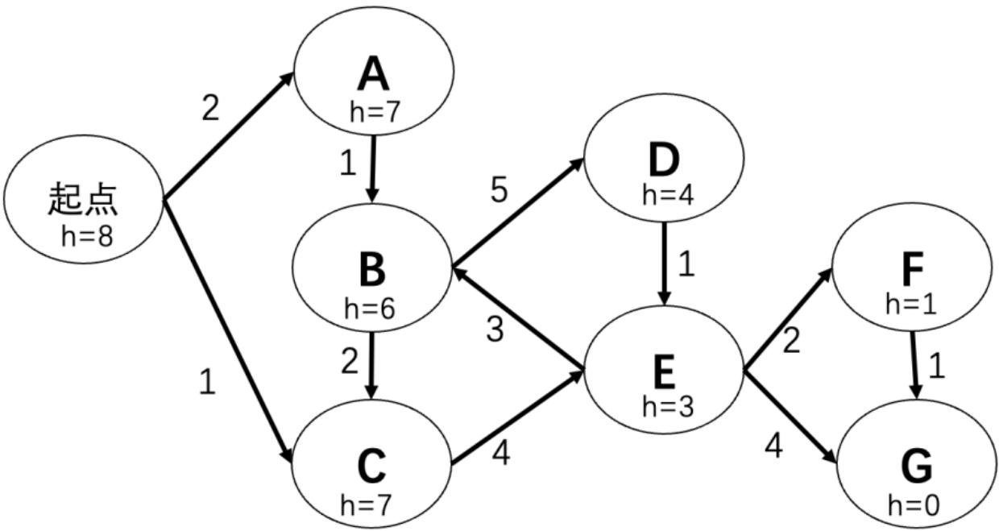

> [!example] 例题（判断题，4 分）
> 目标是到达充电站 G，上图每个结点的启发值是到 G 的代价估计，**可采纳且一致**。
> **(i)** 运行深度优先图搜索（不重复扩展结点），恰好返回路径代价最小的路径？○正确 ○错误
> **(ii)** 运行一致代价图搜索和 A\* 图搜索，节点扩展顺序一样？○正确 ○错误
>
> **参考答案**：
> - **(i) 错误**。深度优先图搜索返回：起点→A→B→C→E→F→G，但最短路径是 起点→C→E→F→G。DFS 不保证最优。
> - **(ii) 错误**。一致代价图搜索按 $g(n)$ 扩展，顺序为：起点, C, A, B, E, F, D, G；A\* 图搜索按 $f(n)=g(n)+h(n)$ 扩展，顺序为：起点, C, E, F, G。两者顺序不同（A\* 用启发值跳过了无关结点）。

### 1.3 可采纳性与一致性

> [!important] 两个关键性质
> - **可采纳（Admissible）**：$0\le h(n)\le h^*(n)$，$h^*$ 是到目标的真实最小代价。**保证树搜索版 A\* 最优**。
> - **一致（Consistent）**：$h(n)-h(n')\le \text{cost}(n\to n')$，即 $h(n)\le \text{cost}(n\to n')+h(n')$（三角不等式）。**保证图搜索版 A\* 最优**。
> - 一致性推论：沿任何路径 $f(n)$ **非递减**；A\* 选择扩展 $n$ 时，已找到到 $n$ 的最优路径。
> - **仅可采纳不足以保证图搜索 A\* 最优**（可能先用次优路径扩展某结点）。

> [!example] 例题（一致性判断与修正，4 分）
> 给定一张启发式值图，问：启发式是否一致？如不一致，改哪个状态的值使其一致？
> **参考答案**：否（不一致）。修改方案：把 **A 的启发值改为 5**，或把 **D 的启发值改为 3**（使其满足 $h(n)\le \text{cost}+h(n')$）。

---

## 二、马尔可夫决策过程（MDP）

> 详解见 [[第7周星期三-马尔可夫决策1_MDP建模_笔记|MDP 建模]]、[[第7周星期五-马尔可夫决策2_价值迭代与策略迭代_笔记|价值/策略迭代]]、[[第8周星期三-马尔可夫决策3_收敛性与老虎机_笔记|收敛性]]。

### 2.1 MDP 定义与贝尔曼更新

> [!note] MDP 五要素
> 状态集 $S$、动作集 $A$、转移模型 $T(s,a,s')=P(s'\mid s,a)$、回报函数 $R(s,a,s')$、初始/终止状态；效用是**折扣累加回报**。
> **马尔可夫性**：下一状态分布只取决于当前状态和当前动作，与历史无关。
> MDP 是完全可观察的概率搜索问题，每个状态投射一棵类 expectimax 搜索树（$s$ 是状态，$(s,a)$ 是 q-state，$(s,a,s')$ 是转移）。

> [!important] 价值迭代（Value Iteration）
> $$V_{k+1}(s)\leftarrow\max_a\sum_{s'}T(s,a,s')[R(s,a,s')+\gamma V_k(s')]$$
> 从 $V_0(s)=0$ 开始，每次对每个状态做一次贝尔曼更新（本质是一层 expectimax），收敛到唯一最优值。每次迭代复杂度 $O(S^2A)$。

> [!important] 策略提取与策略迭代
> - **策略提取**（从 $V$ 得到 $\pi$）：$\pi^*(s)=\arg\max_a\sum_{s'}T(s,a,s')[R(s,a,s')+\gamma V^*(s')]$
> - **策略迭代**：① 策略评估（解固定策略 $\pi$ 的 $V^\pi$，去掉 max）；② 策略改进（用一步前瞻提取新策略）。重复到 $\pi$ 不再变化即收敛。
> - 策略评估的贝尔曼方程：$V^\pi(s)=\sum_{s'}T(s,\pi(s),s')[R(s,\pi(s),s')+\gamma V^\pi(s')]$，$n$ 个状态用线代法解需 $O(n^3)$，也可迭代逼近。

### 2.2 真题：价值迭代收敛迭代次数 k

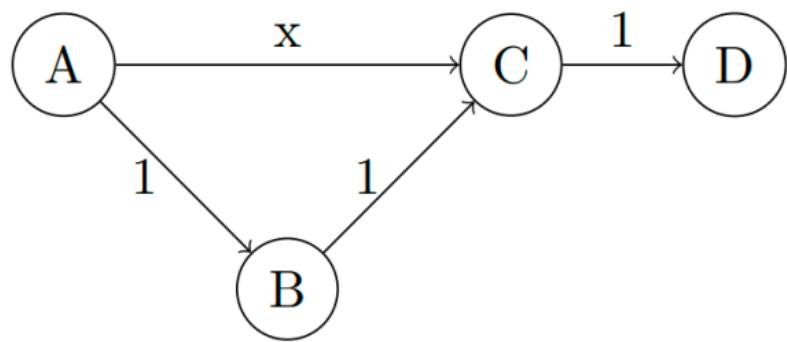

> [!example] 例题（价值迭代收敛 k，6 分）
> 边上权重是奖励，折扣 $\gamma=1$。令 $k$ 为价值迭代第一次使状态 $s$ 取到最优值（$V_k(s)=V^*(s)$）的迭代次数，$V_0(s)=0$。对每个状态 A、B、C、D 列出 $k$ 的所有可能值（若受 $x$ 取值影响，列出所有可能；若永不收敛则 $k=\infty$）。
> **示例**：状态 D，$k=0$（第一次迭代后 $V_1(D)=V_0(D)$ 即收敛，取第一次达到最优值的下标 0）。状态 A 的答案为 **2 或 3**（取决于 $x$）。

### 2.3 真题：Q2 Dice Bonanza（骰子赌博 MDP）

> [!example] 例题（策略评估 + 策略改进，Dice Bonanza）
> 赌场游戏：每轮可掷一个公平 6 面骰子，每次掷骰花费 1 美元，**第一轮必须掷**。每次掷骰后有两个动作：**Stop**（停止，收下骰子点数的美元）或 **Roll**（再掷，再付 1 美元）。用无限时域 MDP 建模：状态 $s_i$ 表示骰子停在 $i$ 点，$\gamma=1$。
>
> **(a) 策略评估**：初始策略 $\pi$ 为 $s_1,s_2$=Roll，$s_3$–$s_6$=Stop。求 $V^\pi$。
> - 对 $i\in\{3,4,5,6\}$，$V(s_i)=i$（策略 Stop，直接拿点数）。
> - 由贝尔曼方程：$V(s_1)=V(s_2)=-1+\tfrac16(V(s_1)+V(s_2)+3+4+5+6)$。解线性方程组得 $V(s_1)=V(s_2)=3$。
> - 结果：$V^\pi=[3,3,3,4,5,6]$。
>
> **(b) 策略改进**：对每个 $s_i$ 比较 Roll 与 Stop 的值。
> - Roll 的值（对所有状态相同）：$-1+\tfrac16(3+3+3+4+5+6)=3$。
> - Stop 的值：$s_i$ 状态为 $i$。
> - 取较大者：$s_1,s_2$ 选 Roll（3>1,3>2），$s_4,s_5,s_6$ 选 Stop（4,5,6>3），**$s_3$ 两者都=3，写 Roll/Stop**。

### 2.4 真题：策略迭代 ABCD 确定性 MDP

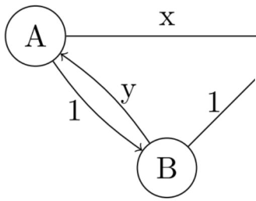

> [!example] 例题（策略迭代追踪，8 分）
> 4 状态确定性 MDP，假设 $x,y\ge0$ 且 $x+y<1$，策略改进时若多个动作最优则选字母靠前者。初始策略 $\pi_0$：A→C, B→C, C→D, D→D。求每个状态首次达到最优策略的迭代次数 $k$。
>
> **解**（追踪策略评估 + 改进）：
> - $\pi_0$ 评估：$V^{\pi_0}(D)=0,\ V^{\pi_0}(C)=1,\ V^{\pi_0}(B)=2,\ V^{\pi_0}(A)=x+1$。
> - $\pi_1$：$\pi_1(B)=\arg\max\{A:x+y+1, C:2\}=C$，$\pi_1(A)=\arg\max\{B:3, C:x+1\}=B$。
> - $\pi_1$ 评估：$V^{\pi_1}(A)=3,\ V^{\pi_1}(B)=2,\dots$
> - $\pi_2$：$\pi_2(B)=\arg\max\{A:y+3, C:2\}=A$，$\pi_2(A)=B$。此策略最优（$V^{\pi_2}(A)=V^{\pi_2}(B)$ 达最优）。
> - 这道题的核心方法：**每轮先精确评估当前策略的 V，再用一步前瞻做策略改进，直到 π 不变**。

---

## 三、Minimax 与决策网络（第二题，13 分）

> 详解见 [[第4周星期五-对抗搜索1_Minimax与剪枝_笔记|Minimax 与剪枝]]、[[第5周星期三-对抗搜索2_评估函数Expectimax与MCTS_笔记|Expectimax]]、[[第13周星期五-简单决策_效用与决策网络_笔记|决策网络与 VPI]]。

### 3.1 Minimax 与 Expectimax

> [!note] Minimax
> 确定性零和博弈（井字棋、国际象棋）：一方最大化、另一方最小化。**极小极大值递归计算**：终止结点取效用值，MAX 结点取子结点最大值，MIN 结点取最小值。

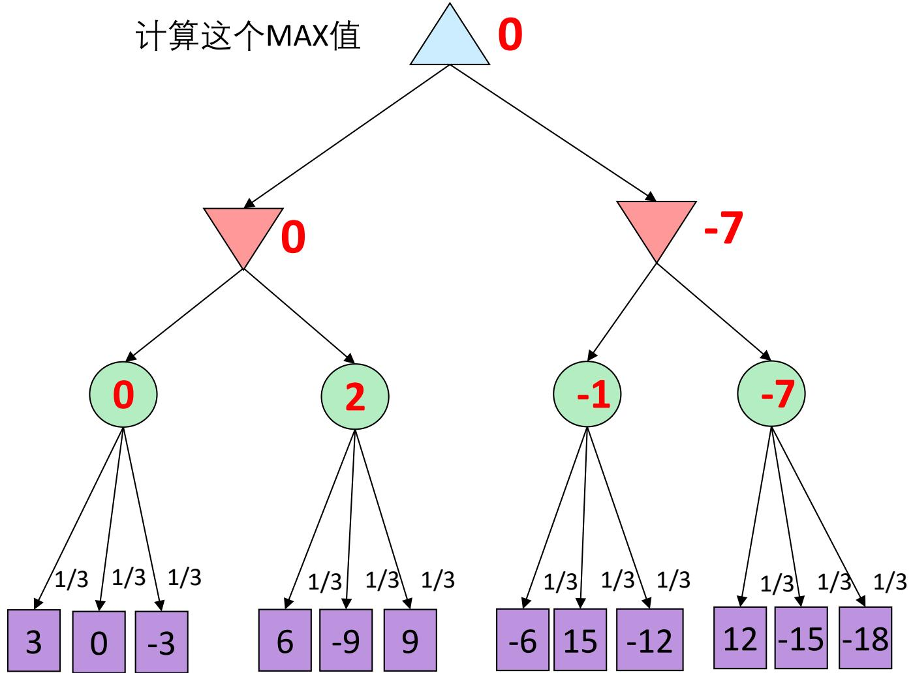

> [!example] 例题（Expectimax，Q2(c)，4 分）
> 给定零和博弈树，但**没有 Min 玩家结点，取而代之的是机会结点（Chance）**，它**随机均匀**地选一个值。填写每个结点的 expectimax 值。
>
> **方法**：机会结点的值 = 子结点的**期望（均匀平均）**，MAX 结点仍取最大值。

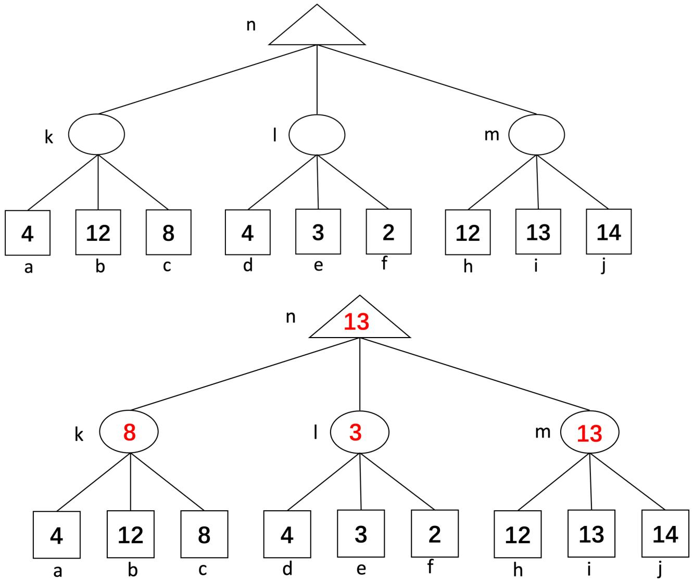

> [!important] 决策论统一视角
> 概率论 + 效用论 → 决策论：理性 agent 最大化期望效用 $a^*=\arg\max_a\sum_s P(s\mid a)U(s)$。这是 [[第13周星期五-简单决策_效用与决策网络_笔记|简单决策]] 与 MDP/强化学习共同的根。

### 3.2 决策网络与完全信息价值 VPI

> [!note] 决策网络求解算法
> ① 对当前状态设证据变量 $e$；② 对动作结点每个可能值 $a$：把动作结点设为 $a$，对效用结点 $U$ 的父节点 $W$ 用**贝叶斯网络推理**算后验 $P(W\mid e,a)$，再算期望效用 $\sum_w P(w\mid e,a)U(a,w)$；③ 返回最高效用的动作。

> [!example] 例题（雨伞决策网络 Umbrella）
> 效用表 $U(A,W)$：(leave,sun)=100, (leave,rain)=0, (take,sun)=20, (take,rain)=70。
> **无预报时**（先验 $P(W)=\langle0.7\text{ sun},0.3\text{ rain}\rangle$）：
> - $EU(\text{leave})=0.7\times100+0.3\times0=70$
> - $EU(\text{take})=0.7\times20+0.3\times70=35$ → 最优 **leave**，$MEU(\{\})=70$。
>
> **看预报后**（$P(F)=\langle0.65\text{ good},0.35\text{ bad}\rangle$）：
> - $F=\text{good}$：$P(W\mid\text{good})=\langle0.89,0.11\rangle$ → $EU(\text{leave})=89,\ EU(\text{take})=25$ → 选 leave，值 89。
> - $F=\text{bad}$：$P(W\mid\text{bad})=\langle0.34,0.66\rangle$ → $EU(\text{leave})=34,\ EU(\text{take})=53$ → 选 take，值 53。
> - 获取预报后的期望效用 $MEU(\{\},F)=0.65\times89+0.35\times53=76.4$。
> - **信息价值** $VPI(F)=76.4-70=\mathbf{6.4}$。

> [!important] VPI 公式（完全信息价值）
> $$\text{MEU}(e)=\max_a\sum_s P(s\mid e)U(s,a)$$
> $$\text{MEU}(e,E')=\sum_{e'}P(e'\mid e)\,\text{MEU}(e,e')$$
> $$\boxed{VPI(E'\mid e)=\text{MEU}(e,E')-\text{MEU}(e)}$$
> 即「先揭示 $E'$ 再行动」比「现在就行动」MEU 上升了多少。**VPI 永远 $\ge0$**。

### 3.3 真题：炉石传说 AoE 决策网络

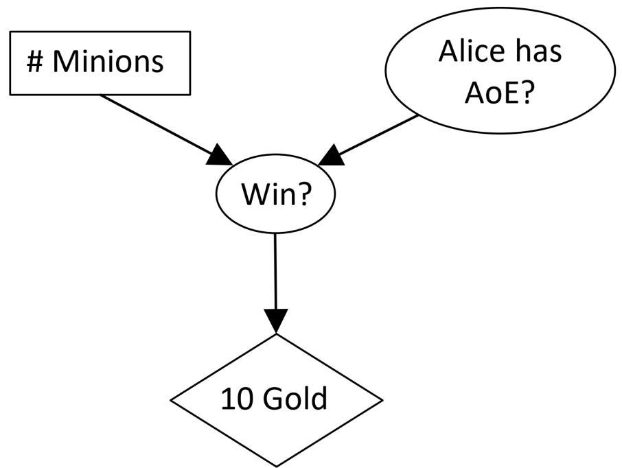

> [!example] 例题（炉石 VPI 完整题）
> 你打出 0/1/2 个随从。若 Alice 有 AoE，获胜率分别 60%/50%/20%；若无 AoE，获胜率 20%/60%/90%。$P(\text{AoE})=0.5$。赢得 10 金币、输得 0 金币（金币效用 = 金币数）。
>
> **(a)–(c) 不知道 AoE 时各动作期望金币**（求和消元 $\sum_a P(w\mid m,a)P(a)\cdot10$）：
> - 打 0 个：$10(0.6\times0.5+0.2\times0.5)=\mathbf{4}$
> - 打 1 个：$10(0.5\times0.5+0.6\times0.5)=\mathbf{5.5}$
> - 打 2 个：$10(0.2\times0.5+0.9\times0.5)=\mathbf{5.5}$
> - 故 $MEU(\{\})=5.5$。
>
> **(d) 已知 AoE 在手**（+a）：$10\max\{0.6,0.5,0.2\}=\mathbf{6}$（选打 0 个）。
> **(e) 已知 AoE 不在手**（−a）：$10\max\{0.2,0.6,0.9\}=\mathbf{9}$（选打 2 个）。
> **(f) 愿付多少金币知道 AoE 是否在手？**（即 $VPI(A)$）：
> - $MEU(\{A\})=0.5\times6+0.5\times9=7.5$
> - $VPI(A)=MEU(\{A\})-MEU(\{\})=7.5-5.5=\mathbf{2}$ → 愿付 **2 金币**。

---

## 四、贝叶斯网络（第三题，18 分）

> 详解见 [[第10周星期三-贝叶斯1_概率基础与贝叶斯规则_笔记|概率基础与贝叶斯规则]]、[[第10周星期五-贝叶斯2_独立性朴素贝叶斯与贝叶斯网络_笔记|贝叶斯网络]]、[[第11周星期三-贝叶斯3_条件独立性与变量消元_笔记|条件独立与变量消元]]、[[第11周星期五-贝叶斯4_采样近似推理_笔记|采样近似推理]]。

### 4.1 概率基础：联合、边缘、条件、归一化

> [!note] 三种分布与互相转换
> - **联合分布** $P(S,R)$ 含全部信息。
> - **边缘分布**：对不关心的变量**求和消元**（aggregate rows）：$P(S)=\sum_r P(S,r)$。
> - **条件分布**：选出符合证据的行再**归一化**（select rows, normalize）：$P(a\mid b)=\dfrac{P(a,b)}{P(b)}$。
> - **归一化**：每项乘 $\alpha=1/(\text{所有项之和})$，使分布和为 1。粒子滤波按权重重采样时也用归一化。

> [!example] 例题（条件概率，P(T,W) 表）
> 给定 $P(T,W)$ 联合表，求 $P(W{=}\text{sun}\mid T{=}\text{cold})$：
> - $P(T{=}c)=\sum_W P(W,T{=}c)=0.15+0.08+0.27+0.00=0.50$
> - $P(W{=}s\mid T{=}c)=0.15/0.50=\mathbf{0.3}$。

> [!important] 贝叶斯规则（最重要的 AI 等式）
> 由乘法规则 $P(a\mid b)P(b)=P(a,b)=P(b\mid a)P(a)$ 两边除以 $P(b)$：
> $$P(a\mid b)=\frac{P(b\mid a)P(a)}{P(b)}$$
> 作用：**逆向构建条件**（一个方向难、另一个简单时），描述从先验 $P(a)$ 到后验 $P(a\mid b)$ 的更新；是 ASR、机器翻译等系统的基础。

### 4.2 贝叶斯网络的联合概率与条件独立

> [!note] 链式法则
> 贝叶斯网络的联合概率 = 每个变量给定其父节点的条件概率之积：$P(x_1,\dots,x_n)=\prod_i P(x_i\mid\text{parents}(x_i))$。

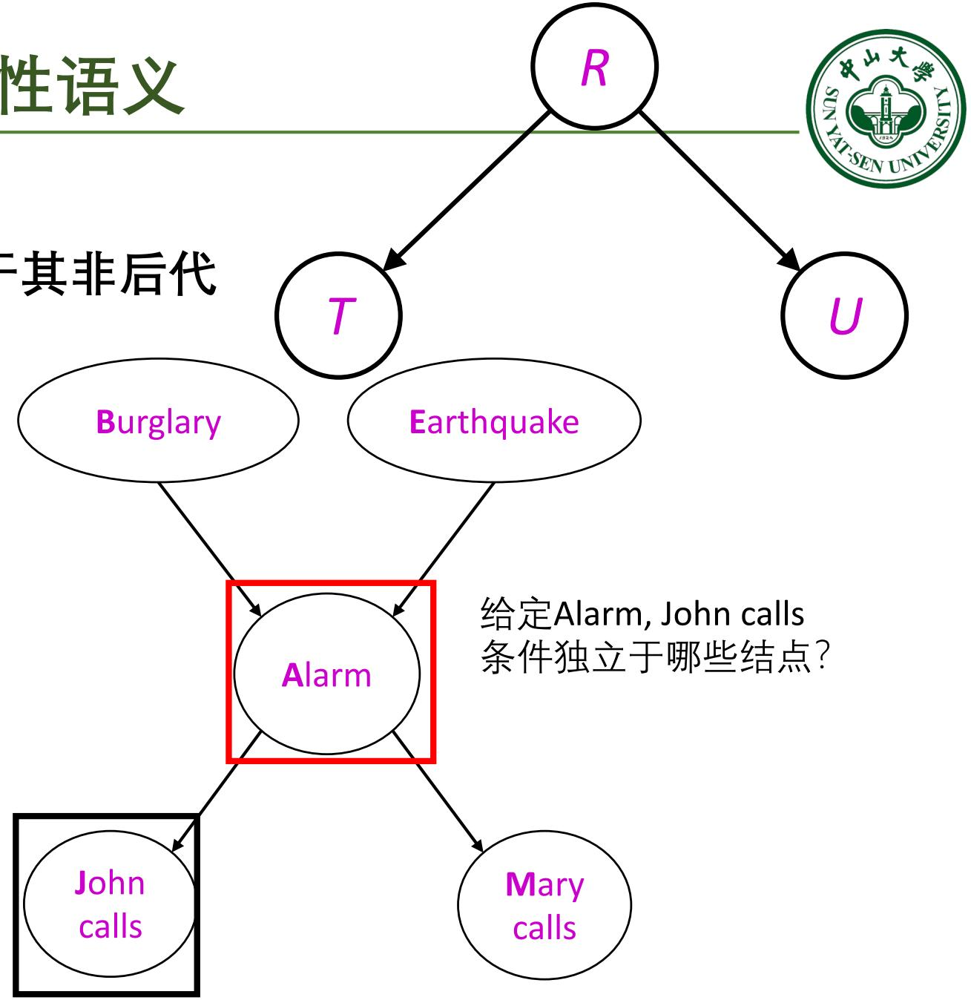

> [!example] 例题（报警网络联合概率）
> 求 $P(b,\neg e,a,\neg j,\neg m)$（盗窃发生、无地震、警报响、John 不打、Mary 不打）：
> $$P(b)P(\neg e)P(a\mid b,\neg e)P(\neg j\mid a)P(\neg m\mid a)=0.001\times0.998\times0.94\times0.1\times0.3=\mathbf{0.000028}$$

> [!important] 两条独立性判据
> - **局部独立性**：给定父节点，每个变量条件独立于其**非后代**。
> - **马尔科夫覆盖（Markov Blanket）**：一个结点的马尔科夫覆盖 = 它的**父节点 + 子节点 + 子节点的其他父节点**。**给定其马尔科夫覆盖，该变量条件独立于所有其他变量**。
> - 例：给定 Alarm，John calls 条件独立于 Burglary、Earthquake、Mary calls。

### 4.3 真题：硫磺味贝叶斯网络

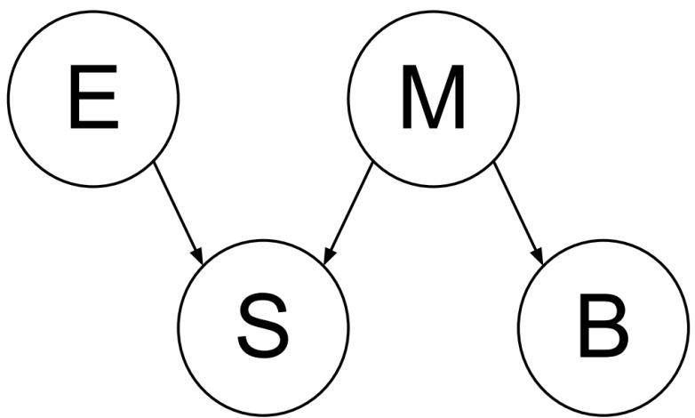

> [!example] 例题（硫磺味网络多问）
> 硫磺味 S 可能由臭鸡蛋 E 或玛雅启示录 M 引起；M 也导致海洋沸腾 B。网络 E→S←M→B。CPT：$P(+e)=0.4$，$P(+m)=0.1$，$P(S\mid E,M)$、$P(B\mid M)$ 如题给。
> - **(a)** $P(-e,-s,-m,-b)=P(-e)P(-m)P(-s\mid -e,-m)P(-b\mid -m)=(0.6)(0.9)(0.9)(0.9)=\mathbf{0.4374}$
> - **(b)** $P(+b)=P(+b\mid+m)P(+m)+P(+b\mid-m)P(-m)=(1.0)(0.1)+(0.1)(0.9)=\mathbf{0.19}$
> - **(c)** $P(+m\mid+b)=\dfrac{P(+b\mid+m)P(+m)}{P(+b)}=\dfrac{(1.0)(0.1)}{0.19}\approx\mathbf{0.5263}$
> - **(d)** $P(+m\mid+s,+b,+e)=\dfrac{(0.4)(0.1)(1.0)(1.0)}{(0.4)(0.1)(1.0)(1.0)+(0.4)(0.9)(0.8)(0.1)}=\dfrac{0.04}{0.04+0.0288}\approx\mathbf{0.5814}$
> - **(e)** $P(+e\mid+m)=P(+e)=\mathbf{0.4}$（E 与 M 边缘独立，因 E、M 无共同祖先且未观测共同后代 S）。

### 4.4 四种采样方法

> [!note] 采样方法对比（核心考点）
> | 方法 | 做法 | 处理证据 | 权重 |
> |---|---|---|---|
> | **直接采样**（prior） | 按拓扑序，每个变量从 $P(X_i\mid\text{parents})$ 采样 | 不处理 | 无 |
> | **拒绝采样** | 直接采样后，**丢弃不符合证据**的样本 | 事后丢弃（浪费多） | 无 |
> | **似然加权** | 证据变量固定为观测值，非证据变量采样，**样本带权重** $w=\prod_{\text{evidence}}P(e_i\mid\text{parents})$ | 固定不采样 | 累乘证据 CPT |
> | **吉布斯采样**（MCMC） | 固定证据，每次重采样一个非证据变量 $X$ 自其马尔科夫覆盖 $P(X\mid\text{mb}(X))$ | 固定 | 无（靠马尔可夫链平稳分布） |

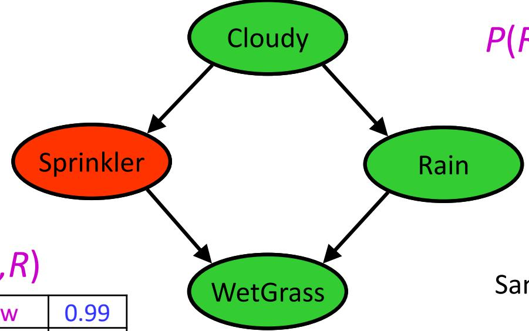

> [!example] 例题（似然加权权重，Sprinkler）
> 求 $P(C\mid r,w)$，证据 $R{=}\text{true},W{=}\text{true}$。某样本权重 $w=1.0\times P(r\mid c)\times P(w\mid s,r)=1.0\times0.99\times0.1$。**权重 = 所有证据变量在其父节点条件下的 CPT 值之积**。

### 4.5 真题：Q1 贝叶斯网络综合（22 分）

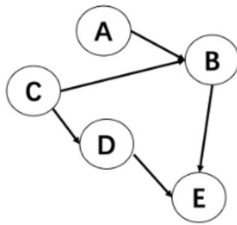

> [!example] 例题（Q1 多问，CPT 见课件）
> 网络拓扑序 A,C,B,D,E，$P(A){=}0.6$、$P(C){=}0.4$，$P(B\mid A,C)$、$P(D\mid C)$、$P(E\mid B,D)$ 如题给。
>
> **(a) 直接采样**：第一个样本是 $+a,-b,-c,-d,+e$，采到它的概率？
> $$P(+a)P(-c)P(-b\mid+a,-c)P(-d\mid-c)P(+e\mid-b,-d)=0.6\times0.6\times0.8\times0.7\times0.2=\mathbf{0.04032}$$
>
> **(b) 判断**：估算 $P(C\mid+a)$，拒绝采样比直接采样运行时间更高效？True/False —— 答案有歧义（题目缺约束如"获取 100 个有效样本"），**两者都给对**。
>
> **(d) 似然加权**：估算 $P(A,C\mid -e)$，五个样本：
> S1: $+a,+b,+c,+d,-e$；S3: $-a,-b,-c,-d,-e$ …
> - S1 权重 $=P(-e\mid+b,+d)=\mathbf{0.5}$
> - S3 权重 $=P(-e\mid-b,-d)=\mathbf{0.8}$
>
> **(e)** 用 S1–S5 估 $P(-a,-c\mid-e)$：五样本权重 0.5, 0.6, 0.8, 0.5, 0.8，总权重 3.2；只有 S3 满足 $-a,-c$，故 $=0.8/3.2=\mathbf{1/4}$。
>
> **(f) 吉布斯采样**：目标 $P(C\mid+a,-b)$，初始样本 $+a,-b,+c,+d,+e$，选变量 D，随机数 0.793。重采样 D：
> $$P(D\mid -b,+c,+e)=\alpha\,P(D\mid+c)P(+e\mid-b,D)=\alpha(0.5{\times}0.3,\ 0.5{\times}0.2)=(0.6,0.4)$$
> $+d$ 对应区间 $[0,0.6)$，$-d$ 对应 $[0.6,1)$。随机数 0.793 落在 $[0.6,1)$ → $D{=}-d$。**新样本：$+a,-b,+c,-d,+e$**。

---

## 五、逻辑（第四题，6 分）

> 详解见 [[第5周星期五-逻辑Agent入门_笔记|逻辑 Agent 入门]]、[[第6周星期三-逻辑2_命题逻辑推理_笔记|命题逻辑推理]]、[[第6周星期五-逻辑3_知识Agent与一阶逻辑_笔记|一阶逻辑]]。

### 5.1 真题：CNF 转换

> [!example] 例题（转合取范式 CNF，2 分）
> 将 $\neg(A\Rightarrow(B\wedge\neg C))\vee D$ 转换为 CNF。
> **解**（逐步）：
> 1. 消蕴含：$A\Rightarrow(B\wedge\neg C)\equiv\neg A\vee(B\wedge\neg C)$
> 2. 取反：$\neg(\neg A\vee(B\wedge\neg C))\equiv A\wedge\neg(B\wedge\neg C)$
> 3. 德摩根：$\neg(B\wedge\neg C)\equiv\neg B\vee C$，故内部 $=A\wedge(\neg B\vee C)$
> 4. 整体 $=(A\wedge(\neg B\vee C))\vee D$
> 5. 分配律：$\boxed{(A\vee D)\wedge(\neg B\vee C\vee D)}$

> [!note] CNF 的结构与转换操作
> CNF = 子句的合取；每个子句是文字（命题词或其否定）的析取。标准操作顺序：① 消双条件 $\Leftrightarrow$ 为两个蕴含；② 消蕴含 $a\Rightarrow b\equiv\neg a\vee b$；③ 用德摩根把否定内移；④ 用分配律把 $\vee$ 分配到 $\wedge$ 内。

### 5.2 可满足性与蕴涵

> [!important] 用 SAT 求解器测试蕴涵（反证法）
> $$\text{KB}\models\alpha\iff(\text{KB}\wedge\neg\alpha)\text{ 不可满足}$$
> 推导：$a\models b$ ⟺ $a\Rightarrow b$ 在所有世界为真 ⟺ $a\wedge\neg b$ 在所有世界为假（不可满足）。所以**给结论加"非"，验证矛盾**。高效 SAT 求解器（如 DPLL）在 CNF 上操作。

> [!example] 例题（真值表枚举，Wumpus）
> 用真值表枚举 KB 为真的所有模型（128 行中仅 3 行 $R_1$–$R_5$ 全真）。这 3 行中 $P_{1,2}$ 都为 false → **能推出 $[1,2]$ 没有坑**；但 $P_{2,2}$ 不全相同 → **不能推出 $[2,2]$ 有/无坑**。这说明蕴涵 = "在 KB 为真的每个模型中查询都为真"。

### 5.3 一阶逻辑

> [!example] 例题（自然语言 → 一阶逻辑）
> "同一国籍的每两个人都讲一种共同的语言"。谓词：$\text{Nationality}(x,n)$（x 有国籍 n）、$\text{Speaks}(x,l)$（x 讲语言 l）。
> $$\forall x,y\ (\exists n\ \text{Nationality}(x,n)\wedge\text{Nationality}(y,n))\Rightarrow(\exists l\ \text{Speaks}(x,l)\wedge\text{Speaks}(y,l))$$

---

## 六、粒子滤波（第五题，14 分）

> 详解见 [[第12周星期三-马尔可夫模型1_马尔可夫链与HMM滤波_笔记|HMM 滤波]]、[[第12周星期五-马尔可夫模型2_平滑与维特比_笔记|平滑与维特比]]、[[第13周星期三-马尔可夫模型3_DBN与粒子滤波_笔记|DBN 与粒子滤波]]。

### 6.1 HMM 与滤波回顾

> [!note] HMM 联合分布与滤波递推
> - 隐马尔科夫模型联合分布：$P(X_0,\dots,X_T,E_{1:T})=P(X_0)\prod_t P(X_t\mid X_{t-1})P(E_t\mid X_t)$。
> - **滤波**（递推求 $P(X_t\mid e_{1:t})$）分两步：
>   - **预测（Predict）**：$P(X_{t+1}\mid e_{1:t})=\sum_{x_t}P(x_t\mid e_{1:t})P(X_{t+1}\mid x_t)$（对 $x_t$ 边缘化）
>   - **更新（Update）**：$P(X_{t+1}\mid e_{1:t+1})=\alpha\,P(e_{t+1}\mid X_{t+1})P(X_{t+1}\mid e_{1:t})$（乘观测似然后归一化）

> [!important] 粒子滤波三步（预测 → 更新/加权 → 重采样）
> 用一组粒子（状态样本）近似分布，而非显式概率表：
> 1. **预测**：每个粒子从转移模型采新状态 $x_{t+1}^{(j)}\sim P(X_{t+1}\mid x_t^{(j)})$。
> 2. **更新/加权**：按观测给每个粒子加权 $w^{(j)}=P(e_{t+1}\mid x_{t+1}^{(j)})$，再归一化。
> 3. **重采样**：按权重有放回地重新抽 N 个粒子（丢弃低权重、复制高权重），权重重置为 1。
> 优势：粒子数固定，不像似然加权随时间需要越来越多样本。

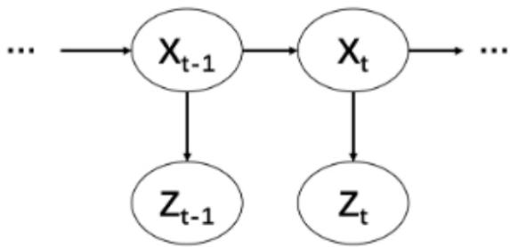

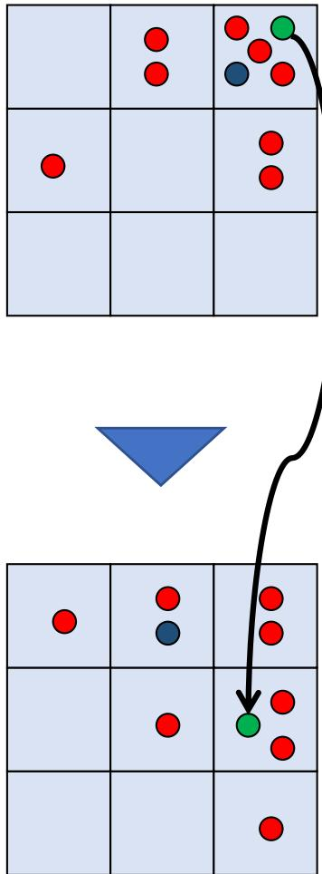

### 6.2 真题：Q2 走廊机器人粒子滤波（14 分）

> [!example] 例题（粒子滤波三步全过程）
> 机器人在 5 个房间（1–5）的走廊。隐状态 $X_t\in\{1,..,5\}$ 真实位置，观测 $Z_t$ 传感器读数。
> **转移模型**：$P(X_t{=}x{-}1\mid x){=}0.2$、$P(X_t{=}x\mid x){=}0.5$、$P(X_t{=}x{+}1\mid x){=}0.3$（越界则留原地）。
> **观测模型**：$P(Z_t{=}x{-}1\mid x){=}0.2$、$P(Z_t{=}x\mid x){=}0.6$、$P(Z_t{=}x{+}1\mid x){=}0.2$。
> $t{-}1$ 的 4 个粒子 $[2,3,3,4]$，观测 $Z_t{=}3$。
>
> **(b) 预测**（随机数 $r=[0.15,0.55,0.88,0.35]$，区间 $[0,0.2)\to x{-}1$、$[0.2,0.7)\to x$、$[0.7,1)\to x{+}1$）：
> | 粒子 | 原状态 | r | 新状态 |
> |---|---|---|---|
> | 1 | 2 | 0.15 | 1（$x{-}1$）|
> | 2 | 3 | 0.55 | 3（$x$）|
> | 3 | 3 | 0.88 | 4（$x{+}1$）|
> | 4 | 4 | 0.35 | 4（$x$）|
>
> **(c) 更新与归一化**（$Z_t{=}3$，权重 $=P(Z_t{=}3\mid x_t)$）：
> | 粒子 | 状态 | 未归一化权重 | 归一化权重 |
> |---|---|---|---|
> | 1 | 1 | 0（\|3-1\|>1）| 0 |
> | 2 | 3 | 0.6（读准）| 0.6 |
> | 3 | 4 | 0.2（\|3-4\|=1）| 0.2 |
> | 4 | 4 | 0.2 | 0.2 |
>
> 总权重 $0+0.6+0.2+0.2=1.0$，已归一化。
>
> **(d) 重采样**（随机数 $r=[0.2,0.5,0.7,0.9]$，累积区间 状态3:$[0,0.6)$、状态4:$[0.6,1)$）：
> | 粒子 | r | 重采样后状态 |
> |---|---|---|
> | 1 | 0.2 | 3 |
> | 2 | 0.5 | 3 |
> | 3 | 0.7 | 4 |
> | 4 | 0.9 | 4 |
> 新粒子集 $[3,3,4,4]$，权重重置为 1，进入下一时间步。

> [!example] 例题（温度粒子滤波，另一例）
> 10 个温度粒子 $[15,12,12,10,18,14,12,11,11,10]$，转移模型偏向最接近 15 的状态（80%）。预测后得 $[15,13,13,11,17,15,13,12,12,10]$；观测 $F{=}13$（传感器正确率 80%、其余各 2%）加权聚合，归一化后状态 13 的权重高达 **0.9449**；重采样后大量粒子收敛到 13，得 $B(T_{i+1})$ 在状态 13 处约 0.9。**体现了"观测把粒子拉向最可能状态"**。

---

## 七、样例学习（第六题，21 分）

> 详解见 [[第14周星期三-机器学习入门_监督学习与分类_笔记|监督学习入门]]、[[第14周星期五-机器学习2_决策树与线性分类_笔记|决策树与线性分类]]、[[第15周星期三-机器学习3_感知器与神经网络_笔记|感知器与神经网络]]、[[第15周星期五-机器学习4_反向传播与逻辑回归_笔记|反向传播与逻辑回归]]、[[第16周星期三-机器学习5_统计学习与朴素贝叶斯_笔记|统计学习与朴素贝叶斯]]。

### 7.1 真题：Q4 感知器电影盈利预测（12 分）

> [!important] 感知器学习规则
> $$w\leftarrow w+\alpha(y-h_w(x))x$$
> 其中正样本(+)标签 $y{=}1$、负样本(−)标签 $y{=}0$，$h_w(x)$ 是预测（$w\cdot x\ge0$ 则 1，否则 0），$(y-h_w(x))\in\{+1,-1,0\}$。直观：预测错就调权重——该为 1 却 $w\cdot x<0$（漏报）就让 $w\cdot x$ 增大，反之减小。

> [!example] 例题（感知器更新追踪）
> 用小明、小红的评分（1–4）预测电影盈利（+/−），加偏置特征 $f_0{=}1$。初始权重 $w{=}[-1,0,0]$，学习率 1。数据：
> | # | 电影 | 小明 $f_1$ | 小红 $f_2$ | 盈利 |
> |---|---|---|---|---|
> | 1 | 哪吒2 | 4 | 3 | + |
> | 2 | 蛟龙行动 | 2 | 2 | − |
> | 3 | 美国队长4 | 1 | 3 | − |
> | 4 | 哆啦A梦 | 2 | 4 | + |
> | 5 | 水饺皇后 | 3 | 1 | + |
>
> **逐步更新**（特征向量含偏置 $[1,f_1,f_2]$）：
> | 步 | 权重 | 感知器得分 | 预测对? | 更新 |
> |---|---|---|---|---|
> | 1 | $[-1,0,0]$ | $-1{\cdot}1+0{\cdot}4+0{\cdot}3=-1$ | 错（应+）| $+[1,4,3]$ |
> | 2 | $[0,4,3]$ | $0{\cdot}1+4{\cdot}2+3{\cdot}2=14$ | 错（应−）| $-[1,2,2]$ |
> | 3 | $[-1,2,1]$ | $-1+2{\cdot}1+1{\cdot}3=4$ | 错（应−）| $-[1,1,3]$ |
> | 4 | $[-2,1,-2]$ | $-2+1{\cdot}2-2{\cdot}4=-8$ | 错（应+）| $+[1,2,4]$ |
> | 5 | $[-1,3,2]$ | $-1+3{\cdot}3+2{\cdot}1=10$ | 对（+）| 无 |
>
> **五个数据跑完最终权重 $w=[-1,3,2]$**。

> [!example] 例题（感知器垃圾邮件误判修正，$\alpha{=}0.5$）
> 权重 $w=[w_0,w_\text{free},w_\text{money}]=[-3,4,2]$，邮件特征 $x=[1,1,1]$。$w\cdot x=-3+4+2=3>0$ 判为 SPAM，但实际**不是**垃圾邮件（$y{=}0$，被误判）。更新：
> $$w\leftarrow(-3,4,2)+0.5(0-1)(1,1,1)=(-3.5,3.5,1.5)$$

### 7.2 决策树与信息增益

> [!important] 信息增益公式
> - 经验熵：$H(D)=-\sum_{i=1}^k\dfrac{|C_i|}{|D|}\log_2\dfrac{|C_i|}{|D|}$（$k$ 个类别，$p_i$ 为各类比例）。
> - 条件熵：$H(D\mid A)=\sum_{j=1}^v\dfrac{|D_j|}{|D|}H(D_j)$（特征 A 有 $v$ 个取值，划分成 $v$ 个子集）。
> - **信息增益 $=H(D)-H(D\mid A)$**，选增益最大的属性做划分。布尔熵 $B(q)=-q\log_2 q-(1-q)\log_2(1-q)$。

> [!example] 例题（餐厅 WillWait 决策树，选首划分属性）
> 12 个样例（属性 Alt/Bar/Fri/Hun/Pat/Price/…，标签 WillWait Yes/No，6 正 6 负，$B(6/12){=}1$ bit）。比较 Patrons 与 Type：

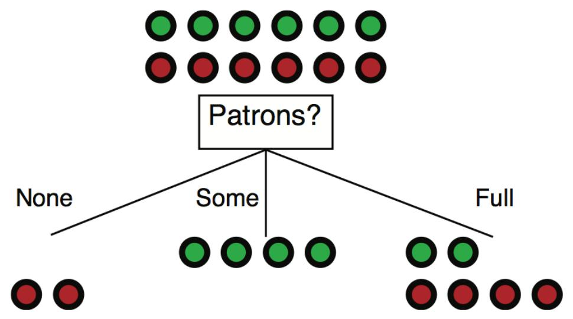

> - **Patrons 划分**（None=2 全负、Some=4 全正、Full=6 含 2 正 4 负）：
> $$\text{Gain}=1-[\tfrac{2}{12}B(0)+\tfrac{4}{12}B(1)+\tfrac{6}{12}B(2/6)]=\mathbf{0.541}\text{ bit}$$

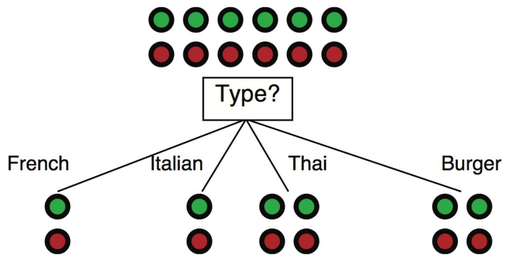

> - **Type 划分**（4 个分支各 1 正 1 负或 2 正 2 负，全是 $B(1/2){=}1$）：
> $$\text{Gain}=1-[\tfrac{2}{12}B(\tfrac12)+\tfrac{2}{12}B(\tfrac12)+\tfrac{4}{12}B(\tfrac26)+\tfrac{4}{12}B(\tfrac12)]=\mathbf{0}\text{ bit}$$
> **结论：Patrons 增益 0.541 > Type 增益 0，应选 Patrons 做第一个划分**（更有区分能力、提升子集纯度）。

### 7.3 神经网络的矩阵表示

> [!note] 单神经元到多层
> - 单神经元：$y=\phi(w_1x_1+w_2x_2+w_3x_3)=\dfrac{1}{1+e^{-(\sum w_ix_i)}}$。
> - 两隐藏神经元：$h_1=\phi(w_{11}x_1+w_{21}x_2+w_{31}x_3)$，$h_2=\phi(\dots)$，$y=\phi(w_1h_1+w_2h_2)$。
> - **矩阵形式**：$\phi(x\times W_{\text{layer1}})=h$，$\phi(h\times W_{\text{layer2}})=y$。
> - 维度（本例）：$x$ 为 (1,3)，$W_1$ 为 (3,2)，$h$ 为 (1,2)，$W_2$ 为 (2,1)，$y$ 为 (1,1)。**第 $k$ 层：$z_i^{(k)}=g(\sum_j W_{ij}^{(k-1,k)}z_j^{(k-1)})$**，$g$ 为非线性激活。

### 7.4 反向传播（计算图 + 链式法则）

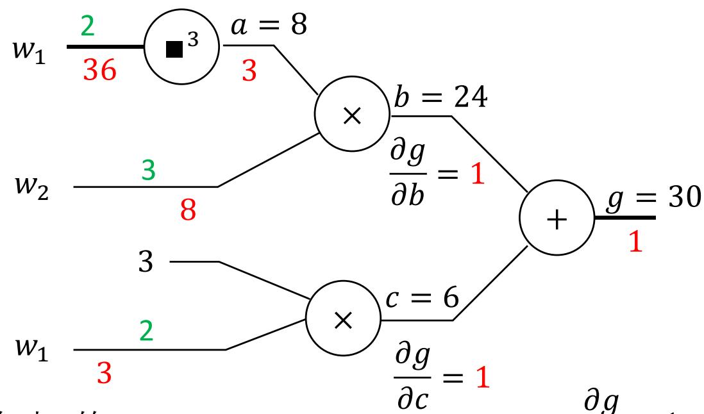

> [!example] 例题（计算图求梯度）
> $g(w)=w_1^3 w_2+3w_1$，在 $w=[2,3]$ 处求梯度。拆解：$a=w_1^3,\ b=a\cdot w_2,\ c=3w_1,\ g=b+c$。
> - $\frac{\partial g}{\partial b}{=}1,\ \frac{\partial g}{\partial c}{=}1$
> - $\frac{\partial g}{\partial a}=\frac{\partial g}{\partial b}\frac{\partial b}{\partial a}=1\cdot w_2=3$
> - $\frac{\partial g}{\partial w_2}=\frac{\partial g}{\partial b}\frac{\partial b}{\partial w_2}=1\cdot a=8$（$a=w_1^3=8$）
> - 路径 a：$\frac{\partial g}{\partial w_1}\big|_a=3\cdot3w_1^2=3\cdot12=36$；路径 c：$\frac{\partial g}{\partial w_1}\big|_c=1\cdot3=3$
> - **累加两条路径**：$\frac{\partial g}{\partial w_1}=36+3=39$。梯度 $\nabla g=[39,8]$。

> [!example] 例题（单神经元单步反向传播，选择题——高频考点）
> 单神经元，$z=w_1x_1+w_2x_2$，$\hat y=\sigma(z)$，平方损失 $L=\tfrac12(\hat y-y)^2$，$\sigma'(z)=\hat y(1-\hat y)$。
> 当前：$x_1{=}1,x_2{=}2,y{=}0.9,w_1{=}2,w_2{=}-1,\eta{=}0.1$。求更新后 $w_2$？
> **解**：$z=2{\cdot}1+(-1){\cdot}2=0$，$\hat y=\sigma(0)=0.5$。
> $$\frac{\partial L}{\partial w_2}=\underbrace{(\hat y-y)}_{-0.4}\times\underbrace{\hat y(1-\hat y)}_{0.25}\times\underbrace{x_2}_{2}=-0.2$$
> $$w_{2,\text{new}}=-1-0.1\times(-0.2)=\mathbf{-0.98}$$
> （此题在 [[第16周星期三-机器学习5_统计学习与朴素贝叶斯_笔记|机器学习5]] 也作为热身出现，务必熟练。）

> [!note] 常见激活函数及导数
> | 激活函数 | $g(z)$ | $g'(z)$ | 常用于 |
> |---|---|---|---|
> | Sigmoid | $\dfrac{1}{1+e^{-z}}$ | $g(z)(1-g(z))$ | RNN |
> | Tanh | $\dfrac{e^z-e^{-z}}{e^z+e^{-z}}$ | $1-g(z)^2$ | RNN |
> | ReLU | $\max(0,z)$ | $1\ (z{>}0)$，否则 0 | MLP、CNN |

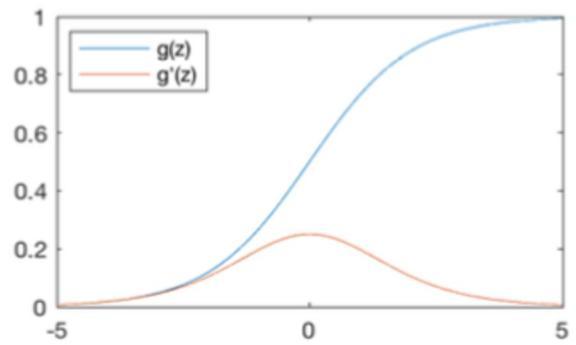

### 7.5 真题：Q5 三层前馈神经网络（16 分）

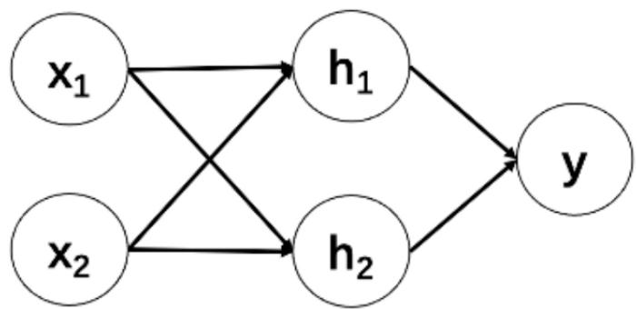

> [!example] 例题（Q5 前向 + 反向）
> 输入 $x_1,x_2$；隐藏层 $h_1,h_2$ 用 ReLU；输出 $y$ 用恒等激活。权重 $W^{[1]}=\begin{bmatrix}1&-1\\2&0.5\end{bmatrix}$（行=输入特征，列=隐藏神经元），$W^{[2]}=[1,-2]^\top$，偏置全 0。输入 $x=[1,2]$，标签 $y_\text{true}=1$，平方损失 $L=\tfrac12(y-y_\text{true})^2$。
>
> **(a) 前向求 y**：
> - $z_1=1{\cdot}1+2{\cdot}2=5$，$h_1=\max(0,5)=5$
> - $z_2=1{\cdot}(-1)+2{\cdot}0.5=0$，$h_2=\max(0,0)=0$
> - $y=1{\cdot}5+(-2){\cdot}0=\mathbf{5}$
>
> **(b) 反向求偏导**：
> - $\dfrac{\partial L}{\partial w_2^{[2]}}=(y-y_\text{true})\cdot h_2=(5-1)\cdot0=\mathbf{0}$（因 $h_2{=}0$）
> - $\dfrac{\partial L}{\partial w_{11}}=(y-y_\text{true})\cdot w_1^{[2]}\cdot\text{ReLU}'(z_1)\cdot x_1=4\times1\times1\times1=\mathbf{4}$
>   （即 误差4 × y对h₁偏导1 × h₁对z₁偏导（ReLU导数）1 × z₁对w₁₁偏导（x₁）1）

### 7.6 贝叶斯学习（全贝叶斯预测）

> [!important] 贝叶斯学习 = 对所有假设按后验加权
> 每个假设后验 $P(h_k\mid X)=\alpha P(X\mid h_k)P(h_k)$；预测新数据用**似然加权平均**（不选单一最佳假设）：
> $$P(x_{N+1}\mid X)=\sum_k P(x_{N+1}\mid h_k)P(h_k\mid X)$$

> [!example] 例题（五种糖果袋，连取 5 个 lime）
> 五种袋子 cherry 比例 $\theta$ 与先验：h1($\theta{=}1$,0.1), h2(0.75,0.2), h3(0.5,0.4), h4(0.25,0.2), h5(0,0.1)。连取 5 个 lime。
> **后验**（$P(\text{lime}\mid h){=}1-\theta$）：归一化常数 $\alpha=1/(0+0.000195+0.0125+0.0475+0.1)=6.2424$，得
> $P(h_1){=}0,\ P(h_2){=}0.0012,\ P(h_3){=}0.078,\ P(h_4){=}0.296,\ P(h_5){=}\mathbf{0.624}$。
> **预测第 6 个是 lime**：$\sum_k P(\text{lime}\mid h_k)P(h_k\mid X)=0.25{\cdot}0.0012+0.5{\cdot}0.078+0.75{\cdot}0.296+1.0{\cdot}0.624=\mathbf{0.886}$。

> [!example] 例题（三硬币贝叶斯预测，两道选择题）
> 三枚硬币假设：h1(均匀,先验0.5,$P(\text{正}){=}0.5$), h2(偏正,0.3,0.8), h3(双面正,0.2,1.0)。观测 $D{=}\{H,H,T,H,H\}$（4 正 1 反）。
>
> **小问 1（哪个后验最大）**：似然×先验——
> - h1：$0.5^4{\cdot}0.5\times0.5=0.015625$
> - h2：$0.8^4{\cdot}0.2\times0.3=0.024576$
> - h3：$1^4{\cdot}0\times0.2=0$（出现反面，$P(\text{反}\mid h3){=}0$，直接排除）
> - $0.024576>0.015625>0$ → **h2 后验最大（选 B）**。
>
> **小问 2（预测第 6 次为正面）**：$P(D)=0.015625+0.024576+0=0.040201$，后验 $P(h_1\mid D){=}0.3887,\ P(h_2\mid D){=}0.6113,\ P(h_3\mid D){=}0$。
> $$P(X_6{=}\text{正}\mid D)=0.5{\cdot}0.3887+0.8{\cdot}0.6113+1.0{\cdot}0=\frac{0.0078125+0.0196608}{0.040201}\approx\mathbf{0.683}\ (\text{选 C})$$

---

## 八、强化学习（第七题，10 分）

> 详解见 [[第8周星期五-强化学习1_被动RL与时序差分_笔记|被动 RL 与 TD]]、[[第9周星期三-强化学习2_QLearning与近似_笔记|Q-Learning 与近似]]。

> [!note] 强化学习总览
> 新情况：**不知道 T 或 R**，必须实际尝试动作来学习。
> - **被动 RL**（给定策略，估计效用）：Model-based（统计估 T、R）；Model-free（直接效用估计、时序差分 TD）。
> - **主动 RL**（找最优策略，不估效用）：Model-free 的 Q-learning、近似 Q-learning。

### 8.1 真题：Q5 被动强化学习（18 分）

> 云处理中心 8 状态，$S_1$ 初始、$S_8$ 终止。策略 π：奇数状态执行 A、偶数状态执行 B。$\gamma{=}0.5,\alpha{=}0.5,V_0{=}0$。6 个 Episodes：
> - Ep1: $S_1\xrightarrow{A,0}S_2\xrightarrow{B,0}S_3\xrightarrow{A,20}S_8$
> - Ep2: $S_1\xrightarrow{A,0}S_4\xrightarrow{B,0}S_5\xrightarrow{A,-10}S_8$
> - Ep3: $S_1\xrightarrow{A,0}S_2\xrightarrow{B,0}S_6\xrightarrow{B,10}S_8$
> - Ep4: $S_1\xrightarrow{A,0}S_4\xrightarrow{B,0}S_7\xrightarrow{A,30}S_8$
> - Ep5: $S_1\xrightarrow{A,0}S_2\xrightarrow{B,0}S_3\xrightarrow{A,20}S_8$
> - Ep6: $S_1\xrightarrow{A,0}S_4\xrightarrow{B,0}S_5\xrightarrow{A,-10}S_8$

> [!example] (a) Model-Based 频率计数估转移概率（4 分）
> - $S_2$ 共出现 3 次（Ep1,3,5），2 次→$S_3$、1 次→$S_6$：$P(S_3\mid S_2,B){=}2/3{\approx}0.67$，$P(S_6\mid S_2,B){=}1/3{\approx}0.33$。
> - $S_4$ 共出现 3 次（Ep2,4,6），2 次→$S_5$、1 次→$S_7$：$P(S_5\mid S_4,B){=}2/3$，$P(S_7\mid S_4,B){=}1/3$。

> [!example] (b) Model-Free 直接效用估计（8 分）
> 折扣回报 $G_t=r_t+\gamma r_{t+1}+\gamma^2 r_{t+2}+\dots$，对每个状态取所有经过它的 episode 的 $G$ 均值：
> - **$V^\pi(S_3)$**：出现在 Ep1,5，回报均 $0.5{\times}0+\dots$ 实际从 $S_3$ 出发 $G{=}20$。均值 $(20+20)/2=\mathbf{20}$。
> - **$V^\pi(S_2)$**：Ep1: $0+0.5(20){=}10$；Ep3: $0+0.5(10){=}5$；Ep5: $0+0.5(20){=}10$。均值 $(10+5+10)/3\approx\mathbf{8.33}$。
> - **$V^\pi(S_1)$**：Ep1,5: $0+0.5(0)+0.25(20){=}5$；Ep2,6: $0+0.5(0)+0.25(-10){=}-2.5$；Ep3: $0+0.5(0)+0.25(10){=}2.5$；Ep4: $0+0.5(0)+0.25(30){=}7.5$。均值 $(5{\times}2+(-2.5){\times}2+2.5+7.5)/6=15/6=\mathbf{2.5}$。

> [!important] 时序差分学习（TD）
> 从**每一次状态转移**学习（不必等 episode 结束）。每经历 $(s,a,s',r)$ 更新一次 $V(s)$：
> $$\text{sample}=R(s,\pi(s),s')+\gamma V^\pi(s')$$
> $$V^\pi(s)\leftarrow(1-\alpha)V^\pi(s)+\alpha\cdot\text{sample}=V^\pi(s)+\alpha(\text{sample}-V^\pi(s))$$
> $\alpha$ 随访问次数递减则收敛。越可能的 $s'$ 越频繁参与更新。

> [!example] (c) TD(0) 在线更新（6 分）
> 公式 $V(s)\leftarrow V(s)+\alpha[r+\gamma V(s')-V(s)]$，按顺序处理 Ep1（$\gamma{=}\alpha{=}0.5$，初值 0）：
> - $S_1\to S_2$：$V(S_1)\leftarrow0+0.5[0+0.5(0)-0]=\mathbf{0}$
> - $S_2\to S_3$：$V(S_2)\leftarrow0+0.5[0+0.5(0)-0]=\mathbf{0}$
> - $S_3\to S_8$：$V(S_3)\leftarrow0+0.5[20+0.5(0)-0]=\mathbf{10}$

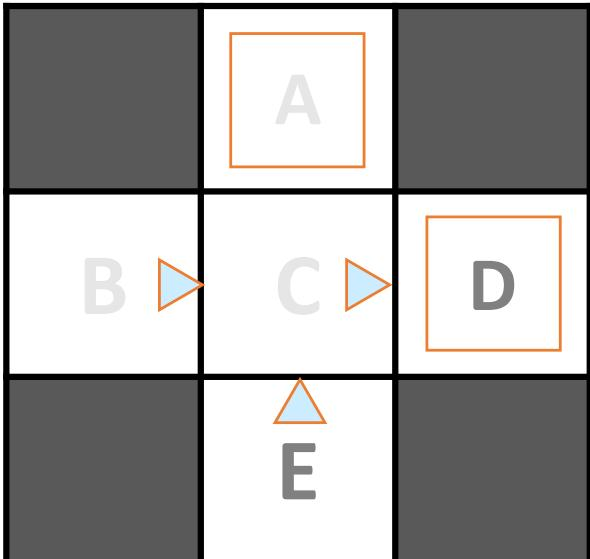

### 8.2 主动强化学习：Q-Learning

> [!important] Q-Learning（sample-based Q 值迭代）
> 边走边学 $Q(s,a)$，**无需策略评估、无需知道 T**。每个样本 $(s,a,s',r)$：
> $$\text{sample}=R(s,a,s')+\gamma\max_{a'}Q(s',a')$$
> $$Q(s,a)\leftarrow(1-\alpha)Q(s,a)+\alpha\cdot\text{sample}=Q(s,a)+\alpha[r+\gamma\max_{a'}Q(s',a')-Q(s,a)]$$
> 关键区别于 Q 值迭代（贝尔曼更新 $Q_{k+1}(s,a)=\sum_{s'}T(s,a,s')[R+\gamma\max_{a'}Q_k(s',a')]$）：**Q-learning 不需要转移函数 T**。

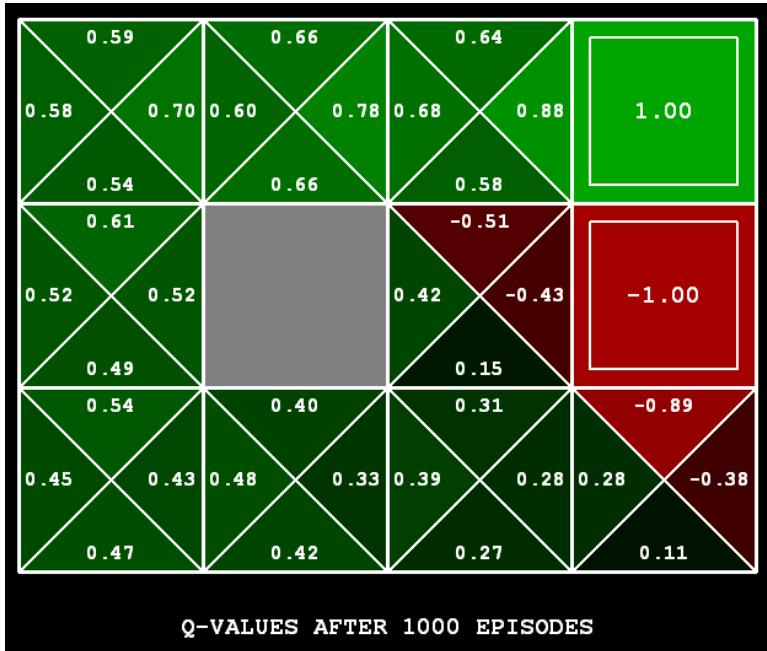

> [!example] 例题（Q6 主动 RL，Q 值在线更新，12 分）
> 5 状态、动作 {A,B}，$\gamma{=}0.8,\alpha{=}0.5$，初始 Q 全 0。按顺序处理 6 个元组（每步立即生效），$Q(s,a)\leftarrow Q(s,a)+\alpha[r+\gamma\max_{a'}Q(s',a')-Q(s,a)]$：
> 1. $(S_1,A,S_2,0)$：$Q(S_1,A)=0+0.5[0+0.8(0)-0]=\mathbf{0}$
> 2. $(S_2,B,S_3,2)$：$Q(S_2,B)=0+0.5[2+0.8(0)-0]=\mathbf{1}$
> 3. $(S_3,A,S_4,10)$：$Q(S_3,A)=0+0.5[10+0.8(0)-0]=\mathbf{5}$
> 4. $(S_1,B,S_5,0)$：$Q(S_1,B)=0+0.5[0+0.8(0)-0]=\mathbf{0}$
> 5. $(S_5,A,S_2,0)$：$Q(S_5,A)=0+0.5[0+0.8\max(Q(S_2,A),Q(S_2,B))-0]=0.5[0.8{\times}1]=\mathbf{0.4}$
> 6. $(S_2,B,S_4,6)$：$Q(S_2,B)=1+0.5[6+0.8(0)-1]=1+2.5=\mathbf{3.5}$

> [!example] 例题（2×4 网格世界 Q 值迭代 vs Q-Learning）
> $2{\times}4$ 网格，起点 1 终点 8，到 8 奖励 +10、其余转移 −1。给定初始 Q 值表。Adam 假设动作**完全确定**，用贝尔曼更新（已知 T、R）：
> - **(i)** $Q(3,\text{left})$ 更新（$\gamma{=}0.8$，向左到状态 2）：$-1+0.8\times(1\times\max_a Q(2,a))=-1+0.8\times6=\mathbf{3.8}$（$Q(2,\text{down}){=}6$ 最大）
> - **(ii)** $Q(3,\text{down})$ 更新（向下到状态 7）：$-1+0.8\times(1\times8)=\mathbf{5.4}$（$Q(7,\text{right}){=}8$ 最大）
> - **(iii)** 与课堂 Q-learning $Q_{k+1}=(1-\alpha)Q_k+\alpha\cdot\text{sample}$ 的区别：Adam 的是 **Q 值迭代（贝尔曼更新）**，**需要知道 T**；Q-learning **不需要 T**。

### 8.3 近似 Q-Learning

> [!important] 线性函数近似
> $$Q(s,a)=w_1 f_1(s,a)+w_2 f_2(s,a)+\dots+w_n f_n(s,a)$$
> 权重更新（每个特征共用同一 difference）：
> $$\text{difference}=[r+\gamma\max_{a'}Q(s',a')]-Q(s,a)$$
> $$w_i\leftarrow w_i+\alpha\cdot\text{difference}\cdot f_i(s,a)$$
> 直观：发生意外坏事就"责怪"当时活跃的特征（大 $f_i$），降低拥有这些特征的所有 q-state 的 Q 值。

> [!example] 例题（近似 Q-Learning 权重更新）
> $Q(s,a)\approx w_1 f_1(s,a)+w_2 f_2(s,a)$，初始 $w=[0,0]$，$\gamma{=}0.8,\alpha{=}0.5$。特征表：$(S_2,B)$ 与 $(S_3,A)$ 的 $f_1{=}1,f_2{=}1$。用元组 $(S_2,B,S_3,2)$ 更新：
> - 当前 $Q(S_2,B)=0{\cdot}1+0{\cdot}1=0$；预测 $\max Q(S_3,a')=0$（权重为 0）。
> - $\text{difference}=[2+0.8(0)]-0=2$。
> - $w_1=0+0.5{\cdot}2{\cdot}f_1(S_2,B)=0+1{\cdot}1=\mathbf{1}$；$w_2=0+0.5{\cdot}2{\cdot}1=\mathbf{1}$。

> [!example] 例题（吃豆人撞鬼，权重大幅下调）
> $Q(s,a)=4.0f_\text{DOT}-1.0f_\text{GST}$，转移 $(s,\text{NORTH},s',r{=}-500)$，$f_\text{DOT}(s,\text{N}){=}0.5,f_\text{GST}(s,\text{N}){=}1.0$，$Q(s,\text{N}){=}+1$，$Q(s',\cdot){=}0$。
> - $r+\gamma\max Q(s',a')=-500+0=-500$，$\text{difference}=-500-1=-501$。
> - 设 $\alpha$ 使 $\alpha{\times}501{\times}\dots$，更新后 $w_\text{DOT}{=}3.0,\ w_\text{GST}{=}-3.0$ → $Q(s,a)=3.0f_\text{DOT}-3.0f_\text{GST}$（撞鬼后大幅惩罚"接近幽灵"特征）。

---

## 本章小结

> [!summary] 全课程主线回顾
> - **搜索**：树/图搜索、UCS/A\*、可采纳与一致性 → 决定节点扩展顺序与最优性。
> - **MDP**：贝尔曼方程、价值迭代、策略迭代、策略提取 → 已知 T、R 时求最优策略。
> - **博弈与决策**：Minimax/Expectimax、决策网络、VPI → 对抗与不确定下的理性决策。
> - **贝叶斯网络**：链式法则、条件独立、马尔科夫覆盖、四种采样 → 概率推理。
> - **逻辑**：CNF、SAT 与蕴涵、一阶逻辑 → 知识表示与推理。
> - **时序推理**：HMM 滤波、粒子滤波三步 → 隐状态估计。
> - **样例学习**：感知器、决策树信息增益、神经网络/反向传播、贝叶斯学习 → 从数据学习。
> - **强化学习**：被动（直接评估、TD）、主动（Q-learning、近似 Q）→ 未知 T、R 时边交互边学。
>
> **知识点关联主线**：Expectimax → MDP → 强化学习（求解序列决策）；贝叶斯网络 → 采样 → 粒子滤波（概率推理）；感知器 → 神经网络 → 反向传播（判别式学习）；MLE/MAP → 朴素贝叶斯 → 贝叶斯学习（生成式/概率学习）。

> [!question] 期末自测（按板块快速过一遍）
> 1. DFS、UCS、A\* 图搜索的节点扩展顺序如何确定？可采纳与一致性各保证什么？
> 2. 写出价值迭代与策略迭代的更新式，并说明策略迭代为何收敛。
> 3. Dice Bonanza 中 $V(s_1)=V(s_2)=3$ 怎么解出来的？$s_3$ 为何 Roll/Stop 都可？
> 4. 雨伞例子：复算 $VPI(\text{Forecast})=6.4$；炉石例子：复算 $VPI(\text{AoE})=2$。
> 5. 硫磺味网络：复算 $P(+m\mid+s,+b,+e)\approx0.5814$。
> 6. 四种采样的区别？Q1(f) 吉布斯采样为何得到 $+a,-b,+c,-d,+e$？
> 7. 把 $\neg(A\Rightarrow(B\wedge\neg C))\vee D$ 转 CNF。如何用 SAT 求解器测蕴涵？
> 8. 粒子滤波 Q2：复算预测/更新/重采样三张表。
> 9. 感知器电影题：复算最终权重 $[-1,3,2]$。决策树为何选 Patrons（增益 0.541）而非 Type（0）？
> 10. Q5 神经网络：复算 $y=5$、$\partial L/\partial w_{11}=4$。糖果袋：复算 $P(h_5\mid5\text{lime})=0.624$、预测 0.886。
> 11. 强化学习 Q6：复算 6 个元组的 Q 更新（注意元组 5、6 用到 max）。近似 Q：复算 $w=[1,1]$。

> [!note] 相关章节（全课程导航）
> 见 [[00_课程总览_MOC|课程总览 MOC]]。各板块详解链接已分散在上文各节标题下。

