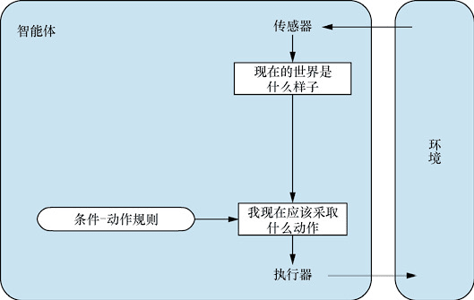
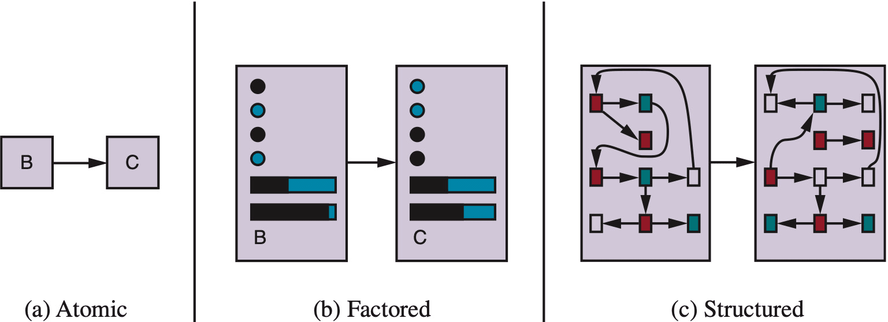
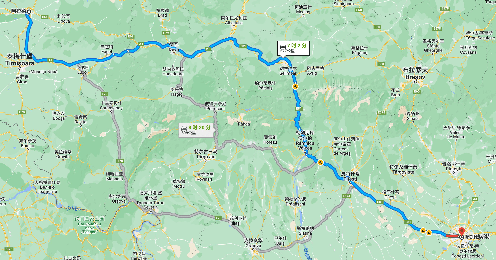

# 智能体与搜索（一）

> [!abstract] 本节导览
> 本课件横跨**第 2 章 智能体**与**第 3 章 通过搜索求解问题**的开头。先用 **PEAS** 框架刻画任务环境、用七个维度分类环境、并区分四类智能体结构；再过渡到把现实问题抽象成**搜索问题的五要素形式化**。承接 [[第1周星期三-绪论_笔记|绪论 — 什么是人工智能]] 中的 理性智能体 概念。

# 第 2 章 — 智能体

## 2.1 智能体与环境


> [!important] 智能体定义
> 任何通过**传感器（Sensor）**感知**环境（Environment）**、并通过**执行器（Actuator）**作用于环境的事物，都可视为智能体（Agent）。
> - 人是智能体：传感器=眼、耳、鼻；执行器=手、脚、声道。
> - AI 更关注**拥有大量计算资源、且需要做重要决策**的智能体。

### 智能体函数 vs. 智能体程序

> [!note] 抽象与实现
> - **智能体函数（agent function）** $f: P^* \to A$：把**感知序列**（percept histories）映射为**行动**——这是抽象的数学表示。
> - **智能体程序（agent program）** $l$：在机器 $M$ 上运行以执行 $f$，即 $f=\text{Agent}(l,M)$——这是具体实现。机器 $M$ 有速度与存储限制，故 $f$ 取决于 $M$ 与 $l$。

> [!example] 吸尘器智能体
> - 感知：`[location, status]`，如 `[A, Dirty]`；行动：`Left / Right / Suck / NoOp`。
> - 一个简单反射程序：
>   ```
>   function Reflex-Vacuum-Agent([location,status]):
>     if status = Dirty then return Suck
>     else if location = A then return Right
>     else if location = B then return Left
>   ```

## 2.2 良好行为：理性的概念

> [!important] 理性智能体的定义
> 对于每一个可能的感知序列，给定**感知序列提供的证据**和智能体的**先验知识（prior knowledge）**，理性智能体应选择一个**期望最大化性能度量**的动作。
> - 理性 ≠ 全知 / 完美（不是实际性能最大化）；
> - 理性智能体要做**信息收集（探索 exploration）**并尽量**从感知中学习（learn）**；
> - **性能度量（performance measure）**评估环境状态序列、定义成功标准。

> [!warning] 性能度量要设计得当
> "统计 8 小时清理的灰尘总量"是坏度量——智能体可能反复弄脏再清洁刷分。更好的度量：**每个时间步、每个干净方格奖励 1 分**。（类比老板如何定 KPI。）

## 2.3 环境的本质 — PEAS 与环境维度

> [!important] PEAS 四要素
> 用 **PEAS**（**P**erformance、**E**nvironment、**A**ctuators、**S**ensors）描述任务环境。准确的 PEAS 定义对智能体设计至关重要。
>
> 例（吃豆人）：性能=每步 -1、吃豆 +10、获胜 +500、死亡 -500、吃掉受惊的鬼 +200；环境=吃豆地图含鬼行为；执行器=上下左右；传感器=整个环境状态可见。

> [!example] 环境的七个分类维度
> | 维度 | 含义 | 对比示例 |
> | --- | --- | --- |
> | 完全 / 部分可观测 | 每步能否获取完整状态？ | 国际象棋 / 夜间驾驶 |
> | 单 / 多智能体 | 他方行为是否影响己方性能度量？ | 解谜 / 踢足球 |
> | 确定 / 随机（stochastic） | 下一状态是否完全由当前状态+动作决定？ | 象棋 / 掷骰子 |
> | 回合式 / 序贯式 | 当前决策是否影响后续？ | 分拣 / 下棋 |
> | 静态 / 动态 | 计算时环境是否变化？ | 象棋 / 自动驾驶 |
> | 离散 / 连续 | 状态/时间是否连续？ | 象棋 / 驾驶 |
> | 已知 / 未知 | 智能体是否知道环境"物理法则"？ | 已知规则的骰子 / 未知规则 |

> [!tip] 环境类型决定智能体设计
> 部分可观测⇒需**记忆**；随机⇒为意外做准备；多智能体⇒可能需**随机行为**；动态⇒时间不足以充分决策；连续⇒需**持续控制**；未知⇒需**探索**。——**自动驾驶汽车同时面临以上所有挑战**。

## 2.4 智能体的结构（四类 + 学习型）

> [!important] 智能体 = 架构 + 程序
> 按通用性与复杂度递增，程序分为四类：



1. **简单反射型（Simple reflex）**：仅依据**当前感知**用"如果…那么…"规则选动作，忽略感知历史。例：前车刹车→开始刹车。
2. **基于模型的反射型（Model-based reflex）**：含"世界如何运转"的**转移模型**与**传感器模型**，用内部状态追踪世界当前状态。例：超车的车下一刻通常更靠近本车。
3. **基于目标的（Goal-based）**：追踪世界状态**与目标**，选择最终能达成目标的动作——需要**搜索（第 3–5 章）**。仅靠目标有时不足（还要更快/更安全）。
4. **基于效用的（Utility-based）**：用**效用函数**衡量各状态偏好，选择**最佳期望效用**的动作（对所有可能结果按概率加权）。"做让我最快乐的事！"

> [!note] 学习型智能体
> 任何类型都能构建为学习型：**学习元素**根据**评估者（critic）**对表现的反馈，修改**性能元素**以在未来做得更好；**问题生成器**负责建议探索性动作（如强化学习的 exploration）；**反馈**对应强化学习的 reward。

### 状态表示的三种粒度



> [!example] 三种状态表示（图 2-16）
> - **原子（atomic）**：状态是无内部结构的黑盒（如城市 B、C）。对应搜索与博弈论、HMM、MDP。
> - **因子化（factored）**：状态由属性值向量组成（布尔/实值/符号）。对应约束满足、命题逻辑、规划、贝叶斯网络、机器学习。
> - **结构化（structured）**：状态含对象及对象间关系。对应一阶逻辑、自然语言处理。

# 第 3 章 — 通过搜索进行问题求解

## 3.1 问题求解智能体

> [!important] 规划智能体 vs. 反射型智能体
> 当正确动作不明显时，智能体需**提前规划**：考虑一个通往目标状态的动作序列。这样的智能体称为**问题求解智能体（Problem-solving agent）**，其计算过程称为**搜索（Search）**。
> - **反射型**：依当前感知（或记忆）选动作，**不考虑未来后果**。
> - **规划型（planning agent）**：问"what if"，基于**假设动作的后果**决策；必须有**世界响应行动的模型**，并制定**目标（测试）**。

## 3.3 搜索问题的形式化（五要素）

> [!important] 搜索问题 = 五个要素
> 1. **状态空间 $S$**（state space）
> 2. **初始状态 $s_0$**（initial state）
> 3. **行动空间 $A(s)$**：每个状态下的可用动作
> 4. **转移模型 $\text{Result}(s,a)$**（transition model）
> 5. **目标测试 $G(s)$**（goal test）
> 6. **动作代价 $c(s,a,s')$**（action cost / 路径耗散）
>
> **解（solution）**：从初始状态到目标状态的一组**行动序列**；**最优解（optimal solution）**：所有解中**路径代价最小**者。

> [!example] 经典实例：罗马尼亚旅行
> 
> - 状态空间=城市；初始状态=Arad；动作=去临近城市；转移模型=到达临近城市；目标测试 $s=\text{Bucharest}$；动作代价=城市间距离。

> [!note] 搜索问题的其他形态
> 地图导航、游戏角色移动、吃豆人寻路、机器人动作规划（移动/旋转关节）、解谜题（华容道）等，都可抽象为同一套五要素。本章目标：**在真正行动之前，先算出最佳路径**。

> [!tip] 分类器 vs. 搜索问题
> - 分类器（简单反射）：$x \xrightarrow{f} y\in\{+1,-1\}$，输出**单个动作**。
> - 搜索问题（基于目标）：$x \xrightarrow{f} (a_1,a_2,a_3,\dots)$，输出**动作序列**——关键在于**考虑动作对未来的影响**。
> 抽象化时一般去除无关细节，从简单情况解起再扩展到复杂情况。

## 本章小结

> [!summary] 要点回顾
> - **理性智能体**：在证据+先验知识下选择期望最大化性能度量的动作；理性 ≠ 全知。
> - **PEAS** 描述任务环境；七个环境维度（可观测性、智能体数、确定性、回合/序贯、动静、离散/连续、已知/未知）很大程度上决定智能体设计。
> - 四类智能体：简单反射 → 基于模型反射 → 基于目标 → 基于效用，皆可加入学习。
> - 状态表示三粒度：原子 / 因子化 / 结构化。
> - **搜索问题**用五要素形式化，解是动作序列，最优解是路径代价最小者。

## 自测题

> [!question] 检验你的理解
> 1. 智能体函数与智能体程序有何区别？写出吸尘器的简单反射程序。
> 2. PEAS 四个字母分别代表什么？为吃豆人写出一份 PEAS。
> 3. 列出环境的七个分类维度，并说明"自动驾驶"在每个维度上属于哪一类。
> 4. 四类智能体结构各自的核心特征是什么？基于效用比基于目标多了什么？
> 5. 搜索问题的五（六）要素是什么？什么是最优解？
> 6. 为什么说基于目标的智能体输出"动作序列"而分类器输出"单个动作"？
