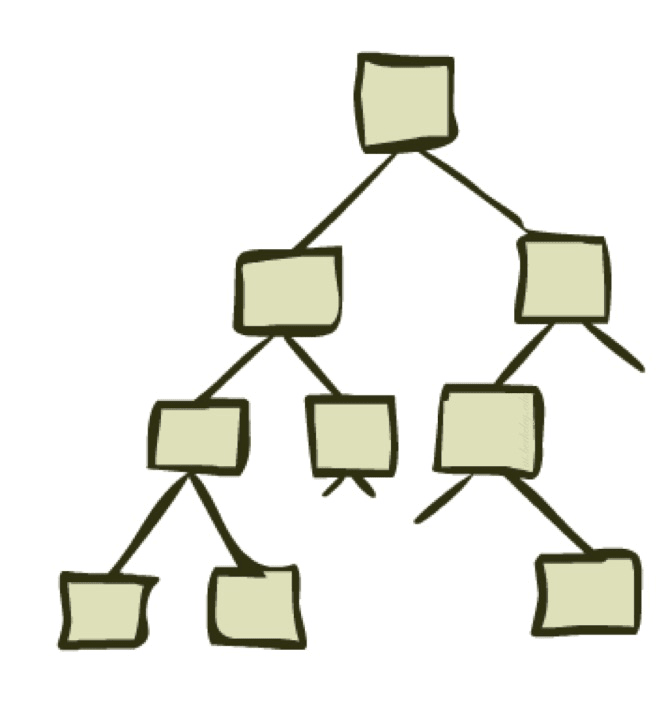
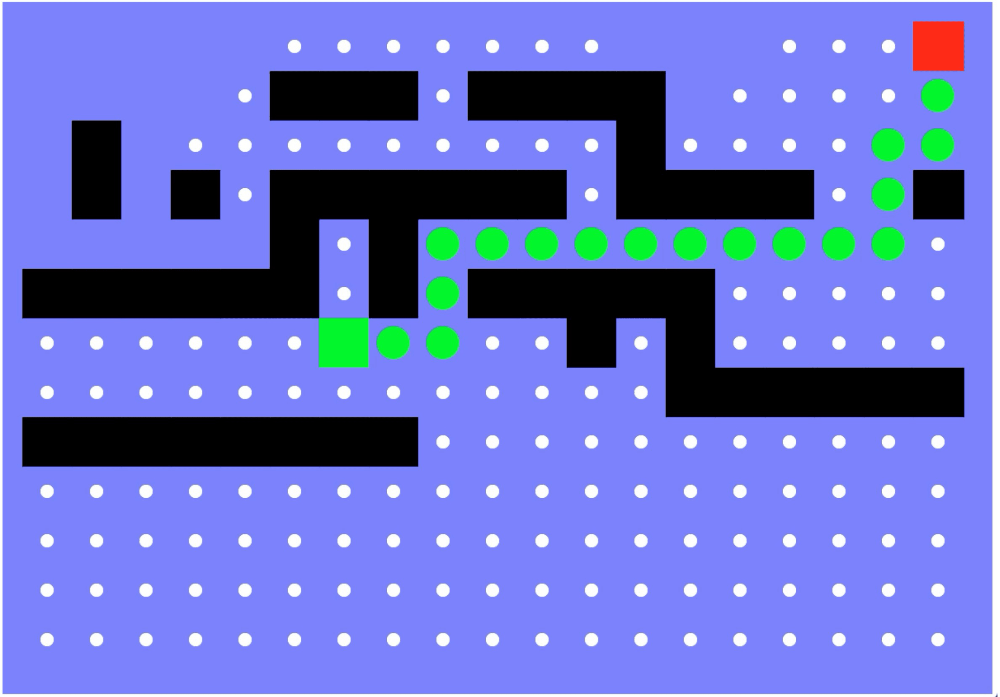
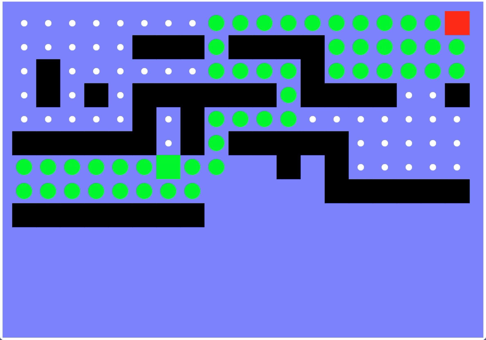
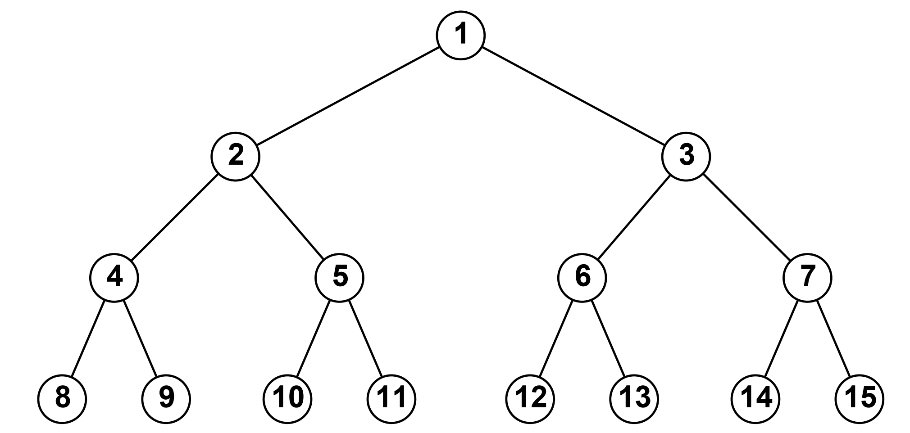
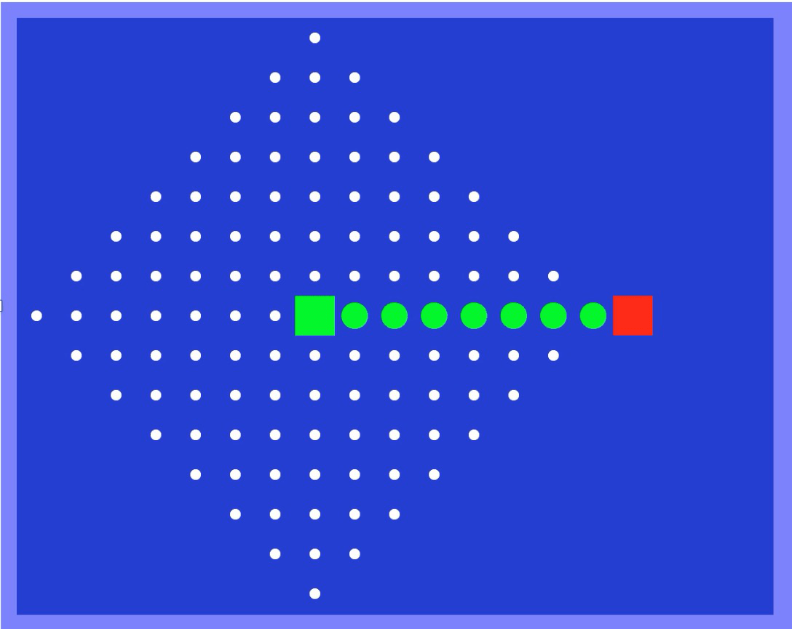

# 搜索（二）— 无信息搜索策略

> [!abstract] 本节导览
> 承接 [[第1周星期五-智能体与搜索1_笔记|搜索问题的形式化]]，本节先厘清**状态空间图**与**搜索树**的区别，定义评价搜索算法的四个指标，然后系统讲解四种**无信息搜索（Uninformed Search）**：广度优先（BFS）、深度优先（DFS）、迭代加深（IDS）、一致代价（UCS）。

## 世界状态 vs. 搜索状态

> [!important] 抽象是关键
> - **世界状态（world state）**：包含环境的每一个细节。
> - **搜索状态（search state）**：只包含规划路径所需的细节（抽象）。
>
> 例（吃豆人，地图 120 个格、30 个豆、12 个鬼位）：
> - 世界状态数 $= 120 \times 2^{30} \times 12^2 \times 4$。
> - **纯路径规划**问题状态数 $= 120$（只需位置）。
> - **吃完所有豆**问题状态数 $= 120 \times 2^{30}$（位置 + 每个豆的布尔值）。

> [!example] 习题：传教士与野人问题
> 三个传教士、三个野人在河一岸，船一次载 1–2 人，要求任何一岸野人数不多于传教士（除非该岸无传教士）。
> 用 `state = [c, a, b]`（传教士数、野人数、船是否在此岸）形式化：初始 `[3,3,1]`，目标 `[0,0,0]`。无约束时共 $4\times4\times2=32$ 个状态，加约束后排除如 `[1,2,1]` 等非法状态。**只要定义好状态与转移规律，即便无法枚举全图也能用算法求解。**

![传教士与野人问题的状态空间图：每个节点是一个 `[传教士, 野人, 船]` 三元组，箭头标注一次合法渡河动作（如 $P_{11}$ 载 1 传教士 1 野人、$Q_{10}$ 载 1 传教士），从初始 `[3,3,1]` 逐步逼近目标 `[0,0,0]`。](./assets/第2周星期三_搜索2_11_2.png)

## 状态空间图 vs. 搜索树

> [!important] 两个核心数据结构
> - **状态空间图（State Space Graph）**：搜索问题的数学表示。节点=（抽象的）世界状态，箭头=转移，目标测试=目标节点集。**每个状态只出现一次**。
> - **搜索树（Search Tree）**：计划及其结果的 "What if" 树。根=起始状态，子节点=后继状态。搜索树的每个节点对应状态空间图里的**一条路径**。对大多数问题**永远无法真正构建整棵树**。

> [!warning] 重复状态会导致死循环
> 不记录访问历史的智能体会反复陷入环路（如 Arad→Sibiu→Arad）。处理办法：① 设定**最大搜索深度**；或 ② **不允许多次访问相同状态**。
> - **树搜索（Tree Search）**：允许访问重复节点，节省存储。
> - **图搜索（Graph Search）**：维护已扩展集合，不重复访问，避免死循环。

## 搜索算法的评价指标

> [!important] 四个指标 + 三个参数
> - **完备性（Complete）**：有解时能否保证找到？
> - **最优性（Optimal）**：能否找到最优解？
> - **时间复杂度** / **空间复杂度**。
>
> 三个影响参数：
> - $b$：**分支因子**（任一节点的最大后继数）；
> - $m$：状态空间中任意路径的**最大长度**；
> - $d$：目标节点所在的**最浅深度**。
>
> 一棵满树总节点数 $1+b+b^2+\dots+b^m = \dfrac{b^{m+1}-1}{b-1} = O(b^m)$。

## 3.4 无信息搜索策略

> 无信息搜索：除问题定义提供的状态信息外，**没有任何附加信息**，仅以节点扩展次序区分算法。

### 广度优先搜索（BFS, Breadth-First Search）

> [!note] 策略与实现
> - **策略**：先扩展边缘集中**最浅**的节点（类似树的层序遍历）。
> - **实现**：边缘集是**先进先出（FIFO）队列**。

> [!example] BFS 性质
> - 时间复杂度 $O(b^d)$；空间复杂度 $O(b^d)$（需存整层节点）。
> - **完备**：解存在则 $d$ 有限，必能找到。
> - **最优**：仅当**每步代价相同**（如均为 1）时最优。

### 深度优先搜索（DFS, Depth-First Search）

> [!note] 策略与实现
> - **策略**：先扩展边缘集中**最深**的节点（类似先序遍历；Tremaux 走迷宫即 DFS）。
> - **实现**：边缘集是**后进先出（LIFO）栈**。

> [!example] DFS 性质
> - 时间复杂度 $O(b^m)$；**空间复杂度 $O(bm)$**（只需存一条根→叶路径上各节点的未扩展兄弟）。
> - **完备**：能防环且 $m$ 有限时完备。
> - **不最优**：优先找搜索树中"靠左"的解，不管代价。

> [!tip] BFS vs. DFS 取舍
> **DFS 在空间上有优势，BFS 在时间与最优性上有优势。** 现实中常常更看重空间——机器存储无法突增，而时间可以多花。

> [!example] 同一迷宫的 BFS / DFS 探索对比（绿色起点、红色终点，绿色方块=已扩展）
> 同一张迷宫（绿色起点→红色终点），对比两种策略实际探索（扩展）的方格：

### 迭代加深搜索（IDS, Iterative Deepening Search）

> [!important] 结合两者优点
> 思路：以深度界限 1、2、3…依次运行 DFS，直到找到解。
> - 看似浪费（上层节点被反复生成），但**问题不大**：分支因子相近时，绝大多数节点都在底层，上层重复影响小。
> - 例（$b=10$，解在第 5 层）：BFS 探索 111,110 个节点，IDS 探索约 123,450 个——**仅多约 11%**。
> - 时间 $O(b^d)$，空间 $O(bd)$——**兼得 BFS 的时间/最优与 DFS 的空间优势**。

> [!example] 三种算法访问顺序（初始 1，目标 11）
> - **BFS**：1 2 3 4 5 6 7 8 9 10 11
> - **DFS**：1 2 4 8 9 5 10 11
> - **IDS**：1; 1 2 3; 1 2 4 5 3 6 7; 1 2 4 8 9 5 10 11

> [!summary] 三者复杂度对比
>
> | 算法 | 时间复杂度 | 空间复杂度 |
> | --- | --- | --- |
> | BFS | $O(b^d)$ | $O(b^d)$ |
> | DFS | $O(b^m)$ | $O(bm)$ |
> | 迭代加深 DFS | $O(b^d)$ | $O(bd)$ |
>
> 时间总是指数级的。

### 一致代价搜索（UCS, Uniform-Cost Search）

> [!important] 当每步代价不等时
> 当各行动代价不同，BFS 找到的是**行动次数最少**而非**代价最小**的路径。UCS 解决此问题——它本质上就是 **Dijkstra 单源最短路**思想。
> - **策略**：先扩展边缘集中**路径代价 $g(n)$ 最小**的节点。
> - **实现**：边缘集是按 $g(n)$ 排序的**优先级队列**（需要更新）。

> [!example] UCS 性质
> 设最优解代价 $C^*$、每步代价至少 $\varepsilon$，则有效深度约 $C^*/\varepsilon$。
> - 时间复杂度 $O(b^{C^*/\varepsilon})$；空间复杂度 $O(b^{C^*/\varepsilon})$。
> - **完备**：$C^*$ 有限且每步代价非负时完备。
> - **最优**：是的（其严格保证将在 A星搜索 一节展开）。
>
> **BFS 可视为 UCS 的特殊情况**（所有代价相等时）。

## 本章小结

> [!summary] 要点回顾
> - 区分**世界状态**与**搜索状态**（抽象）；区分**状态空间图**（每状态一次）与**搜索树**（节点对应路径）。
> - 评价指标：完备性、最优性、时间、空间；参数 $b, m, d$。
> - **BFS**（FIFO，最浅优先，等代价最优）、**DFS**（LIFO，最深优先，省空间不最优）、**IDS**（兼得时间最优与空间节省）、**UCS**（代价最小优先，非负代价下最优）。

## 自测题

> [!question] 检验你的理解
> 1. 世界状态与搜索状态有何区别？为吃豆人"吃完所有豆"问题计算状态数。
> 2. 状态空间图与搜索树的核心区别是什么？为什么搜索树可能无限大？
> 3. 写出 BFS、DFS、UCS 各自的边缘集数据结构与扩展策略。
> 4. 给出 BFS、DFS、UCS 的时间与空间复杂度，并说明各自是否完备/最优。
> 5. 迭代加深为什么"重复生成节点却不浪费"？它的复杂度为何能兼得 BFS 与 DFS 的优点？
> 6. 当每步代价不等时为什么 BFS 不再最优？UCS 如何解决？
