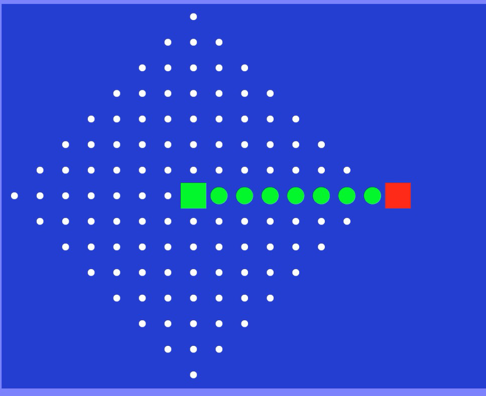
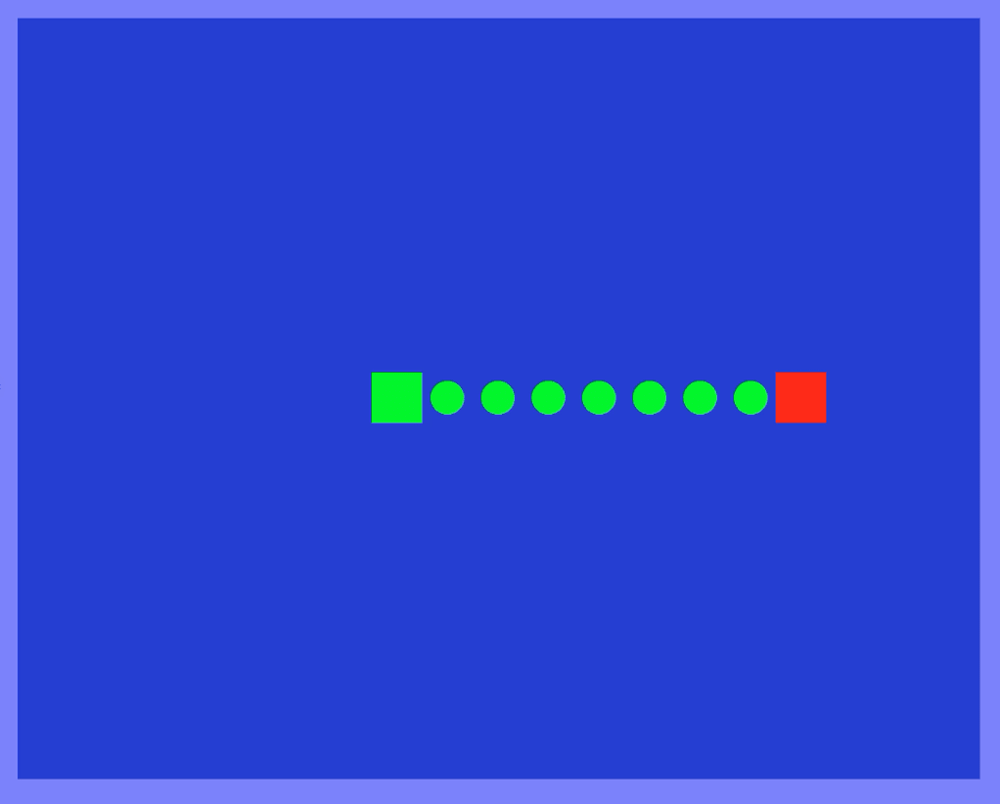
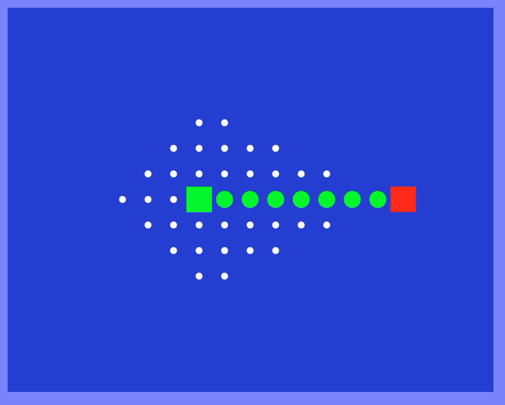

# 搜索（三）— 有信息（启发式）搜索

> [!abstract] 本节导览
> [[第2周星期三-搜索2_无信息搜索_笔记|无信息搜索]]虽然完备、最优，却"够好但不够快"——它在每个方向上均匀探索，浪费大量精力。本节引入**启发函数 $h(n)$**，讲解**贪婪最佳优先搜索**与 **A星搜索**，并证明 A* 在启发式**可采纳（admissible）**时的最优性，最后介绍如何用**松弛问题**系统地构造可采纳启发式。

## UCS 的问题与启发式的引入

> [!warning] UCS 的局限
> 一致代价搜索（UCS）的过程像画**递增的代价等值线（代价轮廓）**——它完备、最优，但**没有目标方向信息**，在每个方向都做探索，最坏复杂度 $O(b^{C^*/\varepsilon})$。如何"既够好又够快"？→ 使用**有信息（启发式）搜索**。

> [!important] 启发函数（Heuristic function）
> - $g(n)$：从初始状态到节点 $n$ 的**已走路径代价**。
> - $h(n)$：节点 $n$ 到目标的**最小代价路径的估计值**——需根据具体问题设计。
> - $f(n)$：经过 $n$ 的路径**评价函数**，按情况定义。
>
> | 算法 | 评价函数 $f(n)$ |
> | --- | --- |
> | 无信息搜索（UCS） | $f(n)=g(n)$ |
> | 贪婪搜索 | $f(n)=h(n)$ |
> | **A\* 搜索** | $f(n)=g(n)+h(n)$ |
>
> 例：路径问题中 $h(n)$ 可取到目标城市的**直线（欧氏）距离**；煎饼问题可取**仍未归位的最大煎饼编号**。

## 贪婪最佳优先搜索（Greedy Best-First Search）

> [!note] 只看 $h(n)$
> 评价函数 $f(n)=h(n)$，每次扩展**离目标估计最近**的节点。实现与 UCS 类似（优先级队列），只是排序依据不同。

> [!warning] 贪婪搜索的缺陷
> - **最优性**：不保证找到最优解（如罗马尼亚问题中贪婪走 A→S→F→B，而最优是 A→S→R→P→B）。
> - **完备性**：有限状态空间的**图搜索**版本完备，其他情况不一定。
> - 它"只顾眼前最近"，容易被局部误导。

## A* 搜索（A\* Search）

> [!important] 核心思想：$f(n)=g(n)+h(n)$
> A* 结合了 UCS（看已走代价 $g$）与贪婪（看未来估计 $h$）：$f(n)$ 表示**经过节点 $n$ 的最小代价解的估计代价**。
> - UCS 均衡地朝各方向扩展；
> - **A\* 主要朝猜测的目标方向扩展**，因而更高效。

> [!example] A* 的实现（OPEN / CLOSE）
> - **OPEN**（边缘集）：已生成但未扩展的叶节点，按 $f$ 值从小到大排列。
> - **CLOSE**（已扩展集）：已生成且已扩展的节点。
> 每步从 OPEN 取 $f$ 最小的节点扩展、移入 CLOSE，生成其后继加入 OPEN，直到目标出队。

### 可采纳性（Admissibility）

> [!important] 可采纳启发式
> 启发函数 $h$ **可采纳（admissible）** ⟺ 对所有 $n$，$0 \le h(n) \le h^*(n)$，其中 $h^*(n)$ 是到达目标的**真实最小代价**。
> - 可采纳 = **乐观的（optimistic）**：从不高估到达目标的代价。
> - 不可采纳 = 悲观的：可能因高估 $f(n)$ 而**错过最优解**。
> - 口诀："估算的目标代价不能太大，要对生活保持乐观！"

> [!note] A* 名字的由来
> A 代表该算法，星号 `*` 代表使用**可采纳启发式**时它保证最优。**使用 A\* 的关键就是找到一个好的可采纳启发式。**

### A* 最优性证明（树搜索）

> [!example] 证明思路
> 设 A 是最优目标节点、B 是次优目标节点（$f(B)>f(A)$），$h$ 可采纳。要证 A* 先扩展 A。
> 设 B 在边缘集中，则 A 的某祖先 $n$ 也在边缘集中：
> 1. $f(n) = g(n)+h(n) \le g(n)+h^*(n) = f(A)$ —— 由 $h$ 可采纳，且目标处 $h=0$ 故 $f(A)=g(A)$。
> 2. $f(A) < f(B)$ —— 因 B 次优。
> 3. 故 $f(n) < f(B)$，$n$ 比 B 先扩展。A 的所有祖先都先于 B 扩展 ⟹ **A 先于 B 被抵达 ⟹ A\* 最优**。

## 构造可采纳启发式 — 松弛问题（Relaxed Problem）

> [!important] 通用方法
> 可采纳启发式通常是**松弛问题**（放宽约束后的问题）的精确解：放宽限制后允许更多操作，在宽条件下算出的 $n$ 到目标的最短代价，必然 ≤ 原问题真实代价，故可采纳。
> 常见放宽方式：移除约束、求封闭形式解、化为更方便的搜索、分解为独立子问题。

> [!example] 八数码问题的两个启发式
> 实际解代价 26：
> - **$h_1$ = 不在位的棋子数**（放宽：可一步把任意棋子直接送到目标位，不管该位是否有子）→ $h_1(\text{start})=8$。
> - **$h_2$ = 所有棋子到目标位的曼哈顿距离之和**（放宽：可逐步移动，不管路径上是否有子）→ $h_2(\text{start})=18$。
> 两者都可采纳，$h_2$ 更接近真实代价，效果更好。

> [!tip] 占优（Dominance）与启发式合成
> - 若对所有 $n$ 有 $h_1(n)\ge h_2(n)$，称 $h_1$ **占优**。可采纳前提下，**启发式值越大越好**（越接近真实代价 ⟹ 扩展更少节点，但每个节点计算 $h$ 的开销可能更大）。
> - 若两个可采纳启发式互不占优，可合成新启发式取较大者：$h(n)=\max(h_1(n), h_2(n))$，仍可采纳。

## A* 的图搜索版本

> [!warning] 树搜索 vs. 图搜索的陷阱
> - **A\* 树搜索**：允许重复扩展同一状态，只要 $h$ 可采纳即最优。
> - **A\* 图搜索**：维护 closed set，**从不扩展同一节点两次**——更省时间，但**仅靠可采纳性不再保证最优**！
>
> 课件示例（S–A–B–C–G）中，A* 图搜索在第③步扩展 C 时，**尚未找到到 C 的最优路径**，却因 C 已入 closed set 而不再重新考虑，导致选了非最优路径。
> 要让 A* 图搜索保持最优，启发式还需满足**一致性（consistency / 单调性）**：对任意边 $n\to n'$，$h(n)\le c(n,n')+h(n')$。

> [!summary] 三种算法对比
> | | UCS | Greedy | A* |
> | --- | --- | --- | --- |
> | $f(n)$ | $g(n)$ | $h(n)$ | $g(n)+h(n)$ |
> | 扩展方向 | 均衡各方向 | 朝目标猛冲 | 朝目标方向但兼顾已走代价 |
> | 最优性 | 是 | 否 | 可采纳时是（图搜索需一致性） |
> A* 广泛用于视频游戏寻路、路径规划、资源规划、机器人动作规划。

> [!example] 三种算法的探索范围对比（绿方块=起点，红方块=终点，白点=被探索的格子）
> 同一空旷地图上从起点到终点：UCS 向四周均匀扩张（探索最多）；贪婪几乎直线冲向目标（探索最少但可能不最优）；A\* 偏向目标方向、探索范围适中且最优。
>
> **UCS（均匀扩张，代价等值线）：**
> 
>
> **贪婪搜索（直冲目标）：**
> 
>
> **A\*（朝目标方向，兼顾代价）：**
> 

## 本章小结

> [!summary] 要点回顾
> - 启发函数 $h(n)$ 估计到目标的代价；UCS 用 $g$、贪婪用 $h$、**A\* 用 $g+h$**。
> - 贪婪快但不最优；**A\* 在 $h$ 可采纳时（树搜索）最优**，图搜索还需一致性。
> - **可采纳 = 不高估 = 乐观**；占优的可采纳启发式更优，可用 $\max$ 合成。
> - 用**松弛问题**系统地构造可采纳启发式（如八数码的错位数 $h_1$、曼哈顿距离 $h_2$）。

## 自测题

> [!question] 检验你的理解
> 1. 写出 UCS、贪婪、A* 各自的评价函数，并说明 A* 如何兼顾两者。
> 2. 什么是可采纳启发式？为什么"乐观"的启发式才能保证 A* 最优？
> 3. 复述 A* 树搜索最优性证明的三个不等式步骤。
> 4. 八数码的 $h_1$、$h_2$ 分别放宽了什么约束？为什么都可采纳？哪个更好，为什么？
> 5. 什么是占优？给定两个互不占优的可采纳启发式，如何合成一个更好的？
> 6. 为什么 A* 图搜索仅有可采纳性不够？还需要什么性质？
