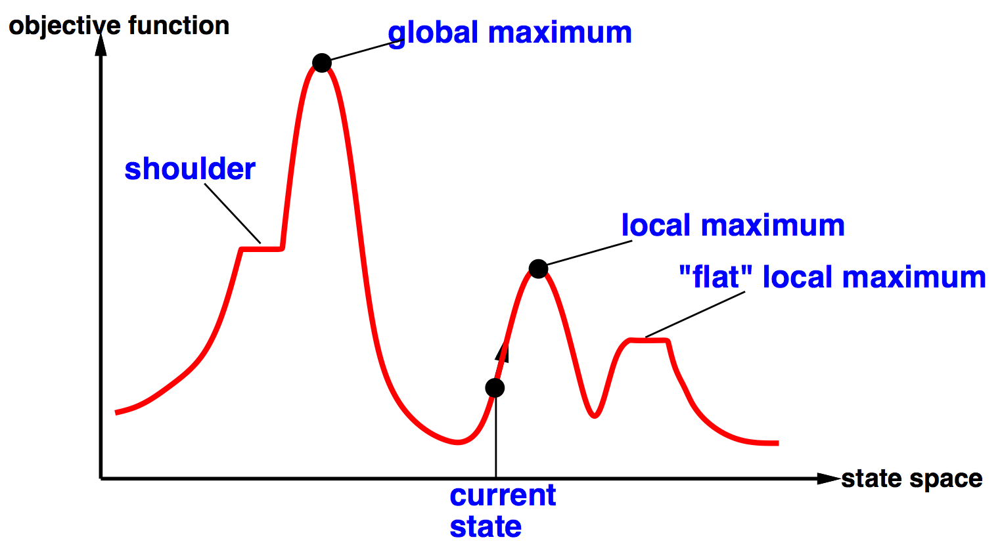

# 搜索（四）— A* 一致性 与 局部搜索

> [!abstract] 本节导览
> 前半补完 [[第2周星期五-搜索3_启发式搜索A星_笔记|A* 搜索]]遗留的**一致性（Consistency）**问题——它是 A* 图搜索最优的充分条件；并通过赛车迷宫、汉诺塔两道习题巩固搜索问题形式化。后半进入**第 4 章 复杂环境中的搜索**，讲解只关心"好状态"而不关心路径的**局部搜索**：爬山法、模拟退火、局部束搜索、遗传算法。

## A* 启发式的一致性（Consistency）

> [!important] 一致性定义
> 启发函数 $h$ **一致（consistent / 单调）** ⟺ 对节点 $n$ 经任一行动生成的每个后继 $n'$：
> $$h(n) - h(n') \le \text{cost}(n \to n') \quad\Longleftrightarrow\quad h(n) \le \text{cost}(n\to n') + h(n')$$
> 即"启发值之差不超过单步代价"（类似三角不等式）。

> [!note] 一致性的两个推论
> 1. **沿任何路径 $f(n)$ 非递减**：
>    $$f(n')=g(n')+h(n')=g(n)+\text{cost}(n\to n')+h(n')\ge g(n)+h(n)=f(n).$$
> 2. **A\* 选择扩展 $n$ 时，已找到到达 $n$ 的最优路径**。因此 **A\* 图搜索最优**。

> [!summary] A* 最优性汇总
> | 搜索方式 | 最优的充分条件 | UCS 作为特例 |
> | --- | --- | --- |
> | **树搜索** | 启发式**可采纳** | $h=0$ 可采纳 |
> | **图搜索** | 启发式**一致** | $h=0$ 一致 |
>
> - **一致 ⟹ 可采纳**（反之不一定）。
> - 大多数可采纳启发式（尤其来自松弛问题的）往往也一致。

> [!tip] 内存受限的 A* 变体（教材 3.5.5）
> A* 把整个探索区保留在内存，大问题会先耗尽空间。变体：
> - **IDA\***（迭代加深 A*）：用 $f$-limit 代替深度限制，每轮记住超限的最小 $f$ 作新限。
> - **RBFS**（递归最佳优先）：递归 DFS，$f$-limit = 祖先可用的最佳替代路径 $f$ 值。
> - **SMA\***：用满内存，满了就删最差节点但在父节点记住其值。
> - **加权 A\***（3.5.4）：$f(n)=g(n)+W\cdot h(n)$，接受次优但"够好"的解以省时省空间。

## 搜索习题精选

> [!example] 习题一：赛车迷宫（变速 agent）
> 状态表示 $(\text{方向}, x, y, \text{速度})$，$M\times N$ 网格、最大速度 $V_{max}$：
> - **(a) 状态空间大小** $= 4MN(V_{max}+1)$。
> - **(b) 曼哈顿距离不可采纳**：agent 可先加速到 $V_{max}$ 再减速停下，能用比"格子数"更少的步数到达（如 9 格仅需 6 步），故曼哈顿距离会**高估**。
> - **(c) 可采纳启发式**（由弱到强）：①面向目标所需转弯数；②放宽墙与变速限制 $d_{man}/V_{max}$；③再考虑 Fast/Slow 加减速动态（占优于②）。
> - **(d)** 不可采纳启发式 + A* 图搜索：**完备**（若有界），但**不保证最优**。
> - **(e)** 可采纳保证树搜索最优、不保证图搜索最优；**一致**才保证图搜索最优。
> - **(f)** 不可采纳启发式的优势：计算更快、可能更接近真实代价从而扩展更少节点——以放弃最优性换速度。

> [!example] 习题二：汉诺塔（N 盘 k 钉）
> - **状态表示**：三个有序列表 `([], [], [])`，每个钉子存其上盘子的编号。
> - **状态空间大小** $= k^N$（本题 $3^N$）。
> - **初始状态** `([1,...,n], [], [])`；**目标测试** 是否为 `([], [], [1,...,n])`。
> - **合法行动**：从某钉弹出顶部盘子，移到另一钉顶部，要求该盘小于目标钉顶部盘（或目标钉为空）。

## 第 4 章 — 复杂环境中的搜索：局部搜索

> [!important] 局部搜索（Local Search）的定位
> 第 3 章假设：完全可观测、确定性、静态、已知环境，解是**动作序列**。本章放宽假设，关注的问题变为：**寻找一个好的状态，而不关心到达路径**。
> - 状态空间 = 所有"完整配置"的集合（如 n-皇后的摆法、TSP 的回路）。
> - 思想：**迭代提升**——从单个当前状态出发，只移动到邻近状态，**不保留搜索路径**，仅用常数内存。
> - 适用于系统化搜索无法处理的**巨大或连续状态空间**。

### 爬山法（Hill Climbing）

> [!note] 算法
> 从任意节点开始，重复**移动到最佳邻接节点**；若无更好邻接则停止。
> ```
> function HILL-CLIMBING(problem):
>   current ← initial-state
>   loop:
>     neighbor ← current 的最高值后继
>     if neighbor.value ≤ current.value: return current
>     current ← neighbor
> ```
> 例（n-皇后）：状态=每列一个皇后的位置；**启发评估 = 相互攻击的皇后对数**（越小越好）；行动=在列内移动皇后。



> [!warning] 爬山法不完备
> 会卡在**局部极大值、山肩、平台区**。改进：
> - **横向移动（sideways move）**：在平台允许有限次平移。
> - **随机重启（random restart）**：反复随机初始化——理论上完备（"只要再试一次总会成功"），但效率较低。
> - 例（8-皇后）：不允许横移成功率 14%，约需 22 步；允许 100 次横移成功率升至 94%，约需 25 步。

### 模拟退火（Simulated Annealing）

> [!important] 以概率接受"坏"动作
> 模拟金属退火（逐渐冷却到低能结晶态）：根据**温度 $T$** 以一定概率接受变差的动作，温度越高"摇晃"越大，越容易跳出局部极点；按调度逐渐降温。
> ```
> ΔE ← next.value − current.value
> if ΔE > 0:  current ← next            # 改善则接受
> else:       以概率 e^(ΔE/T) 接受 next   # 变差也可能接受
> ```
> **若降温足够慢，找到全局最优的概率趋近 1**（但"足够慢"可能指数级慢）。广泛用于工厂调度等大型优化。

### 局部束搜索（Local Beam Search）

> [!note] K 个状态并行且"沟通"
> 从 K 个随机状态开始，每步生成全部 K 个状态的所有后继，从中**统一选 K 个最佳**作为新状态。
> - 与"并行 K 次随机重启"的区别：随机重启各自独立；**局部束搜索会"沟通"**——"快过来，这里的草更绿！"信息在 K 条线程间共享，类比达尔文进化论。

### 遗传算法（Genetic Algorithm）

> [!important] 自然选择的隐喻
> 每一步对 K 个个体：
> 1. **选择（selection）**：按**适应度函数（fitness）**重采样 K 个个体（同一个体可被选多次）；
> 2. **杂交（cross-over）**：随机配对交换片段；
> 3. **变异（mutation）**：以小概率随机改变。
>
> 例（n-皇后）：个体=各列皇后行号串，适应度=非攻击皇后对数；杂交混合两个布局，变异随机移动某皇后。

## 本章小结

> [!summary] 要点回顾
> - **一致性**（$h(n)\le \text{cost}(n\to n')+h(n')$）保证 A* **图搜索**最优；可采纳只保证树搜索最优；一致 ⟹ 可采纳。
> - **局部搜索**只求好状态、不留路径、常数内存，适合巨大/连续空间。
> - **爬山法**（贪婪上坡，会卡局部极值）→ **随机重启 / 横移** → **模拟退火**（概率接受坏动作跳出局部）→ **局部束搜索**（K 线程沟通）→ **遗传算法**（选择+杂交+变异）。

## 自测题

> [!question] 检验你的理解
> 1. 写出一致性的定义，并证明"一致 ⟹ 沿路径 $f$ 非递减"。
> 2. 为什么一致性能保证 A* 图搜索最优，而可采纳不能？
> 3. 赛车迷宫问题中为什么曼哈顿距离不可采纳？给一个可采纳启发式。
> 4. 爬山法会卡在哪三种地形？随机重启与横向移动如何缓解？
> 5. 模拟退火接受坏动作的概率公式是什么？温度起什么作用？
> 6. 局部束搜索与 K 次独立随机重启的本质区别是什么？遗传算法的三个算子分别做什么？
