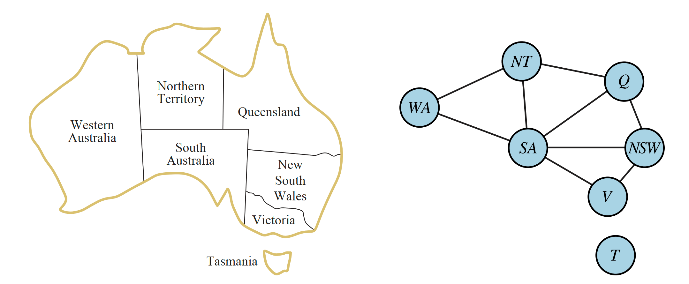

# 连续空间局部搜索 与 约束满足问题（一）

> [!abstract] 本节导览
> 前半收尾 [[第3周星期三-A星一致性与局部搜索_笔记|局部搜索]]：在**连续空间**用梯度下降找极值。后半进入**第 6 章 约束满足问题（CSP）**——一类特殊的"识别问题"，介绍其形式化建模与最基本的求解算法**回溯搜索**，并给出变量排序（MRV）与取值排序（LCV）两大启发式。

## 4.2 连续空间中的局部搜索

> [!example] 罗马尼亚机场选址
> 建 3 个机场，使每个城市到最近机场的距离平方和最小：
> $$f(x)=\sum_a \sum_{c\in C_a}\big[(x_a-x_c)^2+(y_a-y_c)^2\big]$$
> 其中 $C_a$ 是当前状态下离机场 $a$ 最近的城市集合。注意：表达式是**局部的**——$C_a$ 随机场位置（状态）变化。

> [!important] 处理连续空间的三种方法
> 1. **离散化（Discretize）**：每次只把一个机场沿 x 或 y 移动固定量 $\delta$，复用已有局部搜索算法。
> 2. **随机后继**：随机生成长度 $\delta$ 的向量作为移动（随机爬山法、模拟退火）。
> 3. **梯度法**：计算 $f$ 的梯度。

> [!note] 梯度下降（Gradient Descent）
> 梯度向量 $\nabla f(x)=\left(\frac{\partial f}{\partial x_1}, \frac{\partial f}{\partial y_1}, \dots\right)^T$，极值处 $\nabla f(x)=0$。
> - 机场问题 $\frac{\partial f}{\partial x_1}=\sum_{c\in C_1}2(x_1-x_c)$，某些情况有闭式解 $x_1=\frac{\sum_{c\in C_1}x_c}{|C_1|}$。
> - 迭代更新：$x \leftarrow x - \alpha\nabla f(x)$（$\alpha$ 为步长/学习率）。
> - **很多机器学习方法都用这个思想求极值**。

> [!summary] 第 4 章局部搜索小结
> 优化问题常可形式化为局部搜索（不关心路径、只关心目标，状态空间大）。代表算法：爬山法、模拟退火（随机思想）、局部束搜索、遗传算法。

# 第 6 章 — 约束满足问题（CSP）

## 规划 vs. 识别

> [!important] 两类问题
> 在单 agent、确定性、完全可观察、离散的环境下：
> - **规划（Planning）**：找一系列行动，**路径重要**（第 3 章），有代价/深度，启发式提供指引。
> - **识别（Identification）**：找一组**变量赋值**，**目标本身重要而非路径**（第 4 章）。
> - **CSP 是一类特殊的识别问题**。

## 6.1 CSP 的形式化

> [!important] 标准搜索 vs. CSP
> | | 标准搜索问题 | 约束满足问题（CSP） |
> | --- | --- | --- |
> | 状态 | "黑盒"——任意数据结构 | 由**变量 $X_i$** 定义，取值来自**值域 $D$** |
> | 目标测试 | 以状态为参数的任意函数 | 一组**约束**，指定变量子集取值的允许组合 |
> | 后继函数 | 任意 | 受约束限定 |
>
> CSP 的结构化表示，允许使用比标准搜索**更强大的通用算法**。

> [!note] CSP 三元组 $(X, D, C)$
> - **变量集合 $X$**：如澳大利亚地图 $\{WA, NT, Q, NSW, V, SA, T\}$。
> - **值域集合 $D$**：每个变量的可能取值，如 $D_i=\{red, green, blue\}$。
> - **约束集合 $C$**：每条约束 $C_i=\langle scope, rel\rangle$，$scope$ 是变量组、$rel$ 定义允许的取值组合。
>   - 如 $SA\ne WA$ 是 $\langle(SA,WA), SA\ne WA\rangle$ 的简称，展开为 6 个允许的颜色对。
> - **解**：对变量的赋值（Assignment），使所有约束 $C_i$ 满足。

> [!example] CSP 实例
> - **N 皇后**：① 变量=每格、值域=有无棋子、约束=行列对角线及总数；② 变量=第 k 行皇后、值域=所在列、约束=任两皇后不冲突（更简洁）。
> - **数独**：变量=每个空格、值域 $\{1..9\}$、约束=每行/列/宫 9 路 alldiff。
> - **地图着色**：相邻区域不同色。**二元 CSP（Binary CSP）**=每条约束至多涉及两个变量，可画**二元约束图**（节点=变量，边=约束），通用算法借图结构加速。
> - **现实**：日程安排、课表、任务分配、硬件配置、电路布局、故障诊断等。
>
> 注：CSP 是 **NP-hard** 问题，一般不存在多项式时间的通用解法。

## 6.2-3 回溯搜索（Backtracking Search）

> [!important] 朴素搜索的问题
> 若用第 3 章普通搜索（状态=部分着色地图，行动=给某未着色点上色），**能找到解但慢**——会陷入很多 dead end。改进方向：① 一次行动前**推理其后果**、② 尽早避免死路。

> [!note] 回溯搜索 = DFS + 两个改进
> $$\text{Backtracking} = \text{DFS} + \text{变量排序（一次赋一个变量）} + \text{失败即回溯（边走边查约束）}$$
> - **Idea 1**：变量赋值可交换，故**一次赋一个变量、任意顺序**即可（`WA=red then NT=green` 与反序等价）。
> - **Idea 2**：**边走边查约束**——赋值时只取与已赋值不冲突的值；无合法值则回溯改前一个变量（"增量目标测试"）。

> [!example] 回溯算法的三个关键优化点
> 1. **Ordering（排序）**：下一步给哪个变量赋值？按什么顺序试它的值？
> 2. **Filtering（过滤）**：能否**及早发现**不可避免的失败？（见下一节前向检验/弧相容）
> 3. **Structure（结构）**：能否利用问题结构加速？

### 变量排序：最少剩余值（MRV）

> [!important] MRV 启发式
> **Minimum Remaining Values**：优先选择**合法取值最少**的变量（又称"最受约束变量"/"失败优先"）。
> - 例：WA、NT 已赋值后若 SA 无合法值，MRV 会立刻选 SA 并马上检测到失败——避免先搜别处、绕回来才发现死路。

### 取值排序：最少约束值（LCV）

> [!important] LCV 启发式
> **Least Constraining Value**：对选定变量，优先选**给邻居变量留下更多选择**的值。
> - 直觉："给你的朋友/邻居更少的限制、更多的选择"。
> - 注意：判断哪个值最少约束**可能需要一定计算**。

> [!tip] MRV vs. LCV 的互补
> - **选变量**用 MRV：挑最难的先做（失败优先，尽早剪枝）。
> - **选取值**用 LCV：挑最不添乱的值（保留灵活性，尽量成功）。
> 二者方向相反却互补：对变量"悲观"、对取值"乐观"。

## 本章小结

> [!summary] 要点回顾
> - 连续空间局部搜索可用**离散化、随机后继、梯度下降** $x\leftarrow x-\alpha\nabla f(x)$。
> - **CSP** 用三元组 $(X,D,C)$ 建模，是结构化的识别问题，NP-hard。
> - **回溯搜索 = DFS + 变量排序 + 失败即回溯**；三大优化点：Ordering / Filtering / Structure。
> - **MRV**（选合法值最少的变量，失败优先）+ **LCV**（选约束邻居最少的取值）。

## 自测题

> [!question] 检验你的理解
> 1. 处理连续空间局部搜索的三种方法是什么？写出梯度下降更新式。
> 2. 规划问题与识别问题有何区别？CSP 属于哪一类？
> 3. 用三元组 $(X,D,C)$ 形式化澳大利亚地图着色问题。
> 4. 回溯搜索相比朴素 DFS 多了哪两个改进？为什么变量可任意顺序赋值？
> 5. MRV 和 LCV 各自的策略是什么？为什么一个"悲观"、一个"乐观"却能互补？
