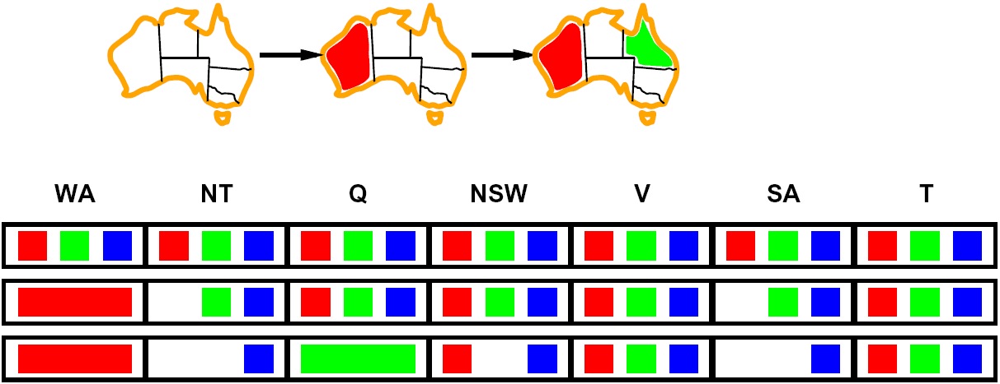

# 约束满足问题（二）— 过滤、结构与局部搜索

> [!abstract] 本节导览
> 承接 [[第3周星期五-约束满足问题1_笔记|CSP（一）]]中回溯搜索的三个优化点，本节深入 **Filtering（前向检验 → 弧相容 AC-3）**、**Structure（独立子问题、树结构 CSP、环割集、树分解）**，以及用**最少冲突启发式**的局部搜索求解 CSP。

## Filtering（过滤）：及早发现失败

### 前向检验（Forward Checking）

> [!important] 前向检验
> 每次给变量 $X$ 赋值时，对每个通过约束与 $X$ 相关的**未赋值变量 $Y$**，从 $Y$ 的值域中**删去与 $X$ 当前取值不相容的值**。
> - 作用：把已赋值变量的信息**传播**到未赋值变量。


> - **局限**：只让当前变量弧相容，**看得不够远**。例如 `WA=red, Q=green` 后 NT 和 SA 都只剩单值，而 NT 与 SA 相邻不能同色——前向检验**检测不出这个矛盾**，还会去尝试给 V 赋 blue。

### 弧相容（Arc Consistency）

> [!important] 弧相容定义
> 若变量值域中的**所有取值**都能满足该变量的所有**二元约束**，则该变量**弧相容**。
> - 一条弧 $X\to Y$ 相容 ⟺ 对 $X$ 域中每个值，$Y$ 域中都**存在**一个值满足约束。
> - 若 $X$ 的某个值在 $Y$ 中找不到对应值，则从 $X$ 的域中**删去该值**使弧相容。

> [!warning] 关键传播规则
> **如果 $X$ 丢失了一个可能取值，必须重新检查 $X$ 的所有邻接变量！**
> 删值可能让原本相容的弧重新变得不相容（连锁反应）。澳大利亚例子中，逐步强制弧相容最终使 SA 域为空 → **检测到失败 → 回溯**。弧相容**比前向检验更早**发现失败。

### AC-3 算法

> [!note] AC-3
> 用一个**队列**存放待检查的弧，反复取出弧做相容性检查：若某变量值域改变，则把它的所有邻接弧重新入队。运行后：要么所有变量弧相容，要么某变量值域为空（**该 CSP 无解**）。

> [!warning] 弧相容的局限
> 强制弧相容后：**可能只剩一个解、可能有多个解、可能无解（且 AC-3 自己不一定知道）**。所以**弧相容仍需在回溯搜索中反复运行**，不能单独求解整个 CSP。

> [!tip] k-相容（k-Consistency）
> - **1-相容（节点相容）**：每个节点的域满足其一元约束。
> - **2-相容（弧相容）**：任意一对节点中，一个的相容赋值都能扩展到另一个。
> - **k-相容**：任意 k 个节点中，对 k−1 个的相容赋值都能扩展到第 k 个。
> - k 越高计算越贵。**本课重点掌握 k=2（弧相容）**。

> [!note] 智能回溯（教材 6.3.3）
> 普通"时序回溯"退回时间最近的决策点；**基于冲突的回溯**直接退回到导致失败的**根源变量**（冲突集合中的变量），需跟踪与每个赋值冲突的赋值组。

## Structure（问题结构）：利用图结构加速

> [!important] 独立子问题
> 若约束图可分为互不影响的部分（如 $\{WA,NT,SA,Q,NSW,V\}$ 与孤岛 $\{T\}$），可**分别求解**——大幅减少总工作量（回想搜索是指数级复杂度）。

### 树结构 CSP

> [!important] 树结构的线性时间求解
> 树结构约束图 = 任意两变量间**至多一条路径**。可在 $O(nd^2)$ 线性时间求解（$n$ 变量数、$d$ 域大小），**无需回溯**：
> 1. 选根、做**拓扑排序**（每个变量在父节点之后）。
> 2. **Remove backward**：$i$ 从 $n$ 到 2，对 $(\text{Parent}(X_i), X_i)$ 做 `RemoveInconsistent`（强制弧相容）。
> 3. **Assign forward**：$i$ 从 1 到 $n$，给 $X_i$ 赋与 $\text{Parent}(X_i)$ 相容的值。
>
> - **Claim 1**：反向遍历后所有根→叶弧相容（因 $Y$ 的孩子先于 $Y$ 处理，$Y$ 之后不会再缩域）。
> - **Claim 2**：根→叶弧相容则正向赋值不会回溯（对位置归纳）。
> - **有环时此法失效**。（这个基本思想后续会在贝叶斯网络中再次出现。）

### 把一般图变成树

> [!example] 法一：环割集条件化（Cutset Conditioning）
> 实例化一组变量（**环割集 cutset**），使剩余约束图成为树：
> 1. 选一个 cutset；2. 用所有可能方式实例化 cutset；3. 对每种赋值计算残余 CSP；4. 用树结构算法求解各残余 CSP。
> 例：实例化 SA 后，澳大利亚其余部分就成了树。

> [!example] 法二：树分解（Tree Decomposition）
> 把变量分组成子问题，满足：① 每个变量至少在一个子问题中；② 有约束的两变量至少同现于某子问题；③ 同一变量出现的所有子问题在连接路径上连续。
> 各子问题求解后，再用树结构算法求解连接它们的约束（共享变量取值一致）。（具体如何分解超出本课范围。）

## 局部搜索求解 CSP

> [!important] 回溯 vs. 局部搜索
> - **回溯搜索**：扩展**部分赋值**——逐个赋值，无合法值时回溯。
> - **局部搜索**：修改**完整赋值**——初始给所有变量赋值，每次改一个变量取值。

> [!note] 最少冲突启发式（Min-Conflicts）
> 从一个完整赋值出发，每步选一个有冲突的变量，把它改到**与其他变量冲突最少**的取值（平局随机）。
> ```
> 给所有变量一个初始完整赋值
> for i = 1 to max_steps:
>   if 当前赋值满足所有约束: return 它
>   选一个冲突变量 var
>   把 var 赋为使总冲突最少的值
> ```
> 对 n-皇后等问题**通常非常高效**（几乎与 n 无关）。

## 本章小结

> [!summary] 要点回顾
> - **Filtering**：前向检验（传播但看不远）→ 弧相容（更早发现失败，AC-3 队列实现，删值要重查邻居）；弧相容仍需嵌在回溯中。
> - **Structure**：独立子问题分治；**树结构 CSP** 可 $O(nd^2)$ 无回溯求解；一般图用**环割集条件化**或**树分解**化为树。
> - **局部搜索**用**最少冲突启发式**修改完整赋值，求解 CSP 常很有效。

## 自测题

> [!question] 检验你的理解
> 1. 前向检验和弧相容有何区别？为什么说前向检验"看得不够远"？
> 2. 弧相容删值后为什么要重新检查邻接变量？AC-3 用什么数据结构？
> 3. 强制弧相容后可能出现哪三种结果？为什么仍需回溯搜索？
> 4. 树结构 CSP 为什么能线性时间无回溯求解？两趟（backward/forward）分别做什么？
> 5. 环割集条件化与树分解各自如何把一般图化为树？
> 6. 最少冲突启发式如何工作？它与回溯搜索在"赋值"上的本质区别是什么？
