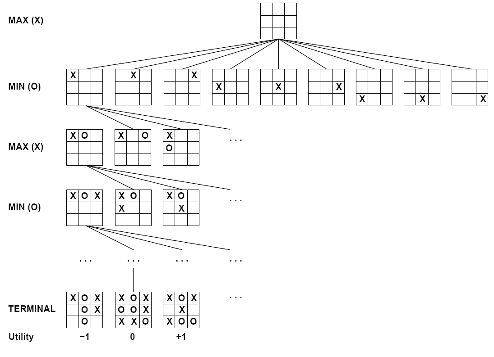
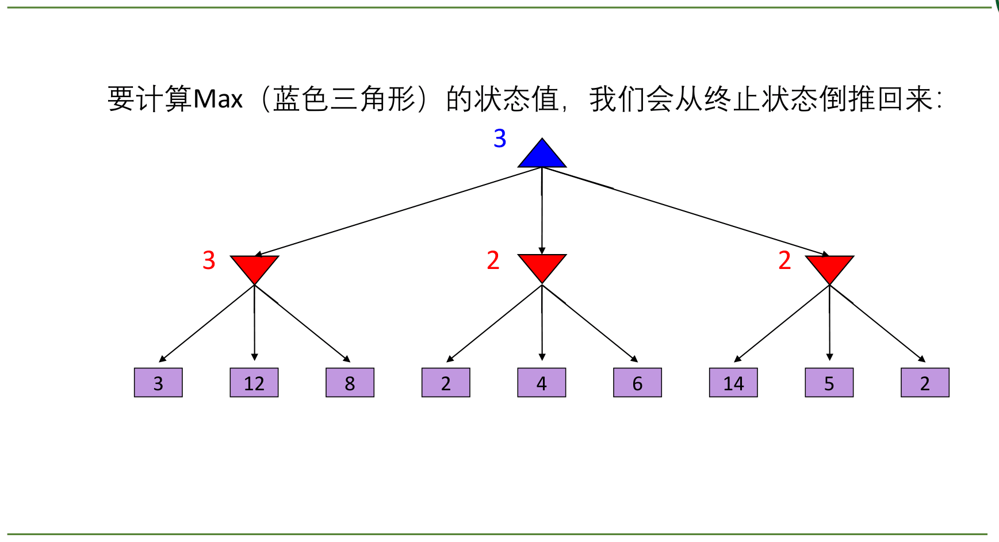
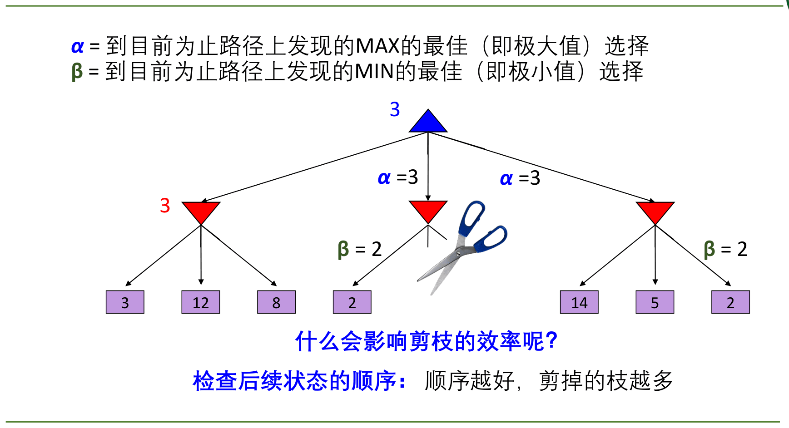
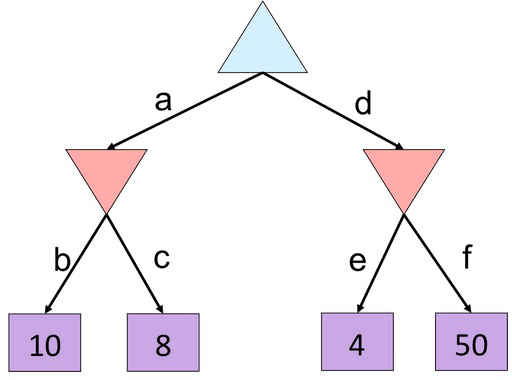
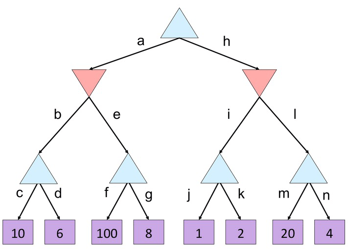

# 对抗搜索（一）— Minimax 与 Alpha-Beta 剪枝

> [!abstract] 本节导览
> 前几章是**单 agent** 搜索；本章（第 5 章）进入**多 agent 且目标冲突**的环境——博弈。我们聚焦"标准游戏"（确定、完全可观察、两人、轮流、零和），介绍 **极小极大值（Minimax）** 算法及其优化 **Alpha-Beta 剪枝**。

## 5.1 博弈论

> [!important] 博弈的环境维度
> 游戏（Game）= **多于一个 agent** 的任务环境。维度：确定/随机？完整信息（完全可观察）？几个玩家？轮流/同时？
> **本章"标准游戏"**：✅确定性 ✅完整信息 ✅两人 ✅轮流 ✅**零和**。

> [!note] 零和游戏 vs. 一般游戏
> - **零和游戏（Zero-Sum）**：双方效用**完全相反**，纯竞争——一人最大化、另一人最小化（一方赢则另一方必输）。
> - **一般游戏**：效用相互独立，可有合作、冷漠、竞争、联盟转移等。

> [!important] 标准游戏的形式化
> - 状态 $s$；玩家 $\text{Player}(s)$（此时轮到谁）；
> - 行动 $\text{Actions}(s)$（合法移动集合）；
> - 转移模型 $\text{Result}(s,a): S\times A\to S$；
> - 终止测试 $\text{Terminal-Test}(s): S\to\{true,false\}$；
> - 效用函数 $\text{Utility}(s,p)$（玩家 $p$ 在终止状态 $s$ 的数值）；
> - **一个玩家的解是策略（policy）** $S\to A$：对每个状态推荐一个行动。
> 例（国际象棋）：状态=棋子位置+轮到谁；效用=白胜 +1、和局 0、负 −1。

## 5.2 极小极大值（Minimax）

> [!important] 核心思想
> 单 agent 中状态值 $V(s)$ = 从 $s$ 能到达的最佳邻接点效用。对抗环境中，对手会**最小化你的效用**，故：
> - **MAX 节点**（自己轮次）：取子节点最大值；
> - **MIN 节点**（对手轮次）：取子节点最小值。
> 极小极大值 = **面对一个理性对手时，最佳的可达效用值**。"面对理性的鬼，吃豆人赢不了，只求输得没那么惨。"



> [!example] Minimax 算法
> ```python
> def value(state):
>     if terminal(state): return utility(state)
>     if next is MAX: return max-value(state)
>     if next is MIN: return min-value(state)
>
> def max-value(state):       # 自己轮次
>     v = -∞
>     for s' in successors(state): v = max(v, value(s'))
>     return v
>
> def min-value(state):       # 对手轮次
>     v = +∞
>     for s' in successors(state): v = min(v, value(s'))
>     return v
> ```
> 从**终止状态倒推**回根，逐层求极大/极小值。`value` 函数统一调度，避免 max/min 互相"套娃"的鸡生蛋问题。



> [!warning] Minimax 的性质与效率
> - **对完美对手最优**；但若对手不完美（如随机），坚持 Minimax 可能不是最佳响应（应改用 **Expectimax**，下一节）。
> - 时间复杂度 $O(b^m)$、空间 $O(bm)$（类似 DFS）。
> - 国际象棋 $b\approx 35, m\approx 100$——状态数随博弈指数增长，无法全算。如何应对？→ **剪枝**与**评估函数**。

## Alpha-Beta 剪枝

> [!important] 剪枝思想
> 在不影响结果的前提下跳过无需检查的分支。
> - $\alpha$ = 到目前为止路径上 **MAX 的最佳（最大）**选择；
> - $\beta$ = 到目前为止路径上 **MIN 的最佳（最小）**选择。
>
> **剪 MIN 节点的子节点**：计算 MIN 节点 $n$ 时，若 MAX 在 $n$ 上层已有更好选择 $m$（其值为 $\alpha$），而 $n$ 当前的 $\beta$ 已经 $\le\alpha$，则理性的 MAX 永远不会走到 $n$，无需再查 $n$ 的其余后代。剪 MAX 节点同理（对称）。



> [!example] 剪枝练习（蓝三角=MAX，红三角=MIN）
> 思考下列两棵树中，按从左到右顺序检查叶子时，哪些枝（b/c/e/f…）可以被剪掉而不影响根值。
>
> 
>
> 

> [!example] Alpha-Beta 算法实现
> ```python
> def max-value(state, α, β):
>     v = -∞
>     for s' in successors(state):
>         v = max(v, value(s', α, β))
>         if v ≥ β: return v        # 剪枝：提前退出
>         α = max(α, v)
>     return v
>
> def min-value(state, α, β):
>     v = +∞
>     for s' in successors(state):
>         v = min(v, value(s', α, β))
>         if v ≤ α: return v        # 剪枝：提前退出
>         β = min(β, v)
>     return v
> ```
> 初始调用 $\alpha=-\infty, \beta=+\infty$。注意：比较时用的是**当前函数执行过程中最新更新的 $\alpha/\beta$**，不是传入参数的旧值。

> [!tip] 剪枝效率取决于节点顺序
> - 剪枝**不影响根节点的 Minimax 值**，但能大幅减少检查的节点。
> - **检查后续状态的顺序越好（好的先查），剪掉的枝越多**。理想排序下时间复杂度可从 $O(b^m)$ 降到 $O(b^{m/2})$——等于把有效分支因子降到 $\sqrt{b}$，可搜索深度翻倍。

> [!note] Min vs. Expectimax 玩家
> 若对手是**随机行动**而非完美对手，应把 MIN 节点换成**期望节点（Exp）**，取子节点的期望值——这是下一节 Expectimax 的内容。面对随机鬼，吃豆人可采取更激进的走法。

## 本章小结

> [!summary] 要点回顾
> - 博弈 = 多 agent、目标冲突环境；本章关注**确定/完全可观察/两人/轮流/零和**的标准游戏。
> - **Minimax**：MAX 取最大、MIN 取最小，从终止状态倒推；对完美对手最优，复杂度 $O(b^m)$。
> - **Alpha-Beta 剪枝**：用 $\alpha$（MAX 最佳）、$\beta$（MIN 最佳）剪掉不影响结果的分支；效率依赖节点排序，最优排序下可达 $O(b^{m/2})$。

## 自测题

> [!question] 检验你的理解
> 1. "标准游戏"的五个环境特征是什么？写出博弈的形式化六要素。
> 2. 零和游戏与一般游戏的区别是什么？
> 3. 手算一棵 3 层博弈树的 Minimax 值（MAX-MIN-终止）。
> 4. Minimax 对不完美对手还最优吗？此时应改用什么？
> 5. $\alpha$ 和 $\beta$ 分别代表什么？写出 max-value 的剪枝条件。
> 6. 为什么剪枝效率依赖节点检查顺序？最优排序下复杂度是多少？
