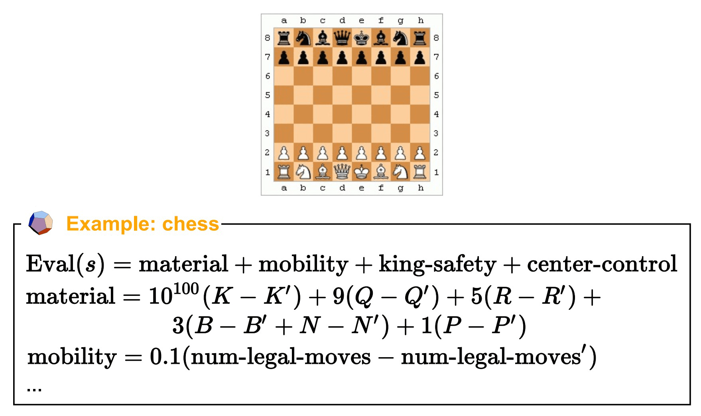
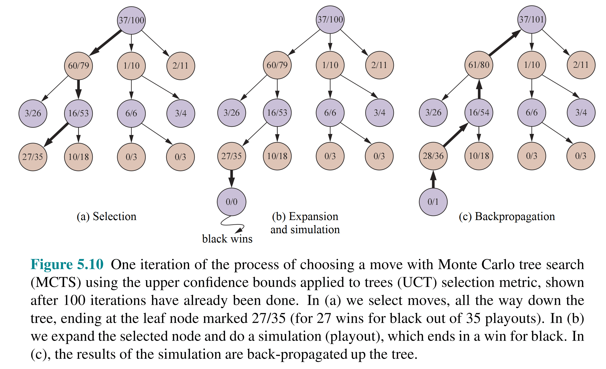

# 对抗搜索（二）— 评估函数、Expectimax 与 MCTS

> [!abstract] 本节导览
> 承接 [[第4周星期五-对抗搜索1_Minimax与剪枝_笔记|Minimax 与 Alpha-Beta 剪枝]]。现实游戏无法搜到终止状态，本节先讲**截断搜索 + 评估函数**；再引入含随机性的 **Expectimax** 与 **Expectiminimax**；最后讲分支因子巨大的围棋所用的**蒙特卡洛树搜索（MCTS）**与 **UCT** 算法。

## 不完美的实时决策：截断搜索 + 评估函数

> [!important] 截断搜索（Depth Limit）
> 真实游戏无法搜到终止状态。方案：预设**搜索深度（depth limit / horizon）**，用**评估函数**给非终止状态打分——不再保证最优。
> - 例：每步 100 秒、每秒查 10K 节点 ⟹ 每步查 1M 节点；象棋 alpha-beta 下 $35^{8/2}\approx 1M$，深度可达 8。

> [!important] 评估函数（Evaluation Function）
> 给深度受限搜索的非终止状态打分，常用**加权线性特征和**：
> $$\text{EVAL}(s) = w_1 f_1(s) + w_2 f_2(s) + \dots + w_n f_n(s)$$
> 例（象棋）：$w_1=9$（皇后价值），$f_1(s)=$（白后数 − 黑后数）。也可用更复杂的非线性函数（如神经网络，AlphaGo 即如此）。



> [!warning] 评估函数设计不当的"饿死"现象（Thrashing）
> 深度为 2、只看得分时，吃豆人可能在两个豆子间**来回踱步**：现在吃和稍后吃"一样好"，重新规划时又面临同样困境而犹豫不决。
> **解法**：评估函数除得分外**额外考虑离豆子的距离**（越近越好），打破平局、给出方向。

> [!tip] 深度 vs. 评估函数的权衡
> - 评估函数是近似的；**更深的搜索通常带来更好决策**，可中和低准确率评估函数的影响。
> - 这是**计算复杂度（深度）与特征复杂度（评估函数）之间的权衡**。
> - **与 Alpha-Beta 的协同**：评估函数可指导**先扩展最有希望的节点**，使剪枝更高效（类似 A* 启发式、CSP 过滤的作用）。

## 5.5 随机博弈：Expectimax

> [!important] 何时引入机会节点
> 当行动结果不确定时（**显式随机**如掷骰子、**不可预知对手**如随机鬼、**行动可能失败**如轮子打滑），状态值应反映**平均情况**而非最坏情况。
> - **Expectimax** = MAX 节点（同 Minimax）+ **机会节点（Chance node）**：取子节点的**期望（加权平均）**效用。

> [!example] Expectimax 算法
> ```python
> def value(state):
>     if terminal(state): return utility(state)
>     if next is MAX: return max-value(state)
>     if next is EXP: return exp-value(state)
>
> def exp-value(state):
>     v = 0
>     for s' in successors(state):
>         p = probability(s')
>         v += p * value(s')
>     return v
> ```
> 例：子节点 8、24、−12，概率 $\tfrac12,\tfrac13,\tfrac16$ ⟹ $v=\tfrac12(8)+\tfrac13(24)+\tfrac16(-12)=10$。

> [!note] 三类博弈树
> | 游戏 | 节点类型 | 算法 |
> | --- | --- | --- |
> | 井字棋、象棋 | MAX / MIN | Minimax |
> | 俄罗斯方块 | MAX / Chance | Expectimax |
> | 西洋双陆棋、大富翁 | MAX / MIN / Chance | **Expectiminimax** |
>
> **Expectiminimax**：环境是额外的"随机 agent"，在每个 min/max 之后行动；CHANCE 节点返回 $\sum_a \Pr(a)\cdot value(\text{Result}(s,a))$。

> [!tip] Expectimax 剪枝
> 普通 Expectimax 难剪枝（机会节点要算所有子节点）。但**若已知效用值范围**（如 $[-2,+2]$），可对机会节点做有限剪枝。深度增加时，到达特定节点的概率降低，搜索作用减弱——剪枝可更巧妙。

> [!note] Minimax 的泛化（非零和/多人）
> 终止状态与节点的值用**效用向量（utility tuple）**衡量，每个玩家最大化自己分量，可出现动态的合作与竞争。

## 5.4 蒙特卡洛树搜索（MCTS）

> [!important] 为什么需要 MCTS
> Alpha-Beta 假设固定深度，对围棋（分支因子 $b>300$）令人生畏。MCTS 结合两个思想：
> 1. **Rollouts（试运行）评估**：从状态 $s$ 用简单快速策略玩到终止，多次统计胜率——胜率与真实获胜概率相关。
> 2. **选择性搜索（Selective Search）**：集中关注有希望的节点，不拘泥深度。

> [!example] MCTS 的演进
> - **V0**：对 root 每个子节点做 N 次 rollout，选胜率最高者。问题：在低胜率分支上浪费资源。
> - **V0.9**：把 rollout 分配给**更有希望**的节点。问题：相似胜率但 rollout 次数不同时无法区分。
> - **V1.0**：同时把 rollout 分配给**更不确定**（rollout 少、方差大）的节点——平衡"利用"与"探索"。

> [!important] UCB 启发式与 UCT
> **UCB1** 公式兼顾"有希望"与"不确定"：
> $$\text{UCB1}(n) = \frac{U(n)}{N(n)} + C\sqrt{\frac{\ln N(\text{Parent}(n))}{N(n)}}$$
> - $N(n)$：从 $n$ 的 rollout 次数；$U(n)$：rollout 总效用（如胜数）。
> - 第一项=利用（exploitation），第二项=探索（exploration）。源自多臂老虎机（bandit）问题。
>
> **UCT（UCB for Trees）= MCTS 2.0**，重复直到超时：
> 1. **选择（Selection）**：从根递归用 UCB 选一条到叶节点的路径；
> 2. **扩展（Expansion）**：给叶节点添加新子节点 $c$；
> 3. **模拟（Simulation）**：从 $c$ 跑一次 rollout；
> 4. **回传（Backpropagation）**：把胜负更新回根。
> 最后选 **$N$ 最高**的子节点对应的动作。



> [!note] MCTS 为什么没有 min/max？
> 节点价值 $U(n)/N(n)$ 是子节点价值的加权和。**当 $N\to\infty$，绝大多数 rollout 集中在最佳子节点，加权平均 → max 或 min**。定理：$N\to\infty$ 时 UCT 选择 Minimax 走法（但 $N$ 永远到不了无穷）。
> 历史：**TDGammon**（双陆棋）用 depth-2 搜索 + 好评估函数 + 强化学习，成为第一个 AI 世界冠军。

## 本章小结

> [!summary] 要点回顾
> - 现实游戏用**截断搜索 + 评估函数**（加权线性特征和）；评估函数差会导致"饿死/抖动"，需补充方向信息（如距离）。
> - **Expectimax**：用机会节点取期望，应对随机性；**Expectiminimax** 处理 MAX/MIN/Chance 三类节点。
> - **MCTS**：rollout 评估 + 选择性搜索，用 **UCB/UCT** 平衡利用与探索，适合围棋等超大分支因子博弈。

## 自测题

> [!question] 检验你的理解
> 1. 为什么真实游戏需要截断搜索 + 评估函数？加权线性评估函数长什么样？
> 2. 什么是 Thrashing（抖动/饿死）？如何修复？
> 3. Expectimax 与 Minimax 的区别是什么？写出 exp-value 的计算式。
> 4. 三类博弈（确定零和 / 含机会 / 含机会且对抗）分别用哪种算法？
> 5. MCTS 的四个步骤是什么？UCB1 公式的两项分别代表什么？
> 6. 为什么 MCTS 没有显式的 min/max，却能逼近 Minimax 走法？
