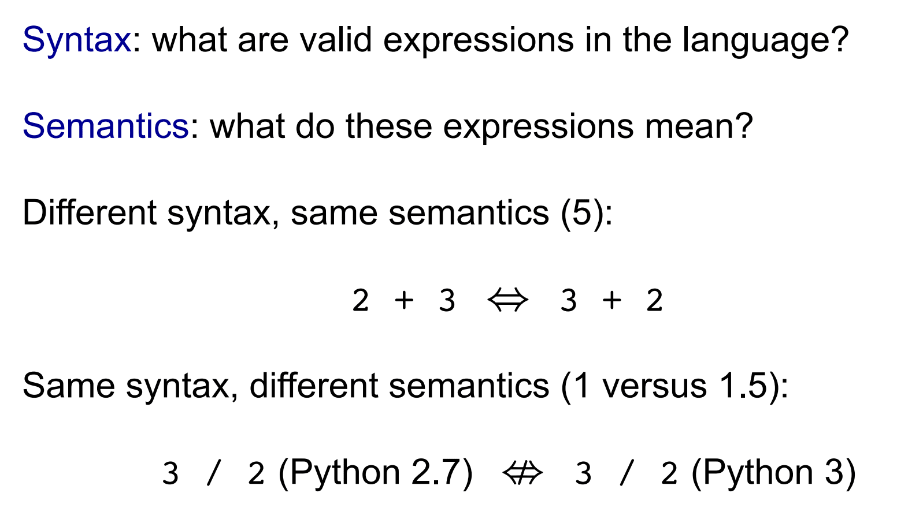

# 逻辑 Agent（一）— 知识、逻辑与命题逻辑

> [!abstract] 本节导览
> 本课件先用 **Expectimax Yahtzee 习题**巩固 [[第5周星期三-对抗搜索2_评估函数Expectimax与MCTS_笔记|随机博弈]]，再开启**第 7 章 逻辑 Agent**：介绍**基于知识的智能体**、**逻辑的语法与语义**、**蕴涵（entailment）**与**推理**的核心概念，以及**命题逻辑**的形式化。

## 对抗搜索习题：Expectimax Yahtzee

> [!example] Yahtzee（三个四面体骰子）
> 规则：可选一个骰子重掷或保持现状；两同得 10、三同得 15、三连得 7，否则取三骰之和（取最高）。
> - **分支因子**：根节点为 4（重掷骰 1/2/3 或不重掷）；机会节点也为 4（骰子四个面）。
> - **加入"捣乱机器人"**：玩家行动时，机器人以概率 $p$ 强制"保持现状"，否则（$1-p$）执行玩家意愿——此时**玩家也变成机会节点**。
> - **机器人何时严格有益**：当"不 reroll 的收益 > reroll 的平均收益"时，强制不重掷反而提高期望。
> 这道题的核心是理解：**不可预知/被干预的行动者要建模为机会节点**，取期望而非取极值。

# 第 7 章 — 逻辑 Agent

> [!note] 一个引子
> 解方程组 $\{X_1+X_2=4, X_1-X_2=...\}$ 有两条思路：
> - **模型检验（model checking）**：像 CSP 一样直接尝试找满足约束的赋值。
> - **逻辑推理（inference）**：应用一系列推理规则（如两式相加消元）推导出结果。
> 本章正是研究后者——用逻辑表示知识并推理。

## 基于知识的智能体（Knowledge-Based Agents）

> [!important] 知识库与知识层
> **知识库（Knowledge Base, KB）** = 一组语句（陈述性事实）。以陈述方式构建智能体：
> - **Tell**：告诉它需要知道的东西（或让它 **Learn**）；
> - **Ask**：询问知识库该执行什么行动。
>
> 智能体处于**知识层（knowledge level）**：只需描述它"知道什么"，不关心底层实现；一个简单的**推理引擎（inference engine）**就能回答任何可回答的问题。智能体需要：转移模型、传感器模型、世界当前状态模型——这些都是知识。

> [!example] 逻辑求解吃豆人
> 鬼左右固定移动。第 5 章用对抗博弈求解；现在吃豆人建立**动态更新（Tell）**的知识库，目标是在某时刻**根据当时的 KB 推出"安全吃完所有豆"**，并返回（Ask）导致此结果的行动序列。

## 逻辑：语法与语义

> [!important] 语法 vs. 语义
> - **语法（Syntax）**：规定哪些语句**合法**（"这句话合不合法"）。如 `x+y=4` 合法，`x 4 y + =` 不合法。
> - **语义（Semantics）**：每个语句在每个可能世界中的**真值**（"这句话意味着什么"）。如 `x+y=4` 在 $x=2,y=2$ 的世界为真、在 $x=1,y=1$ 的世界为假。
> 自然语言有歧义，逻辑提供**清晰规范的描述**。

> [!note] 两类逻辑
> - **命题逻辑（Propositional logic）**：如 $P\vee(\neg Q\wedge R)$；可能世界=各命题词的真值组合（如 1101）。
> - **一阶逻辑（First-order logic）**：含量词与谓词，如 $\forall x\,\exists y\,P(x,y)\wedge\neg Q(\text{Joe},f(x))$；可能世界含对象、关系、函数。

## 蕴涵（Entailment）与推理

> [!important] 蕴涵的定义
> $\alpha \models \beta$（"$\alpha$ 蕴涵 $\beta$" / "$\beta$ 从 $\alpha$ 得出") ⟺ **在每个 $\alpha$ 为真的世界中，$\beta$ 也为真**。
> 即 $\alpha$ 的模型集是 $\beta$ 的模型集的子集：$\text{models}(\alpha)\subseteq\text{models}(\beta)$。
> （这里 world 与 model 都指对所有命题词的一个真值赋值组合。）

> [!important] 推理算法的两个关键性质
> - **可靠性（Sound / 保真）**：算法证明的一切**确实**被蕴涵——"绝不编造不存在的针"。极其重要：不可靠的推理会捏造事实。
> - **完备性（Complete）**：所有被蕴涵的语句都能被证明——"针若在草堆里，一定能找到"。对无限的推论空间，完备性是重大挑战；幸而逻辑中存在足够表达力的完备推断过程。

> [!note] 证明蕴涵的两种方法
> 1. **模型检验（Model Checking）**：枚举每个可能世界，验证"$\alpha$ 真则 $\beta$ 真"。命题逻辑可行（世界有限），一阶逻辑困难。
> 2. **定理证明（Theorem Proving）**：应用推理规则从 $\alpha$ 推导到 $\beta$。如**假言推理（Modus Ponens）**：已知 $P$ 和 $P\Rightarrow Q$，推出 $Q$。

## 命题逻辑的语法与语义

> [!important] 命题逻辑语法
> 给定命题词 $\{X_1,\dots,X_n\}$（每个取真/假），$X_i$ 是原子语句，复合句递归构造：
> - $\neg\alpha$（非）；$\alpha\wedge\beta$（与）；$\alpha\vee\beta$（或）；$\alpha\Rightarrow\beta$（蕴涵）；$\alpha\Leftrightarrow\beta$（当且仅当）。

> [!important] 命题逻辑语义（模型 $m$ 赋值后）
> | 语句 | 在模型 $m$ 中为真，当且仅当 |
> | --- | --- |
> | $\neg\alpha$ | $\alpha$ 在 $m$ 中为假 |
> | $\alpha\wedge\beta$ | $\alpha$ 且 $\beta$ 都为真 |
> | $\alpha\vee\beta$ | $\alpha$ 或 $\beta$ 为真 |
> | $\alpha\Rightarrow\beta$ | **除非** $\alpha$ 真且 $\beta$ 假（即 $\alpha$ 假时恒为真） |
> | $\alpha\Leftrightarrow\beta$ | $\alpha\Rightarrow\beta$ 且 $\beta\Rightarrow\alpha$ 都为真 |
>
> > [!warning] 易错点：$\alpha\Rightarrow\beta$ 在 $\alpha$ 为假时**总为真**（"空真"），与日常"因果"直觉不同。

## 本章小结

> [!summary] 要点回顾
> - **基于知识的智能体**用 KB 存储语句，通过 **Tell/Ask** 交互，处于"知识层"。
> - **语法**管合法性、**语义**管真值；命题逻辑与一阶逻辑是两类主要逻辑。
> - **蕴涵** $\alpha\models\beta$ ⟺ $\text{models}(\alpha)\subseteq\text{models}(\beta)$。
> - 推理算法要**可靠**（不编造）且尽量**完备**（不遗漏）；证明方法有**模型检验**与**定理证明**。
> - 命题逻辑语法由 5 个连接词递归构造，语义按真值表定义（注意蕴涵的空真）。

## 自测题

> [!question] 检验你的理解
> 1. 基于知识的智能体如何用 Tell/Ask 工作？什么是"知识层"？
> 2. 语法与语义分别回答什么问题？各举一例。
> 3. 写出蕴涵 $\alpha\models\beta$ 的定义（用模型集合表述）。
> 4. 推理算法的可靠性与完备性分别是什么？为什么可靠性"极其重要"？
> 5. 证明蕴涵的两种方法是什么？各适合什么逻辑？
> 6. 为什么 $\alpha\Rightarrow\beta$ 在 $\alpha$ 为假时恒为真？
