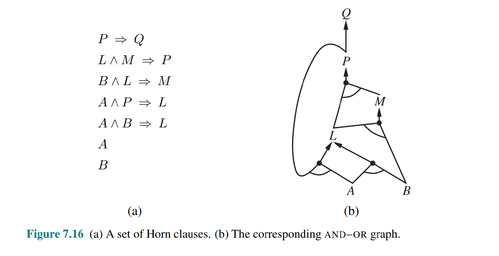

# 逻辑 Agent（二）— 命题逻辑推理

> [!abstract] 本节导览
> 承接 [[第5周星期五-逻辑Agent入门_笔记|逻辑入门]]，本节先用**吃豆人**示范如何用命题逻辑构建知识库（地图、初始状态、传感器模型、转移模型），再系统讲解三类推理算法：**模型检验**、**前向链接**、**归结**，并介绍 **CNF 合取范式**与高效 SAT 求解器 **DPLL**。

## 用命题逻辑建模知识库：吃豆人

> [!important] 变量设计（N 个位置、T 个时间点）
> - **墙位置**：`Wall_x,y`（N 个命题词）
> - **感知**：`Blocked_W_t`（时间 t 向西被墙挡）等（4T 个）
> - **行动**：`W_t`（时间 t 向西走）等（4T 个）
> - **吃豆人位置**：`At_x,y_t`（NT 个）
> 共 $O(NT)$ 个变量 ⟹ $O(2^{NT})$ 个可能世界（N=200, T=400 时约 $10^{240000}$ 个）！大部分世界"看上去很奇怪"——需要用 KB 语句**约束**取值组合，留下合理世界。

> [!example] 四类知识库语句
> 1. **地图**：墙的合取 `Wall_0,0 ∧ Wall_0,1 ∧ …`，以及无墙处 `¬Wall_1,1 ∧ ¬Wall_1,2 ∧ …`。
> 2. **初始状态**（不知初始位置但必在某处）：析取 `At_1,1_0 ∨ At_1,2_0 ∨ …`。
> 3. **传感器模型**（感知 ⟺ 世界状况）：
>    $$\text{Blocked\_W}_0 \Leftrightarrow \big((\text{At}_{1,1,0}\wedge\text{Wall}_{0,1})\vee(\text{At}_{1,2,0}\wedge\text{Wall}_{0,2})\vee\dots\big)$$
> 4. **转移模型**（后继状态公理 successor-state axiom）：状态变量 $X_t$ 要么"$t-1$ 已真且未被行动变假"，要么"$t-1$ 的行动使其变真"：
>    $$X_t \Leftrightarrow [X_{t-1}\wedge\neg(\text{某行动使其假})]\vee[\neg X_{t-1}\wedge(\text{某行动使其真})]$$

> [!warning] 命题逻辑表达力有限
> 转移模型语句占 $O(NT)$ 条，N=200,T=400 约需 80 万行 / 2 万页！可写代码生成，但根本原因是命题逻辑表达力弱。**一阶逻辑只需 $O(1)$ 条转移模型语句**（后续章节）。
> 推理目标：$\text{KB}\Rightarrow f$——使 KB 为真的赋值，必使目标语句 $f$（如"吃完所有豆"）也为真。

## 推理方法一：模型检验（Model Checking）

> [!important] 枚举所有模型
> 枚举所有命题词赋值组合，验证语句 $\alpha$ 在**每个 KB 为真的模型中都为真**（即 $\text{KB}\models\alpha$）。
> - 实现为递归 DFS（TT-ENTAILS）：从未赋值符号中弹一个，分别试 true/false，递归检验。
> - **时间复杂度指数级**。
> - 例（Wumpus 类问题）：可推出"吃豆人不在 P1,2"，但**既推不出"在 P2,2"也推不出"不在 P2,2"**——知识不足时两者都不被蕴涵。

## 推理方法二：前向链接（Forward Chaining）

> [!important] 反复应用假言推理
> 给定 $X_1\wedge X_2\wedge\dots\wedge X_n\Rightarrow Y$ 和已知 $X_1,\dots,X_n$，用 **Modus Ponens** 推出 $Y$，把新事实加入 KB，直到无法再推。
> **要求 KB 只含限定子句（Definite Clause / 霍恩子句）**：
> - 形如 $(X_1\wedge X_2)\Rightarrow Y$，或单个事实 $X$（等价 $\text{True}\Rightarrow X$）；
> - 等价于"恰含一个正文字的析取式" $(\neg X_1\vee\neg X_2\vee Y)$；
> - 真值表等价：$(P\Rightarrow Q)\Leftrightarrow(\neg P\vee Q)$。

> [!example] 前向链接算法 PL-FC-ENTAILS?
> ```
> count[c] ← c 前提中的符号数
> inferred[s] ← false（所有 s）
> queue ← KB 中已知为真的符号
> while queue 非空:
>     p ← Pop(queue)
>     if p = q: return true
>     if not inferred[p]:
>         inferred[p] ← true
>         for 前提含 p 的每个子句 c:
>             count[c] -= 1
>             if count[c] == 0: 把 c.conclusion 加入 queue
> return false
> ```
> 思路：每当某蕴含式的前提全部已知，就把结论加入已知事实，重复直到推出 $q$ 或无法再推。



> [!note] 前向链接的可靠性与完备性
> 对限定子句 KB，前向链接**可靠且完备**：
> - **可靠**：源于 Modus Ponens 的可靠性。
> - **完备**：到达不动点后，把推出的命题词设 true（其余 false）构成模型 $m$；可证原 KB 每个限定子句在 $m$ 中为真（否则前提全真而结论假，说明还没到不动点，矛盾）。故 $m$ 是 KB 的模型，任何被蕴涵的原子语句在 $m$ 中为真，必被算法推出。

## 推理方法三：归结（Resolution）

> [!important] 反证 + 归结规则
> 要证 $\text{KB}\models\alpha$，等价于证 $\text{KB}\wedge\neg\alpha$ **不可满足**（任何世界都不为真）。
> - **归结规则**：对含**互补文字**的两子句归结产生新子句。如已知 $l_1\vee l_2$（食物在 [1,1] 或 [3,1]）和 $\neg l_1$（食物不在 [1,1]），推出 $l_2$（食物在 [3,1]）。
> - 命题逻辑的归结算法**完备**，但最坏情况指数级时间。

## 可满足性、CNF 与 DPLL

> [!important] 用 SAT 求解器测蕴涵
> 语句若在**某个模型**中为真，则**可满足（satisfiable）**。蕴涵可化为可满足性问题（反证法）：
> $$\alpha\models\beta \iff (\alpha\Rightarrow\beta)\text{ 处处真} \iff (\alpha\wedge\neg\beta)\text{ 处处假，即不可满足}$$
> 高效 SAT 求解器在**合取范式（CNF）**上操作。

> [!note] 合取范式（CNF, Conjunctive Normal Form）
> - 整体是若干**子句的合取（∧）**；
> - 每个子句是若干文字的**析取（∨）**；
> - 每个文字是命题词或其否定。
>
> **任意语句转 CNF 的标准步骤**（以 `At_1,1_0 ⇒ (Wall_0,1 ⇔ Blocked_W_0)` 为例）：
> 1. 双条件 ⇔ 拆成两个蕴涵；
> 2. 蕴涵 $a\Rightarrow b$ 替换为 $\neg a\vee b$；
> 3. 用分配律把 ∨ 分配进 ∧。
> 得 $(\neg\text{At}\vee\neg\text{Wall}\vee\text{Blocked})\wedge(\neg\text{At}\vee\neg\text{Blocked}\vee\text{Wall})$。

> [!important] DPLL 算法
> **DPLL**（Davis-Putnam-Logemann-Loveland）本质是递归 DFS 枚举（TT-ENTAILS），但有三个关键改进：
> 1. **及早终止（Early termination）**：用部分模型即可判断——所有子句已满足则真；任一子句被证伪则假。
> 2. **纯文字启发式（Pure literals）**：在所有子句中以同一符号位出现的符号（如恒正的 A），直接赋值使其为真，减少待查子句。
> 3. **单元子句启发式（Unit clauses）**：仅剩一个未赋值文字的子句，该文字必须取使子句为真的值。
> ```
> function DPLL(clauses, symbols, model):
>     if 所有子句在 model 中为真: return true
>     if 某子句在 model 中为假: return false
>     P, value ← FIND-PURE-SYMBOL(...)
>     if P: return DPLL(clauses, symbols−P, model∪{P=value})
>     P, value ← FIND-UNIT-CLAUSE(...)
>     if P: return DPLL(clauses, symbols−P, model∪{P=value})
>     P ← First(symbols)
>     return DPLL(..., model∪{P=true}) or DPLL(..., model∪{P=false})
> ```

## 本章小结

> [!summary] 要点回顾
> - 用命题逻辑建吃豆人 KB：地图、初始状态、传感器模型、**后继状态公理**转移模型；命题逻辑表达力有限（语句数 $O(NT)$）。
> - 三类推理：**模型检验**（枚举模型，指数级）、**前向链接**（限定子句，可靠完备，Modus Ponens）、**归结**（反证 + 互补文字，完备但指数级）。
> - 蕴涵可化为**不可满足性**测试；SAT 求解器在 **CNF** 上用 **DPLL**（及早终止 + 纯文字 + 单元子句）高效求解。

## 自测题

> [!question] 检验你的理解
> 1. 吃豆人 KB 的四类语句分别约束什么？写出后继状态公理的一般形式。
> 2. 模型检验如何判断 $\text{KB}\models\alpha$？复杂度如何？
> 3. 什么是限定子句（霍恩子句）？前向链接为什么对它可靠且完备？
> 4. 归结法如何用"反证"证明蕴涵？什么是互补文字？
> 5. 把 $A\Rightarrow(B\Leftrightarrow C)$ 转换为 CNF。
> 6. DPLL 相比朴素枚举的三个改进是什么？各起什么作用？
