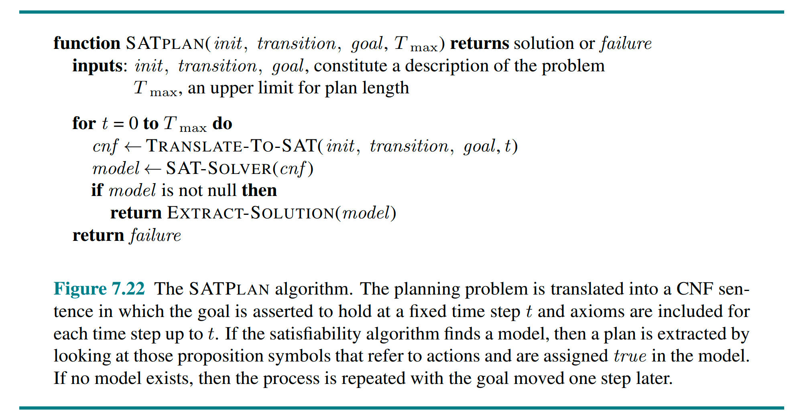
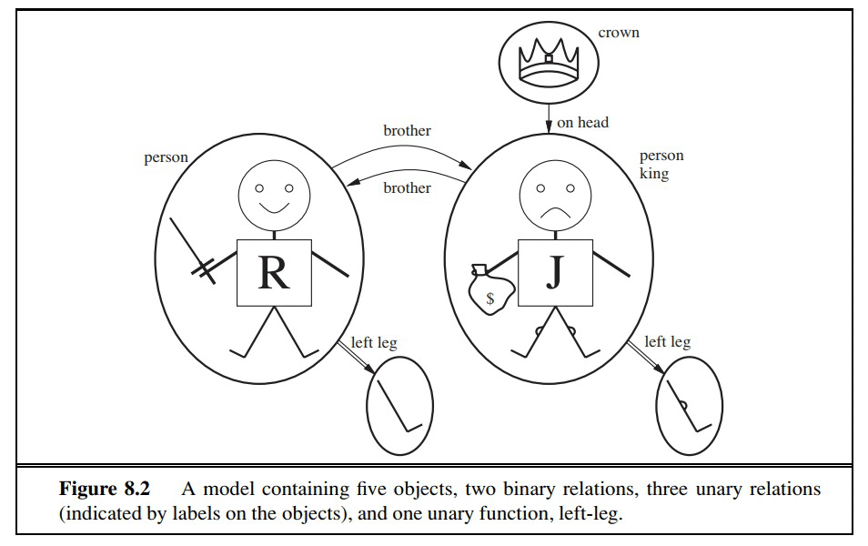

# 逻辑 Agent（三）— 知识 Agent 与一阶逻辑

> [!abstract] 本节导览
> 承接 [[第6周星期三-逻辑2_命题逻辑推理_笔记|命题逻辑推理]]。先用 **DPLL 实例**演示反证法证明蕴涵，再讲**基于知识的 Agent**的核心任务（状态评估、定位、地图建模、SLAM）与 **SATPLAN** 规划；随后跨入**第 8/9 章一阶逻辑**——它弥补了命题逻辑表达力不足的缺陷。

## DPLL 实例：用反证法证明蕴涵

> [!example] 证明 $A\wedge(\neg A\vee B)\wedge(\neg A\vee C)\wedge(\neg B\vee\neg C\vee D)\models D$
> 等价于证明 $A\wedge(\neg A\vee B)\wedge(\neg A\vee C)\wedge(\neg B\vee\neg C\vee D)\wedge\neg D$ **不可满足**。
> DPLL 用**单元子句启发式**逐步推进：
> 1. 单元子句 $A, \neg D$ → 设 $A=T$；
> 2. $(\neg A\vee B), (\neg A\vee C)$ 变成单元子句 $B, C$ → 设 $B=T$；
> 3. 设 $C=T$；
> 4. $(\neg B\vee\neg C\vee D)$ 变成 $D$，但已有 $\neg D$ → 出现 $D\wedge\neg D = \text{True}\wedge\text{False}$，子句被证伪 → 返回 false（不可满足）。
> 故原蕴涵成立。**SAT 求解器应用广泛**：电路/软件验证、协议验证、规划（"怎样吃完所有豆？"）等。

## 基于知识的 Agent

> [!important] KB-Agent 架构
> ```
> function KB-AGENT(percept):
>     TELL(KB, MAKE-PERCEPT-SENTENCE(percept, t))   # 告知感知
>     action ← ASK(KB, MAKE-ACTION-QUERY(t))         # 询问该做什么
>     TELL(KB, MAKE-ACTION-SENTENCE(action, t))      # 告知所选行动
>     t ← t + 1
>     return action
> ```
> **同一套 KB 与算法**可完成多种推理任务：地图定位、地图建模、SLAM（同步定位与建图）、规划。

> [!note] PacPhysics：吃豆人的物理规则知识库
> - **Map**：墙在/不在的位置；
> - **Initial state**：吃豆人一定在某处；
> - **Domain constraints**：每步**恰好一个行动**、**恰好一个位置**（用 `exactlyOne` 函数）；
> - **Sensor model**：$\text{Percept}_t \Leftrightarrow$ 世界状况；
> - **Transition model**（后继状态公理）。
>
> `exactlyOne([A,B,C])` 输出 `(¬A∨¬B)∧(¬A∨¬C)∧(¬B∨¬C)∧(A∨B∨C)`——前三句保证至多一个真，末句保证至少一个真。

> [!important] 逻辑状态评估（State Estimation）
> 追踪"现在什么为真"。逻辑 Agent 可"问自己"：
> - **懒惰式**：每步查询 $\text{KB}\wedge\text{actions}\wedge\text{percepts}\models \text{At}_{2,2,6}$——每步分析整段历史。
> - **积极式（eager）**：每次行动+感知后，对每个状态变量 $X_t$：若 $\text{KB}\wedge\text{action}_{t-1}\wedge\text{percept}_t\models X_t$ 则加入 $X_t$；若蕴涵 $\neg X_t$ 则加入 $\neg X_t$。

> [!example] 三类任务
> - **定位（Localization）**：已知地图，由感知/行动推断位置。可能位置 = 那些**未被证明为 false** 的位置（被证 True 或无法判定）。
> - **地图建模（Mapping）**：已知位置（航位推测法 Dead Reckoning），推断墙变量 `Wall_x,y` 构成地图。
> - **SLAM（同步定位与建图）**：真实世界中航位推测法失效（如感知器只报邻墙数量、不知方向）。位置与地图都未知时，每步同时尝试对 `Wall_x,y` 和 `At_x,y_t` 添加被蕴涵的事实。

> [!important] SATPLAN：用 SAT 求解器做规划
> 完全可观察、确定的场景下，**规划问题可解 ⟺ 存在可满足模型**；解 = 模型中取真的行动变量。
> ```
> for T = 1 to ∞:
>     初始化 T 个时间点的 KB（如 PacPhysics）
>     断言目标在时刻 T 为真（goal_T）
>     把 KB ∧ goal 转 CNF 交给 SAT 求解器
>     if 找到可满足模型: return 提取的行动序列
>     # 否则继续增大 T
> ```
> 注意需约束**每个时间点只有一个行动为真**（否则 N_1 和 E_1 可能同时真）。



## 第 8/9 章 — 一阶逻辑（First-Order Logic）

> [!warning] 命题逻辑的局限
> 命题逻辑"笨重过时"，缺乏：
> - **对象与谓词**：命题 `AliceKnowsArithmetic` 内部结构（Alice、Knows、Arithmetic）无法表达；
> - **量词与变量**："所有人"无法逐一枚举。
> 一阶逻辑下，吃豆人转移模型只需 $O(1)$ 条语句，而命题逻辑需 $O(NT)$ 条。

> [!important] 一阶逻辑的可能世界
> 包含：**对象**（至少一个）、**关系**（对象元组的集合，如兄弟关系 `{<Richard, John>, <John, Richard>}`）、**函数映射**（如"左腿函数"）。



> [!note] 语法三要素
> - **项（Term）**：指代对象——常量符号（A, B, EvilKingJohn）、函词（BFF(EvilKingJohn)）、变量（x）。
> - **原子语句（Atomic sentence）**：谓词 + 项列表，如 `Knows(A, BFF(B))`；或项间等式 `BFF(BFF(BFF(B)))=B`。为真当且仅当关系在所指对象间成立。
> - **复合语句**：逻辑连接词 $\neg,\wedge,\vee,\Rightarrow,\Leftrightarrow$，以及量词。

> [!important] 全称量词 ∀ 与存在量词 ∃
> - **全称 $\forall x\, P(x)$**：对所有 $x$ 取值 $P$ 都为真（类比"对所有的合取 ∧"）。
> - **存在 $\exists x\, P(x)$**：至少一个 $x$ 取值 $P$ 为真（类比"对所有的析取 ∨"）。
> - **对偶关系**：$\neg\forall x\,P(x) \equiv \exists x\,\neg P(x)$（"不是每个人都喜欢冰淇淋" = "有人不喜欢"）。

> [!example] 用一阶逻辑表达
> - 每个人都认识 Zhenhui：$\forall n\, \text{Person}(n)\Rightarrow \text{Knows}(n, \text{Zhenhui})$
> - 有某人是所有人都认识的：$\exists s\, \text{Person}(s)\wedge\forall n\,\text{Person}(n)\Rightarrow\text{Knows}(n,s)$
> - 每个人都认识某个人：$\forall x\,\text{Person}(x)\Rightarrow\exists y\,\text{Person}(y)\wedge\text{Knows}(x,y)$
> > [!warning] 量词顺序很关键：$\exists s\forall n$（同一个人被所有人认识）≠ $\forall x\exists y$（各人各认识各自的人）。

> [!note] 一阶逻辑的模型可用图表示
> 节点=对象（常量），有向边=二元谓词，一元谓词作节点标记。

## 一阶逻辑的推理

> [!important] 蕴涵与置换（Substitution）
> 蕴涵定义同命题逻辑。但一阶逻辑可返回**绑定表（binding list）**而非仅 yes/no：
> - KB $=\forall x\,\text{Knows}(x,\text{Zhenhui})$，Query $=\exists y\forall x\,\text{Knows}(x,y)$ → Answer: Yes, $\sigma=\{y/\text{Zhenhui}\}$。
> - 置换记号 $\alpha\sigma$：对语句 $\alpha$ 应用置换 $\sigma$。

> [!note] 推理方法一：命题化（Propositionalization）
> 把 $\text{KB}\wedge\neg\alpha$ 转为命题逻辑，用 SAT 求解器检查（不）可满足性。用基项置换变量、把原子语句变符号。
> - **Herbrand 定理**：若被一阶 KB 蕴涵，则存在只涉及命题化 KB 有限子集的证明；按函数嵌套深度 $k=1,2,\dots$ 逐层构造，若蕴涵必在某有限 $k$ 找到矛盾。
> - **半可判定（semidecidable）**：存在算法判定所有被蕴涵的语句，但**不存在**能判定所有"不蕴涵"语句的算法。

> [!note] 推理方法二：一般化假言推理（Generalized Modus Ponens）
> 给定 $\alpha\Rightarrow\beta$ 和 $\alpha'$，若存在置换 $\sigma$ 使 $\alpha'=\alpha\sigma$，则推出 $\beta\sigma$。
> - 例：KB = `Person(Socrates), ∀x Person(x)⇒Mortal(x)`，$\sigma=\{x/\text{Socrates}\}$，推出 `Mortal(Socrates)`。
> - 应用：Prolog（后向链接）、Datalog（前向链接）、产生式规则系统、归结定理证明器。

## 本章小结

> [!summary] 要点回顾
> - **DPLL** 用反证 + 单元子句/纯文字推进，证明蕴涵即证 $\text{KB}\wedge\neg\alpha$ 不可满足。
> - **KB-Agent** 用同一套 KB 完成定位/建图/SLAM/规划；**SATPLAN** 把规划化为递增时间界的 SAT 求解。
> - **一阶逻辑**引入对象、谓词、函数、**量词 ∀/∃**，表达力远超命题逻辑（$O(1)$ vs $O(NT)$）。
> - 一阶推理：**命题化**（半可判定，Herbrand）与**一般化假言推理**（置换 + Modus Ponens）。

## 自测题

> [!question] 检验你的理解
> 1. 用 DPLL 证明蕴涵的核心思路是什么？演示一遍单元子句传播。
> 2. KB-Agent 的 Tell/Ask 循环如何工作？定位、建图、SLAM 有何区别？
> 3. SATPLAN 如何把规划转为可满足性问题？为什么要约束"每步一个行动"？
> 4. 命题逻辑缺少哪两类表达能力？一阶逻辑如何补足？
> 5. 写出"每个人都认识某个人"和"有某人被所有人认识"，说明量词顺序的区别。
> 6. 什么是半可判定？一般化假言推理如何用置换 $\sigma$ 推理？
