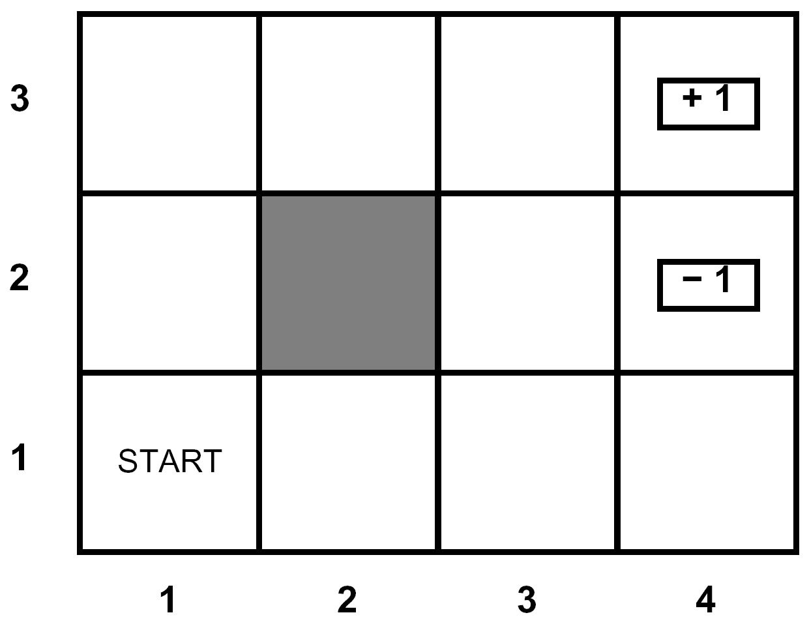

# 马尔可夫决策（一）— MDP 建模

> [!abstract] 本节导览
> 本章（教材第 17 章）研究**不确定性下的序列式决策**。我们把 Expectimax 形式化为 **马尔可夫决策过程（MDP）**，定义其五要素、**策略（policy）**、**时间上的效用**与**折扣因子（discount factor）**，为下一节的价值迭代/策略迭代求解打基础。

## 从一次性决策到序列式决策

> [!important] 序列式决策问题
> - **简单决策**（第 16 章）：一次性/片段式，只关注一个行动，结果效用已知（如 sun 时不带伞效用 100）。
> - **序列式决策**（第 17 章）：效用依赖于**一个决策序列**，包含效用、不确定性、感知；需考虑转移模型、回报、状态值、策略。
> - 回顾 **Expectimax**：行动结果不确定（显式随机/不可预知对手/行动失败）时，用机会节点取**期望**。MDP 正是其形式化。

> [!example] Grid World（网格世界）
> - Agent 在网格中移动，墙挡路；**Noisy movement**：以 80% 概率朝预期方向、各 10% 概率垂直偏移；撞墙则停留原地。
> - 每步有小的"生存"回报 $r$（可负），终止状态有大回报（好/坏）；**目标=最大化回报总和**。

## MDP 的形式化

> [!important] MDP 五（六）要素
> - 状态集合 $s\in S$；行动集合 $a\in A$；
> - **转移模型** $T(s,a,s') = P(s'\mid s,a)$；
> - **回报函数** $R(s,a,s')$（每次转移）；
> - 初始状态，可能有终止状态；
> - **效用函数** = 累加的（折扣）回报。
>
> **MDP 是完全可观察的、概率化的搜索问题。**

> [!note] 搜索问题 vs. MDP
> | 搜索问题 | MDP |
> | --- | --- |
> | 转移 $\text{Result}(s,a)$ | 转移模型 $T(s,a,s')$（概率） |
> | 代价 $c(s,a,s')$ | 回报 $R(s,a,s')$ |
> | 解 = 动作序列 | 解 = **策略 $\pi: S\to A$** |

> [!important] 什么是"马尔可夫"？
> 环境历史 $[s_0,a_0,s_1,a_1,\dots,s_t]$。**马尔可夫性**：给定当前状态，未来与过去独立——**下一状态的概率分布只取决于当前状态和当前动作**。（得名于 Andrey Markov，1856–1922。）

## 策略（Policy）

> [!important] 策略是 MDP 的解
> 策略 $\pi: S\to A$ 为**每个状态**指定一个动作。**最优策略 $\pi^*$** 使 Agent 获得最大期望效用，定义一个反射型 agent。
> - 对比 Expectimax：它**不计算整个策略**，只算单个状态该采取的行动。

> [!example] 回报 $r$ 如何影响最优策略
> 不同的生存回报 $r$ 导致截然不同的策略（"生活态度"）：
> - $r$ 极负（"生活太痛苦"）：尽快冲向最近出口，哪怕是 −1 终点。
> - $r$ 较小负（"不愉快/沉闷"）：谨慎绕开 −1，奔向 +1。
> - $r>0$（"生活愉快"）：尽量**避免进入任何终止状态**，永远停留刷正回报。

## 时间上的效用与折扣因子

> [!important] 奖励序列的偏好
> Agent 对奖励序列的偏好：要更多（More）、要更早（Now）。如何把序列折算成单一效用？

> [!note] 静态偏好（Stationary Preferences）定理
> 若假设静态偏好（偏好不随时间平移而改变），则**只有两种定义效用的方式**：
> - **累加回报**：$U([r_0,r_1,r_2,\dots]) = r_0+r_1+r_2+\dots$
> - **折扣回报**：$U([r_0,r_1,r_2,\dots]) = r_0+\gamma r_1+\gamma^2 r_2+\dots$，其中 $\gamma\in[0,1]$ 是**折扣因子**。

> [!important] 为什么用折扣因子 $\gamma$
> 1. **行为**：人和动物更看重近期奖励。
> 2. **经济**：早拿钱可再投资生息。
> 3. **不确定性**：未来奖励可能因转移模型未涵盖的原因永远拿不到。
> 4. **数学便利**：解决无限回报问题。等比数列 $1+\gamma+\gamma^2+\dots=\frac{1}{1-\gamma}$，故 $r_0+\gamma r_1+\dots$ 的界为 $\pm\frac{R_{max}}{1-\gamma}$（有限！）。

> [!example] 折扣示例（$\gamma=0.5$）
> $U([1,2,3]) = 1\cdot1 + 0.5\cdot2 + 0.25\cdot3 = 2.75 < U([3,2,1])$——越早的大奖励越值钱。

> [!example] 折扣因子小测试
> 一维走廊，出口 a（Exit 得 10）、e（Exit 得 1），转移确定性，其余回报 0：
> - $\gamma=1$：哪边出口都最终拿满，看绝对值 → 倾向走向 10。
> - $\gamma=0.1$：折扣极重，从中间状态看，近的小奖励可能优于远的大奖励。
> - 求"在状态 d 时东西等价"的 $\gamma$：令向左到 a 的折扣收益 = 向右到 e 的折扣收益，解出 $\gamma$。

## MDP 搜索树：V(s) 与 Q(s,a)

> [!important] 状态值与 Q 值
> 每个 MDP 状态投射一棵类 Expectimax 搜索树：
> - $s$ 是状态，$(s,a)$ 是 **q-state**；$(s,a,s')$ 是一个**转移**。
> - $V(s)$：状态 $s$ 的（最优）效用；$Q(s,a)$：在 $s$ 采取 $a$ 的（最优）效用。
> - 关系（下一节展开）：$V(s)=\max_a Q(s,a)$，$Q(s,a)=\sum_{s'}T(s,a,s')[R(s,a,s')+\gamma V(s')]$。

## 本章小结

> [!summary] 要点回顾
> - **MDP** = 状态、行动、转移模型 $T(s,a,s')$、回报 $R(s,a,s')$（+ 折扣 $\gamma$）；满足**马尔可夫性**（未来只依赖当前状态+动作）。
> - MDP 的解是**策略 $\pi: S\to A$**，最优策略最大化期望效用；生存回报 $r$ 显著影响策略形态。
> - 效用用**折扣回报** $\sum_t\gamma^t r_t$ 定义，$\gamma$ 解决无限回报且符合"近期更重要"的直觉。
> - 引入 $V(s)$ 与 $Q(s,a)$ 为求解做准备。

## 自测题

> [!question] 检验你的理解
> 1. 序列式决策与一次性决策的区别是什么？MDP 的五要素有哪些？
> 2. "马尔可夫性"具体指什么？MDP 的解为什么是策略而非动作序列？
> 3. 生存回报 $r$ 的正负如何改变最优策略？
> 4. 静态偏好定理给出哪两种效用定义？写出折扣回报公式。
> 5. 为什么要用折扣因子？它如何让无限回报收敛（给出界）？
> 6. $V(s)$ 与 $Q(s,a)$ 的含义及它们之间的关系是什么？
