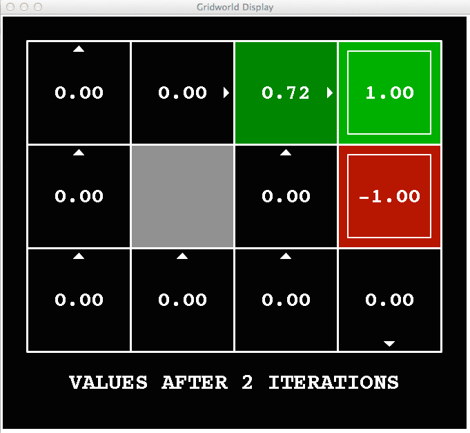
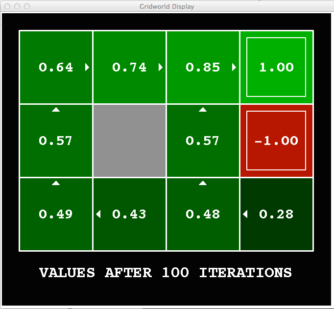

# 马尔可夫决策（二）— 求解 MDP

> [!abstract] 本节导览
> 承接 [[第7周星期三-马尔可夫决策1_MDP建模_笔记|MDP 建模]]，本节给出求解 MDP 的核心工具——**贝尔曼方程（Bellman Equation）**，并讲两大动态规划算法：**价值迭代（Value Iteration）**与**策略迭代（Policy Iteration）**，以及连接二者的**策略提取（Policy Extraction）**。

## 状态值、Q 值与最优策略

> [!important] 三个核心量
> - $V^*(s)$：从 $s$ 开始采取**最优策略**的期望效用。
> - $Q^*(s,a)$：在 $s$ 采取 $a$、之后采取最优策略的期望效用。
> - 关系：$V^*(s)=\max_a Q^*(s,a)$。
> - 最优策略：$\pi^*(s)=\arg\max_a Q^*(s,a)$。
>
> 固定策略 $\pi$ 下：$V^\pi(s)$ = 从 $s$ 跟随 $\pi$ 的期望总折扣回报（执行策略会产生**随机路径**，因转移有噪声）。

## 贝尔曼方程（Bellman Equation）

> [!important] 递归定义最优值
> 一个状态的效用 = **立即回报 + 下一状态的期望折扣效用**（假定选最优行动）：
> $$V^*(s) = \max_a \sum_{s'} T(s,a,s')\big[R(s,a,s') + \gamma V^*(s')\big]$$
> 对应的 Q 函数贝尔曼方程：
> $$Q^*(s,a) = \sum_{s'} T(s,a,s')\big[R(s,a,s') + \gamma \max_{a'}Q^*(s',a')\big]$$
> **这正是 expectimax 计算的过程**：最优行动下的期望（折扣回报平均和）。

## 价值迭代（Value Iteration）

> [!important] 算法
> Expectimax 直接求解工作量太大（状态重复 + 树无限扩展）。价值迭代用**时间受限值** $V_k(s)$（深度 $k$ 的 expectimax 最优值）逐步逼近：
> ```
> 初始化 V_0(s) = 0，给定终止参数 ε
> 重复直到收敛（所有更新 < ε）:
>   对每个状态 s 做贝尔曼更新:
>     V_{k+1}(s) ← max_a Σ_s' T(s,a,s')[R(s,a,s') + γ V_k(s')]
> ```
> - **每次迭代复杂度 $O(S^2A)$**（S 个状态 × A 个动作 × 求和 S 次）。
> - **定理**：无论初值如何，都收敛到唯一最优值函数。若 $\gamma<1$，树的深层最终无关紧要。

> [!example] Grid World 价值迭代（Noise=0.2, γ=0.9, R=0）
> - $k=0$：$V_0$ 全 0。
> - $k=2$，$s=(3,3)$ 最佳 East：$V_2 = 0.9\times(0.8\times1 + 0.1\times0 + 0.1\times0)=0.72$。
> - $k=3$，$s=(3,3)$：$V_3 = 0.9\times(0.8\times1 + 0.1\times0.72 + 0.1\times0)=0.7848$（0.1 概率向北撞墙留原地，用 $V_2=0.72$）。
> - $s=(3,2)$ 最佳 North：$V_3 = 0.9\times(0.8\times0.72 + 0.1\times0 + 0.1\times(-1))=0.4284$。
> 随 $k$ 增大，值逐渐扩散收敛。**策略往往在状态值收敛之前很久就收敛**。
>
> **k=2 时（值刚从 +1/−1 终点向外扩散两步）：**
> 
>
> **k=100 时（已收敛，各格状态值与最优策略箭头稳定）：**
> 

> [!example] Car Racing（无折扣）
> $V_0=(0,0,0)$（蓝/红/灰），$V_1(\text{蓝})=\max\{1.0\times1,\ 0.5\times2+0.5\times2\}=\max\{1,2\}=2$。逐步推出 $V_2(\text{蓝})=3.5$ 等。

## 策略提取（Policy Extraction）

> [!important] 从值得到行动
> 给定 $V(s)$，做一次 **mini-expectimax**：
> $$\pi_V(s) = \arg\max_a \sum_{s'} P(s'\mid a,s)\big[R(s,a,s') + \gamma V(s')\big]$$
> 若已有 $Q^*$，则更简单：$\pi^*(s)=\arg\max_a Q^*(s,a)$。
> **既然最终要用 Q 值提取策略，何不直接求 $Q^*$**（这引向后续 Q-learning）。

> [!note] 策略损失（Policy Loss）
> 策略 $\pi$ 的质量用 $\|V^\pi - V^*\|$ 衡量。当 $\|V_k-V^*\|\le\varepsilon$ 时，策略损失有界：$\|V^{\pi_k}-V^*\|\le \frac{2\varepsilon\gamma}{1-\gamma}$。**策略经常在状态值收敛之前就收敛**。

## 策略迭代（Policy Iteration）

> [!important] 直接迭代策略
> 价值迭代有三个问题：① 每次迭代慢 $O(S^2A)$；② 每状态的 max 很少改变；③ 策略往往早于值收敛。既然最终求策略，何不**直接迭代策略**：
> ```
> 从初始策略 π_0 开始
> 重复直到策略不变:
>   Step 1 策略评估: 计算当前策略 π_i 的值 V^{π_i}
>   Step 2 策略改进: 从 V^{π_i} 提取新策略 π_{i+1}
> ```

> [!note] Step 1：策略评估（Policy Evaluation）
> 固定策略 $\pi$ 后，每个状态只有一个动作，贝尔曼方程简化（去掉 max）：
> $$V^\pi(s) = \sum_{s'} T(s,\pi(s),s')\big[R(s,\pi(s),s') + \gamma V^\pi(s')\big]$$
> - **精确求法**：n 个状态构成线性方程组，$O(n^3)$，大状态空间不可行。
> - **近似求法**：迭代到收敛（视为"每状态只有一个动作的价值迭代"）。

> [!note] Step 2：策略改进（Policy Improvement）
> 固定值后，用 one-step look-ahead 提取更好策略：
> $$\pi_{i+1}(s) = \arg\max_a \sum_{s'} T(s,a,s')\big[R(s,a,s') + \gamma V^{\pi_i}(s')\big]$$
> **策略收敛判据**：对所有 $s$，$\pi(s)$ 都不再变化。

> [!example] Car Racing（γ=0.5）策略迭代
> 给定初始策略 → 解策略评估方程组得 $V^\pi$ → 策略改进得新策略 → 重复直到收敛。

## 价值迭代 vs. 策略迭代

> [!summary] 两者对比
> | | 价值迭代 | 策略迭代 |
> | --- | --- | --- |
> | 每次迭代 | 对所有动作取 max 更新值（隐式更新策略） | 固定策略评估值（每遍快，只算一个动作）+ 策略改进 |
> | 跟踪策略 | 不显式跟踪 | 显式迭代策略 |
> | 收敛 | 收敛到最优值 | 收敛到最优策略 |
>
> 两者都是求解 MDP 的**动态规划**方法；事实上，任何公平序列上的任意状态值/策略更新都收敛到最优解。

## 本章小结

> [!summary] 要点回顾
> - **贝尔曼方程** $V^*(s)=\max_a\sum_{s'}T(s,a,s')[R+\gamma V^*(s')]$ 是求解 MDP 的核心递归。
> - **价值迭代**：反复贝尔曼更新逼近 $V^*$，$O(S^2A)$/迭代，收敛唯一最优值；**策略常先于值收敛**。
> - **策略提取**：$\pi(s)=\arg\max_a\sum_{s'}T[R+\gamma V(s')]$，用 $V$（或更直接的 $Q$）得到行动。
> - **策略迭代**：策略评估（固定策略解值）+ 策略改进，直接逼近最优策略，常比价值迭代快。

## 自测题

> [!question] 检验你的理解
> 1. 写出 $V^*$ 与 $Q^*$ 的贝尔曼方程，并说明它们与 expectimax 的关系。
> 2. 价值迭代的更新式和复杂度是什么？为什么初值不影响最终收敛？
> 3. 手算 Grid World 中某状态一两步的 $V_k$（给定 Noise、γ）。
> 4. 什么是策略提取？为什么说"何不直接求 $Q^*$"？
> 5. 策略迭代的两步分别是什么？策略评估的精确解与近似解各有何代价？
> 6. 价值迭代与策略迭代的核心区别是什么？为何策略迭代每遍更快？
