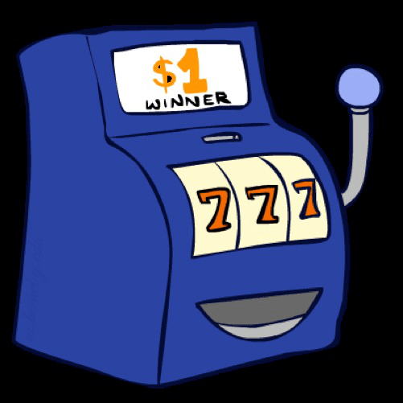

# 马尔可夫决策（三）— 收敛性与多臂老虎机

> [!abstract] 本节导览
> 承接 [[第7周星期五-马尔可夫决策2_价值迭代与策略迭代_笔记|价值/策略迭代]]，先用**压缩映射**证明价值迭代的收敛性与速度，再通过 Double Bandits 引出**离线规划 vs. 在线学习**的区别（强化学习的开端），最后系统讲**多臂老虎机问题**：探索/利用困境、Gittins 指数、遗憾、ε-greedy。

## 价值迭代为什么收敛？

> [!important] 压缩映射（Contraction）
> 算子 $F$ 是因子 $c<1$ 的**压缩**：对任意 $x,y$，$d(Fx,Fy)\le c\cdot d(x,y)$。
> - 压缩有**唯一不动点** $z$（$Fz=z$）。证明：若有两个不动点 $z,z'$，则 $d(Fz,Fz')=d(z,z')$ 违反压缩性（$c<1$）。
> - 例：$Fx=x/2$，任意两数除 2 后差减半，不动点为 0。

> [!note] 贝尔曼算子是 γ-压缩
> 价值迭代写作 $V_{k+1}\leftarrow B V_k$（$B$ 同时更新所有状态）。用**最大范数** $\|V-W\|=\max_s|V(s)-W(s)|$ 度量距离，**贝尔曼更新 $B$ 是 γ-压缩**，其唯一不动点是 $BV^*=V^*$——所以价值迭代收敛到唯一最优值。

> [!important] 收敛速度（指数级）
> $$\|V_{k+1}-V^*\| = \|BV_k - BV^*\| \le \gamma\|V_k - V^*\|$$
> 每次迭代误差至少缩小因子 $\gamma$——**指数级收敛**。如 $\gamma=0.9$：22 次迭代误差减 10 倍，44 次减 100 倍，220 次减 $10^{10}$ 倍。
> - 停止判据：$\|V_{k+1}-V_k\|<\varepsilon(1-\gamma)/\gamma$ 时停止，可保证 $\|V_{k+1}-V^*\|<\varepsilon$（用三角不等式推得）。

> [!summary] MDP 算法统一视角
> | 想要 | 用 |
> | --- | --- |
> | 计算最优值 | 价值迭代 / 策略迭代 |
> | 计算特定策略的值 | 策略评估 |
> | 把值转成策略 | 策略提取 |
>
> 它们**都是贝尔曼更新的变体**，都用相邻时间段的 expectimax，区别仅在于"插入固定策略"还是"对所有动作取 max"。
> 贝尔曼方程的人生启示："**第一步选对方向，第二步保持最优前进**。"

## 离线规划 vs. 在线学习：Double Bandits

> [!important] 求解 MDP = 离线规划（Offline Planning）
> 已知 MDP 全部细节时，纯靠**计算**确定所有量（价值/策略），**不必实际玩游戏**。
> - Double Bandits 例：Blue 稳拿 \$1；Red 以 0.75 概率 \$2、0.25 概率 \$0。无折扣 100 步下可算出最优。

> [!warning] 规则未知时 = 在线学习（强化学习）
> 若 Red 的中奖概率**未知**，就不再是规划而是**学习**问题——具体说是**强化学习**：有 MDP 但无法仅靠计算求解，**必须实际行动才能弄清**。核心思想：
> - **探索（Exploration）**：尝试未知动作获取信息；
> - **利用（Exploitation）**：最终要用已知的最优；
> - **遗憾（Regret）**：即便聪明学习也会犯错；
> - **采样（Sampling）**：因偶然性需反复尝试；
> - **难点**：学习远比求解已知 MDP 困难。

## 多臂老虎机（Multi-Armed Bandit）

> [!important] 问题定义
> $n$ 臂老虎机，每臂 $i$ 以未知概率 $p_i$ 吐 \$1。手握 $T$ 枚代币（每摇一次花一枚），如何最大化期望回报？
> - **频率学派**：认为每个 $p_i$ 是确定值，需在有限时间内找出高 $p_i$ 的臂并多摇。
> - **贝叶斯学派**：对 $p_i$ 设**先验分布**（如 Beta(1,1)），根据反馈更新**后验分布**，找后验偏右的臂多摇。
> - 是众多现实问题的模型：选疗法、选投资、选研究项目、选广告。

> [!note] Gittins 指数（Gittins Index）
> 单臂老虎机：固定臂 $M_\lambda$ 每次产生 $\lambda$，对比未知臂 $M$。求使"运行 $M$ 到最佳停止时间 $T$ 再永远切 $M_\lambda$"与"立即选 $M_\lambda$"**完全中立**的 $\lambda$：
> $$\lambda^* = \frac{\text{效用（分子）}}{\text{折扣时间（分母）}} = \text{每单位折扣时间可获最大效用}$$
> 这个 $\lambda^*$ 就是 $M$ 的 **Gittins 指数**。
> - **最优策略极简**：拉 Gittins 指数最高的臂，然后更新指数。
> - 例：序列 $0,2,0,7.2,0,\dots$、$\gamma=0.5$，前 4 个奖励后比值最大，Gittins 指数 = 1.0133。

> [!example] 伯努利老虎机（Bernoulli Bandit）
> 每臂以未知概率产生 0/1。臂状态由 $(s_i, f_i)$（成功/失败计数）定义，下次为 1 的概率 $\frac{s_i}{s_i+f_i}$；计数初始化为 1（初始概率 1/2）。
> - 无限状态，可用 $s_i+f_i=100, \gamma=0.9$ 的截断 MDP 近似求 Gittins 指数。
> - **探索奖励（exploration bonus）**：状态 (3,2) 指数 0.7057 > (7,4) 指数 0.6922，尽管 (3,2) 估计值更低（0.6 vs 0.6364）——**尝试少的臂更值得探索**。
> - 应用：A/B 测试、Netflix 封面图选择。

## 探索/利用与 ε-Greedy

> [!important] 遗憾（Regret）与动作价值估计
> - **遗憾**：实际累计奖励与最优臂累计奖励之差。
> - **动作价值估计**：多次采取动作 $a$ 的奖励平均。**增量式更新**（每试一次立即更新）：
> $$Q_{n} = Q_{n-1} + \frac{1}{n}\big(R_n - Q_{n-1}\big)$$
> 推导：新均值 = 旧均值 + 步长 × (新样本 − 旧均值)。非平稳老虎机可用固定步长。

> [!note] ε-Greedy 动作选择
> 平衡探索与利用的最简单策略：
> $$a = \begin{cases}\arg\max_a Q(a) & \text{概率 } 1-\varepsilon\ (\text{利用})\\ \text{随机动作} & \text{概率 } \varepsilon\ (\text{探索})\end{cases}$$
> 以小概率 $\varepsilon$ 随机探索，其余时间贪婪利用当前最优估计。

## 本章小结

> [!summary] 要点回顾
> - 价值迭代收敛因贝尔曼算子是 **γ-压缩**，有唯一不动点 $V^*$，**指数级收敛**（每步误差 ×γ）。
> - **离线规划**（已知 MDP，纯计算）vs. **在线学习/强化学习**（MDP 未知，需实际行动）。
> - **多臂老虎机**刻画**探索 vs. 利用**困境；**Gittins 指数**给出最优策略（拉指数最高的臂）。
> - **遗憾**衡量学习损失；动作价值用增量均值估计；**ε-greedy** 是最简单的探索/利用平衡。

## 自测题

> [!question] 检验你的理解
> 1. 什么是压缩映射？为什么压缩有唯一不动点？贝尔曼算子用哪种范数是 γ-压缩？
> 2. 价值迭代的误差每步如何变化？给定 γ 估计减小 100 倍需多少次迭代。
> 3. 离线规划与在线学习的本质区别是什么？强化学习的五个关键思想是什么？
> 4. 多臂老虎机中频率学派与贝叶斯学派的视角有何不同？
> 5. 什么是 Gittins 指数？基于它的最优策略为何如此简单？
> 6. 写出动作价值的增量更新式和 ε-greedy 的选择规则。
