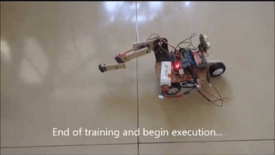

# 强化学习（一）— 被动 RL 与时序差分学习

> [!abstract] 本节导览
> 强化学习（第 22 章）研究**转移模型 T 与回报 R 都未知**的 MDP——必须实际行动才能学习。本节聚焦**被动强化学习**（策略固定，只学其价值）：对比 **Model-Based**（学模型再求解）与 **Model-Free**（直接估计、**时序差分 TD**）两条路线。承接 [[第8周星期三-马尔可夫决策3_收敛性与老虎机_笔记|MDP 与老虎机]]。

## 从 MDP 到强化学习

> [!important] 强化学习的设定
> 仍假设一个 MDP（状态、行动、转移 $T$、回报 $R$），仍想求策略 $\pi(s)$。**新情况：不知道 $T$ 或 $R$**——不知道哪些状态好、行动后果如何，必须**实际尝试**去学习。
> - **离线（MDP）**：Agent 有完整模型与回报函数，纯计算。
> - **在线（RL）**：Agent **无先验知识**，以回报形式接收反馈，学会采取行动最大化期望回报，**所有学习基于观察到的结果样本**。

> [!note] RL 的基本思想
> - **探索（Exploration）**：尝试未知行动获取信息；
> - **利用（Exploitation）**：最终要用已知信息；
> - **采样（Sampling）**：需多次重复才能得到好估计；
> - **泛化（Generalization）**：一个状态学到的可能适用于其他状态。
> 交互循环：环境给 Agent 状态 $s$ 与回报 $r$，Agent 输出行动 $a$。

## 被动强化学习（Passive RL）

> [!important] 任务：策略评估
> Agent 的策略 $\pi$ **固定**（在 $s$ 总执行 $\pi(s)$），目标仅是**学习该策略有多好**，即 $V^\pi(s)$。
> - 学习者**无法选择行动**，只执行策略并吸取经验；
> - **这不是离线规划**——Agent 真的在世界中行动了。

## Model-Based Learning（基于模型）

> [!important] 思路：先学模型，再求解
> 1. **学 MDP 模型**：统计每个 $(s,a)$ 的结果 $s'$，归一化估计 $\hat T(s,a,s')$；记录经历到的 $\hat R(s,a,s')$。
> 2. **求解学到的 MDP**：如用价值迭代。

> [!example] Model-Based 示例（γ=1）
> 由 4 个 episode 统计：$T(B,\text{east},C)=1.0$；$T(C,\text{east},D)=0.75$、$T(C,\text{east},A)=0.25$；$R(B,\text{east},C)=-1$、$R(D,\text{exit},x)=+10$ 等。

> [!note] 优缺点
> - **优点**：有效利用经历。
> - **缺点**：一次学一个状态-动作对模型，**无法扩展到巨大状态空间**。

> [!tip] 类比：估计学生期望年龄
> - **Model-Based**：先学分布 $P(A)$（按频率统计），再算期望——"最终会学到正确模型"。
> - **Model-Free**：直接对样本 $[a_1,\dots,a_N]$ 求平均——"样本以正确频率出现，所以有效"，无需显式模型。

## Model-Free：直接效用估计（Direct Evaluation）

> [!important] 直接平均样本回报
> 目标：算 $\pi$ 下每个状态的值。做法：按 $\pi$ 行动，**每次访问某状态时记下其后的折扣回报总和**，取这些样本的平均。
> - 例（γ=1）：从训练 episode 算得 $V(A)=-10, V(B)=8, V(C)=4, V(D)=10, V(E)=-2$。

> [!warning] 直接估计的问题
> - **优点**：简单易懂，无需 $T,R$ 知识，大样本下收敛到正确均值。
> - **缺点**：① 必须等一次 episode 完成才能学；② 每个状态分开学；③ **浪费了状态间的联系信息**。
> - 矛盾示例：B 和 E 在策略下都通向 C，但学到的 $V(B)=8$、$V(E)=-2$ 不同——因为直接估计**忽略了 C→D / C→A 的转移联系**（恰好从 E 出发那次到了 A 拿到 −10）。

## Model-Free：时序差分学习（TD Learning）

> [!important] 核心思想：从每次转移中学习
> 简化的贝尔曼更新（固定策略）需要 $T$ 和 $R$。**TD 的关键**：在不知 $T,R$ 的情况下，用**采样 + 滑动平均**近似贝尔曼更新——每经历一次转移 $(s,a,s',r)$ 就更新一次 $V(s)$。

> [!note] 滑动平均（Running Average）
> - 普通均值：$\mu_n = \frac{(n-1)\mu_{n-1}+x_n}{n} = \frac{n-1}{n}\mu_{n-1}+\frac1n x_n$。
> - **固定权重（指数遗忘）**：$\mu_n = (1-\alpha)\mu_{n-1} + \alpha x_n$——早期样本权重按 $(1-\alpha)^k$ 指数衰减，强调近期样本，适合非平稳环境。

> [!important] TD 更新规则
> $$\text{sample} = R(s,\pi(s),s') + \gamma V^\pi(s')$$
> $$V^\pi(s) \leftarrow (1-\alpha)V^\pi(s) + \alpha\cdot\text{sample} \;=\; V^\pi(s) + \alpha\big[\text{sample} - V^\pi(s)\big]$$
> - $[\text{sample}-V^\pi(s)]$ 称为 **TD 误差**；$\alpha$ 是**学习率**。
> - 直觉：观察一个样本，把 $V^\pi(s)$ 朝"与邻居 $V^\pi(s')$ 更一致"的方向挪一点。
> - **越可能的转移结果 $s'$ 越频繁参与更新**——自然体现了转移概率。
> - $\alpha$ 随状态被访问次数递减时，$V$ 收敛。

> [!example] TD 示例（γ=1, α=1/2）
> 观察 `B,east,C,-2`：$V(B)\leftarrow V(B)+\tfrac12[(-2)+1\cdot V(C) - V(B)]$。若 $V(B)=0, V(C)=8$ → $V(B)\leftarrow 0+\tfrac12[-2+8-0]=3$。

> [!warning] TD 价值学习的局限 → 引出 Q-learning
> TD 是无模型的**策略评估**，但若想把价值**转成新策略**就遇阻——因为策略提取 $\arg\max_a\sum_{s'}T[R+\gamma V(s')]$ **仍需 $T,R$**！
> **解法**：学 **Q 值**而非 V 值，让行动选择也无模型化（下一节 Q-learning）。

## 本章小结

> [!summary] 要点回顾
> - **强化学习** = $T,R$ 未知的 MDP，靠实际行动+样本学习；核心是探索/利用/采样/泛化。
> - **被动 RL**：策略固定，只学 $V^\pi$。
> - **Model-Based**：学模型再求解（有效但难扩展）；**Model-Free** 两法：
>   - **直接估计**：平均观察到的回报（简单但浪费状态间联系、需整条 episode）；
>   - **时序差分 TD**：$V(s)\leftarrow V(s)+\alpha[\,R+\gamma V(s')-V(s)\,]$，每次转移即更新，利用滑动平均近似贝尔曼。
> - TD 学 V 无法直接导出新策略 → 转向学 Q 值。

## 自测题

> [!question] 检验你的理解
> 1. 强化学习与离线 MDP 规划的本质区别是什么？
> 2. 被动 RL 的任务是什么？为什么"不是离线规划"？
> 3. Model-Based 与 Model-Free 的思路差异（用估计年龄的类比说明）。
> 4. 直接效用估计的三个缺点是什么？为什么 B、E 通向同一状态 C 却值不同？
> 5. 写出 TD 更新规则，解释 TD 误差与学习率 $\alpha$ 的作用。
> 6. 为什么 TD 学 V 值无法直接得到新策略？解决办法是什么？
