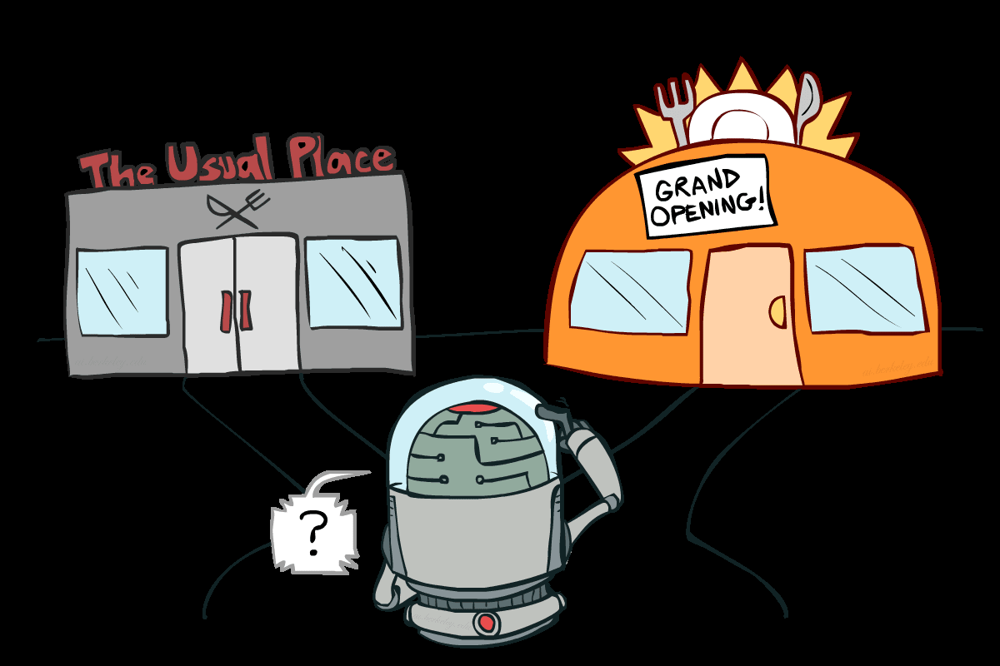

# 强化学习（二）— Q-learning 与近似

> [!abstract] 本节导览
> 承接 [[第8周星期五-强化学习1_被动RL与时序差分_笔记|被动 RL]]。本节进入**主动强化学习**（Agent 自己决定行动）：核心是 **Q-learning**——基于样本的 Q 值迭代，**off-policy** 且无需 $T,R$。再讨论**探索 vs. 利用**（ε-greedy、探索函数、遗憾），以及应对大状态空间的**近似 Q-learning**（特征化）。

## 主动强化学习

> [!important] 被动 vs. 主动
> - **被动 RL**：策略固定，只学其价值。
> - **主动 RL**：Agent **自己决定**采取什么行动，目标是学习**最优策略/状态值**。核心权衡是 **探索 vs. 利用**。这不是离线规划——真在世界中行动并观察结果。

## Q 值迭代 → Q-Learning

> [!note] 从 Q 值迭代说起
> 价值迭代算 $V^*$，但 **Q 值更方便直接导出策略**。Q 值迭代：
> $$Q_{k+1}(s,a) \leftarrow \sum_{s'}T(s,a,s')\big[R(s,a,s')+\gamma\max_{a'}Q_k(s',a')\big]$$

> [!important] Q-Learning：基于样本的 Q 值迭代
> 边走边学 $Q(s,a)$。每收到一个样本 $(s,a,s',r)$：
> $$\text{sample} = r + \gamma\max_{a'}Q(s',a')$$
> $$Q(s,a) \leftarrow (1-\alpha)Q(s,a) + \alpha\cdot\text{sample} = Q(s,a)+\alpha\big[\text{sample}-Q(s,a)\big]$$
> **关键**：sample 里用 $\max_{a'}$ 而非 $\pi(s')$——**不再是策略评估**，不需要策略指定动作。

> [!important] Q-Learning 的惊人性质：Off-Policy
> **Q-learning 收敛到最优策略——即使你实际遵循的行动不是最优的！** 这称为**脱离策略学习（off-policy learning）**。
> 前提条件：
> - 必须有**足够的探索**；
> - 学习率 $\alpha$ 最终要**足够小**……但**不要减小得太快**。

## 探索 vs. 利用

> [!important] 如何探索？
> - **最简单：ε-greedy（随机行动）**——每步掷硬币：以小概率 $\varepsilon$ 随机行动，以 $1-\varepsilon$ 执行当前最优策略。
> - **问题**：学完后仍会因随机性继续"挣扎"。**解法**：① 随时间降低 $\varepsilon$；② 用**探索函数**。

> [!important] 探索函数（Exploration Functions）
> 思路：探索那些"还没摸清好坏"的区域，最终停止探索。探索函数输入价值估计 $u$ 和访问次数 $n$，返回**乐观效用**：
> $$f(u,n) = u + \frac{k}{n}$$
> （$k$ 是常数，$n=N(s,a)$ 是 q-state 访问次数。）**修改后的 Q 更新**用 $f(Q(s',a'), N(s',a'))$ 代替 $\max_{a'}Q(s',a')$，把探索"奖励"导向访问少的（$f$ 值大的）q-state，且奖励会传播到通往未知区域的路径上。

> [!note] 遗憾（Regret）
> 遗憾 = 你的（期望）回报与最优（期望）回报之差，衡量学习过程的**总错误成本**。
> - 最小化遗憾不止是"学会成为最优"，而是"**最优地学会成为最优**"。
> - 随机探索和探索函数最终都最优，但**随机探索的遗憾更高**。

## 近似 Q-Learning（Approximate Q-Learning）

> [!warning] 表格式 Q-learning 的扩展性问题
> 基本 Q-learning 维护一张包含所有 $(s,a)$ 的 Q 表。现实中**状态太多**——训练中无法全部访问，内存也存不下。例如吃豆人某状态被发现"很糟"，朴素 Q-learning 对相似状态**一无所知**。

> [!important] 解决方案：特征化表示 + 泛化
> 用**特征向量**描述状态：特征是状态到实数（常 0–1）的函数，捕获重要属性。
> - 示例特征：到最近鬼的距离、到最近食物的距离、鬼的数量、$1/(\text{dist to dot})^2$、是否在隧道中（0/1）等。
> - 也可用特征描述 q-state $(s,a)$（如"该行动让吃豆人更靠近食物"）。

> [!important] 线性 Q 函数与更新
> 用权重对特征线性组合表示 Q 函数：
> $$Q(s,a) = w_1 f_1(s,a) + w_2 f_2(s,a) + \dots + w_n f_n(s,a)$$
> Q-learning 更新（线性）：
> $$\text{difference} = \big[r + \gamma\max_{a'}Q(s',a')\big] - Q(s,a)$$
> $$w_i \leftarrow w_i + \alpha\cdot\text{difference}\cdot f_i(s,a)$$
> - **直觉**：调整活跃特征的权重——若发生意外坏事，"责怪"当时活跃的特征（大 $f_i$ 值），从此不喜欢所有具有这些特征的 q-state。
> - **优点**：泛化到未见过的相似状态；**缺点**：线性函数可能不足以逼近真实 Q（可用更复杂函数，如神经网络）。
> - 本质上是**最小二乘回归 + 梯度下降**：最小化 $(\text{target}-\text{prediction})^2$。

> [!tip] RL 与多巴胺
> 学习的直接目标不是奖励最大，而是**最小化预测误差**（TD 误差趋于零即最优）。神经科学发现**多巴胺传递的正是 TD 误差**——对未来奖励的预计与心理基准的比较。"真正的快乐在于进步，超乎预期则高兴，反之沮丧。"

## 总结：MDP 与 RL 全景

> [!summary] 方法对照表
> | 情形 | 求 $V^*/Q^*/\pi^*$ | 评估固定策略 $\pi$ |
> | --- | --- | --- |
> | **已知 MDP（离线）** | 价值/策略迭代 | 策略评估 PE |
> | **未知 MDP — Model-Based** | 在近似 MDP 上 VI/PI | 在近似 MDP 上 PE |
> | **未知 MDP — Model-Free** | **Q-learning** | 价值学习（TD） |
>
> 大状态空间时**用特征泛化**。

## 本章小结

> [!summary] 要点回顾
> - **主动 RL** 中 Agent 自选行动，核心是探索/利用权衡。
> - **Q-learning**：$Q(s,a)\leftarrow Q(s,a)+\alpha[r+\gamma\max_{a'}Q(s',a')-Q(s,a)]$，**off-policy**，即使行动非最优也收敛到最优（需足够探索 + $\alpha$ 适当衰减）。
> - 探索：**ε-greedy**（简单但遗憾高）→ **探索函数** $f(u,n)=u+k/n$（导向未知区域，遗憾更低）。
> - **近似 Q-learning**：用特征线性组合表示 Q，按 difference × 特征更新权重，实现跨状态泛化（本质是最小二乘回归）。

## 自测题

> [!question] 检验你的理解
> 1. 写出 Q-learning 的更新式，它与 TD 价值学习的关键区别是什么？
> 2. 什么是 off-policy 学习？Q-learning 收敛到最优需要哪些条件？
> 3. ε-greedy 有什么缺点？探索函数 $f(u,n)=u+k/n$ 如何鼓励探索？
> 4. 什么是遗憾？为什么探索函数的遗憾比随机探索低？
> 5. 表格式 Q-learning 为什么难以扩展？特征化如何解决？
> 6. 写出线性近似 Q-learning 的权重更新式，解释"责怪活跃特征"的直觉。
