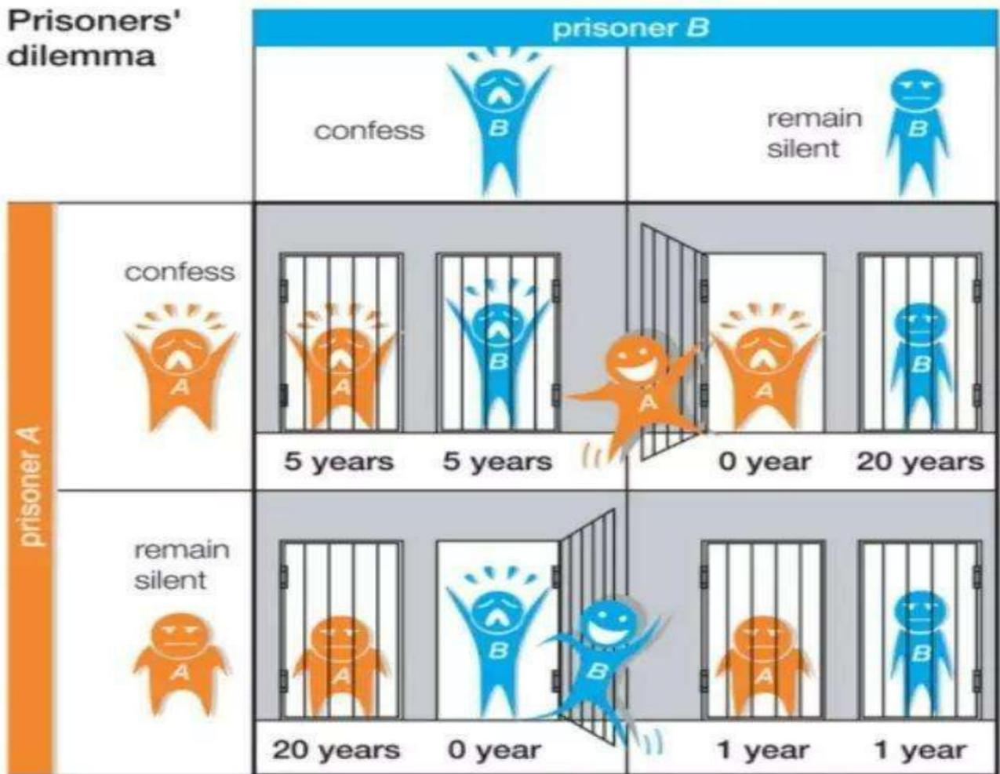
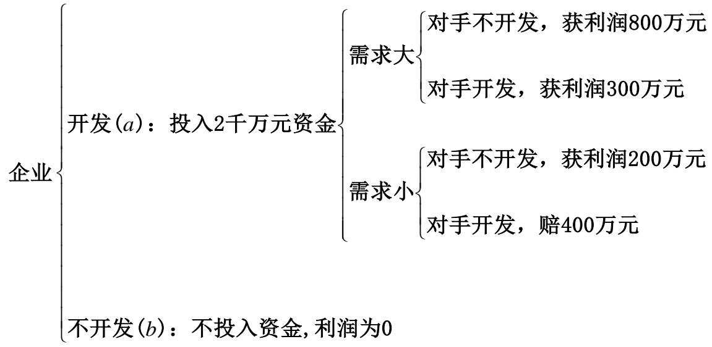

# 第1章 博弈论简介及战略式博弈

> [!abstract] 本章导览
> 本章是全课程的总入口，分两大部分：
> 1. **博弈论简介**——博弈论是什么、如何研究、研究目的（博弈问题的解）、博弈的分类、发展历程。两个贯穿全章的例子是 **猜数游戏**（引出完全理性与共同知识）与 **囚徒困境**（引出占优战略与一致性预测）。
> 2. **完全信息静态博弈——战略式博弈**——把博弈问题形式化：用 **参与人 / 行动 / 战略 / 支付 / 信息** 五个基本概念，配合 **新产品开发博弈** 这一主线例子，最终给出 **战略式（标准式）博弈** 的严格定义 $G=\langle\Gamma;(S_i);(u_i)\rangle$。
>
> 本课程按「信息完全性 × 静态/动态」2×2 框架展开，对应四个核心均衡概念（Nash 均衡 → 子博弈精炼 Nash 均衡 → 贝叶斯 Nash 均衡 → 精炼贝叶斯 Nash 均衡），后者都是前者的**加细（refinement）**。本章为这条主线奠定语言与符号基础。

---

## 一、博弈论简介

### 1.1 什么是博弈论

> [!note] 定义：博弈论（Game Theory）
> 研究**决策主体的行为发生直接相互作用**时的决策，以及这种决策的**均衡（稳定）问题**。
>
> 也就是说：当一个主体（企业、团体或个人）的选择**受其他主体选择的影响**，反过来又**影响其他人的选择**时，所面临的决策问题与均衡问题。

在传统博弈论中，「博弈」被严格定义为：**完全理性的个人或群体的行为发生直接相互作用的情形**，博弈论正是研究这种情形下个人或群体的选择（决策）及其所导致结果的理论。

> [!important] 博弈论 vs. 传统决策理论（核心区别）
>
> | | 决策理论 | 博弈论 |
> |---|---|---|
> | 本质 | 从若干备选方案中选一个 | 研究行为**直接相互作用**时的决策 |
> | 例子 | 出门带不带伞 | 国际象棋对弈 |
> | 选择依据 | 仅取决于对**自然状态**（如天气）的判断 | 取决于自己的偏好**与他人的选择** |
> | 决策的影响 | 结果（带不带伞）**不影响**天气 | 自己的走法**影响**对方下一步，并反作用于自己 |
>
> 一句话：决策论里「对手」是不会还手的自然；博弈论里「对手」是同样在算计你的理性人。

其它经典定义：2005 诺奖得主 **Robert Aumann** 称博弈论为「**交互的决策论**」；**Roger B. Myerson** 称其为「**相互影响的决策理论**」。

> [!example] 博弈论三大要素
> - **参与者**（player）——谁在博弈；
> - 每个参与者可供选择的**策略**（strategy）——能怎么做；
> - 每个策略组合所对应的参与者**利益/支付**（payoff）——做了之后得到什么。
>
> 这三要素后文将被精细化为「参与人 / 行动 / 战略 / 支付 / 信息」五个形式化概念。

### 1.2 如何研究博弈论：猜数游戏与共同知识

> [!example] 猜数游戏（考察行为博弈的经典实验）
> 每名游戏者报一个 $0\sim100$ 的非负整数。计算所有人所报数字的平均数 $\bar{x}$，**报出不超过平均数 70%（即 $0.7\bar{x}$）的最大数字者获胜**。

**逐层剔除推理（理性层次）：**

- 由于获胜数不超过 $0.7\bar{x}$，而 $\bar{x}$ 最大为 100，故**任何人都不会报超过 70** 的数；
- 若每人都不超过 70，则 $\bar{x}\le 70$，故**不会报超过 $70\times0.7=49$**；
- 同理不超过 $49\times0.7=34.3$，……如此反复：

$$
\underbrace{0.7\times0.7\times0.7\times\cdots}_{\text{无穷次}}\times 100 \;\longrightarrow\; 0
$$

逻辑上每人都应报 **0**。但现实中人们未必都报 0——关键在于**每个人对他人理性程度的预期（理性层次）**：

> [!warning] 推理能走多深，取决于「共同知识」
> - 只要我认为别人**理性**，我就不报超过 49；
> - 若我还认为**别人也认为别人理性**，我就不报超过 34；
> - 若理性层次再高一层，我会报小于 34（如 23）……
>
> 要得到「人人报 0」这个**明确且肯定**的结论，需要极强的前提：理性必须是**无穷层级**地相互知道。

> [!note] 两个基石假设
> 为使预测**逻辑严谨且一致**，博弈论的分析框架要求：
> 1. **参与人完全理性**（perfect rationality）——追求自身效用最大化，且具备无限的推理与计算能力；
> 2. **博弈结构与「参与人完全理性」是共同知识（common knowledge）**。
>
> **共同知识**：一条信息，每个人都知道它，且每个人都知道每个人都知道它，且……（无穷递归）。它比「**相互知识**（mutual knowledge，仅每人都知道）」强得多——共同知识是**无穷尽的相互知识**。
>
> 这两个假设确保：每个参与人的**决策环境、理性层次、逻辑思维层次完全相同**，从而「我预测你的决策」与「你自己分析得到的决策」**一致**。

### 1.3 博弈论研究的目的：寻找博弈问题的「解」

博弈论的核心是**寻找博弈问题的解**：给定一个博弈，预测什么样的结果会出现。

> [!question] 什么样的结果才算「解」？
> 设参与人预测结果 A 会出现并据此行动。但博弈结果是**所有人共同选择**的产物——只有当**所有人都预测到同一个 A**、且都采取与 A 相应的行动时，A 才可能真成为结果。
>
> 反例：两人博弈中，参与人 1 预测 A 并据 A 行动，参与人 2 预测 B 并据 B 行动，则真实结果**既不是 A 也不是 B**。

> [!important] 博弈问题的解 = 一致性预测（consistent prediction）
> **所有参与人都预测到的博弈结果**，即一致性预测。这种一致性不仅是「所有人都预测到某结果」，而且是「所有人都预测到所有人都预测到……」——在参与人之间不仅是**相互知识**，而且是**共同知识**。
>
> 性质：*若所有参与人都预测某特定结果会出现，且都不会偏离与之相应的策略，则该结果最终真会成为博弈的结果。*

**用三人猜数游戏验证：**

- 预测 $(1,2,3)$ **不是**一致性预测：若参与人 2 预测到「1 报 1、3 报 3」，则自己报 2 不可能获胜（平均数 $2$，$0.7\bar{x}=1.4$，唯一获胜者是报 1 者），故 2 不会报 2；同理 3 不会报 3。在完全理性+共同知识下，连参与人 1 也能预见这一点。
- 预测 $(0,0,0)$ **是**一致性预测：人人都预测到别人选 0、自己只能选 0，且这一推理是共同知识，层层自洽。

> [!summary] 解概念的演进（贯穿全课的精炼链）
> 人们将 **Nash 均衡（Nash Equilibrium）** 作为博弈问题一致性预测、即博弈问题的解。它是为**完全信息静态博弈**这一最简单情形提出的解。随问题复杂化，又在其基础上提出更精炼的解：
> - 完全信息动态博弈 → **子博弈精炼 Nash 均衡**；
> - 不完全信息静态博弈 → **贝叶斯 Nash 均衡**；
> - 不完全信息动态博弈 → **精炼贝叶斯 Nash 均衡**。
>
> 故 Nash 均衡是「非合作博弈论的中心概念和赖以建立的基础」。详见 [[第2章_完全信息静态博弈——Nash均衡_笔记]]。

> [!example] 案例：囚徒困境（Prisoners' Dilemma）
> 两名共犯被分开审讯，各自可选**坦白（confess）**或**沉默（remain silent）**：
>
> - 双方都沉默：各判 1 年（图中以「轻判」表示）；
> - 一方坦白、一方沉默：坦白者**释放（0 年）**，沉默者重判 **20 年**；
> - 双方都坦白：各判 **5 年**。

*图：囚徒困境的卡通支付矩阵——纵轴为囚徒甲（坦白/沉默），横轴为囚徒乙（坦白/沉默），格内为两人各自刑期。*

> [!note] 占优战略（Dominant Strategy）
> **无论其他参与者怎么选择，此参与者都会选择的策略。**
>
> 在囚徒困境中，无论对方如何，「坦白」都比「沉默」对自己更优（少坐牢），故「坦白」是**占优战略**。结果是**(坦白, 坦白)**——这正是双方一致性预测的结果，却**不是集体最优**（双方都沉默更好）。这一「个体理性导致集体次优」的张力是博弈论的标志性洞见。

### 1.4 博弈论的分类

> [!important] 四个划分维度
> **① 合作博弈 vs. 非合作博弈**——当事人能否达成**有约束力的协议**。
> - 非合作博弈：参与人既不能交流信息也不能签订合约（E. V. Damme）。
> - 由于「达成协议」本身也是非合作过程，故**非合作博弈更基本**。近年研究、三大诺奖（Nash、Harsanyi、Selten）皆集中于非合作博弈。
>
> **② 静态博弈 vs. 动态博弈**——按行动的先后顺序。
> - 静态：所有人**同时行动**；
> - 动态：行动**分先后**，后行动者可获得博弈历史的部分或全部信息。
>
> **③ 完全信息 vs. 不完全信息**——博弈开始时，参与人对他人的**特征、战略空间、支付函数**是否已知。
> - 完全信息：博弈开始时**没有不确定因素**；
> - 不完全信息：博弈开始时**存在不确定因素**。

把「行动顺序」和「信息」两维交叉，得到本课程的 **2×2 四类博弈框架**：

| | **静态**（同时行动） | **动态**（先后行动） |
|---|---|---|
| **完全信息**（无不确定性） | 完全信息静态博弈 → Nash 均衡 | 完全信息动态博弈 → 子博弈精炼 Nash 均衡 |
| **不完全信息**（有不确定性） | 不完全信息静态博弈 → 贝叶斯 Nash 均衡 | 不完全信息动态博弈 → 精炼贝叶斯 Nash 均衡 |

> [!note] 战略空间（战略集）
> 参与人的**行动规则**：规定了在每一种「轮到自己行动的情形」下应采取的行动，是**与行动顺序相关的有序集**。这一概念在 1.6 节会被形式化为 $s_i:X_i\to A_i$。

### 1.5 博弈论的发展历程

> [!summary] 关键里程碑
> - **1944**——John von Neumann 与 Oskar Morgenstern 合著《博弈论与经济行为》（*Game Theory and Economic Behaviors*），标志博弈论诞生。
> - **20 世纪 50 年代初**——John **Nash** 关于 Nash 均衡及其存在性的两篇论文，奠定非合作博弈一般理论。
> - Reinhard **Selten**——将 Nash 均衡扩展到动态甚至多阶段博弈（子博弈精炼）。
> - **Harsanyi**——给出将不完全信息博弈**转换**为可分析模型的一般方法（海萨尼转换）。
> - 应用范围由 50 年代的军事，扩展到经济、政治、文化、法律，乃至进化生物学与计算科学。

---

## 二、完全信息静态博弈——战略式博弈

本部分把抽象的博弈形式化。贯穿全节的主线例子是「**新产品开发博弈**」。

> [!example] 主线例子：新产品开发博弈
> 企业 1 与企业 2 各自准备开发**同一种新产品**并投放市场。每个企业的行动为**开发（a）**或**不开发（b）**；收益不仅取决于自己的决策与市场需求大小，**还取决于另一企业的决策**。

*图：新产品开发的投入-产出图（需求大时一支）。一棵「行动 → 需求 → 对手行动 → 利润」的决策树，是后文构造支付矩阵的原始数据。*

> [!note] 投入-产出结构（文字版，便于查阅）
> 企业选择：
> - **开发（a）**：投入 2 千万元资金
>   - 需求大：对手不开发 → 获利 **800 万**；对手开发 → 获利 **300 万**
>   - 需求小：对手不开发 → 获利 **200 万**；对手开发 → **赔 400 万**
> - **不开发（b）**：不投入资金，利润为 **0**

根据企业对「是否知道市场需求」和「是否知道对方决策」这两类不确定性的了解程度，同一个「新产品开发博弈」可被定义为四类博弈问题（即 1.4 节的 2×2 框架）。其中**完全信息静态博弈**（双方都知道需求、且同时决策）最适合用**战略式博弈**描述。

### 2.1 五个基本概念（形式化标记）

> [!important] 战略式博弈的形式化语言（重难点）
>
> | 概念 | 含义 | 标记 |
> |---|---|---|
> | **参与人** player | 选择行动以最大化自己效用的决策主体 | $i=1,2,\dots,n$；$\Gamma=\{1,2,\dots,n\}$ |
> | **行动** action | 参与人在某时点的决策变量 | $a_i$；$A_i=\{a_i\}$；行动组合 $a=(a_1,\dots,a_n)$ |
> | **战略** strategy | 行动规则：观测集到行动集的映射 | $s_i:X_i\to A_i$；$S_i=\{s_i\}$；战略组合 $s=(s_1,\dots,s_n)$ |
> | **支付** payoff | 参与人在某博弈情形下的所得（效用） | $u_i=u_i(s_1,\dots,s_n)=u_i(s_i,s_{-i})$ |
> | **信息** information | 参与人所具有的关于博弈的全部知识 | 由「完全/不完全信息」假设刻画 |

**① 参与人（player）**——博弈中选择行动以最大化自身效用的决策主体，可以是个人，也可以是国家、企业、组织。新产品开发博弈中 $\Gamma=\{1,2\}$。

**② 行动（action）**——参与人在某时点的决策变量；一般假设每人**至少有两个**可选行动。
- 个体行动 $a_i$，行动集 $A_i=\{a_i\}$。本例 $A_1=A_2=\{a,b\}$（a=开发，b=不开发）。
- **行动组合**（action profile，亦称行动断面）$a=(a_1,\dots,a_n)$，表示一种博弈情形。本例所有行动组合为

$$
A=\{(a,a),(a,b),(b,a),(b,b)\}
$$

**③ 战略（strategy）**——参与人的**行动规则**，规定在每一种轮到自己行动的情形下应采取的行动；是构成博弈的基本要素之一。

> [!warning] 战略 ≠ 行动（动态情形下尤其要分清）
> 战略是从**观测集**到**行动集**的映射：$s_i:X_i\to A_i$，其中 $X_i$ 是参与人 $i$ 可能面临的所有决策情形的集合（**观测集**）。
>
> 以「企业 1 先动、企业 2 观测后再动」的**动态**新产品开发博弈为例，企业 2 行动时面临两种情形：
> - $x_1$：企业 1 已「开发」；$x_2$：企业 1 已「不开发」。故 $X_2=\{x_1,x_2\}$。
>
> 企业 2 的战略集 $S_2$ 含**四个**战略（每种情形各选开发/不开发的组合）：
>
> | 战略 | 当 1 开发($x_1$) | 当 1 不开发($x_2$) |
> |---|---|---|
> | $s_2^1$ | a | a |
> | $s_2^2$ | a | b |
> | $s_2^3$ | b | a |
> | $s_2^4$ | b | b |
>
> 而企业 1 先动、无可观测情形，$S_1=\{s_1^1=a,\;s_1^2=b\}$，**战略集与行动集相同**。

> [!note] 完全信息静态博弈：战略集 = 行动集
> 在**静态**博弈中所有人**同时决策**，面临的决策情形只有一种，故**参与人的战略集与行动集相同**（不像动态情形要为「不同历史」各配一个行动）。这正是战略式博弈适合描述静态博弈的原因。

**战略组合**（strategy profile）$s=(s_1,\dots,s_n)$。动态新产品开发博弈中（$|S_1|=2,|S_2|=4$）共有 $2\times4=8$ 个战略组合：

$$
S=\{(s_1^1,s_2^1),(s_1^1,s_2^2),(s_1^1,s_2^3),(s_1^1,s_2^4),(s_1^2,s_2^1),(s_1^2,s_2^2),(s_1^2,s_2^3),(s_1^2,s_2^4)\}
$$

**④ 支付（payoff）**——参与人在博弈中的所得，一般用**效用函数**表示。对追求效用最大化的完全理性参与人而言，支付是真正关心的东西。
- 支付组合 $u=(u_1,\dots,u_n)$；参与人 $i$ 的支付 $u_i=u_i(s_1,\dots,s_n)$，既取决于自己的选择，也取决于他人的选择。
- 记 $s_{-i}=(s_1,\dots,s_{i-1},s_{i+1},\dots,s_n)$ 为**除 $i$ 外其他人的战略组合**，则 $s=(s_i,s_{-i})$，于是

$$
u_i=u_i(s_i,s_{-i})
$$

> [!example] 本例的支付（利润即支付）
> **需求大时**：$u_1(a,a)=u_2(a,a)=300$；$u_1(a,b)=800,\;u_2(a,b)=0$。
> **需求小时**：$u_1(a,a)=u_2(a,a)=-400$；$u_1(a,b)=200,\;u_2(a,b)=0$。
>
> 按战略组合算支付（动态、$s_1^1$ 配 $s_2^3$）：需求大时 $u_1=800,u_2=0$；需求小时 $u_1=200,u_2=0$。

**⑤ 信息（information）**——参与人所具有的关于博弈的全部知识（他人行动/战略、支付等）。
- 本例中「每个企业都看到投入-产出图」就是一个基本信息假设；
- 两企业都知道市场需求 → **完全信息**；至少一个不知道 → **不完全信息**。
- 「投入-产出图」对两企业是**共同知识**：不仅都看到了，而且**同时在一起看到**（彼此知道对方也看到了，递归地）。

### 2.2 战略式博弈的定义

> [!note] 定义：战略式博弈（Strategic Form Game）
> 战略式博弈是博弈问题的一种**规范性描述**，亦称**标准式博弈**。它假设每个参与人**仅选择一次**行动或行动计划（战略），且这些选择**同时进行**。本质上是一种**静态模型**。

> [!important] 战略式博弈的三要素（两种等价表述）
> **定义 1（偏好版）**：
> 1. 参与人集合 $\Gamma=\{1,2,\dots,n\}$；
> 2. 每位参与人非空的战略集 $S_i$，即 $\forall i\in\Gamma,\;S_i\neq\varnothing$；
> 3. 每位参与人定义在所有战略组合 $\prod_{i=1}^{n}S_i$ 上的**偏好关系** $\succsim_i$。
>
> **定义 2（效用版）**：把 ③ 换成定义在战略组合上的**效用函数** $u_i(s_1,\dots,s_n)$。
>
> 即：要给一个博弈建模，只需说清**谁参与、各有哪些战略、对战略组合的偏好（或效用）**。

> [!note] 有限博弈与三元组表示
> 若参与人数与每人战略数都有限（$|\Gamma|<\infty$ 且 $\forall i,|S_i|<\infty$），称为**有限博弈（finite game）**。一般用三元组表示：
>
> $$
> G=\langle\,\Gamma;(S_i);(\succsim_i)\,\rangle \quad\text{或}\quad G=\langle\,\Gamma;(S_i);(u_i)\,\rangle
> $$

### 2.3 新产品开发博弈的战略式描述

> [!example] 例1：完全信息「静态」博弈的战略式（两企业同时决策）
> 静态时双方战略集 = 行动集 $=\{a,b\}$，支付矩阵为 2×2（格内 = 企业1, 企业2 的支付，单位万元）：
>
> **需求大时：**
>
> | 企业1 \ 企业2 | 开发(a) | 不开发(b) |
> |---|---|---|
> | **开发(a)** | 300, 300 | 800, 0 |
> | **不开发(b)** | 0, 800 | 0, 0 |
>
> **需求小时：**
>
> | 企业1 \ 企业2 | 开发(a) | 不开发(b) |
> |---|---|---|
> | **开发(a)** | -400, -400 | 200, 0 |
> | **不开发(b)** | 0, 200 | 0, 0 |

> [!example] 例2：完全信息「动态」博弈的战略式（企业1先、企业2后）
> 动态时企业 2 有 4 个战略 $s_2^1\sim s_2^4$（见 2.1），矩阵变为 2×4。这正体现了：**战略式可以描述动态博弈，但会丢失原问题的动态特性**。
>
> **需求大时：**
>
> | 企业1 | $s_2^1$ | $s_2^2$ | $s_2^3$ | $s_2^4$ |
> |---|---|---|---|---|
> | **a** | 300, 300 | 300, 300 | 800, 0 | 800, 0 |
> | **b** | 0, 800 | 0, 0 | 0, 800 | 0, 0 |
>
> **需求小时：**
>
> | 企业1 | $s_2^1$ | $s_2^2$ | $s_2^3$ | $s_2^4$ |
> |---|---|---|---|---|
> | **a** | -400, -400 | -400, -400 | 200, 0 | 200, 0 |
> | **b** | 0, 200 | 0, 0 | 0, 200 | 0, 0 |

> [!warning] 战略式描述的局限（本章收尾要点）
> 战略式博弈假设每人「**仅选一次、同时选**」，本质上是**静态模型**，最适合描述**不需要考虑博弈进程**的完全信息静态博弈。对完全信息动态博弈，虽**能**给出战略式描述，却**无法体现原问题的动态特性**（先后顺序、谁观测到谁）。要刻画动态结构，需引入**扩展式（博弈树）**表述——见 [[第2章_完全信息静态博弈——Nash均衡_笔记]] 之后的动态博弈章节。

---

## 本章小结

> [!summary] 核心脉络
> 1. **博弈论 = 交互决策论**：研究行为直接相互作用时的决策与均衡；区别于「对手不还手」的传统决策论。
> 2. **两大基石假设**：参与人**完全理性** + 博弈结构与理性是**共同知识**（无穷递归的相互知识），二者保证预测的逻辑一致性。猜数游戏说明了「理性层次」如何影响推理深度。
> 3. **博弈问题的解 = 一致性预测**：所有人都预测到、且无人愿偏离的结果；其标准载体是 **Nash 均衡**，后续各章是它的逐级精炼。
> 4. **囚徒困境 + 占优战略**：占优战略=无论他人怎么选都会选的策略；个体理性可导致集体次优。
> 5. **博弈四类划分**：按「合作/非合作、静态/动态、完全/不完全信息」，核心是 2×2 框架对应四个均衡概念。
> 6. **战略式（标准式）博弈**：用 $G=\langle\Gamma;(S_i);(u_i)\rangle$ 三要素形式化博弈；五个基本概念（参与人/行动/战略/支付/信息）是全课通用语言。**战略 $s_i:X_i\to A_i$ 是映射，静态时战略集=行动集；战略式本质是静态模型。**

## 自测题

> [!question] 检验理解
> 1. 用「带不带伞」与「下棋」说明博弈论与传统决策论的本质区别。
> 2. 「共同知识」与「相互知识」有何不同？为什么猜数游戏要得到「人人报 0」需要共同知识？
> 3. 什么是「一致性预测」？为什么三人猜数游戏中 $(0,0,0)$ 是一致性预测而 $(1,2,3)$ 不是？
> 4. 写出囚徒困境的支付矩阵，指出各方的占优战略，并解释为何均衡结果不是集体最优。
> 5. 列出博弈分类的三个维度，画出「信息 × 行动顺序」的 2×2 框架并填入对应的四个均衡概念。
> 6. 战略式博弈由哪三个要素构成？写出有限博弈的三元组表示。
> 7. 区分「行动 $a_i$」与「战略 $s_i$」。在「企业1先动、企业2后动」的新产品开发博弈中，为什么企业2有 4 个战略而企业1只有 2 个？
> 8. 设 $s_{-i}$ 表示什么？写出参与人 $i$ 的支付函数 $u_i(s_i,s_{-i})$ 的含义。
> 9. 为什么战略式博弈被称为「静态模型」？它在描述动态博弈时会丢失什么？

## 相关章节

- 下一章：[[第2章_完全信息静态博弈——Nash均衡_笔记]]——在本章的战略式语言上，给出完全信息静态博弈的解概念 **Nash 均衡** 及其求解方法（划线法、劣战略重复剔除、最优反应）。
