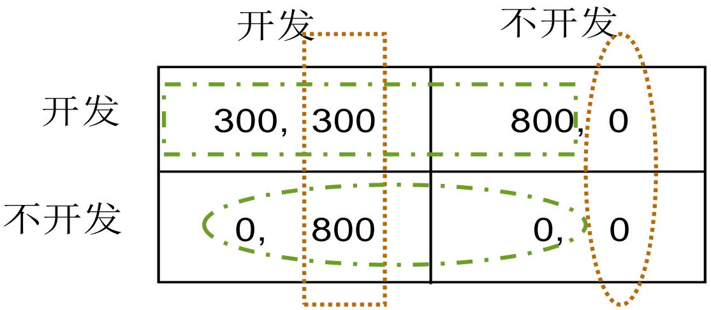
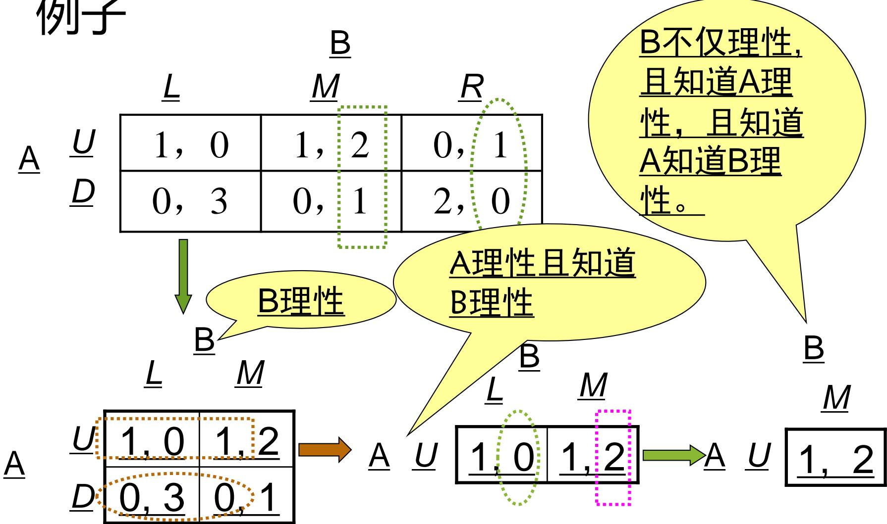
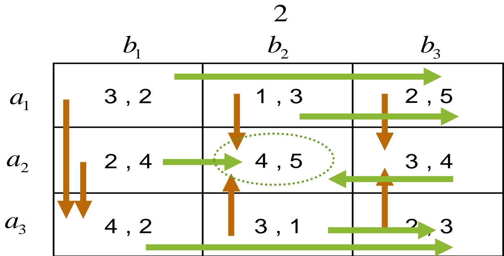

# 第2章 完全信息静态博弈——Nash均衡

> [!abstract] 本章导览
> 第1章给出了博弈的形式化表述（参与人、战略、支付）。本章要回答一个核心问题：**给定一个战略式博弈，理性参与人会怎么博弈？均衡解是什么、怎么求？**
>
> 本章沿"解概念由强到弱"展开四条主线：
> 1. **占优行为**——最强的解：存在占优战略，根本不用看别人。
> 2. **重复剔除劣战略**——退一步：逐轮剔除劣战略，靠"共同知识"的理性逼近解。
> 3. **Nash 均衡（Nash Equilibrium）**——最一般的解概念：相互最优反应、无人愿单独偏离。求解用**划线法 / 箭头法**。
> 4. **混合战略 Nash 均衡**——纯战略均衡不存在时，以概率分布随机化战略，用**等值法 / 支撑求解法**求解。
>
> 解概念强弱关系（包含链）：**占优战略均衡 ⊂ 重复剔除占优均衡 ⊂ Nash 均衡**。

---

## 一、占优行为

### 1.1 引子：囚徒困境（Prisoners' Dilemma）

"囚徒困境"是 Tucker 于 20 世纪 50 年代提出的最经典博弈模型，奠定了非合作博弈论的基础。

> [!example] 囚徒困境的故事
> 两个小偷作案后被分别关押审讯。律师告知：
> - 两人都**坦白** → 各判 4 年；
> - 两人都**抵赖** → 证据不足，各判 1 年；
> - 一人坦白一人抵赖 → 坦白者无罪释放（0），抵赖者重判 6 年。
>
> 支付取刑期的相反数（年数越小越好），得到支付矩阵：

支付矩阵（行=小偷1，列=小偷2，单元格 = 小偷1支付, 小偷2支付）：

| 小偷1 \ 小偷2 | 坦白 | 抵赖 |
| --- | --- | --- |
| **坦白** | −4, −4 | 0, −6 |
| **抵赖** | −6, 0 | −1, −1 |

**逐情形分析小偷1（行）：**
- 当对方**坦白**时：自己坦白得 −4，抵赖得 −6 → 选**坦白**；
- 当对方**抵赖**时：自己坦白得 0，抵赖得 −1 → 还是选**坦白**。

> [!important] 关键观察
> 无论对方怎样选，"坦白"**总是**小偷的最优战略。这种"与对方选择无关、永远最优"的战略，就是下面要定义的**占优战略**。因此博弈结果为 (坦白, 坦白)。

> [!note] 囚徒困境的寓意
> 结果 (抵赖, 抵赖) 对双方都更好（是 (坦白, 坦白) 的 **Pareto 改进**），但只要两人都理性，这个对所有人都有好处的"改进"就无法实现。这正是现实中"**个人理性与集体理性的矛盾**"——寡头价格战、应试教育的"模拟考试军备竞赛"都是其翻版。

### 1.2 占优战略（Dominant Strategy）

考察一般的 $n$ 人博弈：参与人 $i$ 的支付 $u_i = u_i(s_i, s_{-i})$ 既取决于自己的选择 $s_i$，也取决于其他人的选择 $s_{-i}$。通常使支付最大化的最优战略 $s_i^*$ 是**随对手选择而变**的；但有时会出现一种特殊情形——最优战略**与对手无关、恒唯一**。

> [!note] 定义1：占优战略
> 在 $n$ 人博弈中，若对**所有**其他参与人的选择 $s_{-i}$，$s_i^*$ 都是参与人 $i$ 的最优选择，即
> $$\forall s_i \in S_i\ (s_i \neq s_i^*),\ \forall s_{-i} \in \prod_{j\neq i} S_j,\quad u_i(s_i^*, s_{-i}) > u_i(s_i, s_{-i})$$
> 则称 $s_i^*$ 为参与人 $i$ 的**占优战略**。
>
> 注意是**严格大于**（>），故为"严格占优战略"。

**占优行为**：若参与人有占优战略，只要他理性，就一定选它。这是理性参与人选择行为最基本的特征。

### 1.3 占优战略均衡（Dominant-Strategy Equilibrium）

> [!note] 定义2：占优战略均衡
> 在 $n$ 人博弈中，若对所有参与人 $i$ 都存在占优战略 $s_i^*$，则占优战略组合
> $$s^* = (s_1^*, s_2^*, \ldots, s_n^*)$$
> 称为**占优战略均衡**。
>
> 此时该均衡是**唯一**的、所有理性参与人都能预测到的博弈结果。

> [!example] 新产品开发博弈中的占优战略均衡
> 市场需求大时，企业1、企业2都有占优战略"开发"，故均衡为 (开发, 开发)。下图用虚线圈出各自的占优选择：



> [!question] 例2：找出占优战略均衡
>
> | 1 \ 2 | b1 | b2 | b3 | b4 |
> | --- | --- | --- | --- | --- |
> | **a1** | 2, 1 | −2, −6 | 1, 2 | −2, 1 |
> | **a2** | 3, 0 | −1, 2 | 3, 3 | −1, −2 |
>
> 参与人1：逐列比较 a2 与 a1（3>2、−1>−2、3>1、−1>−2），**a2 严格占优于 a1**，故参与人1选 a2。给定参与人1选 a2，参与人2比较各列：3 最大（b3 列），故参与人2选 b3。**占优战略均衡 = (a2, b3)，支付 (3, 3)。**

---

## 二、重复剔除劣战略行为

许多博弈里参与人**没有**占优战略，无法直接用占优行为求解。但可以反向思考——剔除那些"永远更差"的**劣战略**。

在囚徒困境中，"抵赖"相对于"坦白"在任何情况下惩罚都更大，理性小偷绝不会选它，相当于把"抵赖"从自己的战略集中**剔除**。把这一思想推广并反复使用，就是**重复剔除劣战略**。

### 2.1 劣战略与弱劣战略

> [!note] 定义3：（严格）劣战略
> 对参与人 $i$，若存在 $s_i', s_i'' \in S_i$，使得对**所有** $s_{-i}$：
> $$u_i(s_i'', s_{-i}) > u_i(s_i', s_{-i})$$
> 则称 $s_i'$ 为参与人 $i$ 的**劣战略**，称 $s_i''$ 相对于 $s_i'$ **占优**。

理性参与人绝不会选劣战略 $s_i'$，相当于从战略集中删去它：令 $S_i' = S_i \setminus \{s_i'\}$，构造缩小后的新博弈 $G'$，对 $G$ 的求解就转化为对 $G'$ 的求解。这一替换称为**剔除劣战略行为**。

> [!note] 定义4：弱劣战略
> 对参与人 $i$，若存在 $s_i', s_i'' \in S_i$，使得对所有 $s_{-i}$：
> $$u_i(s_i'', s_{-i}) \geq u_i(s_i', s_{-i})$$
> 且**至少存在某个** $s_{-i}'$ 使得 $u_i(s_i'', s_{-i}') > u_i(s_i', s_{-i}')$，
> 则称 $s_i'$ 为参与人 $i$ 的**弱劣战略**，$s_i''$ 相对于 $s_i'$ **弱占优**。

> [!warning] 严格 vs 弱：差在哪
> - **严格劣**：$s_i''$ 在**每一种**情形下都**严格更优**（>）。
> - **弱劣**：$s_i''$ 在每种情形下**不更差**（≥），且**至少一种**情形严格更优（>）。
>
> 弱劣战略剔除"有风险"——见 2.3 的剔除顺序问题。

### 2.2 重复剔除的占优均衡

> [!note] 定义：重复剔除的占优均衡
> 若重复剔除劣战略的过程一直进行到**只剩唯一**的战略组合，则该组合即为**重复剔除的占优均衡**，此时称该博弈是**重复剔除战略可解的（dominance solvable）**。

> [!example] 重复剔除过程图示（共同知识的层层推理）
> 下图是一个 2×3 博弈的逐步剔除：先由"A 理性"剔除 A 的劣战略行，再由"B 知道 A 理性"剔除 B 的某列，逐层缩小到唯一解 (1.0, 1.2)。注释"B 不仅理性，且知道 A 理性，且知道 A 知道 B 理性"点出了**理性是共同知识**这一前提。



**自绘：重复剔除的逐步消去过程**（以下面这个博弈为例）

原始博弈（行 A，列 B）：

```
            C1        C2        C3
   R1     2,12      1,10      1,12
   R2     0,12      0,10      0,11
   R3     0,12      0,10      0,13
```

逐步剔除：

| 步骤 | 操作 | 理由 | 剩余矩阵 |
| --- | --- | --- | --- |
| ① | 剔除 A 的 R2、R3 | 对 A：R1 的支付(2,1,1) 弱占优于 R2(0,0,0)、R3(0,0,0) | 只剩 R1 行 |
| ② | 剔除 B 的 C2 | 给定 A 选 R1，B 比较 12,10,12 → C2 的 10 最小，被 C1/C3 占优 | R1 行剩 C1、C3 |
| ③ | 比较 C1 与 C3 | 给定 R1，B 得 12 与 12 相等 → 二者无差异 | 结果落在 {(R1,C1),(R1,C3)} |

> [!warning] 2.3 剔除顺序问题（极易出错）
> **均衡结果是否依赖剔除顺序？**
> - 若每次剔除的是**严格劣战略** → 结果**与顺序无关**（安全）。
> - 若剔除的是**弱劣战略** → 结果**可能与顺序有关**，甚至会误删掉某些 Nash 均衡（危险）。
>
> 因此实务中**优先剔除严格劣战略**。

> [!important] 对"理性"的要求
> 重复剔除占优均衡要求"**理性**"是**共同知识（common knowledge）**：我理性、我知道你理性、你知道我知道你理性……战略空间越大、需要剔除的步骤越多，对这条共同知识链的要求就越严格。

---

## 三、Nash 均衡（Nash Equilibrium）

很多博弈既无占优战略均衡、也不能靠重复剔除求解（如低需求下的新产品开发博弈）。为给**更一般**的博弈定义解，引入 **Nash 均衡**。

### 3.1 定义

> [!note] 定义5：Nash 均衡
> 在战略式博弈 $G = \langle \Gamma; S_1, \ldots, S_n; u_1, \ldots, u_n \rangle$ 中，战略组合 $s^* = (s_1^*, \ldots, s_n^*)$ 是一个 **Nash 均衡**，当且仅当对所有参与人 $i$ 和所有 $s_i \in S_i$：
> $$u_i(s_i^*, s_{-i}^*) \geq u_i(s_i, s_{-i}^*)$$
> 等价地，每个人的均衡战略都是给定对手均衡战略下的**最优反应**：
> $$s_i^* \in \arg\max_{s_i \in S_i} u_i(s_i, s_{-i}^*)$$

> [!important] Nash 均衡的直观
> 一个战略组合是 Nash 均衡 ⟺ **给定其他人不变，没有任何一个人能靠单方面偏离而获益**（无人有偏离动机，自我维持）。这是博弈论里**最核心**的解概念，由 John Nash（1994 年诺贝尔经济学奖）于 20 世纪 50 年代提出。一个战略组合若不是 Nash 均衡，就不能成为博弈的解。

### 3.2 解概念之间的关系

> [!warning] 三个解概念的包含链
> $$\text{占优战略均衡} \subseteq \text{重复剔除占优均衡} \subseteq \text{Nash 均衡}$$
> - 占优战略均衡一定是重复剔除占优均衡，也一定是 Nash 均衡；
> - **Nash 均衡一定是重复剔除严格劣战略后未被剔除的战略组合**；
> - 但反过来**不成立**——未被剔除的组合不一定是 Nash 均衡，**除非它是唯一**剩下的。
> - Nash 均衡可有强弱之分（弱 Nash 均衡允许偏离时支付"相等"）。
>
> Nash 均衡的本质是参与人对"将如何博弈"的一种**一致性预测**。

### 3.3 求解方法一：划线法

> [!tip] 划线法原理
> 利用 Nash 均衡的性质：**在两人博弈中，相互构成最优反应的战略组合即 Nash 均衡。**
>
> **操作步骤：**
> 1. **对参与人1（行玩家）**：固定对手的**每一列**，在该列里找参与人1支付（单元格左数）最大的行，在其下划线；
> 2. **对参与人2（列玩家）**：固定对手的**每一行**，在该行里找参与人2支付（单元格右数）最大的列，在其下划线；
> 3. **左右支付都被划线**的单元格即 Nash 均衡（双方互为最优反应）。

> [!example] 划线法实例
> 求下列博弈的 Nash 均衡：
>
> | 1 \ 2 | b1 | b2 | b3 |
> | --- | --- | --- | --- |
> | **a1** | 3, 2 | 1, 3 | 2, 5 |
> | **a2** | 2, 4 | 4, 5 | 3, 4 |
> | **a3** | 4, 2 | 3, 1 | 2, 3 |

**自绘：划线法标注最优反应的过程**

第一步——玩家1（看左数，逐列取最大行，用 `_` 标该格左支付）：
```
           b1        b2        b3
  a1      3,2       1,3      [2],5
  a2      2,4      [4],5     [3],4
  a3     [4],2      3,1       2,3
列内左数最大: b1列→a3(4)  b2列→a2(4)  b3列→a2(3)
```
第二步——玩家2（看右数，逐行取最大列，用 `()` 标该格右支付）：
```
           b1        b2        b3
  a1      3,2       1,3      2,(5)    ← a1行右数最大: b3(5)
  a2      2,(4)     4,(5)    3,4      ← a2行右数最大: b2(5) [注:b1的4与b2的5,取5]
  a3      4,(2)     3,1      2,3      ← a3行右数最大: b1(2)
```
第三步——找**两者都被标注**的格：
```
           b1        b2        b3
  a1                          2,5
  a2               [4,5]*               ← (a2,b2): 左4最大 且 右5最大 → Nash均衡
  a3      4,2
```
**Nash 均衡 = (a2, b2)，支付 (4, 5)。**（其中 a2 是 b2 列玩家1的最优反应，b2 是 a2 行玩家2的最优反应，相互最优。）

### 3.4 求解方法二：箭头法

> [!tip] 箭头法原理
> 利用 Nash 均衡的性质：**一个战略组合只有在两个参与人都不愿偏离时才是 Nash 均衡。**
>
> **操作：** 从每个单元格出发，对每个参与人画一个"偏离改善"的箭头——若该玩家单方面换战略能提高自己支付，就从当前格画箭头指向更优格。**没有任何箭头射出（只进不出）的单元格**即 Nash 均衡。

> [!example] 箭头法实例
> 下图用箭头标出各格中两个玩家的"获益偏离"方向，箭头汇聚而无外射的格即 Nash 均衡：



> [!note] 两法对照
> 划线法与箭头法是同一思想（最优反应 / 无偏离动机）的两种可视化：划线法**标最优反应**、箭头法**标偏离动机**，结论一致。两人小矩阵用划线法最快。

---

## 四、混合战略 Nash 均衡

### 4.1 为什么需要混合战略

> [!example] 猜硬币博弈（零和、无纯战略均衡）
> 两人各握一枚硬币同时亮出正(O)/反(R)，战略空间 {O, R}。两枚一致 → 参与人2 赢；不一致 → 参与人1 赢。
>
> | 1 \ 2 | O | R |
> | --- | --- | --- |
> | **O** | −1, 1 | 1, −1 |
> | **R** | 1, −1 | −1, 1 |
>
> 用划线法可验证：**不存在纯战略 Nash 均衡**。特征是"每人都想猜透对方、又都不愿被对方猜透"——一旦战略可预测就会被针对。

直觉上双方会"各以 50% 概率随机出正反"。这种**以概率分布选择战略**的做法就是**混合战略（mixed strategy）**；与之相对，只选定一种确定战略的是**纯战略（pure strategy）**。

### 4.2 混合战略的形式化

> [!note] 定义1：混合战略
> 设参与人 $i$ 的纯战略集 $S_i = \{s_i^1, \ldots, s_i^K\}$，则其一个**混合战略**是 $S_i$ 上的一个概率分布：
> $$\sigma_i = (\sigma_i^1, \ldots, \sigma_i^K),\qquad 0 \leq \sigma_i^j \leq 1,\quad \sum_{j=1}^K \sigma_i^j = 1$$
> 其中 $\sigma_i^j$ 是选纯战略 $s_i^j$ 的概率。
>
> **纯战略是混合战略的特例**：纯战略 $s_i^1 \Leftrightarrow \sigma_i = (1, 0, \ldots, 0)$。

**记号约定**：$\Sigma_i$ 是 $i$ 的混合战略空间，$\sigma = (\sigma_1, \ldots, \sigma_n)$ 是混合战略组合，$\Sigma = \prod_i \Sigma_i$ 是组合空间（$\sigma \in \Sigma$）。

### 4.3 混合战略下的期望支付

纯战略下支付 $u_i(s)$ 是确定值；混合战略下支付**不确定**，参与人关心**期望收益**：

$$v_i(\sigma) = v_i(\sigma_i, \sigma_{-i}) = \sum_{s \in S}\Big(\prod_{j=1}^n \sigma_j(s_j)\Big)\cdot u_i(s)$$

其中 $\prod_{j=1}^n \sigma_j(s_j)$ 是纯战略组合 $s=(s_1,\ldots,s_n)$ 出现的概率。

> [!example] 两人两战略的期望支付（最常用模板）
> 参与人1 混合战略 $\sigma_1=(p, 1-p)$，参与人2 混合战略 $\sigma_2=(q, 1-q)$。
> 一般支付矩阵：
>
> | 1 \ 2 | b1 (概率 q) | b2 (概率 1−q) |
> | --- | --- | --- |
> | **a1 (概率 p)** | x₁, y₁ | x₂, y₂ |
> | **a2 (概率 1−p)** | x₃, y₃ | x₄, y₄ |
>
> 四个组合 $(a_1,b_1),(a_1,b_2),(a_2,b_1),(a_2,b_2)$ 出现概率分别为 $pq,\ p(1-q),\ (1-p)q,\ (1-p)(1-q)$。
>
> 参与人1的期望效用：
> $$v_1(\sigma) = pqx_1 + p(1-q)x_2 + (1-p)qx_3 + (1-p)(1-q)x_4$$
> 参与人2的期望效用：
> $$v_2(\sigma) = pqy_1 + (1-p)qy_3 + p(1-q)y_2 + (1-p)(1-q)y_4$$

### 4.4 混合战略 Nash 均衡的定义

> [!note] 定义2：混合战略 Nash 均衡
> 混合战略组合 $\sigma^* = (\sigma_1^*, \ldots, \sigma_n^*)$ 是 Nash 均衡，当且仅当对所有 $i$ 与所有 $\sigma_i \in \Sigma_i$：
> $$v_i(\sigma_i^*, \sigma_{-i}^*) \geq v_i(\sigma_i, \sigma_{-i}^*)$$
> 即给定对手的均衡混合战略，没人能靠改变自己的概率分布提高期望收益。

> [!example] 猜硬币的混合战略均衡
> 双方都取 $\sigma_i=(0.5, 0.5)$ 时期望收益都为 0。只要参与人1 保持 (0.5, 0.5)，**无论参与人2 怎么改**，参与人2 的期望收益恒为 0、不会增大——偏离没有好处；反之亦然。故 $\sigma^*=((0.5,0.5),(0.5,0.5))$ 是混合战略 Nash 均衡。

> [!warning] 重要提醒
> - **允许混合战略后，某些原本不是劣战略的纯战略可能变成（被混合战略占优的）劣战略**。
> - 没有纯战略均衡的博弈，往往**存在混合战略均衡**（如猜硬币、下面的 2×2 例）。

### 4.5 最优反应引理（混合战略均衡的特征）

> [!note] 命题1：均衡中各纯战略无差异
> 在参与人 $i$ 的最优混合战略 $\sigma_i^*$ 中，对**任何以正概率出现**的纯战略（$\sigma_i^{j*}>0$）：
> $$v_i(s_i^j, \sigma_{-i}) = v_i(\sigma_i^*, \sigma_{-i})$$
> 即**所有以正概率进入最优混合战略的纯战略，给定对手战略时期望效用全部相等**（对该参与人**无差异**）：
> $$v_i(s_i^1, \sigma_{-i}) = v_i(s_i^2, \sigma_{-i}) = \cdots = v_i(s_i^{K_i}, \sigma_{-i})$$

> [!note] 支集（support）
> 混合战略 $\sigma_i$ 中所有**概率大于 0** 的分量对应的纯战略集合，称为 $\sigma_i$ 的**支集**：
> $$S_i(\sigma_i) = \{s_i \in S_i \mid \sigma_i(s_i) > 0\}$$

> [!important] 定理1：最优反应引理
> 混合战略组合 $\sigma^*$ 是 Nash 均衡 ⟺ 对每个参与人 $i$，其支集 $S_i(\sigma_i^*)$ 中的**每一个纯战略都是给定 $\sigma_{-i}^*$ 下的最优反应**。
>
> 这条引理是下面"等值法""支撑求解法"的理论根基：均衡里被随机化的那些纯战略一定带来**相同**的期望收益（否则就会把概率全压到收益更高的那个上）。

### 4.6 求解方法一：等值法（两人两战略）

> [!tip] 等值法思路
> 由命题1，均衡处对手让你在各支集纯战略间**无差异**。于是令：
> $$\begin{cases} v_1(a_1, \sigma_2) = v_1(a_2, \sigma_2)\\ v_2(b_1, \sigma_1) = v_2(b_2, \sigma_1)\end{cases}$$
> **直觉巧法：每个人选的概率，是为了让对手的两个纯战略收益相等**——即"自己的混合比例由对手的支付决定"。

代入 4.3 的一般支付，解得通式：
$$p = \frac{y_3 - y_4}{y_2 - y_1 + y_3 - y_4},\qquad q = \frac{x_2 - x_4}{x_3 - x_1 + x_2 - x_4}$$
（要求分母 $y_2-y_1+y_3-y_4 \neq 0$ 且 $x_3-x_1+x_2-x_4 \neq 0$。）

> [!example] 算例 A：无纯战略均衡时
> 矩阵（行 U/D，列 L/R）：
>
> | 1 \ 2 | L (q) | R (1−q) |
> | --- | --- | --- |
> | **U (p)** | 0, 4 | 2, 1 |
> | **D (1−p)** | 4, 1 | 1, 2 |
>
> 划线法可知无纯战略均衡。令两人的对手收益相等：
> $$\begin{cases} 2(1-q) = 4q + (1-q) \\ 4p + (1-p) = p + 2(1-p)\end{cases}\ \Rightarrow\ p=\tfrac14,\ q=\tfrac15$$
> 混合战略 Nash 均衡：$\sigma_1=(\tfrac14,\tfrac34),\ \sigma_2=(\tfrac15,\tfrac45)$。

> [!example] 算例 B：纯+混合均衡并存
> 矩阵（行 U/D，列 L/R）：
>
> | 1 \ 2 | L (q) | R (1−q) |
> | --- | --- | --- |
> | **U (p)** | 2, 1 | 0, −1 |
> | **D (1−p)** | −1, 0 | 1, 2 |
>
> 划线法给出两个**纯战略**均衡 (U, L)、(D, R)。再用等值法找混合均衡：
> $$\begin{cases} 2q = -q + (1-q)\\ p = -p + 2(1-p)\end{cases}\ \Rightarrow\ p=\tfrac12,\ q=\tfrac14$$
> 这类"两纯一混"是协调博弈的典型结构（共 3 个 Nash 均衡）。

### 4.7 求解方法二：支撑求解法（一般 $n$ 人）

> [!note] 支撑求解法的基本思路
> 当不能事前确定均衡支集时，对**所有可能的支撑**逐一尝试：
> 1. 枚举所有可能的支撑（各参与人取哪些纯战略以正概率出现）；
> 2. 对每个支撑，列出方程组：
>    - **(1) 无差异方程**：由最优反应引理，支集内每个纯战略对对手战略的期望收益都等于均衡期望效用 $v_i$；
>    - **(2) 规范性方程**：每人的概率之和为 1。
> 3. 解方程组并**检验**（见下方三类陷阱）。

> [!warning] 求解中可能出现的三类问题（必检验）
> 1. **方程组无解** → 所构造的支撑有问题，换一个支撑。
> 2. **解不满足非负性** → 出现概率 < 0，该支撑不合法。
> 3. **解存在且非负，但与 Nash 均衡矛盾** → 存在某个**支集外**纯战略的期望收益**大于**支集内的均衡收益（说明该玩家会偏离过去），此支撑不是均衡。

> [!example] 完整算例：2×4 博弈枚举所有支撑
> 行玩家 {U, L}（注：此例两行记作 U、L），列玩家 {A, B, C, D}，无纯战略均衡：
>
> | 1 \ 2 | A | B | C | D |
> | --- | --- | --- | --- | --- |
> | **U** | 0, 2 | 6, 1 | 2, 3 | 4, 6 |
> | **L** | 4, 3 | 2, 6 | 1, 2 | 6, 1 |
>
> 可能的支撑：一个 2×4、四个 2×3、六个 2×2，共 11 个，逐一检验：

| 候选支撑 | 求解结果 | 判定 |
| --- | --- | --- |
| {U,L}×{A,B,C,D} | 方程互相矛盾 | 无解，排除 |
| {U,L}×任一 2×3 | 方程互相矛盾 | 无解，排除 |
| {U,L}×{A,B} | $\sigma_2^A=\sigma_2^B=\tfrac12,\sigma_1^U=\tfrac34$；但 $v_2(\sigma_1,C),v_2(\sigma_1,D)>v_2$ | 支集外 C、D 更优 → 排除 |
| {U,L}×{A,C} | $\sigma_2^A=\tfrac15,\sigma_2^C=\tfrac45,\sigma_1^U=\sigma_1^L=\tfrac12$；但 B、D 更优 | 排除 |
| {U,L}×{A,D} | $\sigma_2^A=-1$ | 违反非负性 → 排除 |
| {U,L}×{B,C} | 同上类型 | 排除 |
| {U,L}×{C,D} | 同 {A,C} 类型 | 排除 |
| **{U,L}×{B,D}** | $\sigma_1^U=\sigma_1^L=\tfrac12,\ \sigma_2^B=\tfrac13,\sigma_2^D=\tfrac23$；A、C 收益 $<v_2$，无偏离 | **✅ 唯一均衡** |

> [!summary] 该例的混合战略 Nash 均衡
> $$\sigma^* = \Big(\big(\tfrac12, \tfrac12\big),\ \big(0, \tfrac13, 0, \tfrac23\big)\Big)$$
> 即参与人1 在 U、L 各 1/2；参与人2 只在 B、D 上以 1/3、2/3 随机（A、C 概率为 0）。

> [!warning] 支撑求解法的局限：计算复杂性
> 目前尚无简捷判断均衡支撑的通法。随着参与人数、战略空间增大，需枚举的支撑数**爆炸式增长**，运算量极大——即便常见的两人有限博弈也如此。这是支撑求解法固有的**计算复杂性问题**。

---

## 本章小结

> [!summary] 核心脉络回顾
>
> | 解概念 | 核心思想 | 求解方法 | 适用 / 强弱 |
> | --- | --- | --- | --- |
> | **占优战略均衡** | 存在与对手无关的恒优战略 | 找占优战略 | 最强，最罕见 |
> | **重复剔除占优均衡** | 逐轮剔除（弱）劣战略 | 重复剔除（需理性为共同知识） | 居中 |
> | **（纯战略）Nash 均衡** | 相互最优反应、无人愿偏离 | 划线法 / 箭头法 | 最一般 |
> | **混合战略 Nash 均衡** | 以概率随机化、对手让你无差异 | 等值法 / 支撑求解法 | 纯均衡不存在时仍可保证存在 |
>
> **包含链**：占优战略均衡 ⊆ 重复剔除占优均衡 ⊆ Nash 均衡。
>
> **三条最易考的要点**：
> 1. Nash 均衡 = 每人都是对手战略的最优反应（无单方面获益的偏离）。
> 2. 划线法：左数标行最优、右数标列最优，双标格即均衡。
> 3. 混合均衡的"无差异"原理：以正概率出现的纯战略期望收益必须相等。

## 自测题

> [!question] 检验你的掌握
> 1. 写出占优战略与（严格）劣战略的定义，并说明二者在逻辑上的关系（"我的占优"是否等价于"剔除别的劣战略"）？
> 2. 用划线法求下列博弈的全部纯战略 Nash 均衡：
>
>    | 1 \ 2 | b1 | b2 | b3 |
>    | --- | --- | --- | --- |
>    | a1 | 3, 2 | 1, 3 | 2, 5 |
>    | a2 | 2, 4 | 4, 5 | 3, 4 |
>    | a3 | 4, 2 | 3, 1 | 2, 3 |
> 3. 为什么"重复剔除**弱**劣战略"的结果可能依赖剔除顺序，而剔除**严格**劣战略则不会？
> 4. 用等值法求猜硬币博弈（支付见 4.1）的混合战略 Nash 均衡，并说明为何双方都取 (0.5, 0.5)。
> 5. 陈述最优反应引理。给定混合战略均衡里某纯战略以正概率出现，它必须满足什么条件？
> 6. 支撑求解法中，一个候选支撑会因哪三类原因被排除？各举一例。
> 7.（综合）说明"占优战略均衡 ⊆ 重复剔除占优均衡 ⊆ Nash 均衡"为什么成立，并各举一个反向不成立的例子。

## 相关章节

- 上一章：[[第1章_博弈论简介及战略式博弈_笔记]]（博弈三要素、战略式博弈的形式化、囚徒困境与猜数游戏）
- 下一章：[[第3章_完全信息静态博弈——Nash均衡解的特性_笔记]]（Nash 均衡的存在性、多重性与精炼）
- 应用：[[第4章_完全信息静态博弈——Nash均衡的应用_笔记]]（古诺、伯特兰寡头与混合战略的经济学应用）
