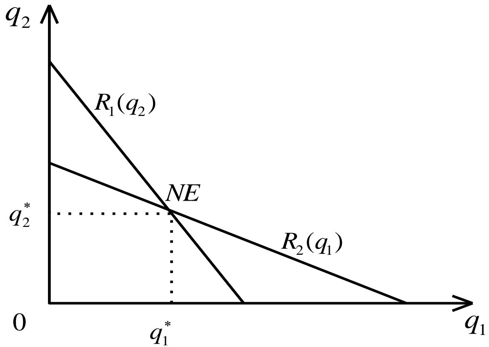
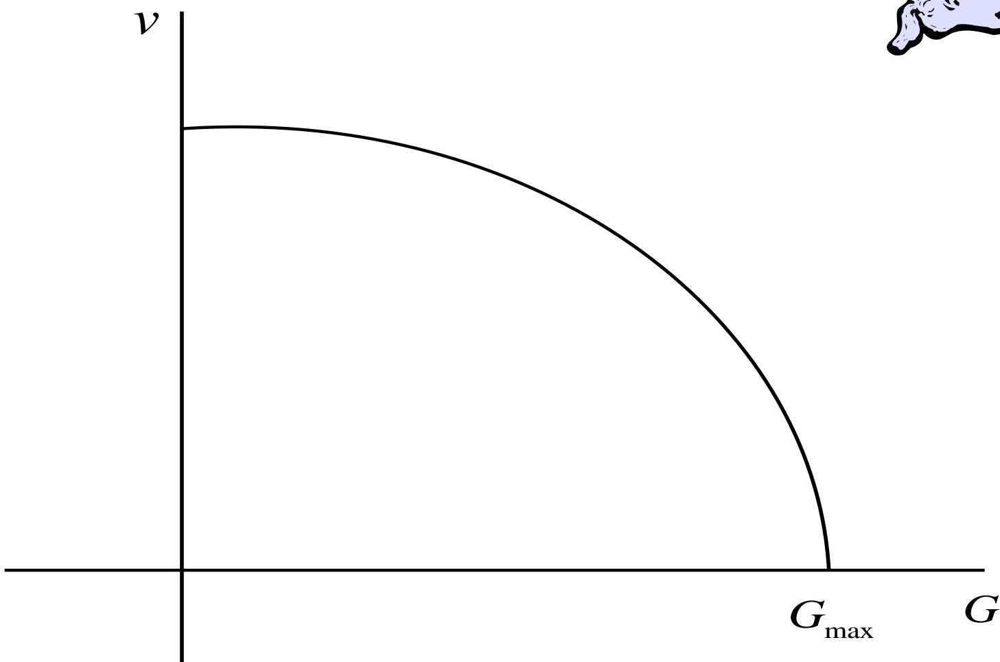
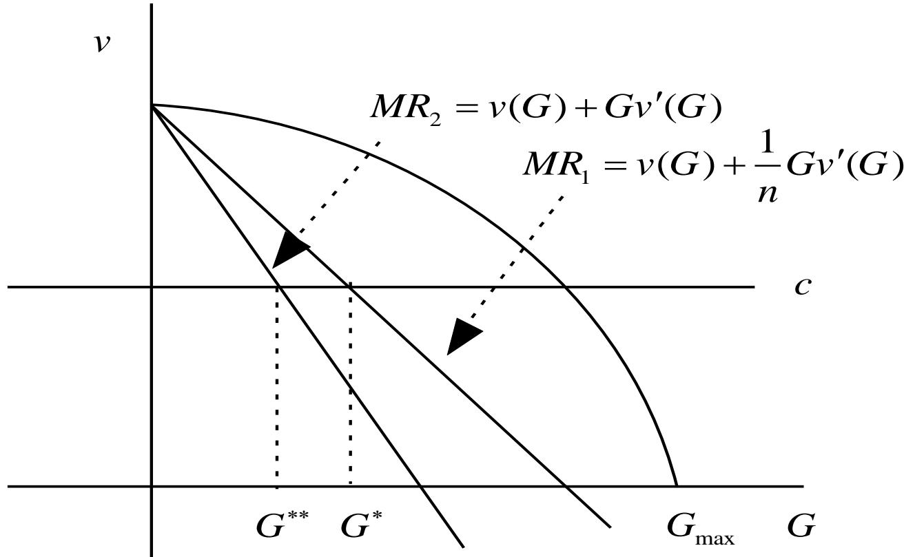

# 第4章 完全信息静态博弈——Nash均衡的应用

> [!abstract] 本章定位
> 前三章解决了「Nash 均衡（Nash Equilibrium）是什么、怎么求、有什么特性」的问题。本章把 Nash 均衡这一解概念**用到经典经济与社会问题**上，看它如何刻画现实中的策略互动。五个应用层层递进：
> - **产量竞争**：古诺（Cournot）寡头模型——决策变量是产量；
> - **价格竞争**：伯特兰（Bertrand）寡头模型——决策变量是价格，引出「伯特兰悖论」；
> - **差异化竞争**：霍特林（Hotelling）模型——用空间位置差异破解伯特兰悖论；
> - **公共资源**：哈丁（Hardin）公共财产问题——「公地悲剧」的博弈解释；
> - **混合战略**：用「等值法」求解纯战略均衡不存在的博弈（小偷-守卫、税收监督）。
>
> 理论基础见 [[第2章_完全信息静态博弈——Nash均衡_笔记]]，承接 [[第3章_完全信息静态博弈——Nash均衡解的特性_笔记]]。

---

## 一、古诺（Cournot）寡头竞争模型

> [!note] 历史地位
> 古诺模型由 **Antoine Augustin Cournot（1838 年）** 在研究产业经济学时提出，可以说是**最早蕴含 Nash 均衡思想的模型，比 Nash 均衡的正式定义早了 100 多年**。它研究寡头垄断市场中，企业追求利润最大化时的产量决策。

### 1.1 基本假设

1. **产品同质无差异**：消费者只看价格，谁便宜买谁；
2. **产量竞争**：企业的决策变量是**产量**；
3. **静态博弈**：企业同时行动。

### 1.2 模型与利润函数

用 $q_i\in[0,\infty)$ 表示企业 $i\,(i=1,2)$ 的产量，$c_i(q_i)$ 为成本，$P=P(q_1+q_2)$ 为（逆）需求函数（价格是总产量的函数）。则企业 $i$ 的利润为：

$$\pi_i(q_1,q_2)=q_i\cdot P(q_1+q_2)-c_i(q_i)$$

追求利润最大化的企业 $i$ 面临的决策问题是：在给定对手最优产量 $q_j^*$ 下选 $q_i$ 使利润最大。若 $(q_1^*,q_2^*)$ 同时满足：

$$\left\{\begin{array}{l} q_1^*\in\arg\max_{q_1}\pi_1(q_1,q_2^*)\\ q_2^*\in\arg\max_{q_2}\pi_2(q_1^*,q_2)\end{array}\right.$$

则由 Nash 均衡定义，该产量组合 $(q_1^*,q_2^*)$ 即为本博弈的 **Nash 均衡**。

### 1.3 反应函数与均衡求解

由 $\pi_i$ 可微，最优化一阶条件为：

$$\left\{\begin{array}{l} \dfrac{\partial\pi_1}{\partial q_1}=P(q_1+q_2)+q_1P'(q_1+q_2)-c_1'(q_1)=0\\[2mm] \dfrac{\partial\pi_2}{\partial q_2}=P(q_1+q_2)+q_2P'(q_1+q_2)-c_2'(q_2)=0\end{array}\right.$$

由一阶条件解出每个企业的最优产量对对手产量的依赖关系，即**反应函数（reaction function）**：

$$q_1=R_1(q_2),\qquad q_2=R_2(q_1)$$

> [!important] 反应函数的几何含义
> 反应函数表示「给定对手产量，本企业的最优产量」。**两条反应函数的交点就是 Nash 均衡点**——它同时满足双方各自的最优反应。



### 1.4 线性需求的具体解

考虑简单情形：单位成本不变 $c_i(q_i)=cq_i$，线性需求 $P=a-(q_1+q_2)$。此时利润为：

$$\pi_i(q_i,q_j)=q_i\,(a-q_i-q_j-c)$$

一阶条件：

$$\left\{\begin{array}{l} a-(q_1+q_2)-q_1-c=0\\ a-(q_1+q_2)-q_2-c=0\end{array}\right.$$

得线性反应函数：

$$\left\{\begin{array}{l} q_1=R_1(q_2)=\tfrac12(a-q_2-c)\\[1mm] q_2=R_2(q_1)=\tfrac12(a-q_1-c)\end{array}\right.$$

> [!example] 联立求解（代数竖式）
> 把两式联立。由对称性设 $q_1^*=q_2^*=q$：
> ```
>   q = ½(a − q − c)
>  2q = a − q − c
>  3q = a − c
>   q = ⅓(a − c)
> ```
> 故 **Nash 均衡产量**：
> $$q_1^*=q_2^*=\tfrac13(a-c)$$
> 代回利润，**Nash 均衡利润**：
> $$\pi_1^*=\pi_2^*=\tfrac19(a-c)^2$$
> 两条反应函数都是直线，其交点即上图的 NE。

### 1.5 寡头 vs. 联合垄断：负外部性

若两企业**联合垄断**市场（视为单一决策者），决策问题为 $\max_Q\;\Pi=Q(a-Q-c)$，解得：

$$Q^*=\tfrac12(a-c),\qquad \Pi(Q^*)=\tfrac14(a-c)^2$$

> [!warning] 关键对比
> - 垄断总产量 $Q^*=\tfrac12(a-c)$ **小于**寡头总产量 $q_1^*+q_2^*=\tfrac23(a-c)$；
> - 垄断利润 $\Pi(Q^*)=\tfrac14(a-c)^2$ **大于**寡头总利润 $\pi_1^*+\pi_2^*=\tfrac29(a-c)^2$。
>
> **根源**：每个企业选最优产量时只考虑自己的利润，**忽略了自己增产对对手利润的负外部效应**——结果双方都过度生产，整体利润受损。

### 1.6 合作能维持吗？——退化为囚徒困境

既然垄断更赚钱，两寡头能否约定「合作」均分垄断利润？设每家两种选择：「合作」生产垄断产量一半 $\tfrac14(a-c)$，「不合作」生产 Nash 产量 $\tfrac13(a-c)$。支付矩阵（行=企业2，列=企业1，单元格=企业2利润, 企业1利润）：

| 企业2 \ 企业1 | 合作 | 不合作 |
|---|---|---|
| **合作** | $\dfrac{(a-c)^2}{8},\ \dfrac{(a-c)^2}{8}$ | $\dfrac{5(a-c)^2}{48},\ \dfrac{5(a-c)^2}{36}$ |
| **不合作** | $\dfrac{5(a-c)^2}{36},\ \dfrac{5(a-c)^2}{48}$ | $\dfrac{(a-c)^2}{9},\ \dfrac{(a-c)^2}{9}$ |

> [!important] 结论：合作不可自我维持
> 「不合作」是双方的**占优战略**，唯一 Nash 均衡是 **（不合作, 不合作）**——这正是典型的**囚徒困境**。两寡头明知合作（垄断）更优，却谁也不肯合作。

**约定为何破裂（背叛激励的代数验证）**：设两家约定各生产垄断产量一半 $\tfrac14(a-c)$，但企业2偷偷多产 $\Delta q$：

$$\pi_2=\tfrac18(a-c)^2+\tfrac14(a-c)\Delta q-(\Delta q)^2$$

只要 $0<\Delta q<\tfrac14(a-c)$，企业2利润就**超过**垄断利润 $\tfrac18(a-c)^2$——存在背叛激励，故无约束力的约定无法遵守。

**Nash 均衡产量却能自动遵守**：若约定各生产 Nash 产量 $\tfrac13(a-c)$，企业2偏离 $\Delta q$ 后：

$$\pi_2=\tfrac19(a-c)^2-(\Delta q)^2$$

只要 $\Delta q\neq0$，利润必**小于**均衡利润——任何偏离都受损，故**即使约定没有约束力，企业也会自动遵守 Nash 均衡产量**。这正体现了 Nash 均衡的**自我实施（self-enforcing）**特性。

---

## 二、伯特兰（Bertrand）寡头竞争模型

> [!note] 与古诺的核心区别
> 寡头企业关心的往往是**自己产品的价格**而非产量，即进行的是**价格竞争**。伯特兰模型把决策变量从产量换成**价格**，其余假设（产品同质、企业同时选择）与古诺相同。

用 $p_i\in[0,\infty)$ 表示企业 $i$ 的价格，单位成本同为 $c$，市场需求 $D(p_i,p_j)$。由于产品同质，**消费者全去价格低的一家**，故利润函数为：

$$\pi_i=\left\{\begin{array}{ll}(p_i-c)\cdot D(p_i,p_j) & p_i<p_j\\[1mm](p_i-c)\cdot\dfrac{D(p_i,p_j)}{2} & p_i=p_j\\[1mm]0 & p_i>p_j\end{array}\right.$$

> [!warning] 伯特兰悖论（Bertrand Paradox）
> 唯一 Nash 均衡是 $p_1^*=p_2^*=c$，即**两家定价都等于边际成本，利润都为 0**。
>
> 直觉：只要对手定价 $p_j>c$，我就略微降价 $p_i=p_j-\varepsilon$ 抢走全部市场——这种相互削价一直持续到价格压到边际成本为止。
>
> **悖论之处**：即使市场上只有两家企业（理应是有利润的寡头/不完全市场），却得到了与**完全竞争市场一样**的零利润结论。这便是著名的「伯特兰悖论」。

> [!question] 悖论的破解方向
> 悖论根源在于「产品同质无差异」这一假设与现实不符——现实中很难找到不同企业生产且完全相同的产品。**解决办法：在模型中引入产品差异性**，这正是下一节霍特林模型要做的事。

---

## 三、霍特林（Hotelling）寡头竞争模型

> [!note] 思路
> 要引入产品差异，先得**描述**差异。现实差异形式多样（包装、颜色、性能……），霍特林的巧思是**用空间位置差异**来刻画：产品本身仍同质，但因消费者到不同位置的**运输成本不同**，产品不再是完全替代品。

### 3.1 基本假设与设定

1. 价格竞争（决策变量为价格）；
2. 静态博弈（同时行动）；
3. 产品在**空间位置上存在差异**。

设两企业 1、2 分处长度为 1 的**线性城市**两端，以单位成本 $c$ 生产同质产品。消费者在 $[0,1]$ 区间上**均匀分布**，单位运输成本为 $t$，需求相同。企业战略为选价格 $p_i$。

> [!example] 线性城市结构（自绘示意）
> ```
>  企业1                                              企业2
>  p1                  无差异点 x                       p2
>  ●━━━━━━━━━━━━━━━━━━━━━┊━━━━━━━━━━━━━━━━━━━━━━━━━━━━●
>  0        ← 在企业1购买 ┊ 在企业2购买 →               1
>                        ┊
>      消费者沿 [0,1] 均匀分布，单位运输成本 t
> ```
> 位于 $x$ 处的消费者对两家无差异：到企业1的总成本 $p_1+tx$ 等于到企业2的总成本 $p_2+t(1-x)$。$x$ 左侧的人都去企业1，右侧都去企业2。

### 3.2 需求的推导：无差异消费者

理性消费者会到「价格 + 运输成本」之和较小的企业购买。设 $x$ 处消费者对两企业**无差异**（两边总成本相等）：

$$p_1+tx=p_2+t(1-x)$$

则企业1的需求为左侧消费者 $D_1=x$，企业2的需求为右侧消费者 $D_2=1-x$。联立解出：

$$\left\{\begin{array}{l} D_1(p_1,p_2)=\dfrac{p_2-p_1+t}{2t}\\[2mm] D_2(p_1,p_2)=\dfrac{p_1-p_2+t}{2t}\end{array}\right.$$

### 3.3 均衡求解

利润函数 $\pi_i=D_i\cdot(p_i-c)$：

$$\pi_1=\frac{p_2-p_1+t}{2t}(p_1-c),\qquad \pi_2=\frac{p_1-p_2+t}{2t}(p_2-c)$$

一阶条件：

$$\frac{p_2-2p_1+c+t}{2t}=0,\qquad \frac{p_1-2p_2+c+t}{2t}=0$$

联立求解（由对称性 $p_1=p_2=p$，得 $-p+c+t=0$）：

$$\boxed{\,p_1^*=p_2^*=c+t\,}\qquad \pi_1^*=\pi_2^*=\frac t2$$

> [!important] 结论：差异化破解悖论
> 引入位置差异后，**均衡利润 $\tfrac t2>0$ 不再为零**，**定价 $c+t>c$ 高于边际成本**——在一定程度上解释了伯特兰悖论。运输成本 $t$ 越大（差异越显著），企业利润越高。

> [!example] 拓展：位置内生 → 最小差异化原理
> 若企业可同时选**价格与位置**，则两家都会选**线性城市的中点**（区间中点）。此时两家位置重合，差异消失，模型退化为伯特兰均衡。这解释了政治生活中的「向中间靠拢」：两党选举中，为争取最多选民，两党的政策定位会「惊人地」趋同。

---

## 四、哈丁（Hardin）公共财产问题

> [!note] 公地悲剧
> 草原沙化、渔业枯竭、矿产过度开发……公共资源被过度使用，**利己行为是最主要的「祸根」**。G. Hardin 的公共财产模型用博弈论解释了这一「公地悲剧」。

### 4.1 模型设定

村庄有 $n$ 个村民，都在公共草地放牧。$g_i$ 为村民 $i$ 放养的羊数，$G=g_1+\cdots+g_n$ 为总数。放养一只羊平均成本为 $c$，平均收益为 $v(G)$（与总数 $G$ 有关）。

草地有承载上限 $G_{\max}$：当 $G<G_{\max}$ 时 $v(G)>0$；当 $G\ge G_{\max}$ 时 $v(G)=0$。且假设：

- $v'(G)<0$：羊越多，每只羊平均价值越**低**；
- $v''(G)<0$：羊越多，平均价值**下降越快**（凹函数）。



### 4.2 个体决策 vs. 集体决策

村民 $i$ 的利润：$\pi_i=g_i\cdot(v(G)-c)$。**个体**最优一阶条件（每个村民对自己的 $g_i$ 求导）：

$$v(G^*)+g_i^*\,v'(G^*)-c=0$$

把 $n$ 个村民的一阶条件**加总再除以 $n$**，得自由放牧下的总数 $G^*$ 满足：

$$v(G^*)+\frac1n\,G^*\,v'(G^*)-c=0$$

若整个村庄作为**集体**统一决策，问题为 $\max_{G}\;G\cdot(v(G)-c)$，一阶条件给出社会最优总数 $G^{**}$：

$$v(G^{**})+G^{**}\,v'(G^{**})-c=0$$

### 4.3 过度放牧的证明

对比两个一阶条件：个体的边际收益项是 $\tfrac1n G v'(G)$，集体的是 $G v'(G)$。由于 $v'(G)<0$，个体只「摊薄」了 $\tfrac1n$ 的负边际影响，故**个体平均边际收益曲线 $MR_1=v(G)+\tfrac1n Gv'(G)$ 位于社会边际收益曲线 $MR_2=v(G)+Gv'(G)$ 的上方**。



> [!important] 结论：公地必然被过度使用
> 因为 $MR_1$ 在 $MR_2$ 上方，使个体边际收益等于 $c$ 的 $G^*$ **大于**使社会边际收益等于 $c$ 的 $G^{**}$，即
> $$G^*>G^{**}$$
> **公共资源被过度使用了**。原因同古诺：每个村民只考虑自己的行为，没有计入对他人的负外部性——这与 1.5 节古诺寡头「忽略负外部效应」本质相同。

---

## 五、混合战略 Nash 均衡的应用

> [!note] 为什么需要混合战略
> 有些博弈**不存在纯战略 Nash 均衡**（任一战略组合下总有一方想偏离）。此时引入**混合战略（mixed strategy）**：以一定概率随机选择各纯战略。两人两战略博弈可用 **「等值法」（无差异原则）** 求解——让对手在其两个纯战略间**期望收益相等**，从而使其愿意混合。

### 5.1 小偷-守卫博弈

参与人：小偷（参与人1，战略「偷/不偷」）、守卫（参与人2，战略「睡/不睡」）。小偷只有在守卫睡时偷才能得手，守卫最希望「睡着且小偷不偷」。支付矩阵（站在博弈双方，单元格 = 小偷, 守卫 的支付）：

| 小偷 \ 守卫 | 睡 ($q$) | 不睡 ($1-q$) |
|---|---|---|
| **偷** ($p$) | $V,\ -D$ | $-T,\ 0$ |
| **不偷** ($1-p$) | $0,\ S$ | $0,\ 0$ |

> [!warning] 纯战略均衡不存在
> 循环式最优反应：给定小偷偷 → 守卫最优是「不睡」；给定守卫不睡 → 小偷最优是「不偷」；给定小偷不偷 → 守卫最优是「睡」；给定守卫睡 → 小偷最优是「偷」。**首尾相接成环，无任何纯战略组合稳定**，故无纯战略 Nash 均衡，须求混合战略均衡。

**等值法求解**。设小偷混合战略 $\sigma_1=(p,1-p)$（以 $p$ 概率偷），守卫 $\sigma_2=(q,1-q)$（以 $q$ 概率睡）。

> [!example] 求守卫的混合战略概率 $q$
> 让小偷在「偷」与「不偷」之间**期望收益相等**（否则小偷会选纯战略）：
> $$v_1\big((1,0),(q,1-q)\big)=v_1\big((0,1),(q,1-q)\big)$$
> $$qV+(1-q)(-T)=0$$
> $$\Downarrow$$
> $$q=\frac{T}{V+T}$$

> [!example] 求小偷的混合战略概率 $p$
> 让守卫在「睡」与「不睡」之间期望收益相等：
> $$v_2\big((1,0),(p,1-p)\big)=v_2\big((0,1),(p,1-p)\big)$$
> $$p(-D)+(1-p)S=0$$
> $$\Downarrow$$
> $$p=\frac{S}{S+D}$$

故小偷-守卫博弈的**混合战略 Nash 均衡**为：

$$\Big(\big(\tfrac{S}{S+D},\tfrac{D}{S+D}\big),\ \big(\tfrac{T}{V+T},\tfrac{V}{V+T}\big)\Big)$$

> [!important] 模型启示（反直觉）
> - **加重对小偷的惩罚 $T$**：注意 $q=\tfrac{T}{V+T}$ 是**守卫**睡的概率、$p=\tfrac{S}{S+D}$ 是**小偷**偷的概率。加大 $T$ 只改变 $q$（让守卫更敢睡），**不改变小偷偷窃概率 $p$**——短期能抑制盗窃，**长期只是让守卫多睡觉，盗窃情况不改善**。
> - **加重对守卫的惩罚 $D$**：会降低小偷偷窃概率 $p=\tfrac{S}{S+D}$——长期能真正**抑制盗窃**。
> - 寓意：**要治盗，关键在「问责守卫（监管者）」，而非一味重罚小偷**。

### 5.2 监督博弈（税收监督）

参与人：税收机关（参与人1，战略「检查/不检查」）、纳税人（参与人2，战略「逃税/不逃税」）。站在税收机关角度设支付（$C$=检查成本，$F$=罚款，$t$=应纳税款；单元格 = 税收机关, 纳税人 的支付）：

| 税收机关 \ 纳税人 | 逃税 ($q$) | 不逃税 ($1-q$) |
|---|---|---|
| **检查** ($p$) | $-C+F,\ -F$ | $-C,\ 0$ |
| **不检查** ($1-p$) | $-t,\ t$ | $0,\ 0$ |

> [!warning] 前提条件
> 若 $C>t+F$，则税收机关存在**占优战略「不检查」**——此时根本无所谓监督，混合均衡无意义。下面讨论 $C<t+F$ 的有意义情形。

**等值法求解**。设税收机关 $\sigma_1=(p,1-p)$（$p$ 概率检查），纳税人 $\sigma_2=(q,1-q)$（$q$ 概率逃税）。

> [!example] 求纳税人逃税概率 $q$
> 让税收机关在「检查」与「不检查」间期望收益相等：
> $$q(-C+F)+(1-q)(-C)=q(-t)+(1-q)\cdot 0$$
> 整理得 $-C+qF=-qt$，解出
> $$q=\frac{C}{t+F}$$

> [!example] 求税收机关检查概率 $p$
> 让纳税人在「逃税」与「不逃税」间期望收益相等：
> $$v_2\big((1,0),(p,1-p)\big)=v_2\big((0,1),(p,1-p)\big)$$
> $$p(-F)+(1-p)t=0\;\Rightarrow\;p=\frac{t}{t+F}$$

故税收监督博弈的**混合战略 Nash 均衡**为：

$$\Big(\big(\tfrac{t}{t+F},\tfrac{F}{t+F}\big),\ \big(\tfrac{C}{t+F},\tfrac{t+F-C}{t+F}\big)\Big)$$

> [!important] 比较静态分析与寓意
> 对均衡概率做比较静态：
>
> | 参数变化 | 对逃税概率 $q=\tfrac{C}{t+F}$ | 对检查概率 $p=\tfrac{t}{t+F}$ |
> |---|---|---|
> | 罚款 $F\uparrow$ | $q\downarrow$（逃税减少） | $p\downarrow$（检查减少） |
> | 检查成本 $C\uparrow$ | $q\uparrow$（逃税增多） | 不变 |
> | 税款 $t\uparrow$ | — | $p\uparrow$（检查增多） |
>
> **税款 $t$ 越大、税收机关检查概率 $p=\tfrac{t}{t+F}$ 越高**。寓意：
> - 监督对象是企业时，$t$ 代表企业规模 → 解释了**逃税现象更多发生在小企业**；
> - 收个人所得税时 → 意味着**「穷人」中逃税比「富人」更普遍**。

---

## 本章小结

> [!summary] 核心要点
> 1. **古诺模型（产量竞争）**：反应函数 $q_1=R_1(q_2),\,q_2=R_2(q_1)$，**两条反应曲线交点即 Nash 均衡**。线性需求下 $q_i^*=\tfrac13(a-c)$，利润 $\tfrac19(a-c)^2$。寡头总产量 > 垄断产量、总利润 < 垄断利润，根源是**忽略负外部性**；合作退化为囚徒困境，但 **Nash 产量自我实施**。
> 2. **伯特兰模型（价格竞争）**：同质产品下 $p_1^*=p_2^*=c$、利润为 0，即**伯特兰悖论**——两家企业却得到完全竞争结果。破解之道是引入产品差异。
> 3. **霍特林模型（差异化）**：用**空间位置 + 运输成本 $t$** 刻画差异，得 $p_i^*=c+t>c$、利润 $\tfrac t2>0$，破解伯特兰悖论；位置内生时两家趋同于中点（「向中间靠拢」）。
> 4. **哈丁公共财产**：个体边际收益曲线 $MR_1$ 在社会 $MR_2$ 上方，故自由放牧 $G^*>G^{**}$ 社会最优——**公地必被过度使用**，与古诺同源（负外部性）。
> 5. **混合战略 Nash 均衡**：纯战略均衡不存在时，用**等值法（让对手在两纯战略间无差异）** 求解。小偷-守卫、税收监督两例给出反直觉的政策寓意：**治盗重在问责守卫**、**逃税多发于小企业/穷人**。
>
> 贯穿全章的主线：Nash 均衡刻画的是**个体理性的稳定状态，但往往不是集体最优**——古诺、公地问题都是「个体最优 ≠ 社会最优」的负外部性故事。

## 自测题

> [!question] 检验你的理解
> 1. 古诺模型中，为什么「两条反应函数的交点」就是 Nash 均衡？请结合反应函数的定义说明。
> 2. 线性需求 $P=a-(q_1+q_2)$、单位成本 $c$ 下，推导 $q_i^*=\tfrac13(a-c)$ 与 $\pi_i^*=\tfrac19(a-c)^2$。
> 3. 为什么古诺寡头的「合作约定」无法自我维持，而「Nash 均衡产量约定」却能？用 $\Delta q$ 偏离的利润变化解释。
> 4. 什么是「伯特兰悖论」？它为何与直觉（寡头应有利润）矛盾？霍特林模型如何破解？
> 5. 霍特林模型中，均衡价格 $c+t$ 随运输成本 $t$ 上升而上升，请从「产品差异化程度」的角度解释其经济含义。
> 6. 公共财产问题中，为什么个体平均边际收益曲线 $MR_1$ 会位于社会边际收益曲线 $MR_2$ 的上方？这与 $\tfrac1n$ 这个因子有什么关系？
> 7. 用「等值法」复述小偷-守卫博弈的求解：为什么要让对手在两个纯战略间期望收益相等？
> 8. 税收监督博弈中，为什么「逃税现象更多发生在小企业/穷人」？请从均衡检查概率 $p=\tfrac{t}{t+F}$ 出发说明。

## 相关章节

- 上一章（均衡特性）：[[第3章_完全信息静态博弈——Nash均衡解的特性_笔记]]
- 理论基础（Nash 均衡定义与求解）：[[第2章_完全信息静态博弈——Nash均衡_笔记]]
- 下一章（转入动态博弈）：[[第5章_完全信息动态博弈——扩展式博弈_笔记]]
