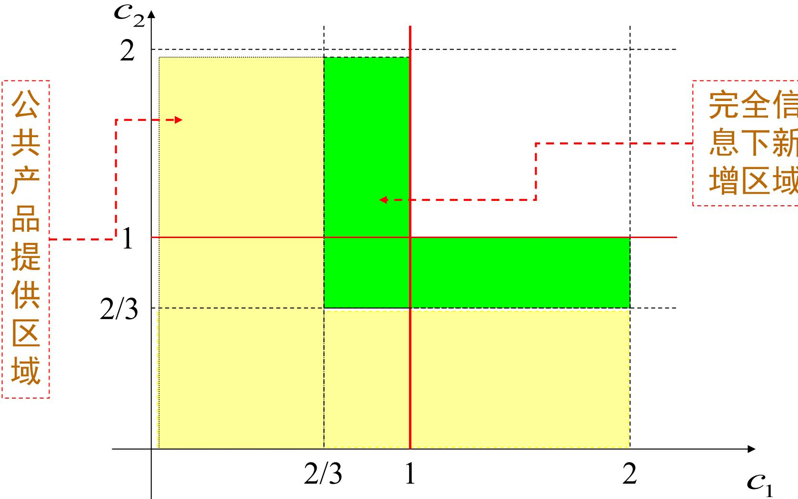

# 第9-11章 不完全信息静态博弈——贝叶斯博弈与贝叶斯Nash均衡

> [!abstract] 本篇导览
> 前面各章都假设博弈结构（参与人、行动、支付）是**共同知识**——这是**完全信息（complete information）**。现实中我们更常面对**不完全信息（incomplete information）**：你不知道对手的支付函数、成本、估价或偏好。本篇沿着课程「信息完全性 × 静态/动态」的 2×2 框架，进入**不完全信息静态博弈**这一格，核心解概念是**贝叶斯 Nash 均衡（Bayesian Nash Equilibrium, BNE）**。三章脉络：
> - **第9章 贝叶斯博弈**：用**类型（type）**刻画私人信息，用**海萨尼转换（Harsanyi transformation）**把"不知道在和谁博弈"的不完全信息，转化为"自然先随机选类型、你不观测自然的选择"的**完全但不完美信息**博弈，并给出贝叶斯博弈的五要素定义。
> - **第10章 贝叶斯 Nash 均衡**：定义并求解 BNE（类型相依的最优反应），以"斗鸡博弈"贯穿。
> - **第11章 应用**：不完全信息古诺、不完全信息公共产品提供、一级密封拍卖、以及对混合战略均衡的"纯化（purification）"解释。

> [!note] 在精炼链中的位置
> 本课的四个均衡概念构成一条加细（refinement）链。本篇的 BNE 是把 **Nash 均衡** 推广到不完全信息静态情形；下一篇的**精炼贝叶斯 Nash 均衡（PBE）** 则把它再推广到不完全信息**动态**情形。
>
> | | 静态博弈 | 动态博弈 |
> | --- | --- | --- |
> | **完全信息** | Nash 均衡（第2章） | 子博弈精炼 Nash 均衡（第6章） |
> | **不完全信息** | **贝叶斯 Nash 均衡（本篇）** | 精炼贝叶斯 Nash 均衡（第12章） |

---

# 第9章 贝叶斯博弈

## 9.1 为什么需要不完全信息博弈

完全信息博弈中，博弈的全部结构是共同知识。但现实里我们常遇到**不完全信息（incomplete information）**问题——某些参与人不知道其他参与人的支付：

- "新产品开发"博弈中，企业并不清楚市场需求；
- 连锁店博弈中，潜在进入者不知道在位者在该市场的盈利情况。

> [!question] 不完全信息的根本困难
> 当一个参与人**并不知道自己在与谁博弈**（对手是哪种"性格/成本/偏好"）时，博弈的规则其实是**没有定义**的——前面"求 Nash 均衡"的方法无从下手。Harsanyi 给出了化解之道：**Harsanyi 转换**。

## 9.2 引例："斗鸡博弈"的不完全信息版本

考察两位决斗者，每人可能是两种**类型**之一：**"强硬"（用 $s$ 表示）**——争强好胜、不达目的誓不罢休；**"软弱"（用 $w$ 表示）**——胆小怕事、希望息事宁人。令 $U$ = 冲上去、$D$ = 退下去。不同类型相遇时，支付矩阵不同（行为参与人1，列为参与人2）：

> [!example] 四种类型组合下的战略式博弈
> **(1) 双方都"强硬"**：硬碰硬最惨（$-4,-4$），存在两个纯战略 Nash 均衡 $(U,D)$ 和 $(D,U)$。
>
> | 1 \ 2 | $U$ | $D$ |
> | --- | --- | --- |
> | $U$ | $-4,-4$ | $2,-2$ |
> | $D$ | $-2,2$ | $0,0$ |
>
> **(2) 参与人1"强硬"、参与人2"软弱"**：唯一 Nash 均衡 $(U,D)$。
>
> | 1 \ 2 | $U$ | $D$ |
> | --- | --- | --- |
> | $U$ | $-4,-4$ | $2,0$ |
> | $D$ | $-2,0$ | $0,1$ |
>
> **(3) 参与人1"软弱"、参与人2"强硬"**：唯一 Nash 均衡 $(D,U)$。
>
> | 1 \ 2 | $U$ | $D$ |
> | --- | --- | --- |
> | $U$ | $-4,-4$ | $0,-2$ |
> | $D$ | $0,2$ | $1,0$ |
>
> **(4) 双方都"软弱"**：唯一 Nash 均衡 $(D,D)$。
>
> | 1 \ 2 | $U$ | $D$ |
> | --- | --- | --- |
> | $U$ | $-4,-4$ | $0,0$ |
> | $D$ | $0,0$ | $1,1$ |

**困难所在**：博弈前每人知道自己的类型，但**不知道对手的类型**——存在"事前不确定性"。给定参与人1是"强硬"的，若对手"软弱"则唯一均衡 $(U,D)$、参与人1有唯一最优"冲上去"；若对手"强硬"则有两个均衡、最优选择取决于对手。但参与人1**不知道对手是哪种**，仿佛同时在与"一个强硬、一个软弱"两个对手决斗——博弈规则未定义。

## 9.3 Harsanyi 转换：把不完全信息变成完全但不完美信息

> [!important] 核心思想
> 引入一个**"虚拟"参与人——"自然"（nature，记 $N$）**。让"自然"**先行动**、按某概率分布**随机选定各参与人的类型**；某参与人**观测到自己的类型但观测不到自然对别人的选择**。如此一来，原本"博弈开始前就不知道"的**事前不确定性**，被转化为"博弈开始后、对自然这一步的不观测"——即**完全但不完美信息（complete but imperfect information）**博弈，从而可用扩展式（博弈树）+信息集来处理。

以简化情形说明：设参与人1确定是"强硬"的，参与人2可能"强硬"也可能"软弱"，参与人1不知道参与人2的类型（但参与人2清楚双方类型）。Harsanyi 转换这样构造三人扩展式博弈：

1. "自然" $N$ 首先行动，以概率 $p$ 选参与人2为"强硬"、以 $1-p$ 选"软弱"；
2. 这一选择**参与人2知道、参与人1不知道**；
3. 之后两位决斗者进行"斗鸡博弈"，"自然"自身没有支付，叶子上的支付由对应类型组合的矩阵决定。

_p19_1.jpg)

> [!note] 怎么读这棵树
> 图中**连接参与人1两个决策结的虚线 = 参与人1的信息集**：他知道轮到自己动，却分不清自己处在"对手强硬"还是"对手软弱"的分支——这正是"不观测自然选择"的图形化表达。引入虚拟参与人后，博弈起点由 $x_1/x_2$ **提前到 $x_0$**，事前不确定性就转成了博弈内的不完美信息。

## 9.4 类型、推断（信念）与共同知识

在一般不完全信息博弈中，"自然"选择的是参与人的**类型（type）**。类型可按支付、行动空间、甚至掌握信息的多少来划分，**必须是参与人个人特征的一个完备描述**。

> [!note] 类型记号
> - $t_i$：参与人 $i$ 的一个特定类型；$T_i$：参与人 $i$ 的**类型空间（type space）**，$t_i\in T_i$。
> - $t=(t_1,\dots,t_n)$：所有参与人的类型组合；$t_{-i}$：除 $i$ 外其他人的类型组合，故 $t=(t_i,t_{-i})$。

**参与人对"自然"选择的推断（belief）**：Harsanyi 假定存在一个定义在类型组合上的**联合分布** $p(t_1,\dots,t_n)$，**且它是共同知识**——即所有参与人关于自然行动的信念**相同**。参与人 $i$ 在知道自己类型 $t_i$ 后，对他人类型的推断是**条件概率**，由贝叶斯公式给出：

$$p_i(t_{-i}\mid t_i)=\frac{p(t_{-i},t_i)}{p(t_i)}=\frac{p(t_{-i},t_i)}{\sum_{t_{-i}\in T_{-i}}p(t_{-i},t_i)}$$

其中 $p(t_i)$ 为边缘密度函数。

> [!example] 用贝叶斯规则推断对手类型（斗鸡博弈）
> 设联合分布 $p_{ss}=0.2,\ p_{sw}=0.3,\ p_{ws}=0.25,\ p_{ww}=0.25$。决斗者1知道自己类型后可推知对手类型分布：
>
> | 我方类型 | 对手"强硬"的概率 | 对手"软弱"的概率 |
> | --- | --- | --- |
> | "强硬" | $p_1(s\mid s)=\dfrac{0.2}{0.2+0.3}=0.4$ | $p_1(w\mid s)=\dfrac{0.3}{0.2+0.3}=0.6$ |
> | "软弱" | $p_1(s\mid w)=\dfrac{0.25}{0.25+0.25}=0.5$ | $p_1(w\mid w)=\dfrac{0.25}{0.25+0.25}=0.5$ |
>
> **关键洞察**：不同类型的同一参与人，对"自然"选择形成**不同**的推断。Harsanyi 认为：理性人掌握**相同信息**时对同一事件形成相同概率推断；但**私人信息不同**（自己是 $s$ 还是 $w$）就会得出不同推断。即——对所有人类型的**联合**推断人人相同，但因私人信息不同，各自对**他人**类型的**条件**推断不同。

完成 Harsanyi 转换后，把四种类型组合统一画进一棵树，就得到等价的**完全但不完美信息博弈**：

_p30_1.jpg)

图中 $(x,y)$ 表示参与人1类型为 $x$、参与人2类型为 $y$，$p_{xy}$ 为"自然"选择该组合的概率（共同知识）。

## 9.5 贝叶斯博弈的定义

> [!important] 贝叶斯博弈（the static Bayesian game）= 不完全信息静态博弈的标准式描述
> 一个贝叶斯博弈 $G=\langle\Gamma;(T_i);(p_i);(A_i(t_i));(u_i(a(t);t_i))\rangle$ 包含**五个要素**：
> 1. **参与人集合** $\Gamma=\{1,2,\dots,n\}$；
> 2. **类型集** $T_1,\dots,T_n$；
> 3. **推断（信念）** $p_i(t_{-i}\mid t_i)$，来源于共同知识的联合分布 $p(t_1,\dots,t_n)$；
> 4. **类型相依的行动集** $A_i(t_i)$；
> 5. **类型相依的支付函数** $u_i(a_1(t_1),\dots,a_n(t_n);t_i)$。

> [!note] 贝叶斯博弈的时间顺序
> 1. "自然"选择类型组合 $t=(t_1,\dots,t_n)$；
> 2. 参与人 $i$ 观测到**自己**的类型 $t_i$（观测不到 $t_{-i}$，但持有推断 $p_i(t_{-i}\mid t_i)$）；
> 3. 参与人**同时**从 $A_i(t_i)$ 中选行动 $a_i(t_i)$；
> 4. 参与人 $i$ 得到支付 $u_i(\cdot;t_i)$。

**贝叶斯博弈中的战略**是一个**从类型到行动的函数** $s_i(t_i)$：它规定"当自然赋予 $i$ 的类型为 $t_i$ 时，$i$ 从 $A_i(t_i)$ 中选什么行动"。

> [!example] "斗鸡博弈"的战略（$T_i=\{s,w\}$，行动 $\{U,D\}$）
> 一个战略要同时规定"强硬时怎么做、软弱时怎么做"，共 4 个纯战略：
>
> | 战略 | 强硬型 $i$ | 软弱型 $i$ | 记法 |
> | --- | --- | --- | --- |
> | $s_i^1$ | $U$ | $U$ | $(U,U)$ |
> | $s_i^2$ | $U$ | $D$ | $(U,D)$ |
> | $s_i^3$ | $D$ | $U$ | $(D,U)$ |
> | $s_i^4$ | $D$ | $D$ | $(D,D)$ |

---

# 第10章 贝叶斯 Nash 均衡

## 10.1 直观引入：简化斗鸡博弈的最优反应

用 $x$ = "强硬"决斗者2 选 $U$ 的概率，$y$ = 决斗者1 选 $U$ 的概率，$p$ = "自然"选决斗者2为"强硬"的概率。

_p47_1.jpg)

**决斗者1的期望收益**（对手为软弱时支付按 (2) 矩阵）：

$$v_1(U)=p\big(-4x+2(1-x)\big)+2(1-p)=2-6xp,\qquad v_1(D)=p(-2x)+0=-2xp$$

> [!note] 决斗者1的最优战略（设 $p>1/2$）
> 比较 $v_1(U)$ 与 $v_1(D)$，临界在 $x=1/(2p)$：
> - 若 $x<1/(2p)$ → 选 $y=1$（行动 $U$）；
> - 若 $x>1/(2p)$ → 选 $y=0$（行动 $D$）；
> - 若 $x=1/(2p)$ → 任一混合战略 $y\in[0,1]$。

**"强硬"决斗者2的最优战略**（其期望收益 $v_2(U)=2-6y,\ v_2(D)=-2y$，临界 $y=1/2$）：$y<1/2$ 选 $U$；$y>1/2$ 选 $D$；$y=1/2$ 任意混合。

> [!example] 简化博弈的均衡
> 存在两个纯战略均衡：① 决斗者1选 $U$，强硬2选 $D$，软弱2选 $D$；② 决斗者1选 $D$，强硬2选 $U$，软弱2选 $D$。另有一个混合战略均衡：决斗者1 以 $1/2$ 概率选 $U$，强硬2 以 $1/(2p)$ 概率选 $U$，软弱2 选 $D$。

## 10.2 期望效用与贝叶斯 Nash 均衡定义

给定他人战略 $s_{-i}$，类型 $t_i$ 的参与人 $i$ 选行动 $a_i$ 的**期望效用**为：

$$v_i(a_i,s_{-i};t_i)=\sum_{t_{-i}\in T_{-i}}p_i(t_{-i}\mid t_i)\,u_i\big(a_i,a_{-i}(t_{-i});t_i\big)$$

理性参与人 $i$ 在只知自己类型 $t_i$ 时，选择使期望效用最大化的行动 $a_i^*(t_i)\in\arg\max_{a_i\in A_i(t_i)}v_i(a_i,s_{-i};t_i)$。

> [!important] 纯战略贝叶斯 Nash 均衡（BNE）
> 类型相依的行动组合 $(a_1^*(t_1),\dots,a_n^*(t_n))$ 是**纯战略贝叶斯 Nash 均衡**，如果对每个参与人 $i$、每个类型 $t_i$：
> $$a_i^*(t_i)\in\arg\max_{a_i\in A_i(t_i)}\sum_{t_{-i}\in T_{-i}}p_i(t_{-i}\mid t_i)\,u_i\big(a_i,a_{-i}^*(t_{-i});t_i\big)$$
> **直观**：每种类型的每个参与人，在给定自己类型与他人**类型相依**的均衡行动下，都在最大化自己的期望效用——没人愿意改变任一类型下的任一行动。

> [!summary] 另一种等价表述（战略层面）
> 战略组合 $s^*=(s_1^*,\dots,s_n^*)$ 是 BNE，当且仅当对 $\forall i,\forall t_i$：
> $$s_i^*(t_i)\in\arg\max_{a_i(t_i)\in A_i(t_i)}\sum_{t_{-i}\in T_{-i}}u_i\big(s_1^*(t_1),\dots,a_i(t_i),\dots,s_n^*(t_n);t_i\big)\,p_i(t_{-i}\mid t_i)$$
> 即没有参与人愿意改变战略，哪怕这一改变只涉及**一种类型下的一个行动**。

> [!note] 存在性定理
> **一个有限的贝叶斯博弈一定存在贝叶斯 Nash 均衡（纯战略或混合战略）。** 这是 Nash 存在性定理在不完全信息情形的推广。

## 10.3 求解 BNE：把"类型相依战略"展开成大型支付矩阵

求 BNE 的标准做法：把每个参与人的**纯战略（类型→行动的函数）**当作行/列，算出每个战略组合下各类型的**期望支付**，再像普通博弈那样找最优反应、剔除劣战略。

**简化斗鸡博弈**（决斗者1固定强硬，仅2有两类型，$p$ = 推断对手强硬的概率），决斗者2的 4 个战略简化后只剩 $(U,D)$ 与 $(D,D)$ 不被劣势支配：

_p64_1.jpg)

> [!example] 约简后的支付表与求解
> $(x,(y,z))$：$x$ = 决斗者1 的期望支付；$y,z$ = 强硬2、软弱2 的支付。剔除2的劣战略 $(U,U),(D,U)$ 后剩：
>
> | 1 \ 2 | $(U,D)$ | $(D,D)$ |
> | --- | --- | --- |
> | $U$ | $2-6p,\ (-4,0)$ | $2,\ (-2,0)$ |
> | $D$ | $-2p,\ (2,1)$ | $0,\ (0,1)$ |
>
> 据 $p$ 大小求纯战略 BNE：
> - **若 $p\le 1/2$**：无论2选 $(U,D)$ 还是 $(D,D)$，决斗者1最优都是 $U$；给定1选 $U$，强硬2最优为 $D$。**唯一 BNE**：$\big(U,(D,D)\big)$。
> - **若 $p>1/2$**：存在两个纯战略 BNE：① $\big(U,(D,D)\big)$；② $\big(D,(U,D)\big)$。

> [!note] 完整斗鸡博弈（双方各两类型）的结果
> 当双方各有 $s/w$ 两类型时，每人有 $4$ 个纯战略，支付表是 $4\times4$。在 $p_{ss}=0.2,p_{sw}=0.3,p_{ws}=0.2,p_{ww}=0.3$ 下，逐步剔除劣战略（如"软弱1无论如何最优都是 $D$"），最终得两个纯战略 BNE：
> $$\big((U,D),(U,D)\big)\quad\text{和}\quad\big((U,D),(D,D)\big)$$
> 含义："强硬"者倾向冲（$U$）、"软弱"者倾向退（$D$），符合直觉。

---

# 第11章 贝叶斯 Nash 均衡的应用

## 11.1 不完全信息古诺（Cournot）模型

在经典古诺模型中各企业成本互为已知（完全信息）。现实中企业常不知对手成本——**至少有一企业不知道对方成本**即为不完全信息古诺模型。这里**参与人类型 = 成本函数**。

> [!note] 模型设定
> - 企业1成本为共同知识：$c_1(q_1)=c_1 q_1$；
> - 企业2成本为**私人信息**：低成本 $c_2^L q_2$ 或高成本 $c_2^H q_2$（$c_2^L<c_2^H$）；企业1只知道"企业2为低成本的概率为 $p$"（$p$ 共同知识）。
> - 市场需求 $P=a-Q,\ Q=q_1+q_2$；数值：$a=2,\ c_1=1,\ c_2^L=\tfrac34,\ c_2^H=\tfrac54,\ p=\tfrac12$。

**企业2（知道自己成本）的反应函数**：$\pi_2=q_2(a-c_2-q_2-q_1)$，一阶条件给出 $q_2(q_1)=\tfrac12(a-c_2-q_1)$。代入两类型：

$$q_2^L=\tfrac12\big(\tfrac54-q_1\big),\qquad q_2^H=\tfrac12\big(\tfrac34-q_1\big)$$

**企业1（不知对手成本）最大化期望利润**：

$$E\pi_1=p\,q_1(1-q_1-q_2^L)+(1-p)\,q_1(1-q_1-q_2^H)$$

一阶条件给出企业1反应函数 $q_1=\tfrac12\big(1-Eq_2\big)$，其中 $Eq_2=p\,q_2^L+(1-p)q_2^H$。

> [!important] 贝叶斯 Nash 均衡产量
> 联立三个反应函数（$q_1,q_2^L,q_2^H$），解得：
> $$q_1^*=\frac13,\qquad q_2^L=\frac{11}{24},\qquad q_2^H=\frac{5}{24}$$

### 不完全信息对谁有利？与完全信息对比

把上面 BNE 与"若企业1**确知**对手成本"的完全信息古诺解做对比：

> [!example] 两种均衡的产量比较
>
> | 情形 | 企业1 产量 $q_1^*$ | 企业2 产量 $q_2^*$ |
> | --- | --- | --- |
> | 完全信息·对手低成本 | $\tfrac14<\tfrac13$ | $\tfrac12>\tfrac{11}{24}$ |
> | 完全信息·对手高成本 | $\tfrac{5}{12}>\tfrac13$ | $\tfrac16<\tfrac{5}{24}$ |
> | **不完全信息（BNE）** | $\tfrac13$ | $\tfrac{11}{24}$ 或 $\tfrac{5}{24}$ |
>
> **解读**：企业1因不知对手成本，只能用一个折中产量 $q_1^*=\tfrac13$ 应对所有类型。相比完全信息，企业2**低成本时产得更多、高成本时产得更少**——信息不对称下，掌握私人信息的一方（企业2）能据真实成本灵活调整，而蒙在鼓里的企业1被迫"一刀切"。

_p90_1.jpg)

> [!note] 双边不完全信息（两企业都各有两类型）
> 进一步设企业1、2 都可能高/低成本（$c^l=\tfrac34,c^h=\tfrac54$）、各自等概率。对每一类型写期望利润、求一阶条件，得**四条**反应函数：
> $$q_1^l=\tfrac58-\tfrac14 q_2^l-\tfrac14 q_2^H,\quad q_1^H=\tfrac38-\tfrac14 q_2^l-\tfrac14 q_2^H$$
> $$q_2^l=\tfrac58-\tfrac14 q_1^l-\tfrac14 q_1^H,\quad q_2^H=\tfrac38-\tfrac14 q_1^l-\tfrac14 q_1^H$$
> 联立解得 $(q_1^l,q_2^l)=(\tfrac{11}{24},\tfrac{11}{24})$，$(q_1^l,q_2^H)=(\tfrac{11}{24},\tfrac{5}{24})$，$(q_1^H,q_2^l)=(\tfrac{5}{24},\tfrac{11}{24})$，$(q_1^H,q_2^H)=(\tfrac{5}{24},\tfrac{5}{24})$。即每类型产量只取 $\tfrac{11}{24}$（低成本）或 $\tfrac{5}{24}$（高成本）。

## 11.2 不完全信息下的公共产品提供

两个参与人**同时**决定是否提供公共产品（0-1 决策）。**类型 = 提供成本**。

> [!note] 设定
> - 公共产品好处（每人一单位）为共同知识，但**每人成本 $c_i$ 只有自己知道**；
> - $c_1,c_2$ 独立同分布于 $[\underline c,\overline c]$（$\underline c<1<\overline c$），分布 $P(\cdot)$ 共同知识；
> - 纯战略 $a(c_i):[\underline c,\overline c]\to\{0,1\}$（0 不提供、1 提供）；
> - 支付 $u_i(a_i,a_j,c_i)=\max(a_i,a_j)-a_i c_i$（只要有人提供就享好处 1，自己提供才付成本）。
>
> 支付矩阵（行1列2）：
>
> | 1 \ 2 | 提供 | 不提供 |
> | --- | --- | --- |
> | 提供 | $1-c_1,\ 1-c_2$ | $1-c_1,\ 1$ |
> | 不提供 | $1,\ 1-c_2$ | $0,\ 0$ |

**求解（门槛战略）**：令 $z_j=\text{Prob}(a_j^*(c_j)=1)$ 为对手提供的概率。参与人 $i$ 提供的预期收益为 $1-z_j$，故**仅当 $c_i<1-z_j$ 时才提供**。因此最优战略是**门槛型**：存在临界成本 $c_i^*$，只有 $c_i\in[\underline c,c_i^*]$ 才提供。由 $z_j=P(c_j^*)$ 得对称关系：

$$c_i^*=1-P(c_j^*),\qquad c_j^*=1-P(c_i^*)$$

> [!example] 均匀分布算例 $[\underline c,\overline c]=[0,2]$
> $P(c)=c/2$，代入得 $c_1^*=c_2^*=\dfrac23$。即**只有成本低于 $2/3$ 的人才会提供**。
>
> 而在**完全信息**下，只要自身成本 $c_i<1$ 就值得提供（不依赖对手）。对比：

> [!summary] 结论
> 不完全信息下提供门槛从 $1$ **降到 $2/3$**——黄色区域（提供）比完全信息更小，绿色是完全信息相对多出的提供区。**信息不完全使公共产品供给不足**：每人都担心"对手可能会提供"而搭便车，从而抬高了自己愿意提供的门槛。

## 11.3 一级价格密封拍卖

> [!note] 模型
> - 参与人 = 投标人 1、2；战略 = 报价 $b_i$；支付 = 净收益 $v_i-b_i$；
> - $v_i$ 为 $i$ 对标的物的**估价（私人信息=类型）**，独立同分布于 $[0,1]$ 均匀分布；
> - 行动空间 $A_1=A_2=[0,1]$，类型空间 $T_1=T_2=[0,1]$。
> - 支付（出价高者得，价高者按所报价付款）：
> $$u_i(b_1,b_2,v_i)=\begin{cases}v_i-b_i & b_i>b_j\\[2pt]\tfrac{v_i-b_i}{2} & b_i=b_j\\[2pt]0 & b_j>b_i\end{cases}$$

**BNE 推导**：$b_i(v_i)$ 是对 $b_j(v_j)$ 的最优反应：

$$b_i(v_i)\in\arg\max\Big\{(v_i-b_i)\,\text{Prob}\{b_i>b_j(v_j)\}+\tfrac12(v_i-b_i)\,\text{Prob}\{b_i=b_j(v_j)\}\Big\}$$

**猜线性解** $b_i(v_i)=a_i+c_i v_i$，代入求解可证线性均衡**存在且唯一**：

> [!important] 一级密封拍卖的贝叶斯 Nash 均衡
> 两投标人情形：
> $$b_1(v_1)=\frac{v_1}{2},\qquad b_2(v_2)=\frac{v_2}{2}$$
> 即**每人报出自己估价的一半**——理性投标人**压低报价（bid shading）**以保留正利润。
>
> 推广到 $n$ 个投标人（估价独立同 $U[0,1]$）：
> $$b_i(v_i)=\frac{n-1}{n}\,v_i$$
> $n$ 越大、竞争越激烈，报价越接近真实估价（$\tfrac{n-1}{n}\to1$）。

## 11.4 对混合战略 Nash 均衡的"纯化"解释

混合战略均衡常被质疑"现实中谁会真去掷骰子？" Harsanyi 给出**纯化（purification）**解释：**混合战略其实是不完全信息下、不同类型参与人各自采取纯战略所表现出的随机性**。

> [!example] 性别战博弈（Battle of the Sexes）
> 完全信息版本（行=丈夫，列=妻子）：
>
> | 夫 \ 妻 | F | B |
> | --- | --- | --- |
> | F | $2,1$ | $0,0$ |
> | B | $0,0$ | $1,2$ |
>
> 除两个纯战略均衡外，有混合均衡 $\big((\tfrac23,\tfrac13),(\tfrac13,\tfrac23)\big)$。

**Harsanyi 的不完全信息版本**：给支付加入微小私人信息 $t_p,t_c$（独立同 $U[0,x]$）：

| 夫 \ 妻 | F | B |
| --- | --- | --- |
| F | $2+t_p,\ 1$ | $0,0$ |
| B | $0,0$ | $1,\ 2+t_c$ |

> [!note] 门槛式纯战略 → 极限还原混合均衡
> 构造门槛 BNE：妻子在 $t_c$ 超临界值 $c$ 时选芭蕾、否则足球；丈夫在 $t_p$ 超临界值 $p$ 时选足球、否则芭蕾。由双方最优条件（$t_c>\tfrac{x}{p}-3=c$、$t_p>\tfrac{x}{c}-3=p$）得对称方程组：
> $$\begin{cases}p=c\\ p^2+3p-x=0\end{cases}\Rightarrow\ p=c=\frac{-3+\sqrt{9+4x}}{2}$$
> 于是女方选芭蕾、男方选足球的概率均为 $1-\dfrac{-3+\sqrt{9+4x}}{2x}$。当私人信息趋于消失（$x\to0$）时，这两个概率都 $\to\tfrac23$，恰好**还原**完全信息下的混合均衡 $\big((\tfrac23,\tfrac13),(\tfrac13,\tfrac23)\big)$。
>
> **结论**：完全信息博弈的混合战略均衡，可看作"几乎完全信息"贝叶斯博弈中**纯战略 BNE 的极限**——参与人并非真的随机，而是依各自私人信息采取确定行动，外人看来才像在"掷骰子"。

---

## 本章小结

> [!summary] 核心要点回顾
> - **不完全信息**：某些参与人不知道他人的支付/成本/估价/偏好。用**类型 $t_i$**（个人特征的完备描述）刻画私人信息，**类型空间** $T_i$。
> - **海萨尼转换**：引入虚拟参与人"自然"先随机选类型，把"不知道在和谁博弈"的事前不确定性，转成"不观测自然选择"的**完全但不完美信息**博弈——可用扩展式 + 信息集分析。
> - **信念一致性**：联合分布 $p(t)$ 为共同知识，各人由贝叶斯公式得条件推断 $p_i(t_{-i}\mid t_i)$；联合推断人人相同，但因私人信息不同，对他人的条件推断各异。
> - **贝叶斯博弈五要素**：$\langle\Gamma;(T_i);(p_i);(A_i(t_i));(u_i)\rangle$；战略 $s_i(t_i)$ 是"类型 → 行动"的函数。
> - **贝叶斯 Nash 均衡（BNE）**：每种类型的每个参与人，在给定他人类型相依均衡行动下最大化期望效用。有限贝叶斯博弈必存在 BNE。求解套路：把类型相依战略展开成大型支付矩阵，找最优反应、剔劣战略。
> - **应用**：① 不完全信息古诺——信息劣势方被迫"一刀切"产量；② 公共产品——私人成本下供给不足（门槛 $1\to2/3$）；③ 一级密封拍卖——压价报 $\tfrac{n-1}{n}v_i$；④ 性别战的纯化——混合均衡 = 微小私人信息下纯战略 BNE 的极限。

## 自测题

> [!question] 检验理解
> 1. 用一句话说明海萨尼转换"做了什么"，以及它把不完全信息变成了哪类信息结构？为什么扩展式中要用**信息集（虚线）**？
> 2. 为什么同一参与人的不同类型，对"自然"选择会形成**不同**的推断？这与"联合推断人人相同"矛盾吗？
> 3. 写出纯战略贝叶斯 Nash 均衡的定义式，并说明它与普通 Nash 均衡的区别（提示：对"类型"和"期望"两处）。
> 4. 简化斗鸡博弈中，为什么 $p\le1/2$ 与 $p>1/2$ 时纯战略 BNE 的个数不同？
> 5. 不完全信息古诺里，企业1 的均衡产量 $q_1^*=\tfrac13$ 介于完全信息两种情形之间——直观解释为何"不知对手成本"使它只能折中。
> 6. 公共产品博弈中，不完全信息把提供门槛从 $1$ 压到 $2/3$，说明这意味着公共产品供给偏多还是偏少？根源是什么？
> 7. 一级密封拍卖中，$n=2$ 时报 $\tfrac{v}{2}$、$n\to\infty$ 时报 $\to v$，解释竞争对压价幅度的影响。
> 8. "纯化"解释如何回应"现实中没人真按概率掷骰子"的质疑？

## 相关章节

- 上承完全信息静态博弈：[[第2章_完全信息静态博弈——Nash均衡_笔记]]（BNE 是 Nash 均衡向不完全信息的推广；古诺、混合战略亦在此奠基）
- 下接不完全信息动态博弈：[[第12章_不完全信息动态博弈——精炼贝叶斯Nash均衡_笔记]]（在 BNE 上引入信念系统与序贯理性，得到精炼贝叶斯 Nash 均衡）

