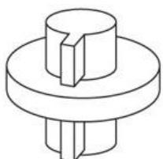
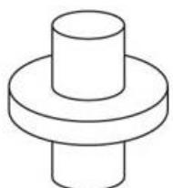
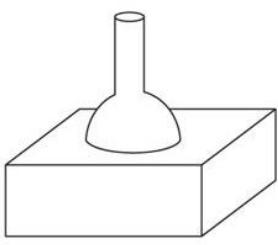
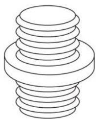
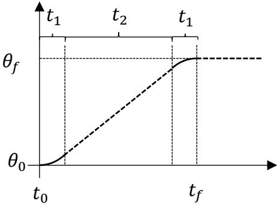
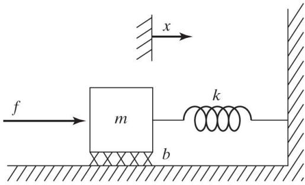
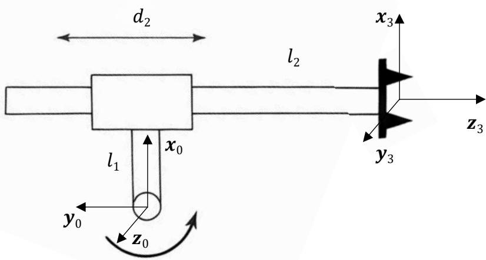

# 📝 机器人原理 · 期末样卷详解

> [!abstract] 关于本篇
> 本篇按**中山大学人工智能学院《机器人原理》期末样卷**逐题整理：**先完整抄录原题（含题图）**，再给答案、解析与**知识点反向链接**，方便对照 [[00_课程总览_MOC|课程总览]] 各章复习。
> - 卷面结构：选择题 15×2=30 分 + 判断题 5×2=10 分 + 计算题 60 分，闭卷 120 分钟。
> - 使用建议：先盖住答案自测（答案块默认折叠，点击展开），再顺链接回原章节补漏。

> [!note] 试卷符号约定（与全课程一致）
> - 左上标=所在坐标系（$^A p$ 为 {A} 系中的矢量），左下标=姿态/变换的参考（$^A_B R$ 为 {B} 相对 {A} 的姿态）。
> - 三角简写：$\cos\theta_1=\mathrm{c}\theta_1=\mathrm{c}_1$，$\sin\theta_1=\mathrm{s}\theta_1=\mathrm{s}_1$。
> - 参考公式：改进（Craig）DH 的连杆变换
>
> $$^{i-1}_iT=\begin{bmatrix} c\theta_i & -s\theta_i & 0 & a_{i-1}\\ s\theta_i c\alpha_{i-1} & c\theta_i c\alpha_{i-1} & -s\alpha_{i-1} & -s\alpha_{i-1}d_i\\ s\theta_i s\alpha_{i-1} & c\theta_i s\alpha_{i-1} & c\alpha_{i-1} & c\alpha_{i-1}d_i\\ 0&0&0&1 \end{bmatrix}$$
>
> 详见 [[理论课03.操作臂运动学a_笔记#五、连杆变换矩阵 $^{i-1}_i T$|连杆变换矩阵]]。

---

## 一、选择题（共 15 题，每题 2 分，共 30 分）

**1.** 机器人运动学**正解**是指（　）
A. 由关节角求末端位姿　B. 由末端位姿求关节角　C. 计算速度雅可比矩阵　D. 分析静力学平衡

> [!success]- 答案：**A**
> 正运动学（FK）= 已知关节角 $\Theta$ → 末端位姿 $^0_NT$；逆运动学（IK，选项 B）反之。
> 🔗 [[理论课03.操作臂运动学a_笔记#一、运动学 vs 动力学|FK 概念]]、[[理论课04.操作臂逆运动学_笔记#一、FK 与 IK|FK vs IK]]

**2.** 改进 D-H 参数中，连杆长度 $a_i$ 的定义是（　）
A. 沿 $x_i$ 轴从 $z_i$ 到 $z_{i+1}$ 的距离　B. 沿 $z_i$ 轴从 $x_{i-1}$ 到 $x_i$ 的距离　C. 绕 $z_i$ 轴从 $x_{i-1}$ 到 $x_i$ 的转角　D. 绕 $x_i$ 轴从 $z_i$ 到 $z_{i+1}$ 的转角

> [!success]- 答案：**A**
> 连杆长度 $a_i$ = 沿公垂线 $x_i$ 测量、相邻两关节轴 $z_i$ 与 $z_{i+1}$ 之间的距离（"沿 $x$ 平移"）。其余三项分别是 $d$（沿 $z$ 平移）、$\theta$（绕 $z$ 转）、$\alpha$（绕 $x$ 转）。
> 🔗 [[理论课03.操作臂运动学a_笔记#三、连杆四参数（DH 参数核心）|DH 四参数]]

**3.** 旋转矩阵 $R_z(\theta)$ 的表达式是（　）
A. $\begin{bmatrix}\cos\theta&-\sin\theta&0\\\sin\theta&\cos\theta&0\\0&0&1\end{bmatrix}$　B. $\begin{bmatrix}\cos\theta&0&\sin\theta\\0&1&0\\-\sin\theta&0&\cos\theta\end{bmatrix}$　C. $\begin{bmatrix}1&0&0\\0&\cos\theta&-\sin\theta\\0&\sin\theta&\cos\theta\end{bmatrix}$　D. 其它

> [!success]- 答案：**A**
> 绕 $z$ 轴旋转：$z$ 行列不变（第 3 行第 3 列为 1），$x,y$ 子块为标准平面旋转。选项 B 为 $R_y$、C 为 $R_x$。
> 🔗 [[理论课02.空间描述和变换a_笔记#三个主轴旋转矩阵（基本旋转）|三个基本旋转矩阵]]

**4.** 机器人静力学中，关节广义力 $\tau$ 与末端广义力 $f$ 的关系是（　）
A. $\tau=J^{\mathrm T}f$　B. $\tau=Jf$　C. $\tau=(J^{\mathrm T})^{-1}f$　D. $\tau=J^{-1}f$

> [!success]- 答案：**A**
> 由虚功原理 $\delta W=\tau^{\mathrm T}\delta\Theta=f^{\mathrm T}\delta\chi$ 及 $\delta\chi=J\delta\Theta$ 得 $\tau=J^{\mathrm T}f$——**力的传递用雅可比转置**，与速度 $\nu=J\dot\Theta$ 对偶。
> 🔗 [[理论课05.速度与静力b_笔记]]「四、虚功原理 → $\Gamma=J^TF$」

**5.** 以下哪种轨迹规划方法能保证**端点加速度连续**？（　）
A. 三次多项式插值　B. 线性插值　C. 抛物线过渡的线性插值　D. 五次多项式插值

> [!success]- 答案：**D**
> 五次多项式有 6 个系数，可同时约束起止的**位置、速度、加速度** → 端点加速度可指定且连续。三次多项式只能约束位置、速度（端点加速度一般不为零、段间不连续）；LFPB 在直线段与抛物线段交界处加速度突变。
> 🔗 [[理论课07.轨迹规划a_笔记#七、五次多项式（Quintic）|五次多项式]]、[[理论课08.轨迹规划b_笔记#五、LFPB 的局限|LFPB 加速度突变]]

**6.** 在改进 D-H 表示法中，连杆转角 $\alpha_i$ 是绕哪个轴的旋转角度？（　）
A. $x_i$ 轴　B. $z_i$ 轴　C. $x_{i-1}$ 轴　D. $z_{i-1}$ 轴

> [!success]- 答案：**A**
> $\alpha_i$ = 绕公垂线 $x_i$ 轴、把 $z_i$ 转到 $z_{i+1}$ 的扭转角（"绕 $x$ 转"）。注意与第 2 题配对记忆：$a$ 是沿 $x$ 的**距离**、$\alpha$ 是绕 $x$ 的**转角**。
> 🔗 [[理论课03.操作臂运动学a_笔记#三、连杆四参数（DH 参数核心）|连杆扭转角 α]]

**7.** 一个三维空间中的 6 自由度串联机器人，其速度雅可比矩阵的维度是（　）
A. $3\times3$　B. $3\times6$　C. $6\times6$　D. $6\times3$

> [!success]- 答案：**C**
> 末端广义速度 = 线速度 3 + 角速度 3 = 6 维；关节数 6。$\nu_{6\times1}=J_{6\times6}\dot\Theta_{6\times1}$，故 $J$ 为 $6\times6$ 方阵（方阵才谈得上 $\det J=0$ 奇异）。
> 🔗 [[理论课05.速度与静力a_笔记#三、雅可比矩阵（Jacobian）|雅可比的维度]]

**8.** 以下运动副中，具有**三个自由度**的是（　）

| (A) 移动副 | (B) 圆柱副 | (C) 球面副 | (D) 螺旋副 |
|:---:|:---:|:---:|:---:|
|  |  |  |  |

> [!success]- 答案：**C**
> 各运动副自由度：移动副 1（沿轴平移）、圆柱副 2（沿轴移+绕轴转）、**球面副 3（三个独立旋转）**、螺旋副 1（移动与转动按螺距耦合）。
> 🔗 [[理论课08.操作臂的机构设计_笔记#二、运动学构型|运动副与构型]]

**9.** 下列坐标系中，通常用于代表或描述机器人**末端执行器姿态**的是（　）
A. 腕部坐标系　B. 关节坐标系　C. 工具坐标系　D. 基坐标系

> [!success]- 答案：**C**
> 工具坐标系 {T} 固连在末端执行器（如夹爪指尖）上，描述工具实际作业的位姿；目标坐标系 {G}、工作台 {S} 等共同构成标准命名体系。
> 🔗 [[理论课04.操作臂逆运动学_笔记#六、标准坐标系命名与综合实例|标准坐标系命名]]

**10.** 机器人工作空间中，**可达**工作空间与**灵巧**工作空间的关系是（　）
A. 可达工作空间包含灵巧工作空间　B. 灵巧包含可达　C. 两者相同　D. 没有必然关系

> [!success]- 答案：**A**
> 灵巧工作空间（末端可达且能以**任意姿态**到达）是可达工作空间（末端**至少一种姿态**能到达）的子集，故可达 ⊇ 灵巧。
> 🔗 [[理论课08.操作臂的机构设计_笔记#三、工作空间属性的定量|工作空间属性]]、[[理论课04.操作臂逆运动学_笔记#二、工作空间与解的数目|工作空间]]

**11.** 给定末端目标位置和姿态的情况下，各连杆**不等长**的**平面 3R** 机器人最多可能有多少个逆运动学解？（　）
A. 1 个　B. 2 个　C. 4 个　D. 无穷多个

> [!success]- 答案：**B**
> 平面 3R 给定末端位姿 $(x,y,\phi)$ 共 3 个约束、3 个关节。由 $\phi$ 定出手腕点后，前两杆退化为 **2R 定位问题**，对应"肘上/肘下"**2 组解**。（注意：若只给位置不给姿态，则因姿态自由而有无穷多解。）
> 🔗 [[理论课04.操作臂逆运动学_笔记#二、工作空间与解的数目|解的数目]]、[[理论课04.操作臂逆运动学_笔记#三、闭式解：几何法（3R 平面臂）|3R 几何法]]

**12.** 在机器人控制中，PID 控制器中的"I"项主要用于（　）
A. 消除稳态误差　B. 减小超调　C. 提高响应速度　D. 抑制振荡

> [!success]- 答案：**A**
> 积分项对误差累积，只要存在常值稳态误差就持续增大输出，直至误差归零——用于**消除（重力等常值扰动引起的）稳态误差**。
> 🔗 [[理论课09.操作臂的线性控制_笔记]]「六、抗扰动：稳态误差与积分项（→ PID）」

**13.** 齐次变换矩阵 $\begin{bmatrix}R&p\\0&1\end{bmatrix}$ 中，$p$ 表示（　）
A. 旋转矩阵　B. 位置矢量　C. 缩放因子　D. 透视变换

> [!success]- 答案：**B**
> $4\times4$ 齐次变换 = 左上 $3\times3$ 旋转 $R$ + 右上 $3\times1$ 位置 $p$ + 底行 $[0\ 0\ 0\ 1]$。机器人学只用刚体变换，无缩放/透视。
> 🔗 [[理论课02.空间描述和变换b_笔记]]「四、齐次变换矩阵 $T$（核心工具）」

**14.** X-Y-Z 固定角与 Z-Y-X 欧拉角的计算（　）
A. 顺序相反　B. 结果相同　C. 与计算顺序无关　D. 其它

> [!success]- 答案：**B**（结果相同）
> 重要结论：**绕固定轴 X→Y→Z 转 $(\gamma,\beta,\alpha)$ 与绕运动轴 Z→Y→X 转 $(\alpha,\beta,\gamma)$ 得到完全相同的旋转矩阵**。原因：固定角后转的左乘、欧拉角后转的右乘，两者矩阵连乘顺序恰好一致。
> 🔗 [[理论课02.空间描述和变换a_笔记#六、姿态的三参数拆解：固定角 vs 欧拉角|固定角 vs 欧拉角]]

**15.** 当机器人处于**奇异位形**时，以下说法正确的是（　）
A. 雅可比矩阵满秩　B. 末端执行器失去一个或多个方向的移动能力　C. 逆运动学解唯一　D. 关节速度为零

> [!success]- 答案：**B**
> 奇异 ⇔ $\det J=0$（$J$ 降秩）⇔ 末端在某些方向上**瞬时无法运动**；反过来要在该方向运动则需**无穷大关节速度**。
> 🔗 [[理论课05.速度与静力a_笔记#四、奇异（Singularity）|奇异位形]]

---

## 二、判断题（共 5 题，每题 2 分，共 10 分）

**1.** 齐次变换矩阵可同时表示旋转和平移。（　）

> [!success]- 答案：**✓ 对**
> $T$ 的 $R$ 块管旋转、$p$ 块管平移，一个 $4\times4$ 矩阵把两者统一。🔗 [[理论课02.空间描述和变换b_笔记]]

**2.** 工作空间分为灵巧工作空间和可达工作空间，前者范围更大。（　）

> [!success]- 答案：**✗ 错**
> 恰相反——**可达 ⊇ 灵巧**（见选择题 10）。🔗 [[理论课08.操作臂的机构设计_笔记#三、工作空间属性的定量|工作空间属性]]

**3.** 机器人逆运动学问题一定有解析解。（　）

> [!success]- 答案：**✗ 错**
> 一般 6R 臂未必有闭式解；**满足 Pieper 准则（相邻三轴交于一点或三轴平行）才保证存在解析解**，否则只能数值迭代。🔗 [[理论课04.操作臂逆运动学_笔记#五、Pieper 准则：三轴交点保证闭式解|Pieper 准则]]

**4.** 轨迹规划中的三次多项式插值可以保证起点和终点的加速度为零。（　）

> [!success]- 答案：**✗ 错**
> 三次多项式只有 4 个系数，仅能约束起止**位置与速度**；端点加速度由系数 $a_2,a_3$ 决定，一般**不为零**。要约束加速度须用五次多项式。🔗 [[理论课07.轨迹规划a_笔记#三、三次多项式单段插值（Cubic Polynomial）|三次多项式]]

**5.** D-H 参数中，相邻连杆的坐标系变换可以通过四个参数完全确定。（　）

> [!success]- 答案：**✓ 对**
> $(a_{i-1},\alpha_{i-1},d_i,\theta_i)$ 四参数即可唯一确定 $^{i-1}_iT$——这正是 DH 表示法用 4 参数（而非 6）描述相邻坐标系的精妙之处。🔗 [[理论课03.操作臂运动学a_笔记#五、连杆变换矩阵 $^{i-1}_i T$|连杆变换]]

---

## 三、计算题（共 5 题，共 60 分）

### 计算题 1：变换链的乘法次数优化（10 分）

> [!question] 原题
> 在三维空间中有一个点 $p$，已知其在 {C} 坐标系中坐标 $^Cp$，且该点坐标**每秒更新 30 次**。要计算该点在 {A} 坐标系下的坐标，需要经过两次变换，即 $^Ap={}^A_BT\,{}^B_CT\,{}^Cp$，这些**齐次变换矩阵每秒更新一次**。在这种情况下，只考虑计算顺序优化，每秒至少需要计算多少次乘法？

> [!success]- 解答：**306 次/秒**
> 关键：**矩阵 1 秒只变 1 次，点 1 秒变 30 次** → 应把"矩阵×矩阵"预算好、复用，避免每次点更新都做两次矩阵-向量乘。
>
> **利用齐次变换结构**（底行恒为 $[0\,0\,0\,1]$，只需算 $R$ 与 $p$ 块）：
> - **预乘** $M={}^A_BT\,{}^B_CT$：$\begin{bmatrix}R_1&p_1\\0&1\end{bmatrix}\begin{bmatrix}R_2&p_2\\0&1\end{bmatrix}=\begin{bmatrix}R_1R_2 & R_1p_2+p_1\\0&1\end{bmatrix}$
>   - $R_1R_2$：$3\times3\times3=27$ 次乘法
>   - $R_1p_2$：$3\times3=9$ 次乘法 → 小计 **36 次**，每秒做 1 次 = **36**
> - **每点变换** $^Ap=M\,{}^Cp=R\,{}^Cp_{vec}+p$：$3\times3=9$ 次乘法，每秒做 30 次 = **270**
>
> **合计 $36+270=306$ 次乘法/秒。**
>
> 对比"不预乘"的方案：每次点更新做 2 次矩阵-向量乘 $=2\times9=18$，$\times30=540$ 次 → 劣于 306。
> 🔗 [[理论课02.空间描述和变换b_笔记]]「六、自由矢量变换与计算效率」

### 计算题 2：复合旋转矩阵（10 分）

> [!question] 原题
> 一矢量 $^Ap$ 绕 $y_A$ 旋转角度 $\theta$，然后绕 $z_A$ 旋转 $\phi$。
> （1）（6 分）求按以上顺序旋转后得到的旋转矩阵 $R$。
> （2）（4 分）若 $\theta=45^\circ$，$\phi=30^\circ$，求旋转矩阵。

> [!success]- 解答
> **（1）绕固定轴 $y_A$、$z_A$ 旋转 → 后转的左乘**：
> $$R=R_z(\phi)\,R_y(\theta)=\begin{bmatrix}c\phi&-s\phi&0\\s\phi&c\phi&0\\0&0&1\end{bmatrix}\begin{bmatrix}c\theta&0&s\theta\\0&1&0\\-s\theta&0&c\theta\end{bmatrix}$$
> $$\boxed{R=\begin{bmatrix}c\phi c\theta & -s\phi & c\phi s\theta\\ s\phi c\theta & c\phi & s\phi s\theta\\ -s\theta & 0 & c\theta\end{bmatrix}}$$
>
> **（2）代入 $\theta=45^\circ$（$c=s=\tfrac{\sqrt2}{2}\approx0.707$）、$\phi=30^\circ$（$c=\tfrac{\sqrt3}{2}\approx0.866,\ s=0.5$）：**
> $$R\approx\begin{bmatrix}0.612 & -0.5 & 0.612\\ 0.354 & 0.866 & 0.354\\ -0.707 & 0 & 0.707\end{bmatrix}$$
> ⚠ 易错点：绕**固定轴**连续旋转一定是**左乘**（新旋转在左）；若题目说"绕运动/当前轴"则改右乘。
> 🔗 [[理论课02.空间描述和变换a_笔记#五、旋转矩阵的三种用法（本章核心）|旋转矩阵用法]]、[[理论课02.空间描述和变换a_笔记#三个主轴旋转矩阵（基本旋转）|基本旋转矩阵]]

### 计算题 3：抛物线过渡的线性函数（LFPB）轨迹（10 分）

> [!question] 原题
> 一个单连杆转动关节机器人静止在关节角 $\theta_0=0^\circ$ 处。希望在 $5\,\mathrm{s}$ 内将关节转动到 $\theta_f=22.5^\circ$ 并停止，关节最大加速度为 $a=10^\circ/\mathrm{s}^2$。
> （8 分）请使用抛物线过渡的线性函数方法生成运动轨迹函数，有几种合理的解？（提示：加速与减速段用时相等）
> （2 分）写出速度和加速度的时间函数。

> [!success]- 解答：**仅 1 种合理解（$t_b=0.5\,\mathrm{s}$）**
> 单段对称 LFPB，过渡时间 $t_b$、总时间 $t=5\,\mathrm{s}$、$\ddot\theta=a=10$。位移约束：
> $$\theta_f-\theta_0=\ddot\theta\,t_b\,(t-t_b)\ \Rightarrow\ 10\,t_b(5-t_b)=22.5$$
> $$t_b^2-5t_b+2.25=0\ \Rightarrow\ t_b=\frac{5\pm\sqrt{25-9}}{2}=\frac{5\pm4}{2}=0.5\ \text{或}\ 4.5$$
> 因过渡段须满足 $t_b\le t/2=2.5\,\mathrm{s}$，**$t_b=4.5$ 不合理舍去**，故只有 $t_b=0.5\,\mathrm{s}$ **一种合理解**。
> （附注：若不强制用最大加速度，则 $\ddot\theta\in[3.6,\,10]^\circ/\mathrm{s}^2$ 都能 5 s 内完成，对应无穷多解；本题取最大加速度 $\Rightarrow$ 唯一。）
>
> **匀速段速度** $v=\ddot\theta\,t_b=10\times0.5=5^\circ/\mathrm{s}$，过渡段位移 $\tfrac12\times10\times0.5^2=1.25^\circ$。
>
> **位置 $\theta(t)$：**
>
> | 区间 | $\theta(t)$ |
> |---|---|
> | $0\le t\le0.5$（加速）| $5t^2$ |
> | $0.5\le t\le4.5$（匀速）| $1.25+5(t-0.5)$ |
> | $4.5\le t\le5$（减速）| $22.5-5(5-t)^2$ |
>
> **速度 $\dot\theta(t)$ / 加速度 $\ddot\theta(t)$：**
>
> | 区间 | $\dot\theta$ | $\ddot\theta$ |
> |---|---|---|
> | $0\!\sim\!0.5$ | $10t$ | $+10$ |
> | $0.5\!\sim\!4.5$ | $5$ | $0$ |
> | $4.5\!\sim\!5$ | $10(5-t)$ | $-10$ |
>
> 校验位移：$2\times1.25+5\times4=22.5^\circ$ ✓
> 🔗 [[理论课08.轨迹规划b_笔记#二、单段 LFPB 推导|单段 LFPB 推导]]

### 计算题 4：分解控制器与共振约束（10 分）

> [!question] 原题
> 一个有阻尼的质量-弹簧系统被驱动器驱动。质量块视为质点，质量 $m=2$，位移为 $x$，阻尼系数 $b=1$，弹簧弹性系数 $k=4$，驱动器作用在质量块上的力为 $f$（约定以右为正）。系统的**未建模共振频率** $\omega_{\mathrm{res}}=20.0\,\mathrm{rad/s}$。设计分解控制器 $\alpha$ 和 $\beta$，确定在**闭环刚度达到允许的最大值时**这个**临界阻尼**的增益 $k_v$ 和 $k_p$。

> [!success]- 解答：$\alpha=2,\ \beta=\dot x+4x,\ k_p=100,\ k_v=20$
> 系统方程：$m\ddot x+b\dot x+kx=f$，即 $2\ddot x+\dot x+4x=f$。
>
> **第 1 步 分解（线性化+解耦）**：取 $f=\alpha f'+\beta$，令
> $$\alpha=m=2,\qquad \beta=b\dot x+kx=\dot x+4x$$
> 代入得**单位质量系统** $\ddot x=f'$。
>
> **第 2 步 伺服律**：$f'=-k_v\dot x-k_p x$ → 闭环 $\ddot x+k_v\dot x+k_p x=0$，自然频率 $\omega_n=\sqrt{k_p}$。
>
> **第 3 步 共振约束定上限**：为不激发未建模共振，经验法则取闭环带宽 $\omega_n\le\tfrac12\omega_{\mathrm{res}}=\tfrac12\times20=10\,\mathrm{rad/s}$。取允许最大刚度 ⇒ $\omega_n=10$：
> $$k_p=\omega_n^2=100$$
>
> **第 4 步 临界阻尼**（$\zeta=1$）：$k_v=2\sqrt{k_p}=2\sqrt{100}=20$。
> $$\boxed{k_p=100,\quad k_v=20}$$
> 🔗 [[理论课09.操作臂的线性控制_笔记#四、控制律分解（Partitioned Control）|控制律分解]]、[[理论课09.操作臂的线性控制_笔记#未建模柔性与共振约束|共振约束 ωₙ≤½ω_res]]

### 计算题 5：RP 平面机器人综合（20 分）

> [!question] 原题
> 如图所示 RP 机器人位于平面中，关节 1 为转动副，关节 2 为移动副，且连杆 1 与连杆 2 方向**垂直**，连杆 1 长为 $l_1$，关节 2 在 0 位置时对应的连杆 2 长度为 $l_2$。
> （1）（3 分）建立连杆坐标系。
> （2）（3 分）列出（改进）DH 参数表。
> （3）（4 分）写出末端相对基坐标的正运动学表达式 $^0_3T$。
> （4）（4 分）给定末端相对基坐标的位置 $(p_x,p_y,0)$（可达），求逆运动学表达式。
> （5）（3 分）求末端相对基坐标的雅可比矩阵表达式。
> （6）（3 分）若末端受广义力 $f=[f_x,\,f_y,\,0]^{\mathrm T}$（力矩 $n$ 可忽略），求各关节广义力表达式。

> [!success]- 解答
> **（1）（2）建系与 DH 参数表**　按题图取基帧 {0}（$z_0$ 沿关节 1 转轴、出纸面，$x_0$ 沿连杆 1 朝上，$y_0$ 朝左）；中间帧 {2} 置于移动副处（$z_2$ 沿关节 2 滑动方向＝零位朝右，连杆 1⊥连杆 2 故 $\alpha_1=90^\circ,\ a_1=l_1$）；末端帧 {3} 沿 $z_2$ 平移 $l_2+d_2$ 到达。$^0_3T$ 经 {0}→{1}→{2}→{3} **3 段变换，故 DH 表 3 行**：
>
> | $i$ | $\alpha_{i-1}$ | $a_{i-1}$ | $d_i$ | $\theta_i$ |
> |:---:|:---:|:---:|:---:|:---:|
> | 1 | $0$ | $0$ | $0$ | $\theta_1$（变量）|
> | 2 | $90^\circ$ | $l_1$ | $0$ | $0$ |
> | 3 | $0$ | $0$ | $l_2+d_2$（变量）| $0$ |
>
> > 行 2 = 连杆 1 的 $90^\circ$ 拐弯＋长度 $l_1$（固定段）；行 3 = 移动副 $d_2$ 沿 $z_2$ 滑出。末端帧按原题图：$x_3$ 朝上、$z_3$ 沿臂向外、$y_3$ 出纸面。
>
> 
>
> **（3）正运动学**　记 $r\equiv l_2+d_2$。三段连杆变换矩阵（各旋转块即一张 $3\times3$ 表）：
> $${}^0_1T=\begin{bmatrix}c_1&-s_1&0&0\\s_1&c_1&0&0\\0&0&1&0\\0&0&0&1\end{bmatrix},\quad {}^1_2T=\begin{bmatrix}1&0&0&l_1\\0&0&-1&0\\0&1&0&0\\0&0&0&1\end{bmatrix},\quad {}^2_3T=\begin{bmatrix}1&0&0&0\\0&1&0&0\\0&0&1&r\\0&0&0&1\end{bmatrix}$$
> 连乘得（末端在基坐标 $x_0,y_0$ 下位置 $p_x=l_1c_1+r\,s_1,\ p_y=l_1s_1-r\,c_1,\ p_z=0$）：
> $${}^0_3T={}^0_1T\,{}^1_2T\,{}^2_3T=\begin{bmatrix}c_1&0&s_1&l_1c_1+r\,s_1\\s_1&0&-c_1&l_1s_1-r\,c_1\\0&1&0&0\\0&0&0&1\end{bmatrix},\qquad r=l_2+d_2$$
> 旋转块三列即图中末端 $x_3$（沿 $x_0$）、$y_3$（出纸面）、$z_3$（沿臂向外）经 $\operatorname{Rot}_{z_0}(\theta_1)$ 后的方向。⚠️ 因 $\alpha_1=90^\circ$，朝向**不是绕 $z$ 的纯转动**——把 $^0_3T$ 写成 $\operatorname{Rot}_z(\theta_1)$ 是常见错误。
>
> **（4）逆运动学**：由 $p_x^2+p_y^2=l_1^2+r^2$
> $$r=\sqrt{p_x^2+p_y^2-l_1^2}\;\Rightarrow\; d_2=\sqrt{p_x^2+p_y^2-l_1^2}-l_2$$
> 再由 $\begin{bmatrix}p_x\\p_y\end{bmatrix}=\begin{bmatrix}l_1 & r\\ -r & l_1\end{bmatrix}\begin{bmatrix}c_1\\s_1\end{bmatrix}$ 解出
> $$\theta_1=\operatorname{atan2}(r\,p_x+l_1p_y,\;l_1p_x-r\,p_y)=\operatorname{atan2}(p_y,p_x)+\operatorname{atan2}(r,\,l_1)$$
>
> **（5）雅可比**（$[\dot p_x;\dot p_y]=J[\dot\theta_1;\dot d_2]$，将 $p_x,p_y$ 对 $\theta_1,d_2$ 求偏导，$\partial r/\partial d_2=1$）：
> $$J=\begin{bmatrix}\dfrac{\partial p_x}{\partial\theta_1} & \dfrac{\partial p_x}{\partial d_2}\\[2mm] \dfrac{\partial p_y}{\partial\theta_1} & \dfrac{\partial p_y}{\partial d_2}\end{bmatrix}=\begin{bmatrix}-l_1s_1+r\,c_1 & s_1\\ l_1c_1+r\,s_1 & -c_1\end{bmatrix}=\begin{bmatrix}-p_y & s_1\\ p_x & -c_1\end{bmatrix}$$
>
> **（6）静力** $\tau=J^{\mathrm T}f$（$f=[f_x,f_y]^{\mathrm T}$）：
> $$\begin{bmatrix}\tau_1\\\tau_2\end{bmatrix}=\begin{bmatrix}-p_y & p_x\\ s_1 & -c_1\end{bmatrix}\begin{bmatrix}f_x\\f_y\end{bmatrix}=\begin{bmatrix}p_xf_y-p_yf_x\\ s_1f_x-c_1f_y\end{bmatrix}$$
> 物理自洽：$\tau_1=p_xf_y-p_yf_x$ 正是末端力对转轴 $z_0$ 的**力矩**（转动关节）；$\tau_2=s_1f_x-c_1f_y=f\cdot\hat z_2$ 是末端力沿**移动轴 $z_2$ 的分量**（移动关节）。
> 🔗 综合运用：[[理论课03.操作臂运动学a_笔记#三、连杆四参数（DH 参数核心）|DH 建系]] → [[理论课03.操作臂运动学b_笔记#二、3R 平面臂正运动学（完整推导）|正运动学]] → [[理论课04.操作臂逆运动学_笔记#三、闭式解：几何法（3R 平面臂）|逆解]] → [[理论课05.速度与静力a_笔记#五、实例：2R 平面臂雅可比|雅可比]] → [[理论课05.速度与静力b_笔记]]「静力 $\Gamma=J^TF$」

---

## 本章小结

> [!summary] 样卷高频考点地图
> - **空间描述**：基本旋转矩阵默写、固定角=反序欧拉角（选 3/14、判 1、计 2）→ [[理论课02.空间描述和变换a_笔记]]、[[理论课02.空间描述和变换b_笔记]]
> - **运动学**：DH 四参数定义（沿 $x$=$a$、绕 $x$=$\alpha$、沿 $z$=$d$、绕 $z$=$\theta$）、FK/IK（选 1/2/6、判 5、计 5）→ [[理论课03.操作臂运动学a_笔记]]、[[理论课04.操作臂逆运动学_笔记]]
> - **逆解数目 / 工作空间**：平面 3R 给位姿 2 解、可达⊇灵巧、Pieper 保证闭式解（选 10/11、判 2/3）→ [[理论课04.操作臂逆运动学_笔记]]
> - **速度与静力**：$J$ 维度、奇异 $\det J=0$、$\tau=J^TF$（选 4/7/15、计 5）→ [[理论课05.速度与静力a_笔记]]、[[理论课05.速度与静力b_笔记]]
> - **轨迹规划**：三次/五次端点约束、LFPB 计算 $t_b$（选 5、判 4、计 3）→ [[理论课07.轨迹规划a_笔记]]、[[理论课08.轨迹规划b_笔记]]
> - **控制**：PID 的 I 项消稳态误差、分解控制 $\alpha=m,\beta=b\dot x+kx$、共振约束 $\omega_n\le\tfrac12\omega_{\mathrm{res}}$（选 12、计 4）→ [[理论课09.操作臂的线性控制_笔记]]
> - **机构设计**：运动副自由度（球面副 3 自由度）→ [[理论课08.操作臂的机构设计_笔记]]

> [!warning] 易错点速记
> - 绕**固定轴**旋转 → **左乘**；绕**当前/运动轴** → 右乘。
> - 三次多项式**保证不了**端点加速度为零；要约束加速度用五次多项式。
> - LFPB 两根取较小者（$t_b\le t/2$），大根舍去。
> - 分解控制：$\alpha$ 补质量（=$m$）、$\beta$ 补真实动力学（阻尼+刚度），把系统化为单位质量后再设计 PD/PID。
> - 静力是**雅可比转置** $J^T$，不是 $J^{-1}$ 或 $J$。

## 自测题

> [!question] 自测（先独立作答，再翻链接对照）
> 1. 写出 $R_x(\theta)$、$R_y(\theta)$、$R_z(\theta)$ 三个基本旋转矩阵；说明为何"X-Y-Z 固定角"与"Z-Y-X 欧拉角"结果相同。（→ [[理论课02.空间描述和变换a_笔记]]）
> 2. 某点在 {C} 系坐标每秒更新 60 次、变换矩阵每秒更新 2 次，链 $^Ap={}^A_BT\,{}^B_CT\,{}^Cp$，求最省乘法的方案与每秒乘法数。（仿计算题 1）
> 3. 关节 $\theta_0=0^\circ\to\theta_f=30^\circ$，$t=4\,\mathrm{s}$，$a=15^\circ/\mathrm{s}^2$，用 LFPB 求 $t_b$ 与匀速段速度，并写 $\dot\theta(t)$。（→ [[理论课08.轨迹规划b_笔记]]）
> 4. $m=1,b=2,k=3$，$\omega_{\mathrm{res}}=16\,\mathrm{rad/s}$，设计分解控制器并求临界阻尼下最大刚度的 $k_p,k_v$。（→ [[理论课09.操作臂的线性控制_笔记]]）
> 5. 对计算题 5 的 RP 臂，求其奇异位形（提示：令 $\det J=0$），并解释物理含义。（→ [[理论课05.速度与静力a_笔记#四、奇异（Singularity）|奇异]]）

---

> [!note] 相关章节
> 本样卷是全课程综合检验，建议配合 [[00_课程总览_MOC|课程总览 MOC]] 与 [[理论课10.复习_笔记|复习课总纲]] 一并使用。
