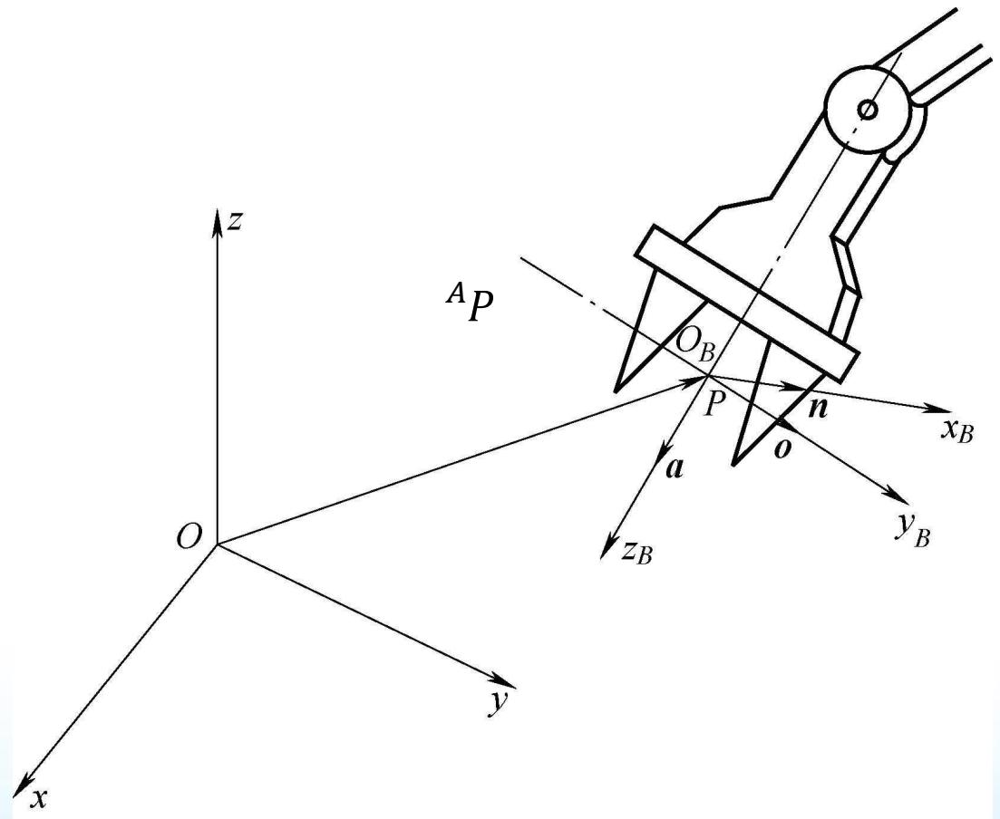
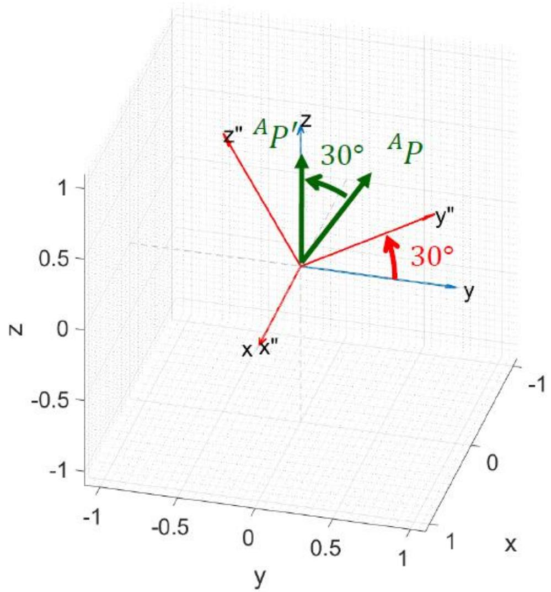
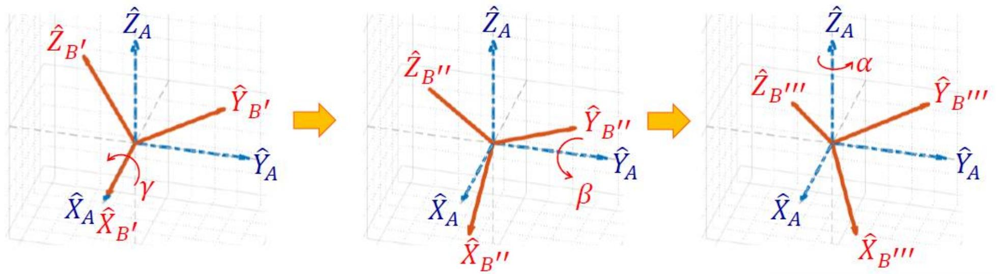

# 空间描述和变换（上）：位置、姿态与旋转矩阵

> [!abstract] 本章导览
> 机器人操作的本质是「让零件/工具在空间中运动」，因此首先要能用数学量**精确表达位置和姿态**。本章建立全部后续内容（速度、力、运动学）的几何地基：
> 1. **位置描述**——用 $3\times1$ 矢量 + 坐标系上标
> 2. **姿态描述**——用 旋转矩阵（Rotation Matrix）
> 3. **旋转矩阵的三种用法**——描述姿态 / 坐标变换 / 旋转算子
> 4. **姿态的三参数拆解**——固定角（Fixed Angles）与 欧拉角（Euler Angles）
> 5. 其它表达：Angle-axis 与四元数（Quaternion）

> [!note] 致谢
> 部分内容源自台湾大学 林沛群 教授「机器人学导论」课件。

---

## 一、符号约定（贯穿全课程，务必牢记）

| 记号 | 含义 | 示例 |
|---|---|---|
| 大写 $R,\ T$ | 矩阵 | 旋转矩阵 $R$、齐次变换 $T$ |
| 小写 $p$ | 矢量（默认列向量） | 位置矢量 $p$ |
| 小写 $a,p$ | 标量 | 分量 $p_x$ |
| **左上标** $^A p$ | 矢量**所在的参考坐标系** | $^A p$ = 在 $\{A\}$ 中表示的矢量 |
| **左下标** $^A_B R$ | 姿态/变换：描述 $\{B\}$ **相对于** $\{A\}$ | $^A_B R$ |
| **右下标** $p_x$ | 矢量分量 / 特定对象 | $p_x$、$p_{bolt}$、$x_A$ |

> [!tip] 三角函数简写（全课程通用）
> $\cos\theta_1 = c\theta_1 = c_1$，$\sin\theta_1 = s\theta_1 = s_1$

体系约定：存在一个**世界坐标系（World Frame）** $\{W\}$，一切位置与姿态都参照它或参照由它定义的笛卡儿坐标系。

---

## 二、线性代数回顾（点积）

点 $P$ 的位置用原点到该点的向量表示：
$$\pmb{p} = p_x\pmb{i} + p_y\pmb{j} + p_z\pmb{k} = \begin{bmatrix}p_x\\p_y\\p_z\end{bmatrix},\qquad \|\pmb{p}\| = \sqrt{p_x^2+p_y^2+p_z^2}$$

**点积（dot product）的两种定义**——这是旋转矩阵「方向余弦」的根基：

> [!important] 点积 = 投影
> - 代数定义：$\pmb{u}\cdot\pmb{v} = \pmb{u}^T\pmb{v} = u_xv_x+u_yv_y+u_zv_z$
> - 几何定义：$\pmb{u}\cdot\pmb{v} = \|\pmb{u}\|\,\|\pmb{v}\|\cos\theta$
> - 当 $\pmb{i}$ 为单位向量时，$\pmb{u}\cdot\pmb{i} = \|\pmb{u}\|\cos\theta$ 即 **$\pmb{u}$ 在 $\pmb{i}$ 方向上的投影**。
> - 两单位向量夹角余弦：$\cos(\pmb{i},\pmb{j}) = \pmb{i}\cdot\pmb{j}$ ← **后面旋转矩阵每个元素都是它**

---

## 三、位置与姿态描述

刚体状态自由度（DOF）：

| 空间 | 平动 | 转动 | 合计 |
|---|---|---|---|
| 平面 | 2 | 1 | **3 DOF** |
| 空间 | 3 | 3 | **6 DOF** |

### 位置描述

建立坐标系后，世界系中任一点用 $3\times1$ 位置矢量定位，左上标标明参考系：
$$^A\pmb{p} = \begin{bmatrix}p_x\\p_y\\p_z\end{bmatrix}$$

![世界坐标系 {W} 与物体坐标系 {B}：物体上一点 P 在世界系中的位置矢量 P̄=[Px,Py,Pz]=[10,3,3]，直观展示「位置 = 3×1 矢量 + 参考系」](./assets/理论课02.空间描述和变换a_p7_1.jpg)

### 姿态描述

仅有位置不够——还需描述物体的**朝向**。做法：在物体（如夹爪）上固连一个坐标系 $\{B\}$，给出 $\{B\}$ **相对参考系 $\{A\}$ 的描述**，即姿态。

---

## 四、旋转矩阵（Rotation Matrix）

描述 $\{B\}$ 相对 $\{A\}$ 的姿态：把 $\{B\}$ 的三个单位基矢量在 $\{A\}$ 中表达，**按列排成矩阵**：

$$^A_B R = \begin{bmatrix} | & | & | \\ ^A\hat{X}_B & ^A\hat{Y}_B & ^A\hat{Z}_B \\ | & | & | \end{bmatrix} = \begin{bmatrix} \hat{X}_B\cdot\hat{X}_A & \hat{Y}_B\cdot\hat{X}_A & \hat{Z}_B\cdot\hat{X}_A \\ \hat{X}_B\cdot\hat{Y}_A & \hat{Y}_B\cdot\hat{Y}_A & \hat{Z}_B\cdot\hat{Y}_A \\ \hat{X}_B\cdot\hat{Z}_A & \hat{Y}_B\cdot\hat{Z}_A & \hat{Z}_B\cdot\hat{Z}_A \end{bmatrix}$$

> [!note] 「方向余弦」(Direction Cosines)
> 每个元素都是两轴夹角的余弦（点积）。$R$ 的三列正是 $\{B\}$ 的基矢量 $\hat{X}_B,\hat{Y}_B,\hat{Z}_B$（由 $\{A\}$ 看）。

### 关键性质：正交矩阵（Orthogonal）

$$^A_B R^{\,T} = {}^A_B R^{-1} = {}^B_A R$$

> [!important] 旋转矩阵 = 3×3 正交矩阵 $Q$
> - $QQ^T = Q^TQ = I$，故**逆 = 转置**（$Q^{-1}=Q^T$），求逆零成本。
> - 各列是**单位正交基**：模为 1、两两垂直。
> - 9 个数受 6 个约束（3 个单位长 + 3 个正交），实际只剩 **3 个 DOF**，与空间转动 3 DOF 吻合。
> - $\det = +1$ 为旋转；$\det = -1$ 为反射（镜像）。
> - **互逆关系**：$^A_B R = {}^B_A R^T$，即「上下标互换 = 转置」。

### 三个主轴旋转矩阵（基本旋转）

$$R_{\hat{Z}}(\theta)=\begin{bmatrix}c\theta&-s\theta&0\\s\theta&c\theta&0\\0&0&1\end{bmatrix},\quad
R_{\hat{X}}(\theta)=\begin{bmatrix}1&0&0\\0&c\theta&-s\theta\\0&s\theta&c\theta\end{bmatrix},\quad
R_{\hat{Y}}(\theta)=\begin{bmatrix}c\theta&0&s\theta\\0&1&0\\-s\theta&0&c\theta\end{bmatrix}$$

> [!warning] 记忆要点
> 绕哪个轴转，该轴所在行列就是「1 与 0」不变；注意 **绕 Y 轴的正弦号位置与 X、Z 相反**（$+s\theta$ 在右上）。

---

## 五、旋转矩阵的三种用法（本章核心）

> [!summary] 同一个 $R$，三种身份
>
> | 用法 | 公式 | 含义 |
> |---|---|---|
> | ① 描述姿态 | $^A_B R=[^A\hat{X}_B\ ^A\hat{Y}_B\ ^A\hat{Z}_B]$ | 一个 frame 相对另一 frame 的朝向 |
> | ② 坐标变换 | $^A P = {}^A_B R\,{}^B P$ | 同一点在不同 frame 间换算（仅相对转动） |
> | ③ 旋转算子 | $^A P' = R(\theta)\,{}^A P$ | 在**同一** frame 内把矢量转动 $\theta$ |

### 用法②：坐标变换推导

把 $^B P$ 各分量分别投影到 $\{A\}$ 各轴（再次用到「点积 = 投影」）：
$$^A P = \begin{bmatrix} \hat{X}_B\cdot\hat{X}_A & \hat{Y}_B\cdot\hat{X}_A & \hat{Z}_B\cdot\hat{X}_A \\ \hat{X}_B\cdot\hat{Y}_A & \hat{Y}_B\cdot\hat{Y}_A & \hat{Z}_B\cdot\hat{Y}_A \\ \hat{X}_B\cdot\hat{Z}_A & \hat{Y}_B\cdot\hat{Z}_A & \hat{Z}_B\cdot\hat{Z}_A \end{bmatrix}{}^B P = {}^A_B R\,{}^B P$$

> [!example] 算例：坐标变换
> 已知 $^A_B R = \begin{bmatrix}0.866&-0.5&0\\0.5&0.866&0\\0&0&1\end{bmatrix}$（绕 Z 转 30°），$^B P=[1.732,\ 1,\ 0]^T$，求 $^A P$。
> $$^A P = {}^A_B R\,{}^B P = \begin{bmatrix}0.866&-0.5&0\\0.5&0.866&0\\0&0&1\end{bmatrix}\begin{bmatrix}1.732\\1\\0\end{bmatrix} = \begin{bmatrix}1\\1.732\\0\end{bmatrix}$$

### 用法③：旋转算子

> [!example] 算例：旋转算子
> $^A P=[0,1,1.732]^T$ 绕 $\hat{X}_A$ 转 30°，求 $^A P'$：
> $$^A P' = R_{\hat{X}}(30^\circ)\,{}^A P = \begin{bmatrix}1&0&0\\0&0.866&-0.5\\0&0.5&0.866\end{bmatrix}\begin{bmatrix}0\\1\\1.732\end{bmatrix}=\begin{bmatrix}0\\0\\2\end{bmatrix}$$

---

## 六、姿态的三参数拆解：固定角 vs 欧拉角

空间转动是 3 DOF，需把一般旋转矩阵拆成**三次主轴旋转的连乘**。但旋转**不可交换**（non-commutable），所以必须明确两件事：

> [!warning] 拆解的两个必明确事项
> 1. **顺序**：三次旋转先后不可换。
> 2. **转轴**：是绕「固定不动」的轴，还是绕「转动后 frame 当下所在」的轴？
>
> | 拆解方式 | 绕什么轴转 | 连乘顺序 |
> |---|---|---|
> | **固定角 Fixed Angles** | 方向**固定不动**的轴 | 先转的放**后面**（左乘，operator 思维）|
> | **欧拉角 Euler Angles** | **转动后 frame 当下**的轴 | 先转的放**前面**（右乘，mapping 思维）|

### X-Y-Z 固定角（Fixed Angles）

绕固定的 X 转 $\gamma$ → 固定的 Y 转 $\beta$ → 固定的 Z 转 $\alpha$，**先转放后面**：
$$^A_B R_{XYZ}(\gamma,\beta,\alpha) = R_Z(\alpha)R_Y(\beta)R_X(\gamma) = \begin{bmatrix} c\alpha c\beta & c\alpha s\beta s\gamma - s\alpha c\gamma & c\alpha s\beta c\gamma + s\alpha s\gamma \\ s\alpha c\beta & s\alpha s\beta s\gamma + c\alpha c\gamma & s\alpha s\beta c\gamma - c\alpha s\gamma \\ -s\beta & c\beta s\gamma & c\beta c\gamma \end{bmatrix}$$

**由 $R$ 反算角度**（设 $r_{ij}$ 为矩阵元素）：

> [!note] 反解公式（用 Atan2 保证象限正确）
> 当 $\beta\neq\pm90^\circ$（单解）：
> $$\beta = \text{Atan2}(-r_{31},\sqrt{r_{11}^2+r_{21}^2}),\quad \alpha=\text{Atan2}(r_{21}/c\beta,\ r_{11}/c\beta),\quad \gamma=\text{Atan2}(r_{32}/c\beta,\ r_{33}/c\beta)$$
> 退化情形 $\beta=\pm90^\circ$：令 $\alpha=0$，$\gamma=\pm\text{Atan2}(r_{12},r_{22})$（万向锁，丢失一个自由度）。

### Z-Y-X 欧拉角（Euler Angles）

绕**当下** Z' 转 $\alpha$ → 当下 Y' 转 $\beta$ → 当下 X' 转 $\gamma$，**先转放前面**：
$$^A_B R_{Z'Y'X'}(\alpha,\beta,\gamma) = R_Z(\alpha)R_Y(\beta)R_X(\gamma)$$

> [!important] 关键对偶（Duality）
> **Z-Y-X 欧拉角 $(\alpha,\beta,\gamma)$ 与 X-Y-Z 固定角 $(\gamma,\beta,\alpha)$ 得到完全相同的 $R$！**
> 共有 12 种欧拉角 + 12 种固定角 = 24 种连三次主轴旋转的拆法，两两对偶。

> [!example] 同一矩阵，固定角与欧拉角结果一致
> 「固定角：先 X 转 60° 再 Y 转 30°」与「欧拉角：先 Y' 转 30° 再 X' 转 60°」都得到：
> $$R = \begin{bmatrix}0.866&0.433&0.25\\0&0.5&-0.866\\-0.5&0.75&0.433\end{bmatrix}$$

### Z-Y-Z 欧拉角（绕当下 Z'→Y'→Z'）

$$^A_B R_{Z'Y'Z'}(\alpha,\beta,\gamma) = R_{Z'}(\alpha)R_{Y'}(\beta)R_{Z'}(\gamma)$$
反解（$\beta\neq 0$）：
$$\beta=\text{Atan2}(\sqrt{r_{31}^2+r_{32}^2},\ r_{33}),\quad \alpha=\text{Atan2}(r_{23}/s\beta,\ r_{13}/s\beta),\quad \gamma=\text{Atan2}(r_{32}/s\beta,\ -r_{31}/s\beta)$$

---

## 七、其它姿态表达法

> [!note] Angle-Axis（轴角）与 Quaternion（四元数）
> - **轴角**：绕单位向量 $\hat{k}$ 旋转 $\theta$。$\hat{k}$ 含 2 个独立参数 + 转角 1 个 = 3 DOF。
> - **四元数**：$q = \epsilon_4 + \epsilon_1\hat{i}+\epsilon_2\hat{j}+\epsilon_3\hat{k} = \cos\tfrac{\theta}{2} + \sin\tfrac{\theta}{2}(k_x\hat{i}+k_y\hat{j}+k_z\hat{k})$，约束 $\epsilon_1^2+\epsilon_2^2+\epsilon_3^2+\epsilon_4^2=1$。无万向锁、便于插值，工程常用。

---

## 本章小结

> [!summary] 一图记住全章
> - **位置** → $3\times1$ 矢量；**姿态** → $3\times3$ 旋转矩阵（正交，3 DOF）。
> - 旋转矩阵 = 方向余弦表，三列是物体系基矢量；**逆 = 转置**，上下标互换。
> - 一个 $R$ 三种用法：**描述姿态 / 坐标变换 $^AP={}^A_BR\,{}^BP$ / 旋转算子 $P'=R\,P$**。
> - 姿态三参数化：**固定角（绕固定轴，先转放后）** ↔ **欧拉角（绕当下轴，先转放前）**，二者对偶。
> - 万向锁出现在 $\beta=\pm90^\circ$（XYZ）或 $\beta=0,180^\circ$（ZYZ），损失一个自由度。

## 自测题

1. 写出 $^A_B R$ 的物理含义，并说明为什么它的逆等于转置。
2. 已知绕 Z 转 30° 的旋转矩阵，把 $^B P=[1.732,1,0]^T$ 换算到 $\{A\}$。
3. 「先绕固定 X 转 60°，再绕固定 Y 转 30°」与「先绕当下 Y' 转 30°，再绕当下 X' 转 60°」，所得 $R$ 是否相同？为什么？（提示：对偶性）
4. 给定旋转矩阵 $\begin{bmatrix}0.866&0.433&0.25\\0&0.5&-0.866\\-0.5&0.75&0.433\end{bmatrix}$，用 X-Y-Z 固定角反算 $\gamma,\beta,\alpha$。
5. 旋转矩阵有 9 个元素却只有 3 个自由度，被哪 6 个约束「吃掉」了？

> 关联：[[理论课02.空间描述和变换b_笔记]]（平移+齐次变换 $T$）、[[理论课03.操作臂运动学a_笔记]]（DH 参数与连杆变换）
