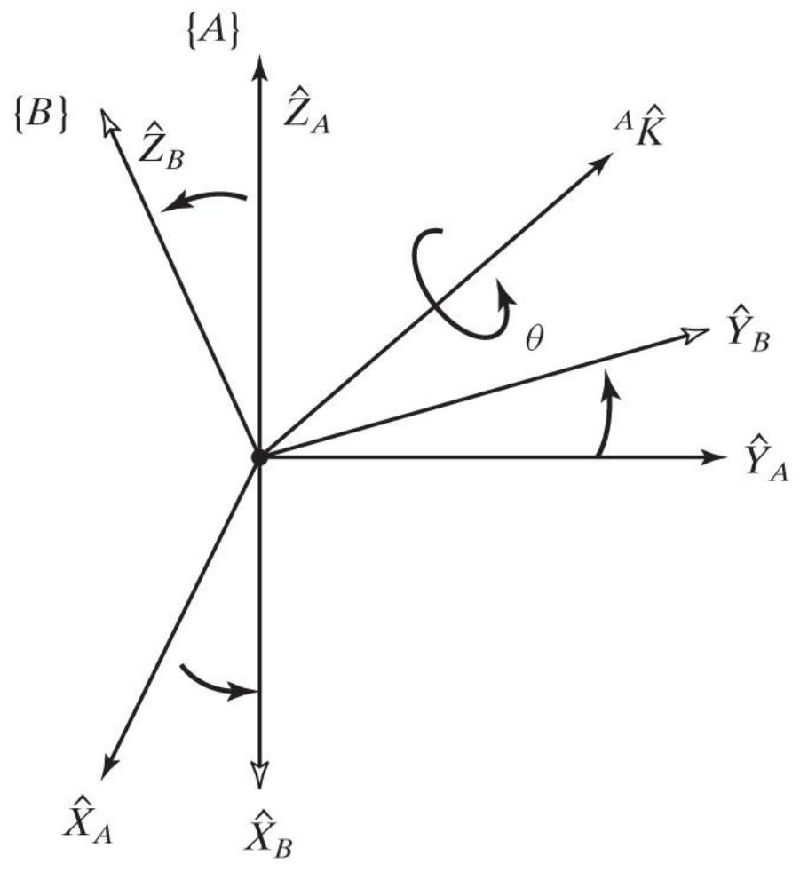
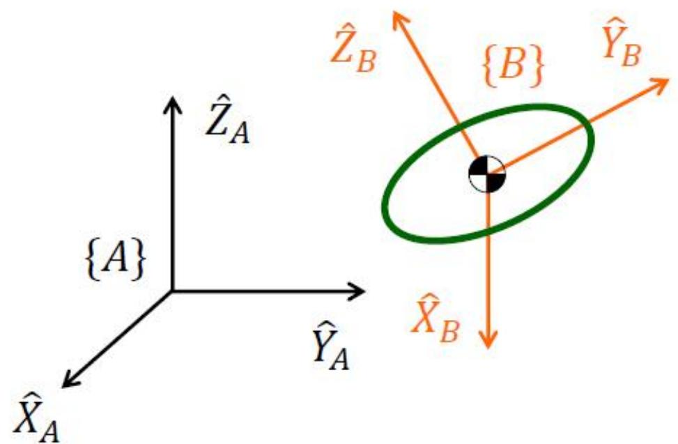
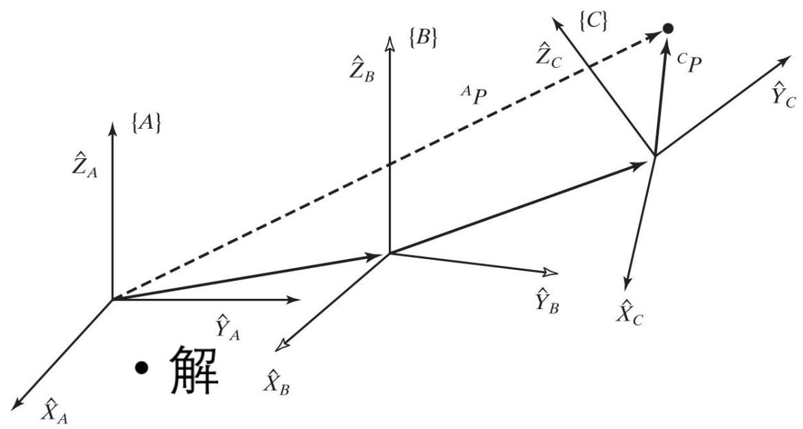
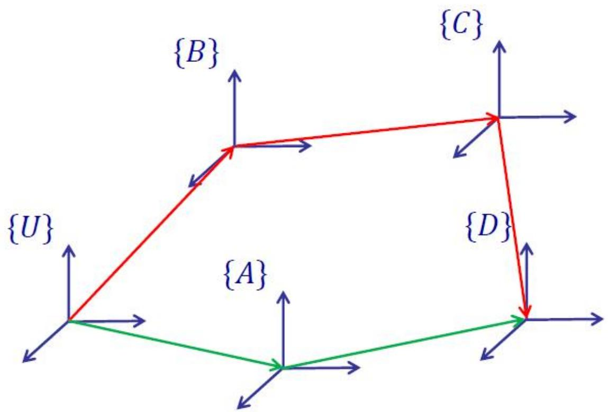

# 空间描述和变换（下）：轴角、四元数与齐次变换

> [!abstract] 本章导览
> 承接 [[理论课02.空间描述和变换a_笔记]]，本节把「姿态」补全为「位姿（位置+姿态）」，引出贯穿全课程的核心工具——**齐次变换矩阵 $T$**：
> 1. 旋转矩阵补充性质（Cayley 公式、3 参数本质）
> 2. **等效角度-轴线**（Equivalent Angle-Axis）表示
> 3. **欧拉参数**（即单位四元数）
> 4. **齐次变换矩阵 $^A_B T$**——平移与旋转的统一表达
> 5. $T$ 的三种用法、**复合变换**、**逆变换**、连续运算法则
> 6. 计算效率问题

---

## 一、旋转矩阵的补充性质

> [!note] 24 种 → 12 种唯一参数化
> 绕主轴连续三转共有 **12 种固定角 + 12 种欧拉角 = 24 种**设定法；但因固定角与欧拉角的**对偶性**，实际只有 **12 种唯一**的参数设定。（书末附录 B 列出全部 24 种等效旋转矩阵。）

**Cayley 公式**：任意正交阵 $R$ 可由一个反对称阵 $S$（$S=-S^T$）生成：
$$R = (I_3 - S)^{-1}(I_3 + S),\qquad S=\begin{bmatrix}0&-s_z&s_y\\s_z&0&-s_x\\-s_y&s_x&0\end{bmatrix}$$
反对称阵只含 3 个参数 $(s_x,s_y,s_z)$ → 再次印证**任意 $3\times3$ 旋转矩阵仅需 3 个参数确定**。

> [!important] 旋转矩阵 = 标准正交阵（special orthogonal）
> 各列单位正交，$\det R = +1$（"标准"即指此）。9 个元素受 6 个约束：
> $$|x|=|y|=|z|=1,\quad x\cdot y = x\cdot z = y\cdot z = 0$$

---

## 二、等效角度-轴线（Equivalent Angle-Axis）

任意姿态都可表示为：**先令 $\{B\}$ 与 $\{A\}$ 重合，再绕单位矢量 $^A k$ 按右手定则转 $\theta$**，记作 $^A_B R(\hat k,\theta)$ 或 $R_K(\theta)$。

**轴角 → 旋转矩阵**（Rodrigues 形式，$v\theta = 1-\cos\theta$）：
$$R_K(\theta)=\begin{bmatrix} k_xk_x v\theta + c\theta & k_xk_y v\theta - k_z s\theta & k_xk_z v\theta + k_y s\theta \\ k_xk_y v\theta + k_z s\theta & k_yk_y v\theta + c\theta & k_yk_z v\theta - k_x s\theta \\ k_xk_z v\theta - k_y s\theta & k_yk_z v\theta + k_x s\theta & k_zk_z v\theta + c\theta \end{bmatrix}$$

**旋转矩阵 → 轴角**（反解）：
$$\theta = \arccos\!\left(\frac{r_{11}+r_{22}+r_{33}-1}{2}\right),\qquad \hat K = \frac{1}{2\sin\theta}\begin{bmatrix}r_{32}-r_{23}\\r_{13}-r_{31}\\r_{21}-r_{12}\end{bmatrix}$$

> [!warning] 退化情形
> $\theta=0$ 时轴不定；$\theta=180^\circ$ 时 $\sin\theta=0$，上式失效，需另行处理。

---

## 三、欧拉参数（单位四元数）

用 4 个数描述姿态，由轴角导出：
$$\varepsilon_1 = k_x\sin\tfrac{\theta}{2},\ \varepsilon_2 = k_y\sin\tfrac{\theta}{2},\ \varepsilon_3 = k_z\sin\tfrac{\theta}{2},\ \varepsilon_4 = \cos\tfrac{\theta}{2}$$
约束 $\varepsilon_1^2+\varepsilon_2^2+\varepsilon_3^2+\varepsilon_4^2 = 1$ —— 姿态即四维空间**单位超球面上一点**，亦即一个**单位四元数**。

由欧拉参数构造旋转矩阵：
$$R_\varepsilon = \begin{bmatrix} 1-2\varepsilon_2^2-2\varepsilon_3^2 & 2(\varepsilon_1\varepsilon_2-\varepsilon_3\varepsilon_4) & 2(\varepsilon_1\varepsilon_3+\varepsilon_2\varepsilon_4) \\ 2(\varepsilon_1\varepsilon_2+\varepsilon_3\varepsilon_4) & 1-2\varepsilon_1^2-2\varepsilon_3^2 & 2(\varepsilon_2\varepsilon_3-\varepsilon_1\varepsilon_4) \\ 2(\varepsilon_1\varepsilon_3-\varepsilon_2\varepsilon_4) & 2(\varepsilon_2\varepsilon_3+\varepsilon_1\varepsilon_4) & 1-2\varepsilon_1^2-2\varepsilon_2^2 \end{bmatrix}$$

> [!tip] 反解时的数值陷阱
> $\varepsilon_4 = \tfrac12\sqrt{1+r_{11}+r_{22}+r_{33}}$，其余 $\varepsilon_i = (r_{jk}-r_{kj})/4\varepsilon_4$。当绕轴转 $180^\circ$ 时 $\varepsilon_4=0$，该式失效，需换公式。**四元数无万向锁、便于插值，工程首选。**

> [!summary] 姿态表示法全家福
>
> | 方法 | 参数个数 | 特点 |
> |---|---|---|
> | 旋转矩阵 | 9（3 DOF） | 直观、易用，但冗余 |
> | 固定角/欧拉角 | 3 | 紧凑，但有**万向锁** |
> | 轴角 | 3（$\theta\hat k$） | 物理直观，$180^\circ$ 退化 |
> | 欧拉参数/四元数 | 4（1 约束） | **无奇异、便于插值** |

---

## 四、齐次变换矩阵 $T$（核心工具）

刚体状态 = **平移 + 转动**。在刚体（常取质心）建坐标系 $\{B\}$：
- 平移：原点位置 $^A P_{Borg}$（$\{B\}$ 原点在 $\{A\}$ 中的坐标）
- 转动：姿态 $^A_B R$
- 合记：$\{B\} = \{\,^A_B R,\ ^A P_{Borg}\,\}$

把二者塞进一个 $4\times4$ 矩阵——**齐次变换矩阵**（Homogeneous Transformation Matrix）：

$$^A_B T = \begin{bmatrix} & ^A_B R & & ^A P_{Borg} \\ 0 & 0 & 0 & 1 \end{bmatrix} = \begin{bmatrix} | & | & | & | \\ ^A\hat X_B & ^A\hat Y_B & ^A\hat Z_B & ^A P_{Borg} \\ | & | & | & | \\ 0 & 0 & 0 & 1 \end{bmatrix}$$

> [!important] 点变换（用增广坐标 $[P;1]$）
> $$\begin{bmatrix}^A P\\1\end{bmatrix} = {}^A_B T\begin{bmatrix}^B P\\1\end{bmatrix},\qquad ^A P = {}^A_B R\,{}^B P + {}^A P_{Borg}$$
> 即「先按姿态旋转，再加上原点平移」。第 4 个分量恒为 1，保证平移项被加进来。

> [!example] 算例：点的坐标变换
> $^B P=[3,7,0]^T$，$^A P_{Borg}=[10,5,0]^T$，$\{B\}$ 相对 $\{A\}$ 绕 Z 转 30°：
> $$\begin{bmatrix}^A P\\1\end{bmatrix} = \begin{bmatrix}\tfrac{\sqrt3}{2}&-\tfrac12&0&10\\ \tfrac12&\tfrac{\sqrt3}{2}&0&5\\ 0&0&1&0\\ 0&0&0&1\end{bmatrix}\begin{bmatrix}3\\7\\0\\1\end{bmatrix} = \begin{bmatrix}9.098\\12.562\\0\\1\end{bmatrix}$$

### $T$ 的三种用法（与 $R$ 完全平行）

> [!summary] 一个 $T$，三种身份
>
> | 用法 | 公式 | 含义 |
> |---|---|---|
> | ① 描述位姿 | $^A_B T$ | frame {B} 相对 {A} 的空间状态 |
> | ② 坐标变换 | $[^A P;1] = {}^A_B T[^B P;1]$ | 点在不同 frame 间换算 |
> | ③ 算子 | $[^A P_2;1] = T[^A P_1;1]$ | 同一 frame 内对点平移+转动 |

> [!note] Operator 的「反向」直觉
> 把 $T$ 当算子对点操作，等价于对 frame 做**反向**操作：**点往前移 = frame 往后移；点逆时针转 = frame 顺时针转。** 算子顺序也有讲究：「先转后移」与「先移后转」结果不同（先移再转时平移量 $^A Q$ 也会被一起转动）。

---

## 五、复合变换与逆变换

### 复合变换（链式）

已知 $\{C\}$ 相对 $\{B\}$、$\{B\}$ 相对 $\{A\}$，求 $^A P$：
$$^A P = {}^A_B T\,{}^B_C T\,{}^C P \quad\Rightarrow\quad ^A_C T = {}^A_B T\,{}^B_C T$$

展开式（旋转连乘、平移逐级累加并被前级姿态旋转）：
$$^A_C T = \begin{bmatrix} ^A_B R\,{}^B_C R & ^A P_{Borg} + {}^A_B R\,{}^B P_{Corg} \\ 0\ 0\ 0 & 1 \end{bmatrix}$$

### 逆变换（巧用正交性，避免直接求 $4\times4$ 逆）

> [!important] 齐次变换的逆有闭式解
> $$^A_B T^{-1} = {}^B_A T = \begin{bmatrix} ^A_B R^T & -{}^A_B R^T\,{}^A P_{Borg} \\ 0\ 0\ 0 & 1 \end{bmatrix}$$
> 推导要点：$^B_A R = {}^A_B R^T$（旋转部分转置），平移部分 $^B P_{Aorg} = -{}^A_B R^T\,{}^A P_{Borg}$。**绝不要硬算 $4\times4$ 矩阵求逆。**

### 连续运算求未知相对关系（变换方程）

闭合回路 $^U_D T = {}^U_A T\,{}^A_D T = {}^U_B T\,{}^B_C T\,{}^C_D T$，欲求其中任一未知 $T$，左/右乘对应逆即可。例如 $^C_D T$ 未知：
$$^C_D T = {}^B_C T^{-1}\,{}^U_B T^{-1}\,{}^U_A T\,{}^A_D T$$

> [!note] 连续运算法则（premultiply vs postmultiply）
> 初始 $\{A\}\equiv\{B\}$（$^A_B T=I$），$\{B\}$ 依次经 $T_1,T_2,T_3$：
> - **绕固定 $\{A\}$ 轴转/移 → 左乘（premultiply）**：$^A_B T = T_3 T_2 T_1$
> - **绕 $\{B\}$ 自身当下轴转/移 → 右乘（postmultiply）**：$^A_B T = T_1 T_2 T_3$
>
> 思路与 固定角 vs 欧拉角 的连乘顺序完全一致。

---

## 六、自由矢量变换与计算效率

> [!note] 矢量类型决定变换方式
> 线矢量、自由矢量等类型不同，变换形式不同（详见后续速度/力章节的雅可比变换）。维数、大小、方向都相同的两矢量才相等；功能等效是另一回事。

> [!tip] 计算效率：运算顺序很关键
> 工业机器人软件**不直接用齐次变换**——不愿在与 0、1 相乘上浪费时间。同样求 $^A P = {}^A_B R\,{}^B_C R\,{}^C_D R\,{}^D P$：
> - **先把三个 $R$ 连乘**再乘矢量：63 次乘法 + 42 次加法。
> - **逐个矩阵作用于矢量**（从右往左）：仅 **27 次乘法 + 18 次加法**。
> 结论：先算矩阵×矩阵代价大，**矩阵×矢量逐次推进更省**。

---

## 本章小结

> [!summary] 核心收束
> - **位姿 = 平移 $^A P_{Borg}$ + 姿态 $^A_B R$**，统一进 $4\times4$ 齐次变换 $^A_B T$。
> - $T$ 的点变换：$^A P = {}^A_B R\,{}^B P + {}^A P_{Borg}$（增广坐标自动加平移）。
> - 复合 $^A_C T = {}^A_B T\,{}^B_C T$；逆 $^A_B T^{-1}=\begin{bmatrix}R^T & -R^T P_{Borg}\\0&1\end{bmatrix}$ 有闭式解。
> - 连乘顺序：绕固定轴**左乘**、绕自身轴**右乘**（呼应固定角/欧拉角）。
> - 姿态四类表示：矩阵 / 欧拉角(有锁) / 轴角 / 四元数(无锁、首选插值)。

## 自测题

1. 写出齐次变换 $^A_B T$ 的逆，并解释为何不需要做一般 $4\times4$ 求逆。
2. $^B P=[3,7,0]^T$，$\{B\}$ 相对 $\{A\}$ 绕 Z 转 30° 且原点在 $[10,5,0]^T$，求 $^A P$。
3. 「先平移再旋转」与「先旋转再平移」对同一点结果为何不同？写出两种 $T$。
4. 轴角反解中 $\theta=180^\circ$ 为什么会失效？四元数如何规避此问题？
5. 求 $^A P={}^A_B R\,{}^B_C R\,{}^C_D R\,{}^D P$，说明哪种运算顺序更省乘加次数。

> [!info] 作业（课本第二章）
> 课后题 1、2、16；截止 2026-03-31 23:59，企业微信提交。

> 关联：[[理论课03.操作臂运动学a_笔记]]（用 $T$ 串联连杆得正运动学）、[[理论课02.空间描述和变换a_笔记]]（旋转矩阵基础）
