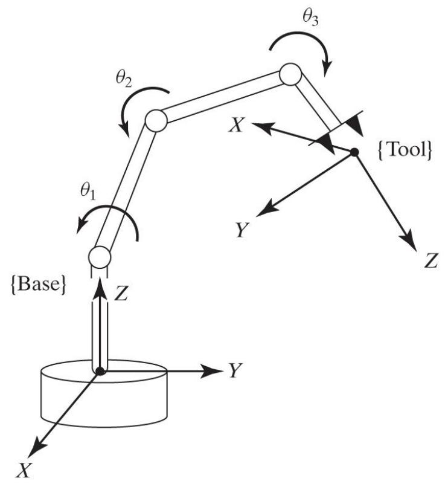
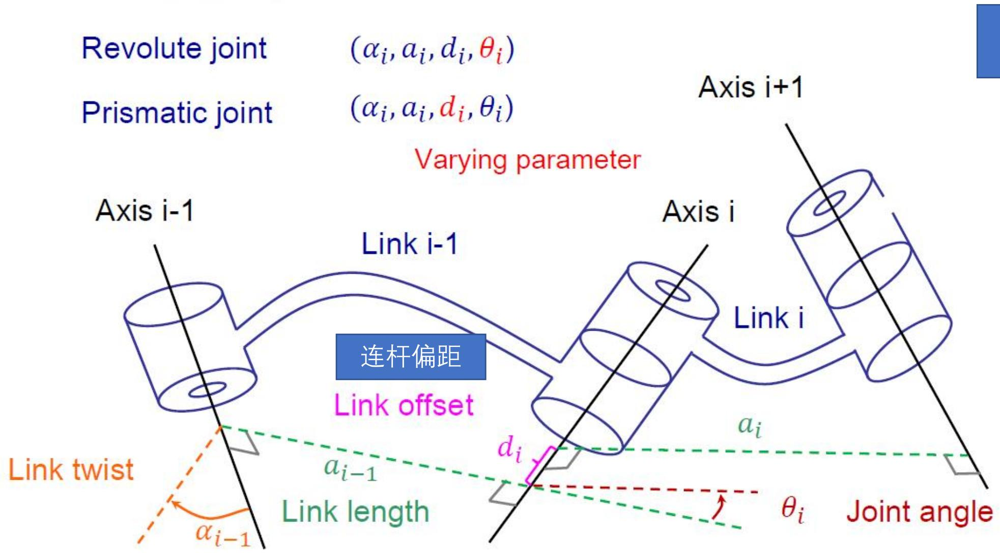
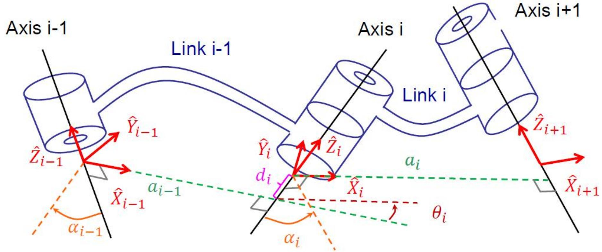
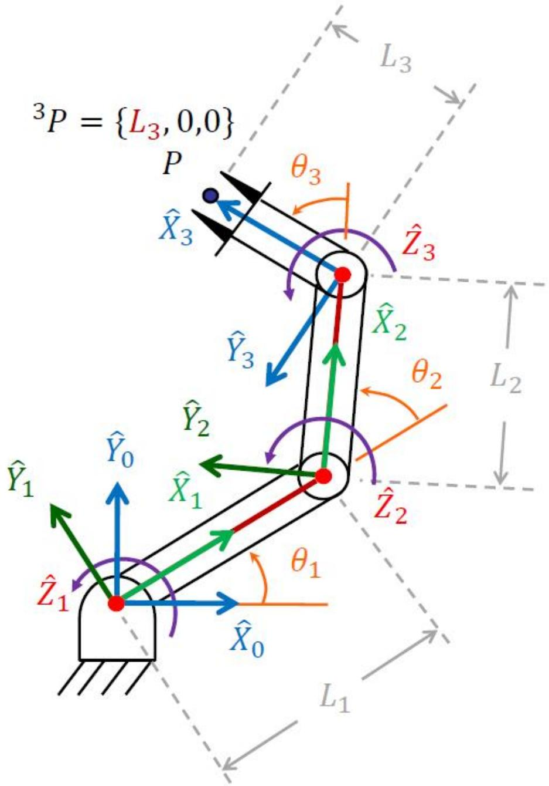
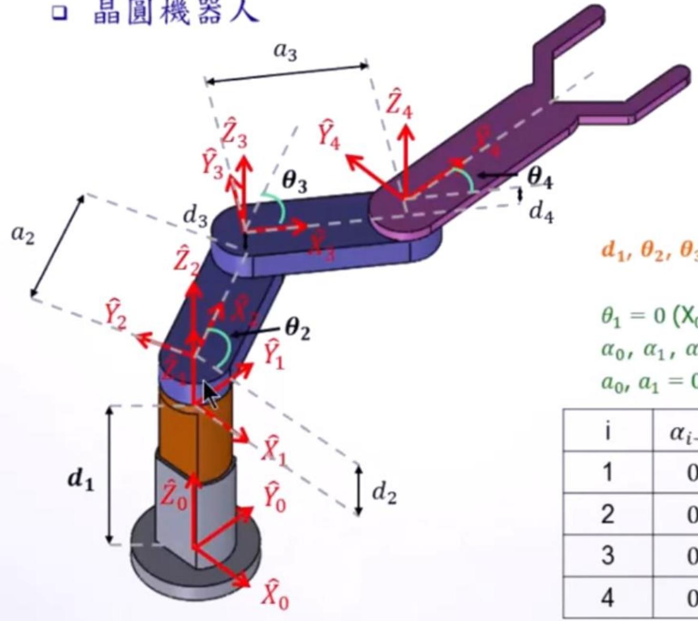

# 操作臂运动学（上）：DH 参数与正运动学

> [!abstract] 本章导览
> 把 [[理论课02.空间描述和变换b_笔记|齐次变换]] $T$ 用于真实机械臂：通过在每根连杆上贴坐标系、用 4 个参数描述相邻连杆关系，最终把 $n$ 个关节变量映射到末端位姿。
> 1. 运动学 vs 动力学的界定
> 2. 关节（Joint）与连杆（Link）的编号
> 3. **连杆四参数**：$a_{i-1}$（连杆长度）、$\alpha_{i-1}$（连杆扭转）、$d_i$（连杆偏距）、$\theta_i$（关节角）
> 4. **DH 参数法**（Craig 版）与连杆坐标系定义
> 5. **连杆变换矩阵** $^{i-1}_i T$ 及连乘得正运动学 $^0_n T$
> 6. 三类空间：驱动器 / 关节 / 笛卡儿空间

---

## 一、运动学 vs 动力学

> [!note] 两个层次
>
> | | 研究对象 | 核心关系 |
> |---|---|---|
> | **运动学 Kinematics** | 运动状态本身，**不涉及力** | 位置 $x$、速度 $v=\dot x$、加速度 $a=\ddot x$、时间 $t$ |
> | **动力学 Dynamics** | 力/力矩**如何产生**运动 | 牛顿第二定律 $\sum F = ma$；功能原理；冲量动量 |

**正运动学（Forward Kinematics）**：由关节变量求末端执行器相对基座的位姿，$^W P = f(\theta_1,\theta_2,\dots,\theta_n)$。

---

## 二、关节与连杆

> [!note] 基本构件
> - **关节（Joint）**：每个转动（Revolute）或移动（Prismatic）关节有 **1 个自由度**，绕/沿某特定轴运动；通常装位置传感器测相对位移。
>   - 转动关节 → 位移为**关节角**；移动关节 → 位移为**关节偏移量**。
> - **连杆（Link）**：连接关节的刚体。编号：
>   - **Link 0**：地杆（基座），不动；**Link 1**：第一个可动杆，与 Link 0 相连；依次 Link 2, 3, …

**描述手臂状态的方法**：在每根连杆上固连一个坐标系 $\{i\}$（贴在连杆 $i$ 上），用坐标系的位姿代表连杆位姿，再求相邻坐标系间的相对几何关系。

---

## 三、连杆四参数（DH 参数核心）

> [!important] 描述「一根连杆」+「与邻杆连接」共需 4 个参数
> 空间中任意两关节轴之间，存在唯一一条**公垂线**（同时垂直两轴）。
>
> | 参数 | 名称 | 几何含义 |
> |---|---|---|
> | $a_{i-1}$ | **连杆长度** Link length | 沿 $\hat X_{i-1}$，$\hat Z_{i-1}$ 到 $\hat Z_i$ 的**距离**（公垂线长，$a_i>0$）|
> | $\alpha_{i-1}$ | **连杆扭转** Link twist | 以 $\hat X_{i-1}$ 看，$\hat Z_{i-1}$ 到 $\hat Z_i$ 的**夹角** |
> | $d_i$ | **连杆偏距** Link offset | 沿 $\hat Z_i$，$\hat X_{i-1}$ 到 $\hat X_i$ 的**距离** |
> | $\theta_i$ | **关节角** Joint angle | 以 $\hat Z_i$ 看，$\hat X_{i-1}$ 到 $\hat X_i$ 的**夹角** |
>
> 记忆：**$(a,\alpha)$ 描述一根连杆自身**（沿/绕 $\hat X_{i-1}$）；**$(d,\theta)$ 描述两连杆如何连接**（沿/绕 $\hat Z_i$）。

> [!warning] 哪个是关节变量（Varying parameter）？
> - **转动关节**：$\theta_i$ 可变，其余 3 个固定（$d_i$ 常为 0）。
> - **移动关节**：$d_i$ 可变，其余 3 个固定（$\theta_i$ 常为 0）。

---

## 四、连杆坐标系定义（DH，Craig 版）

> [!important] 坐标系 $\{i\}$ 的建立规则
> - $\hat Z_i$ 与**关节轴 $i$ 重合**。
> - 原点：公垂线 $a_i$ 与关节轴 $i$ 的交点。
> - $\hat X_i$：沿 $a_i$ 方向（$a_i\neq0$）；当 $a_i=0$ 时 $\hat X_i \perp \hat Z_i$ 与 $\hat Z_{i+1}$ 所在平面。
> - $\hat Y_i$：由右手定则确定。

> [!note] 首末连杆的特殊约定
> - **地杆 Link 0**：$\{0\}$ 与 $\{1\}$ 在初始时重合，$a_0=0,\ \alpha_0=0$。
> - **末杆 Link n**：取 $\hat X_n$ 与 $\hat X_{n-1}$ 同向，$a_n=0,\ \alpha_n=0$。
> - 这样首末杆各只剩 1 个关节变量。

---

## 五、连杆变换矩阵 $^{i-1}_i T$

把 $\{i\}$ 到 $\{i-1\}$ 的变换拆成**四个基本子变换**连乘（引入中间系 $\{P\},\{Q\},\{R\}$，每步只含一个参数）：

$$^{i-1}_i T = T_{\hat X_{i-1}}(\alpha_{i-1})\,T_{\hat X_R}(a_{i-1})\,T_{\hat Z_Q}(\theta_i)\,T_{\hat Z_P}(d_i)$$

> [!important] 连杆变换矩阵（务必会默写/会用）
> $$^{i-1}_i T = \begin{bmatrix} c\theta_i & -s\theta_i & 0 & a_{i-1} \\ s\theta_i c\alpha_{i-1} & c\theta_i c\alpha_{i-1} & -s\alpha_{i-1} & -s\alpha_{i-1}d_i \\ s\theta_i s\alpha_{i-1} & c\theta_i s\alpha_{i-1} & c\alpha_{i-1} & c\alpha_{i-1}d_i \\ 0 & 0 & 0 & 1 \end{bmatrix}$$

### 正运动学：连续连杆变换

$$^0_n T = {}^0_1 T\ {}^1_2 T\ {}^2_3 T\ \cdots\ {}^{n-1}_n T$$

> [!summary] 求解流程
> 把整体运动学问题分解为 $n$ 个子问题（每个 $^{i-1}_i T$），每个子问题再分解为 4 个单参数次子变换。逐杆建系 → 填 DH 参数表 → 代入连杆变换公式 → 连乘 → 得到 $^0_n T$，即末端系 $\{n\}$ 相对基座 $\{0\}$ 的完整位姿。

### 实例：3R 平面操作臂

其 DH 参数表（所有轴平行，$\alpha=0$）：

| $i$ | $\alpha_{i-1}$ | $a_{i-1}$ | $d_i$ | $\theta_i$ |
|---|---|---|---|---|
| 1 | 0 | 0 | 0 | $\theta_1$ |
| 2 | 0 | $L_1$ | 0 | $\theta_2$ |
| 3 | 0 | $L_2$ | 0 | $\theta_3$ |

末端 $^3P=\{L_3,0,0\}$，连乘 $^0_3T={}^0_1T\,{}^1_2T\,{}^2_3T$ 即得末端位置。

> [!example] 真实机器人：晶圆搬运机器人
> 
> 第一关节为移动（$d_1$），其余为转动；所有 Z 轴平行使全部 $\alpha=0$，大幅简化变换。

> [!tip] 建系小心机（In-video Quiz 提炼）
> 判断哪两个 DH 参数是驱动变量：先看关节类型（R→θ，P→d）。若 $Z$ 轴相交则 $a=0$；若 $Z$ 轴平行则 $\alpha=0$；若 $X$ 轴平行则 $\theta=0$。例如「1R + 1P」臂的驱动参数是 $\theta_1$ 与 $d_2$。

---

## 六、三类空间

> [!note] 驱动器 / 关节 / 笛卡儿空间
>
> | 空间 | 含义 |
> |---|---|
> | **驱动器空间 Actuator space** | 各驱动器（马达）的变量；传感器常装于此 |
> | **关节空间 Joint space** | $n\times1$ 关节向量 $(\theta_1,\dots,\theta_n)$，所有关节向量构成 |
> | **笛卡儿空间 Cartesian space** | 末端位姿（位置正交 + 姿态），又称任务空间/操作空间 |
>
> 转换关系：
> - **关节空间 ⇄ 笛卡儿空间**：正运动学（关节→笛卡儿）/ 逆运动学（笛卡儿→关节，见 [[理论课04.操作臂逆运动学_笔记]]）。
> - **驱动器空间 ⇄ 关节空间**：由连接驱动器与关节的机构决定（如齿轮箱齿比 $N$：$\theta_{motor}=\theta_{joint}\cdot N$）。工业机器人常用差动驱动、四连杆等，需显式建立该映射。

> [!warning] 为何要驱动器空间？
> 许多工业机器人**关节并非由驱动器直接驱动**（差动驱动、四连杆驱动旋转关节等）。由于传感器装在驱动器上，控制运算必须把关节向量表示成驱动器变量方程。

---

## 本章小结

> [!summary] 核心收束
> - 正运动学 = 关节变量 → 末端位姿，靠**连杆坐标系 + 齐次变换连乘**。
> - **连杆四参数**：$(a_{i-1},\alpha_{i-1})$ 描述连杆自身（沿/绕 $\hat X_{i-1}$）；$(d_i,\theta_i)$ 描述连接（沿/绕 $\hat Z_i$）。
> - **关节变量**：转动关节是 $\theta_i$，移动关节是 $d_i$。
> - 牢记连杆变换矩阵 $^{i-1}_i T$，连乘得 $^0_n T = {}^0_1T\cdots{}^{n-1}_nT$。
> - 三空间：驱动器 ⇄ 关节（机构决定）⇄ 笛卡儿（正/逆运动学）。

## 自测题

1. 写出连杆四参数 $a_{i-1},\alpha_{i-1},d_i,\theta_i$ 各自的几何定义，并指出转动/移动关节各以哪个为变量。
2. 默写连杆变换矩阵 $^{i-1}_i T$，并说明它由哪 4 个单参数子变换连乘而成。
3. 对 3R 平面臂写出 DH 参数表，并说明为什么所有 $\alpha=0$。
4. 某关节轴 $Z_1$ 与 $Z_2$ 相交且平行，对应哪些 DH 参数为 0？
5. 解释「驱动器空间、关节空间、笛卡儿空间」的区别，以及为何工业机器人需要驱动器空间这一层。

> 关联：[[理论课02.空间描述和变换b_笔记]]（齐次变换基础）、[[理论课03.操作臂运动学b_笔记]]（PUMA 等实例与坐标系命名）、[[理论课04.操作臂逆运动学_笔记]]（笛卡儿→关节）
