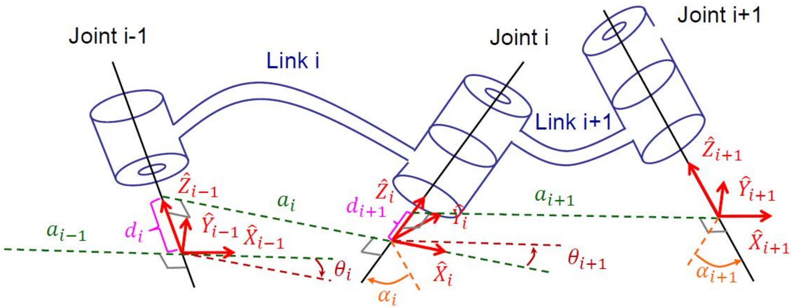
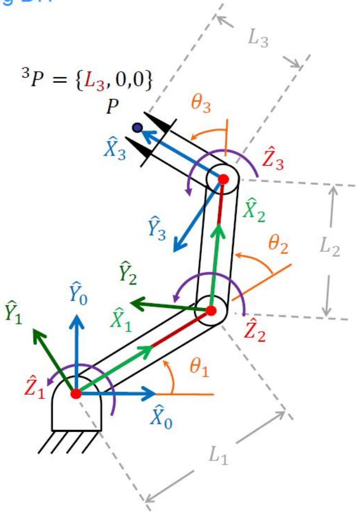
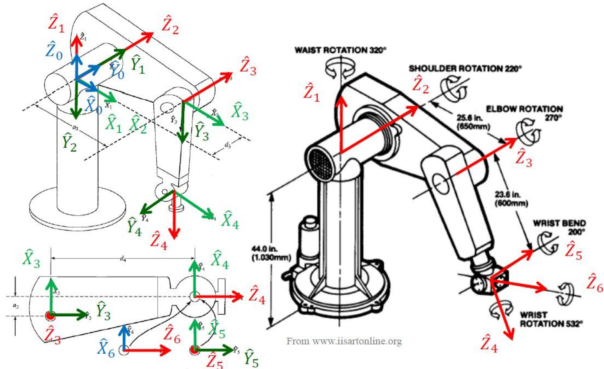
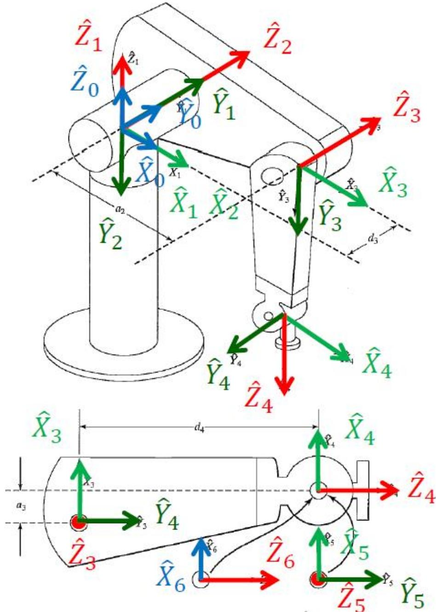

# 操作臂运动学（下）：两种 DH 约定与 PUMA 560 实例

> [!abstract] 本章导览
> 承接 [[理论课03.操作臂运动学a_笔记]]，本节做三件事：
> 1. 对比 **Craig DH** 与 **Standard DH** 两种约定（坐标系编号与变换矩阵差异）
> 2. 完整推导 **3R 平面臂**的正运动学闭式解
> 3. 真实机器人 **PUMA 560（6R）** 的 DH 参数表与正运动学
> 4. 运动学计算的工程优化技巧

---

## 一、Craig DH vs Standard DH（两种约定）

> [!important] 核心区别：坐标系 $\{i\}$ 贴在哪个关节轴上
>
> | | **Craig DH**（本课程默认）| **Standard DH** |
> |---|---|---|
> | $\hat Z_i$ 对齐 | 关节轴 **$i$** | 关节轴 **$i+1$** |
> | 参数下标 | $\alpha_{i-1},a_{i-1},d_i,\theta_i$（**前杆**扭转/长度）| $\alpha_i,a_i,d_i,\theta_i$（**本杆**）|
> | 变换分解 | 先 $\hat X$（$\alpha,a$）后 $\hat Z$（$\theta,d$）| 先 $\hat Z$（$\theta,d$）后 $\hat X$（$a,\alpha$）|

### Craig DH 的连杆变换（沿/绕顺序 $\hat X_{i-1}\to\hat Z_i$）

$$^{i-1}_i T = T_{\hat X_{i-1}}(\alpha_{i-1})T_{\hat X_R}(a_{i-1})T_{\hat Z_Q}(\theta_i)T_{\hat Z_P}(d_i)=\begin{bmatrix} c\theta_i & -s\theta_i & 0 & a_{i-1} \\ s\theta_i c\alpha_{i-1} & c\theta_i c\alpha_{i-1} & -s\alpha_{i-1} & -s\alpha_{i-1}d_i \\ s\theta_i s\alpha_{i-1} & c\theta_i s\alpha_{i-1} & c\alpha_{i-1} & c\alpha_{i-1}d_i \\ 0 & 0 & 0 & 1 \end{bmatrix}$$

### Standard DH 的连杆变换（沿/绕顺序 $\hat Z_{i-1}\to\hat X_i$）

> [!note] Standard DH 参数定义
> - $\theta_i$：以 $\hat Z_{i-1}$ 看，$\hat X_{i-1}\to\hat X_i$ 的夹角
> - $d_i$：沿 $\hat Z_{i-1}$，$\hat X_{i-1}\to\hat X_i$ 的距离
> - $a_i$：沿 $\hat X_i$，$\hat Z_{i-1}\to\hat Z_i$ 的距离
> - $\alpha_i$：以 $\hat X_i$ 看，$\hat Z_{i-1}\to\hat Z_i$ 的夹角

$$^{i-1}_i T = T_{\hat Z_{i-1}}(\theta_i)T_{\hat Z_R}(d_i)T_{\hat X_Q}(a_i)T_{\hat X_P}(\alpha_i)=\begin{bmatrix} c\theta_i & -s\theta_i c\alpha_i & s\theta_i s\alpha_i & a_i c\theta_i \\ s\theta_i & c\theta_i c\alpha_i & -c\theta_i s\alpha_i & a_i s\theta_i \\ 0 & s\alpha_i & c\alpha_i & d_i \\ 0 & 0 & 0 & 1 \end{bmatrix}$$

> [!warning] 务必明确用哪种约定
> 两种约定的变换矩阵形式不同、同一机器人的 DH 表也不同。看文献/代码先确认是 Craig 还是 Standard，否则结果全错。本课程及 Craig 教材统一用 **Craig DH**。

---

## 二、3R 平面臂正运动学（完整推导）

DH 表（Craig，所有轴平行 $\alpha=0$）：

| $i$ | $\alpha_{i-1}$ | $a_{i-1}$ | $d_i$ | $\theta_i$ |
|---|---|---|---|---|
| 1 | 0 | 0 | 0 | $\theta_1$ |
| 2 | 0 | $L_1$ | 0 | $\theta_2$ |
| 3 | 0 | $L_2$ | 0 | $\theta_3$ |

三个连杆变换（代入 Craig 公式，$\alpha=0$ 时退化为平面旋转+平移）：
$$^0_1T=\begin{bmatrix}c_1&-s_1&0&0\\s_1&c_1&0&0\\0&0&1&0\\0&0&0&1\end{bmatrix},\quad ^1_2T=\begin{bmatrix}c_2&-s_2&0&L_1\\s_2&c_2&0&0\\0&0&1&0\\0&0&0&1\end{bmatrix},\quad ^2_3T=\begin{bmatrix}c_3&-s_3&0&L_2\\s_3&c_3&0&0\\0&0&1&0\\0&0&0&1\end{bmatrix}$$

连乘得 $^0_3T$（角度叠加 $c_{123}=\cos(\theta_1+\theta_2+\theta_3)$）：

> [!important] 3R 平面臂正运动学闭式解
> $$^0_3T=\begin{bmatrix} c_{123} & -s_{123} & 0 & L_1 c_1 + L_2 c_{12} \\ s_{123} & c_{123} & 0 & L_1 s_1 + L_2 s_{12} \\ 0 & 0 & 1 & 0 \\ 0 & 0 & 0 & 1 \end{bmatrix}$$
> 再右乘末端 $^3P=[L_3,0,0]^T$ 得末端点位置：
> $$\begin{cases} p_x = L_1 c_1 + L_2 c_{12} + L_3 c_{123} \\ p_y = L_1 s_1 + L_2 s_{12} + L_3 s_{123} \end{cases}$$
> 这就是平面臂「逐段三角函数累加」的经典结果，是后续逆运动学的出发点。

---

## 三、PUMA 560（6R）正运动学

PUMA 560 是经典六自由度工业机器人，**全部 6 个关节均为转动关节（6R 机构）**。

DH 参数表（Craig）：

| $i$ | $\alpha_{i-1}$ | $a_{i-1}$ | $d_i$ | $\theta_i$ |
|---|---|---|---|---|
| 1 | $0°$ | 0 | 0 | $\theta_1$ |
| 2 | $-90°$ | 0 | 0 | $\theta_2$ |
| 3 | $0°$ | $a_2$ | $d_3$ | $\theta_3$ |
| 4 | $-90°$ | $a_3$ | $d_4$ | $\theta_4$ |
| 5 | $90°$ | 0 | 0 | $\theta_5$ |
| 6 | $-90°$ | 0 | 0 | $\theta_6$ |

> [!note] 求解策略：分段连乘后合并
> 先算各 $^{i-1}_iT$，再**分段合并**（如 $^4_6T={}^4_5T\,{}^5_6T$、$^3_6T={}^3_4T\,{}^4_6T$、$^1_3T={}^1_2T\,{}^2_3T$），最后 $^0_6T={}^0_1T\,{}^1_6T$。这样比一口气乘 6 个矩阵更易管理、便于复用中间结果。

部分末端位置分量（体现「肩+肘」角组合 $c_{23}=\cos(\theta_2+\theta_3)$）：
$$p_x = c_1[a_2 c_2 + a_3 c_{23} - d_4 s_{23}] - d_3 s_1$$
$$p_y = s_1[a_2 c_2 + a_3 c_{23} - d_4 s_{23}] + d_3 c_1$$
$$p_z = -a_3 s_{23} - a_2 s_2 - d_4 c_{23}$$

---

## 四、运动学计算的工程优化

> [!tip] 实时性优化技巧（实际系统关心）
> 1. **定点数 vs 浮点数**：变量变化范围小且易确定时用定点（通常 ≤24 位），更快。
> 2. **因式分解**：以增加局部变量为代价减少乘加次数（如对 $p_x,p_y$ 提取公共括号项）。
> 3. **超越函数查表**：$\sin/\cos$ 用级数展开很慢，**查表可省 2–3 倍时间**——主要耗时就在三角函数。
> 4. **姿态只算两列**：旋转矩阵 9 个元素中，只算两列、第三列用**叉乘**得到，省 1/3 计算。

---

## 本章小结

> [!summary] 核心收束
> - **Craig DH（$\hat Z_i$ 对齐轴 $i$）** vs **Standard DH（$\hat Z_i$ 对齐轴 $i+1$）**：变换矩阵与参数下标不同，混用必错。
> - 3R 平面臂：$^0_3T$ 角度逐段累加，末端 $p_x=\sum L_i\cos(\text{累加角})$。
> - PUMA 560 是 6R，DH 表含 $\pm90°$ 扭转；正解靠**分段连乘再合并**。
> - 实时优化：定点数、因式分解、三角函数查表、姿态只算两列+叉乘。

## 自测题

1. Craig DH 与 Standard DH 的核心区别是什么？为什么不能混用？
2. 写出 3R 平面臂的 $^0_3T$，并给出末端点 $p_x,p_y$ 的表达式。
3. PUMA 560 是几自由度、什么机构？其 DH 表里 $\alpha$ 出现 $\pm90°$ 说明了什么几何关系？
4. 计算 $^0_6T$ 时为什么采用分段合并而非直接连乘 6 个矩阵？
5. 列举三种降低运动学计算耗时的工程方法。

> 关联：[[理论课03.操作臂运动学a_笔记]]（DH 参数与连杆坐标系）、[[理论课04.操作臂逆运动学_笔记]]（由位姿反求关节角）、[[理论课05.速度与静力a_笔记]]（雅可比）
