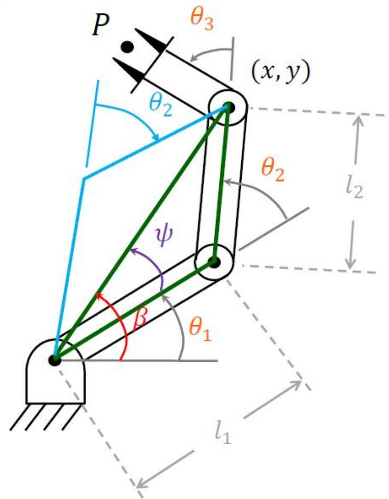
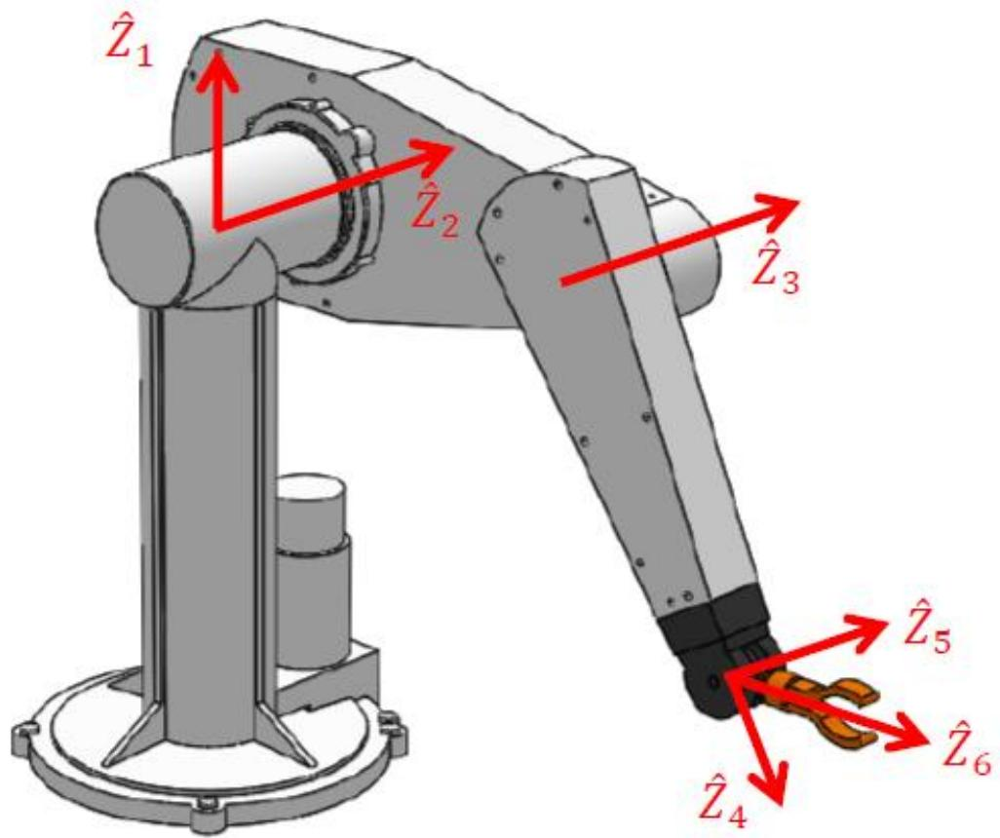
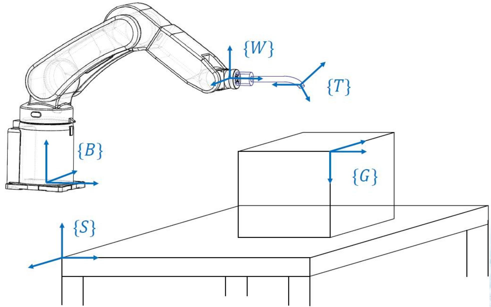
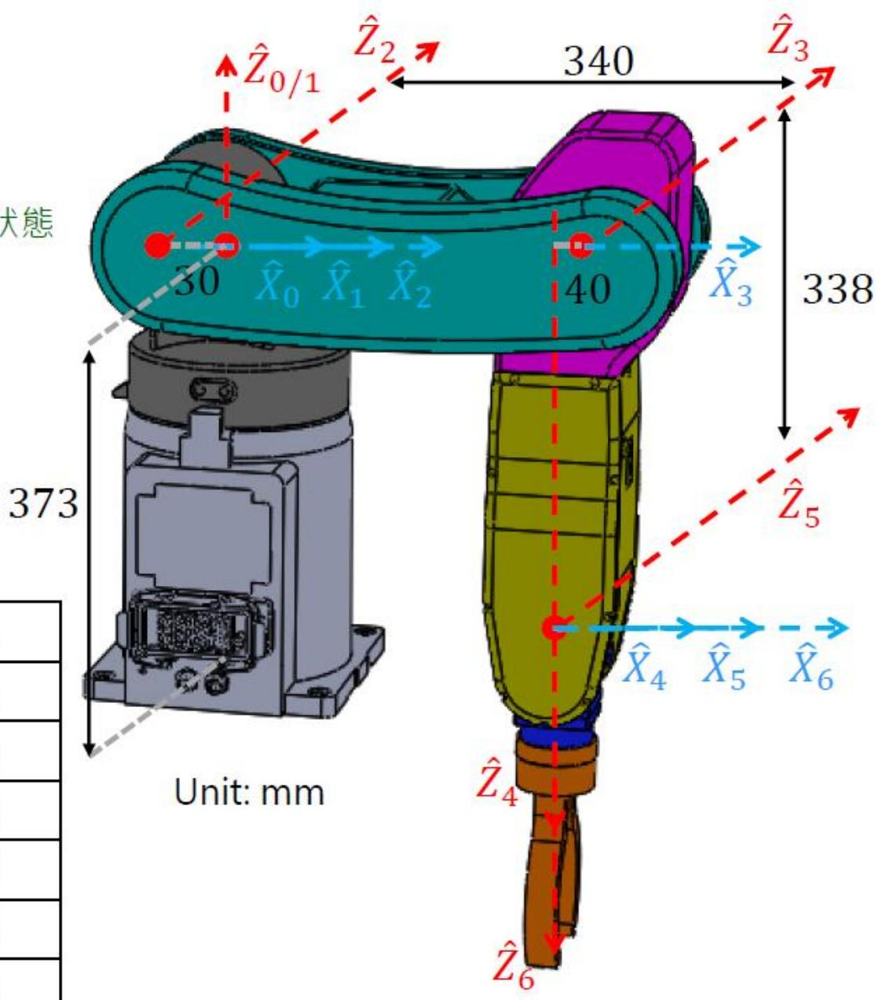

# 操作臂逆运动学（Inverse Kinematics, IK）

> [!abstract] 本章导览
> 逆运动学是正运动学的「反问题」，也是机器人控制中**更难、更核心**的一步：给定末端位姿 → 反求各关节角。
> 1. IK 与 FK 的关系、工作空间（可达/灵巧）
> 2. **解的数目**与多解选择
> 3. **闭式解**：几何法、代数法
> 4. $a\cos\theta+b\sin\theta=c$ 的万能解法
> 5. **Pieper 准则**：三轴交于一点 → 必有闭式解（前三轴定位、后三轴定姿）
> 6. 标准坐标系命名、完整夹杯实例
> 7. 重复精度 vs 精度、标定

---

## 一、FK 与 IK

> [!note] 正逆对照
>
> | | 已知 | 求 |
> |---|---|---|
> | **正运动学 FK** | 关节角 $\theta_i$ | 末端位姿 $^W_H T = f(\theta_1,\dots,\theta_n)$ |
> | **逆运动学 IK** | 末端位姿 $^W_H T$ | 关节角 $[\theta_1,\dots,\theta_n] = f^{-1}(^W_H T)$ |
>
> 对 6-DOF 臂：从 $^0_6 T$ 提取 16 个数（实为 12 个非线性超越方程、6 个未知数、6 个约束）。**非线性 → 不保证唯一解，甚至无解。**

---

## 二、工作空间与解的数目

> [!important] 两类工作空间
> - **可达工作空间（Reachable workspace）**：手臂能以**至少一种**姿态到达的点集。
> - **灵巧工作空间（Dexterous workspace）**：手臂能以**任意**姿态到达的点集（⊆ 可达空间）。
> - 例 RR 臂：$l_1=l_2$ 时灵巧空间退化为原点；$l_1>l_2$ 时存在一个环形不可达内区。

### 解的数目由关节数与连杆参数决定

| 6R 臂的 $a_i$ 条件 | 最多解数 |
|---|---|
| $a_1=a_3=a_5=0$ | ≤ 4 |
| $a_3=a_5=0$ | ≤ 8 |
| $a_3=0$ | ≤ 16 |
| 所有 $a_i\neq0$ | ≤ 16 |

> [!example] PUMA（6R）：8 组解
> 同一末端位姿，前 3 轴有 **4 种姿态**，每种姿态手腕又有 2 组解（共 8 组）：
> $$\theta_4'=\theta_4+180°,\quad \theta_5'=-\theta_5,\quad \theta_6'=\theta_6+180°$$
> 若手臂有几何/关节限位，并非每组解都可用。

> [!tip] 多解如何选？
> - 选**离当前状态最近**的解（最快、最省能）。
> - 选能**避开障碍物**的解。

---

## 三、闭式解：几何法（3R 平面臂）

> [!note] 几何法思路
> 把空间几何切割成平面几何，用**余弦定理**逐角求解。问题：给定 $(x,y,\phi)$，求 $(\theta_1,\theta_2,\theta_3)$。

**Step 1 解 $\theta_2$**（余弦定理）：
$$c_2 = \frac{x^2+y^2-l_1^2-l_2^2}{2l_1l_2}$$
- $|c_2|>1$：目标太远，**不可达**；$-1\le c_2\le1$：$\theta_2=\pm\cos^{-1}(c_2)$（**两个解**，肘上/肘下）。

**Step 2 解 $\theta_1$**：
$$\theta_1 = \text{Atan2}(y,x) - \text{Atan2}(k_2,k_1),\quad k_1=l_1+l_2c_2,\ k_2=l_2 s_2$$
$\theta_2$ 取不同解时 $k_1,k_2$ 变，$\theta_1$ 随之变。

**Step 3 解 $\theta_3$**（姿态约束）：
$$\theta_3 = \phi - \theta_1 - \theta_2$$

> [!example] 量化算例（$l_1=5,l_2=2,l_3=1$，目标 (3,5)）
> $\theta_2=75.5°$，$\psi=19.4°$，$\theta_1=\text{Atan2}(y,x)-\psi=39.6°$，$\theta_3=\phi-\theta_1-\theta_2=-70.2°$。

---

## 四、闭式解：代数法

由 FK 建立方程 $x=l_1c_1+l_2c_{12}$、$y=l_1s_1+l_2s_{12}$、$c_\phi=c_{123}$。先平方相加消元解 $\theta_2$，再变量替换（令 $r=\sqrt{k_1^2+k_2^2}$，$\gamma=\text{Atan2}(k_2,k_1)$）解 $\theta_1$，最后 $\theta_3=\phi-\theta_1-\theta_2$。结果与几何法一致。

### 万能技巧：$a\cos\theta+b\sin\theta=c$ 的解

> [!important] 半角代换化为多项式（4 阶以下有闭式解）
> 令 $u=\tan\dfrac{\theta}{2}$，则 $\cos\theta=\dfrac{1-u^2}{1+u^2}$，$\sin\theta=\dfrac{2u}{1+u^2}$，代入得：
> $$(a+c)u^2 - 2bu + (c-a) = 0 \ \Rightarrow\ u=\frac{b\pm\sqrt{b^2+a^2-c^2}}{a+c}$$
> $$\theta = 2\tan^{-1}\!\left(\frac{b\pm\sqrt{b^2+a^2-c^2}}{a+c}\right)\quad(a+c\neq0);\quad \theta=180°\ (a+c=0)$$
> 判别式 $b^2+a^2-c^2<0$ 时无实解（目标不可达）。

---

## 五、Pieper 准则：三轴交点保证闭式解

> [!important] Pieper's solution
> 若 6-DOF 臂有**三个相邻关节轴交于一点**，则存在闭式解。常见设计：**前三轴定位（position），后三轴交于一点定姿（orientation）**——即「球形手腕」。

后三轴交点使 $^0P_{6org}=^0P_{4org}$，于是**位置仅由 $\theta_1,\theta_2,\theta_3$ 决定**。

### 位置求解：层层分离 $\theta_1,\theta_2,\theta_3$

把 $^0P_{4org}={}^0_1T\,{}^1_2T\,{}^2_3T\,{}^3P_{4org}$ 逐层剥开：
- $^3_iT$ 的第 4 列给出仅含 $\theta_3$ 的函数 $f_1,f_2,f_3$；
- 再乘 $^1_2T$ 得仅含 $\theta_2,\theta_3$ 的 $g_1,g_2,g_3$；
- 取模长 $r=x^2+y^2+z^2$ 与 $z$ 分量，整理成：
$$\begin{cases} r = (k_1c_2+k_2s_2)\,2a_1 + k_3 \\ z = (k_1s_2-k_2c_2)\,s\alpha_1 + k_4 \end{cases}$$
其中 $k_1,k_2,k_3,k_4$ 仅为 $\theta_3$ 的函数。

> [!note] 三种情形解 $\theta_3$（均用 $u=\tan(\theta_3/2)$）
> - $a_1=0$：$r=k_3(\theta_3)$ 直接解。
> - $s\alpha_1=0$：$z=k_4(\theta_3)$ 直接解。
> - 一般：$\dfrac{(r-k_3)^2}{4a_1^2}+\dfrac{(z-k_4)^2}{s^2\alpha_1}=k_1^2+k_2^2$ 解出 $\theta_3$。
> 然后用 $r$ 式解 $\theta_2$，用 $x=c_1g_1-s_1g_2$ 解 $\theta_1$。

### 姿态求解：Z-Y-Z 欧拉角解 $\theta_4,\theta_5,\theta_6$

$\theta_1,\theta_2,\theta_3$ 已知后，求 $^3_6R = {}^0_3R^{-1}\,{}^0_6R$，再用 [[欧拉角|Z-Y-Z 欧拉角]]反解（注意 DH 定义下 $\theta_4$ 需比欧拉角多转 180°，$\theta_5$ 量值不变）。

---

## 六、标准坐标系命名与综合实例

> [!note] 五个标准坐标系
> $\{B\}$ Base 基座、$\{W\}$ Wrist 腕、$\{T\}$ Tool 工具、$\{S\}$ Station 工作台、$\{G\}$ Goal 目标。

> [!example] 完整实例：6R 臂夹取桌上杯子
> 
> **Step 1** 定 DH 表（$a_1=-30,a_2=340,a_3=-40,d_4=338$，$\alpha$ 含 $\pm90°$）。
> **Step 2** 由「桌相对臂」「杯相对桌」求 $^W_C T = {}^W_D T\,{}^D_C T$，再用 $^0_6T={}^W_0T^{-1}\,{}^W_CT\,{}^6_CT^{-1}$ 反解出 $^0_6R$ 与 $^0P_{6org}=[381.3,151.8,19.5]^T$。
> **Step 3** 位置层层分离解得 $\theta_3=2.5°,\theta_2=-52.2°,\theta_1=21.8°$；姿态用 Z-Y-Z 欧拉角解得 $\theta_4=-20°,\theta_5=-42°,\theta_6=15°$。

---

## 七、重复精度 vs 精度

> [!important] 两个易混概念
> - **重复精度（Repeatability）**：返回**示教点**的精度。「示教-再现」机器人**无 IK 问题**（直接存关节角再现）。
> - **精度（Accuracy）**：到达**笛卡儿计算点**（从未示教过、由视觉等指定）的精度，**必须算 IK**。
> - **精度 ≤ 重复精度**。精度受运动学参数（DH）误差影响——DH 误差 → IK 关节角误差。
> - **标定（Calibration）**：辨识真实 DH 参数，提高精度。工业机器人通常重复精度很好，但精度参差。

> [!tip] IK 计算效率
> 路径控制常需 ≥30 Hz 解 IK。优化：Atan2 查表、**并行计算所有解**、几何法求出第一个解后用「和差/±π」快速推其余解。

---

## 本章小结

> [!summary] 核心收束
> - IK：末端位姿 → 关节角，非线性、可能**多解或无解**。
> - 工作空间分**可达**与**灵巧**；解数由 $a_i$ 决定（PUMA 8 解）。
> - 闭式解两路：**几何法**（余弦定理）、**代数法**（$u=\tan(\theta/2)$ 化多项式）。
> - **Pieper**：三轴交点 → 闭式解；前三轴定位、后三轴（球腕）定姿，**解耦**。
> - 位置「层层分离」$\theta_1\theta_2\theta_3$，姿态用 Z-Y-Z 欧拉角解 $\theta_4\theta_5\theta_6$。
> - **精度 ≤ 重复精度**，标定可提精度。

## 自测题

1. 用余弦定理写出 3R 平面臂 $\theta_2$ 的解，并说明何时「肘上/肘下」两解、何时不可达。
2. 把 $a\cos\theta+b\sin\theta=c$ 化为关于 $u=\tan(\theta/2)$ 的多项式并求解，指出无解条件。
3. 陈述 Pieper 准则。为什么「球形手腕」能让位置与姿态解耦？
4. PUMA 为什么有 8 组解？写出手腕翻转的 $\theta_4',\theta_5',\theta_6'$。
5. 区分重复精度与精度，说明为什么标定能提高精度而非重复精度。

> [!info] 作业（课本第三章）
> 课后题 3.1、3.3、3.4、3.8、3.14；截止 4 月 28 日 23:59，企业微信提交。

> 关联：[[理论课03.操作臂运动学b_笔记]]（正运动学/PUMA）、[[理论课02.空间描述和变换a_笔记]]（Z-Y-Z 欧拉角）、[[理论课05.速度与静力a_笔记]]（雅可比与奇异）
