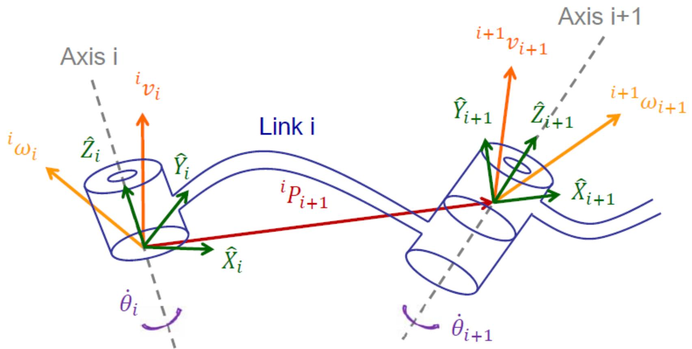
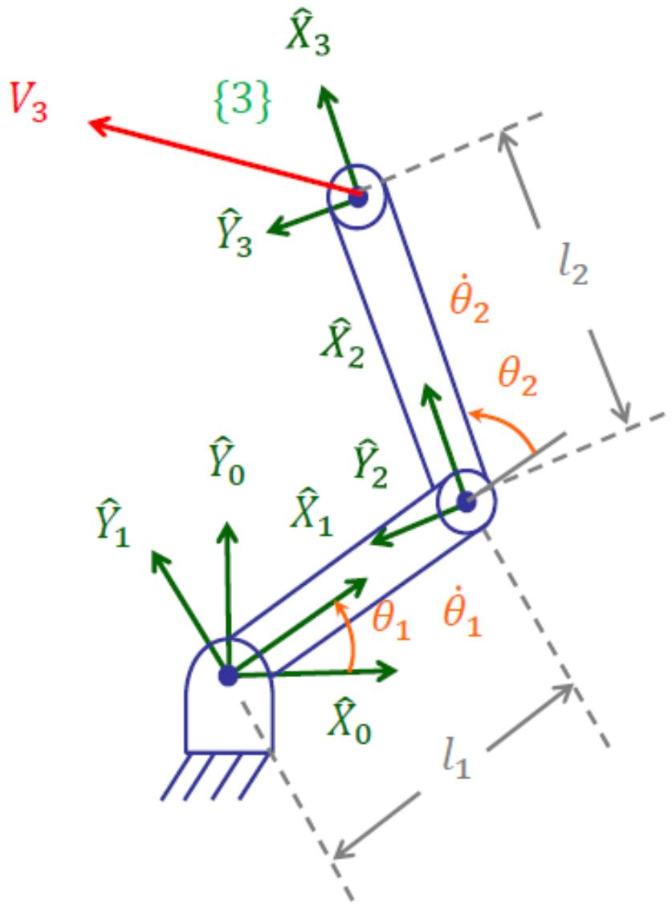

# 速度与静力（上）：速度传递与雅可比矩阵

> [!abstract] 本章导览
> 从「位姿」进到「速度」：研究关节速度 $\dot\Theta$ 如何映射到末端的线速度/角速度，核心工具是**雅可比矩阵 $J$**。
> 1. 位置矢量与角速度的微分
> 2. 动坐标系中的速度公式 $v_A = v_B + v_{rel} + \omega\times r$
> 3. **连杆间速度传递**（转动/移动关节）
> 4. **雅可比矩阵**：多维导数、参考系变换
> 5. **奇异（Singularity）**：$J$ 不可逆 → 损失自由度
> 6. 2R 平面臂雅可比的两种求法

---

## 一、速度的基本概念

> [!note] 位置矢量微分与参考系
> 矢量 $^BP_Q$ 相对 $\{B\}$ 的导数 $^BV_Q=\frac{d}{dt}{}^BP_Q$；换到 $\{A\}$ 表达：$^A(^BV_Q)={}^A_BR\,{}^BV_Q$。
> 当参考系即宇宙系 $\{U\}$ 时记 $v_C={}^UV_{Corg}$（坐标系 $\{C\}$ 原点速度）。

> [!important] 角速度矢量 $^A\Omega_B$
> 描述 $\{B\}$ 相对 $\{A\}$ 的转动：**方向 = 瞬时转轴**，**大小 = 转动速率**。记 $\omega_C={}^U\Omega_C$。

### 动坐标系中的速度合成

由 $\dot{\hat e}=\vec\omega\times\hat e$（单位矢量随转动的变化率），推得动系中一点的速度：

> [!important] 速度合成公式（核心）
> $$^AV_Q = {}^AV_{Borg} + {}^A_BR\,{}^BV_Q + {}^A\Omega_B\times{}^A_BR\,{}^BP_Q$$
> 三项含义：**牵连平动**（$\{B\}$ 原点速度）+ **相对速度**（点在 $\{B\}$ 内的运动）+ **牵连转动**（$\{B\}$ 转动带动）。等价于经典力学的 $\vec v_A=\vec v_B+\vec v_{rel}+\vec\omega\times\vec r_{A/B}$。

---

## 二、连杆间速度传递（Velocity Propagation）

> [!note] 策略
> 把连杆 $i$ 的线速度、角速度在坐标系 $\{i\}$ 中表达，逐杆递推到相邻连杆 $\{i+1\}$。从基座（$\omega_0=0,v_0=0$）一路传到末端。

> [!important] 转动关节（Link i+1 为 Revolute）
> $$^{i+1}\omega_{i+1} = {}^{i+1}_iR\,{}^i\omega_i + \dot\theta_{i+1}\,{}^{i+1}\hat Z_{i+1}$$
> $$^{i+1}v_{i+1} = {}^{i+1}_iR\left({}^iv_i + {}^i\omega_i\times{}^iP_{i+1}\right)$$
> 角速度多了 $\dot\theta_{i+1}\hat Z_{i+1}$（绕自身 Z 轴转动贡献）。

> [!important] 移动关节（Link i+1 为 Prismatic）
> $$^{i+1}\omega_{i+1} = {}^{i+1}_iR\,{}^i\omega_i \quad(\text{角速度不变})$$
> $$^{i+1}v_{i+1} = {}^{i+1}_iR\left({}^iv_i + {}^i\omega_i\times{}^iP_{i+1}\right) + \dot d_{i+1}\,{}^{i+1}\hat Z_{i+1}$$
> 线速度多了 $\dot d_{i+1}\hat Z_{i+1}$（沿 Z 轴平移贡献）。

> [!tip] 对偶记忆
> 转动关节给**角速度**加 $\dot\theta\hat Z$；移动关节给**线速度**加 $\dot d\hat Z$。其余传递项形式相同。

---

## 三、雅可比矩阵（Jacobian）

> [!important] 雅可比 = 多维导数（线性变换）
> 对 $Y=F(X)$（$y_i=f_i(x_1,\dots,x_6)$），微分关系：
> $$\delta Y = \frac{\partial F}{\partial X}\delta X = J(X)\,\delta X \quad\Rightarrow\quad \dot Y = J(X)\dot X$$
> 若 $f_i$ 非线性，则 $J$ 是 $X$ 的函数（随位形变化）。

机器人中，雅可比把**关节速度**映射到**末端笛卡儿速度**：
$$^0\nu = \begin{bmatrix}{}^0v\\{}^0\omega\end{bmatrix} = {}^0J(\Theta)\dot\Theta$$
- 平面运动 $3\times1$（$v_x,v_y,\omega$）；空间运动 $6\times1$。

### 雅可比的参考系变换

$$^A J(\Theta) = \begin{bmatrix}{}^A_BR & 0\\ 0 & {}^A_BR\end{bmatrix}{}^B J(\Theta)$$
即换参考系时，线速度块与角速度块各乘一次旋转矩阵。

---

## 四、奇异（Singularity）

> [!warning] 奇异 = 雅可比不可逆
> 由 $\dot\Theta = J^{-1}(\Theta)\nu$，当 $J$ **不可逆**（$\det J=0$）时出现奇异：
> - **工作空间边界奇异**：手臂**完全伸直或完全折回**时。
> - **工作空间内部奇异**：某些特殊位形（如多轴共线）。
> - 后果：**损失一个或多个自由度**——某些笛卡儿方向无论如何动关节都无法瞬时移动，且 $J^{-1}$ 处关节速度趋于无穷。

---

## 五、实例：2R 平面臂雅可比

### 方法 1：逐杆速度传递

从基座递推（$\omega_0=0$）：
$$^1\omega_1=\begin{bmatrix}0\\0\\\dot\theta_1\end{bmatrix},\quad ^2\omega_2=\begin{bmatrix}0\\0\\\dot\theta_1+\dot\theta_2\end{bmatrix},\quad ^2v_2=\begin{bmatrix}l_1s_2\dot\theta_1\\l_1c_2\dot\theta_1\\0\end{bmatrix}$$
$$^3v_3=\begin{bmatrix}l_1s_2\dot\theta_1\\l_1c_2\dot\theta_1+l_2(\dot\theta_1+\dot\theta_2)\\0\end{bmatrix}$$

整理成 $\{3\}$ 系雅可比：
$$^3\nu=\begin{bmatrix}v_x\\v_y\\\omega\end{bmatrix}=\underbrace{\begin{bmatrix}l_1s_2 & 0\\ l_1c_2+l_2 & l_2\\ 1 & 1\end{bmatrix}}_{^3J(\Theta)}\begin{bmatrix}\dot\theta_1\\\dot\theta_2\end{bmatrix}$$

### 方法 2：直接微分（对 FK 求导）

由 FK $\begin{bmatrix}p_x\\p_y\\\theta\end{bmatrix}=\begin{bmatrix}l_1c_1+l_2c_{12}\\l_1s_1+l_2s_{12}\\\theta_1+\theta_2\end{bmatrix}$ 直接对时间求导：
$$^0J(\Theta)=\begin{bmatrix}-l_1s_1-l_2s_{12} & -l_2s_{12}\\ l_1c_1+l_2c_{12} & l_2c_{12}\\ 1 & 1\end{bmatrix}$$

> [!note] 两法对比
>
> | 方法 | 思路 | 注意 |
> |---|---|---|
> | 速度传递 | 逐杆递推 ω、v | 适合多自由度、可在任意参考系表达 |
> | 直接微分 | 对 FK 闭式解求导 | 简单直接，但**姿态部分无 3×1 矢量其导数为 ω**（需小心角速度表示）|

### 该臂的奇异分析

$\{3\}$ 系雅可比的行列式：
$$\det\begin{bmatrix}l_1s_2 & 0\\ l_1c_2+l_2 & l_2\end{bmatrix} = l_1l_2 s_2 = 0 \ \Rightarrow\ \theta_2 = 0°\text{ 或 }180°$$
即**手臂完全伸直（$\theta_2=0$）或完全折回（$\theta_2=180°$）时奇异**——正是边界奇异，此时末端只能沿一个方向运动，损失一个自由度。

---

## 本章小结

> [!summary] 核心收束
> - 动系速度合成：$^AV_Q={}^AV_{Borg}+{}^A_BR\,{}^BV_Q+{}^A\Omega_B\times{}^A_BR\,{}^BP_Q$。
> - 速度传递：转动关节给角速度 $+\dot\theta\hat Z$，移动关节给线速度 $+\dot d\hat Z$。
> - **雅可比** $\nu=J(\Theta)\dot\Theta$ 把关节速度映射到末端笛卡儿速度；换系乘 $\text{diag}(R,R)$。
> - **奇异**：$\det J=0$，手臂伸直/折回（$\theta_2=0,180°$），损失自由度。
> - 2R 雅可比两法（传递/直接微分）结果一致。

## 自测题

1. 写出动坐标系中速度合成公式的三项，并各自给出物理意义。
2. 转动关节与移动关节的速度传递公式分别在哪一项上不同？为什么？
3. 雅可比矩阵的定义是什么？换参考系时如何变换？
4. 推导 2R 平面臂的 $^0J(\Theta)$，并求其奇异位形。
5. 解释「工作空间边界奇异」与「内部奇异」的区别及后果。

> 关联：[[理论课04.操作臂逆运动学_笔记]]（奇异与多解）、[[理论课05.速度与静力b_笔记]]（静力与雅可比转置）、[[理论课06.操作臂动力学a_笔记]]（牛顿-欧拉递推）
