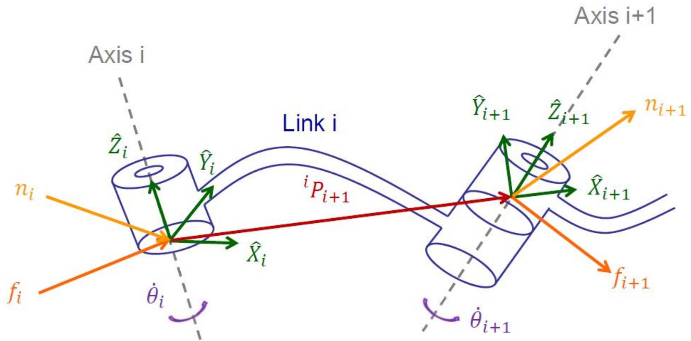
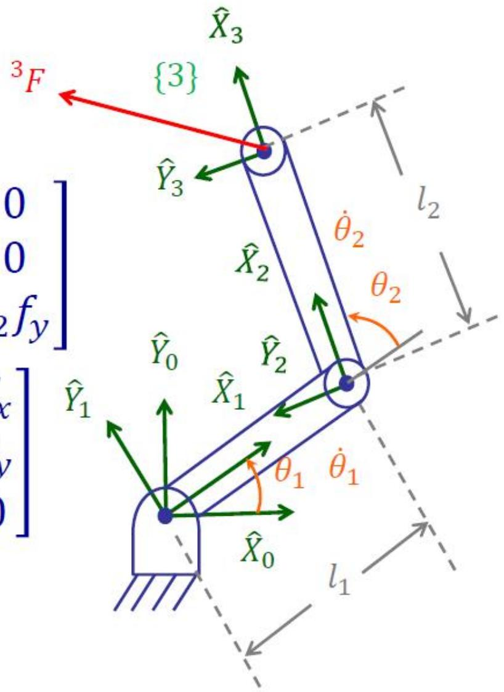

# 速度与静力（下）：静力传递与雅可比转置

> [!abstract] 本章导览
> 承接 [[理论课05.速度与静力a_笔记|速度与雅可比]]，本节研究**静力**：末端受力如何沿连杆传回各关节、需要多大关节力矩维持平衡。核心结论 **$\Gamma = J^T F$** 把笛卡儿力优雅地映射到关节力矩。
> 1. 静力分析的前提与力/力矩逐杆传递
> 2. 维持平衡所需的关节力矩
> 3. **虚功原理** → $\Gamma = J^T F$
> 4. 速度与力的广义坐标系变换（$T_v$、$T_f$ 互为转置）

---

## 一、静力分析前提

> [!note] 处理静力时
> 1. **锁定所有关节**（视为静止刚体系）。
> 2. 写出每根连杆的**力-力矩平衡关系**。
> 3. 计算维持平衡的**静态关节力矩**（一般**忽略重力**，只考虑末端外力）。

---

## 二、力/力矩逐杆传递（Force Propagation）

> [!important] 静力传递公式（从末端往基座递推，与速度传递方向相反）
> $$^if_i = {}^i_{i+1}R\,{}^{i+1}f_{i+1}$$
> $$^in_i = {}^i_{i+1}R\,{}^{i+1}n_{i+1} + {}^iP_{i+1}\times{}^if_i$$
> 力直接旋转传递；力矩除旋转传递外，还多一项**力臂叉乘** $^iP_{i+1}\times{}^if_i$（外力对本关节产生的附加力矩）。

> [!important] 维持平衡的关节力矩（只取沿关节轴 $\hat Z$ 的分量）
> $$\text{转动关节：}\ \tau_i = {}^in_i^T\,{}^i\hat Z_i \qquad \text{移动关节：}\ \tau_i = {}^if_i^T\,{}^i\hat Z_i$$
> 转动关节由**力矩**沿轴分量驱动，移动关节由**力**沿轴分量驱动——与 [[理论课05.速度与静力a_笔记|速度传递]]中「转动加 $\dot\theta\hat Z$、移动加 $\dot d\hat Z$」完全对偶。

---

## 三、实例：2R 平面臂末端受力

末端受力 $^3F=[f_x,f_y,0]^T$，逐杆传递：
$$^2f_2 = {}^3F,\quad ^2n_2 = \begin{bmatrix}0\\0\\l_2 f_y\end{bmatrix},\quad ^1f_1 = \begin{bmatrix}c_2f_x-s_2f_y\\s_2f_x+c_2f_y\\0\end{bmatrix},\quad ^1n_1=\begin{bmatrix}0\\0\\l_1s_2f_x+(l_1c_2+l_2)f_y\end{bmatrix}$$

取 $\hat Z$ 分量得关节力矩：
$$\tau_1 = l_1s_2f_x + (l_1c_2+l_2)f_y,\qquad \tau_2 = l_2 f_y$$

写成矩阵形式：
$$\tau = \begin{bmatrix}l_1s_2 & l_1c_2+l_2 \\ 0 & l_2\end{bmatrix}\begin{bmatrix}f_x\\f_y\end{bmatrix}$$

> [!tip] 关键观察：这个矩阵正是 $^3J^T$！
> 对比 [[理论课05.速度与静力a_笔记]]中该臂的 $^3J=\begin{bmatrix}l_1s_2 & 0\\ l_1c_2+l_2 & l_2\\ 1 & 1\end{bmatrix}$（取力部分），力矩矩阵恰为其**转置**。这不是巧合——

---

## 四、虚功原理 → $\Gamma = J^T F$

> [!important] 雅可比转置定理（本章最重要结论）
> 由**虚功原理**：末端外力做的虚功 = 关节力矩做的虚功：
> $$F\cdot\delta\mathcal{X} = \Gamma\cdot\delta\Theta$$
> 代入 $\delta\mathcal{X}=J\,\delta\Theta$：$\ F^T J\,\delta\Theta = \Gamma^T\delta\Theta$，对任意 $\delta\Theta$ 成立，故：
> $$\boxed{\Gamma = J^T F}$$
> 同一雅可比 $J$：**速度上 $\nu=J\dot\Theta$，力上 $\Gamma=J^T F$**——这是速度与静力的对偶。

> [!note] 工程价值
> $\Gamma = {}^0J^T\,{}^0F$ 把**笛卡儿力直接转成关节力矩**，**无需求逆运动学**（"inverse" 力映射不必解 IK）。力控制、碰撞检测、拖动示教都靠它。
>
> 同时注意：奇异位形（$\det J=0$）时 $J^T$ 也降秩——某些末端力方向无法由关节力矩平衡（或被结构直接吃掉），与速度奇异同源。

---

## 五、速度与力的广义坐标系变换

> [!note] 广义速度（旋量）与广义力（力旋量）
> $$\nu = \begin{bmatrix}v\\\omega\end{bmatrix}\ (\text{速度旋量}),\qquad \mathcal{F}=\begin{bmatrix}F\\N\end{bmatrix}\ (\text{力旋量})$$

**速度变换**（由速度传递公式令 $\dot\theta=0$ 得）：
$$\begin{bmatrix}^Av_A\\^A\omega_A\end{bmatrix} = \underbrace{\begin{bmatrix}^A_BR & ^AP_{Borg}\times{}^A_BR \\ 0 & ^A_BR\end{bmatrix}}_{^A_BT_v}\begin{bmatrix}^Bv_B\\^B\omega_B\end{bmatrix}$$

其中叉乘矩阵 $P\times=\begin{bmatrix}0&-p_z&p_y\\p_z&0&-p_x\\-p_y&p_x&0\end{bmatrix}$。

**力变换**：
$$\begin{bmatrix}^AF_A\\^AN_A\end{bmatrix} = \underbrace{\begin{bmatrix}^A_BR & 0 \\ ^AP_{Borg}\times{}^A_BR & ^A_BR\end{bmatrix}}_{^A_BT_f}\begin{bmatrix}^BF_B\\^BN_B\end{bmatrix}$$

> [!important] 速度变换与力变换互为转置
> $$^A_BT_f = {}^A_BT_v^{\,T}$$
> 又一处「速度-力」对偶：同样的几何（$R$ 与 $P\times$）以转置的形式分别作用于速度旋量与力旋量。

---

## 本章小结

> [!summary] 核心收束
> - 静力分析：锁关节、写力-力矩平衡、求静态关节力矩（忽略重力）。
> - **力传递**（末端→基座）：$^if_i={}^i_{i+1}R\,{}^{i+1}f_{i+1}$，$^in_i={}^i_{i+1}R\,{}^{i+1}n_{i+1}+{}^iP_{i+1}\times{}^if_i$。
> - 关节力矩：转动取力矩沿轴分量 $\tau_i={}^in_i^T\hat Z_i$，移动取力沿轴分量。
> - **核心定理 $\Gamma = J^T F$**（虚功原理），无需 IK 即把笛卡儿力转关节力矩。
> - 广义变换：$T_f = T_v^T$，速度与力处处对偶。

## 自测题

1. 写出力与力矩的逐杆传递公式，并说明力矩多出的叉乘项含义。
2. 转动关节与移动关节维持平衡所需的力矩/力分别取哪个分量？
3. 用虚功原理推导 $\Gamma=J^TF$。它的工程意义（相对 IK）是什么？
4. 对 2R 臂验证关节力矩矩阵恰为 $J^T$。
5. 写出速度旋量与力旋量的坐标系变换矩阵，说明二者为何互为转置。

> [!info] 作业（课本第四章）
> 课后题 4.2、4.6、4.8、4.10；截止 5 月 12 日 23:59，企业微信提交。

> 关联：[[理论课05.速度与静力a_笔记]]（雅可比与奇异）、[[理论课06.操作臂动力学a_笔记]]（牛顿-欧拉、力矩与加速度）
