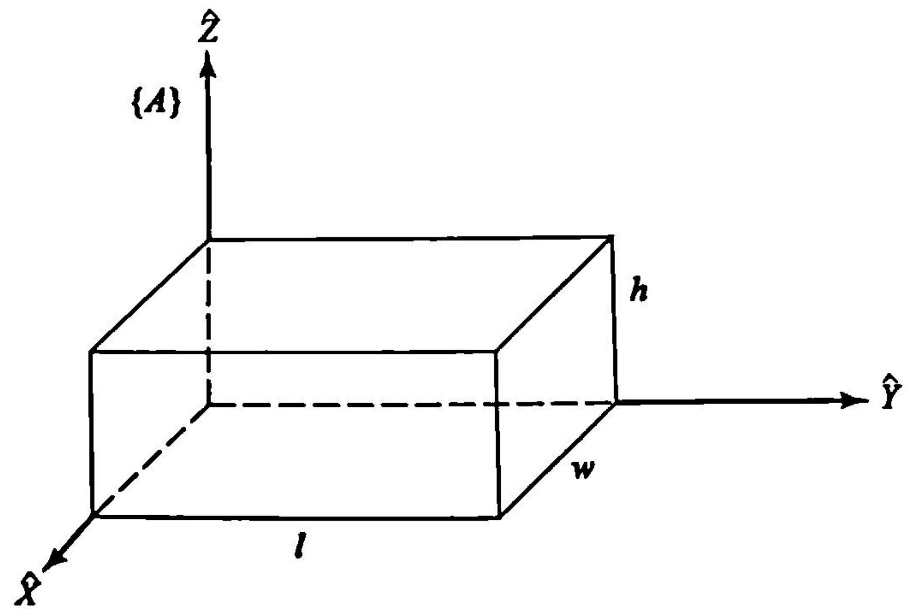
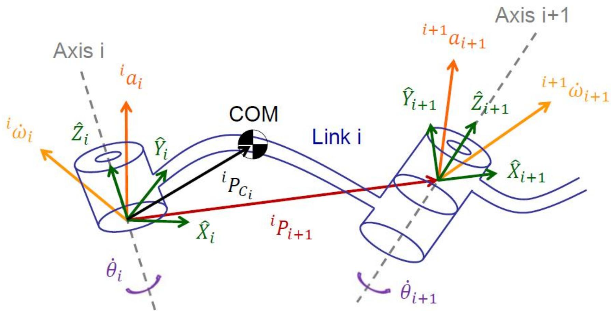
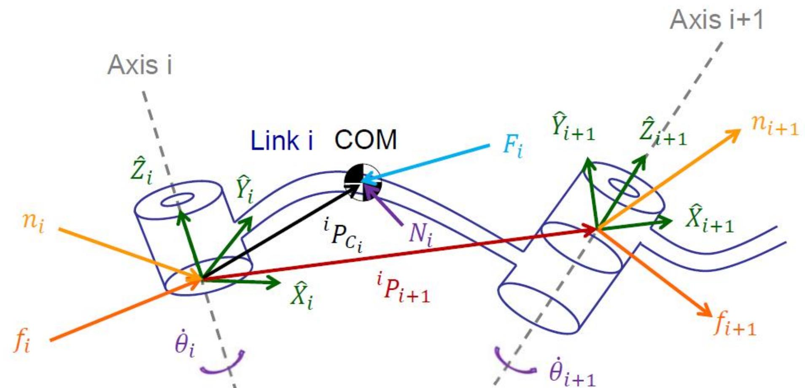
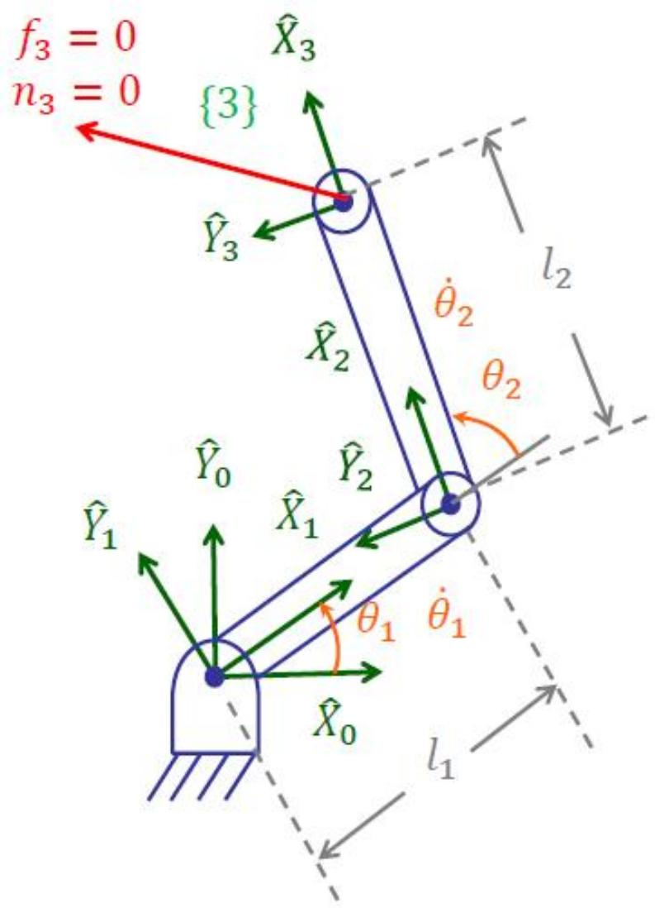

# 操作臂动力学（上）：牛顿-欧拉递推法

> [!abstract] 本章导览
> 动力学研究**力/力矩如何产生运动**。本章用**牛顿-欧拉（Newton-Euler）迭代法**建立机械臂动力学方程：给定关节运动 $\theta,\dot\theta,\ddot\theta$，求所需关节力矩 $\tau$。
> 1. 加速度的微分（线加速度、角加速度、Coriolis 项）
> 2. **惯性张量**（Inertia Tensor）、平行轴定理、主轴
> 3. **牛顿方程 + 欧拉方程**
> 4. **外推**（速度/加速度，1→n）+ **内推**（力/力矩，n→1）
> 5. 2R 平面臂完整算例

---

## 一、加速度的传递

### 角加速度

$$^A\dot\Omega_C = {}^A\dot\Omega_B + {}^A_BR\,{}^B\dot\Omega_C + {}^A\Omega_B\times{}^A_BR\,{}^B\Omega_C$$
最后一项（叉乘）是「动系本身转动」对角加速度的耦合贡献。

### 线加速度（含 Coriolis 项）

对 [[理论课05.速度与静力a_笔记|速度合成公式]]再求一次导，得到动系中一点的加速度：

> [!important] 加速度合成公式（5 项，比速度多 Coriolis）
> $$^AA_Q = {}^AA_{Borg} + {}^A\dot\Omega_B\times{}^A_BR\,{}^BP_Q + {}^A\Omega_B\times({}^A\Omega_B\times{}^A_BR\,{}^BP_Q) + 2\,{}^A\Omega_B\times{}^A_BR\,{}^BV_Q + {}^A_BR\,{}^BA_Q$$
> 对应经典力学：$\vec a_A = \vec a_B + \dot{\vec\omega}\times\vec r + \vec\omega\times(\vec\omega\times\vec r) + 2\vec\omega\times\vec v_{rel} + \vec a_{rel}$
>
> | 项 | 名称 |
> |---|---|
> | $\dot{\vec\omega}\times\vec r$ | 切向（角加速度）|
> | $\vec\omega\times(\vec\omega\times\vec r)$ | **向心加速度** |
> | $2\vec\omega\times\vec v_{rel}$ | **Coriolis（科氏）加速度** |
> | $\vec a_{rel}$ | 相对加速度 |

> [!note] 刚体上一点（$^BV_Q=^BA_Q=0$）简化
> 对固连刚体，相对速度/加速度为 0，Coriolis 与相对项消失，只剩牵连项。

---

## 二、惯性张量（Inertia Tensor）

> [!important] 惯性张量定义
> $$^AI = \begin{bmatrix} I_{xx} & -I_{xy} & -I_{xz} \\ -I_{xy} & I_{yy} & -I_{yz} \\ -I_{xz} & -I_{yz} & I_{zz} \end{bmatrix}$$
> **惯性矩**（对角，恒正）：$I_{xx}=\iiint(y^2+z^2)\rho\,dv$，余类推。
> **惯量积**（非对角）：$I_{xy}=\iiint xy\,\rho\,dv$，余类推。

> [!example] 例 6.1：均匀长方体（角点坐标系）
> $$I_{xx}=\tfrac{m}{3}(l^2+h^2),\quad I_{yy}=\tfrac{m}{3}(w^2+h^2),\quad I_{zz}=\tfrac{m}{3}(l^2+w^2)$$
> $$I_{xy}=\tfrac{m}{4}wl,\quad I_{xz}=\tfrac{m}{4}hw,\quad I_{yz}=\tfrac{m}{4}hl$$
> （注意：若取**质心坐标系**，惯量积为 0、惯性矩系数由 $\tfrac13\to\tfrac1{12}$。）

> [!note] 重要性质
> - **实对称 → 可正交对角化**：$^AI=R\,\text{diag}(I_{XX},I_{YY},I_{ZZ})\,R^T$，特征向量给出**主轴方向**，对角元为**主惯性矩**。
> - **迹不变**：$I_{xx}+I_{yy}+I_{zz}=\text{trace}$ 在相似变换下守恒。
> - **对称面消惯量积**：若 $xy$ 平面是对称面，则 $I_{xz}=I_{yz}=0$。

### 平行轴定理（Parallel-Axis Theorem）

> [!important] 坐标系平移时惯性张量如何变
> $$^AI = {}^CI + m\left[P_c^T P_c\,I_3 - P_c P_c^T\right],\quad P_c=[x_c,y_c,z_c]^T$$
> 标量形式：$^AI_{zz}={}^CI_{zz}+m(x_c^2+y_c^2)$，$^AI_{xy}={}^CI_{xy}-mx_cy_c$。其中 $\{C\}$ 在质心、$\{A\}$ 任意。

---

## 三、牛顿方程与欧拉方程

> [!important] 单刚体的力与力矩
> **牛顿方程**（线运动）：
> $$F = \frac{d}{dt}(mv_c) = m\dot v_c$$
> **欧拉方程**（转动，$\{C\}$ 原点在质心）：
> $$N = {}^CI\dot\omega + \omega\times{}^CI\omega$$
> 第二项 $\omega\times I\omega$ 是**陀螺力矩**——即使在惯性系，$I\omega$ 方向也会随转动变化，故不可省。

---

## 四、牛顿-欧拉迭代法（核心算法）

> [!summary] 两遍迭代
>
> | 阶段 | 方向 | 算什么 | 用什么方程 |
> |---|---|---|---|
> | **外推 Outward** | Link 1 → n | 角速度、角加速度、线加速度、质心加速度 | 运动学传递公式 |
> | **内推 Inward** | Link n → 1 | 各连杆受力 $F_i,N_i$ → 关节力/力矩 | 牛顿/欧拉 + 力传递 |
>
> 通用结构，适用任意机械臂，**便于数值计算**。转动/移动关节选对应公式。

### 外推：加速度传递（转动关节）

$$^{i+1}\dot\omega_{i+1} = {}^{i+1}_iR\,{}^i\dot\omega_i + {}^{i+1}_iR\,{}^i\omega_i\times\dot\theta_{i+1}{}^{i+1}\hat Z_{i+1} + \ddot\theta_{i+1}{}^{i+1}\hat Z_{i+1}$$
$$^{i+1}a_{i+1} = {}^{i+1}_iR\left({}^ia_i + {}^i\dot\omega_i\times{}^iP_{i+1} + {}^i\omega_i\times({}^i\omega_i\times{}^iP_{i+1})\right)$$
质心加速度：$^ia_{C_i}={}^ia_i+{}^i\dot\omega_i\times{}^iP_{C_i}+{}^i\omega_i\times({}^i\omega_i\times{}^iP_{C_i})$。

> [!note] 移动关节的加速度多两项
> 线加速度额外加 $2{}^{i+1}\omega_{i+1}\times\dot d_{i+1}\hat Z_{i+1}$（**Coriolis**）+ $\ddot d_{i+1}\hat Z_{i+1}$（平移加速度）。

### 内推：力/力矩传递

每连杆质心处惯性力/力矩：$F_i = m\,a_{C_i}$，$N_i = {}^{C_i}I\dot\omega_i + \omega_i\times{}^{C_i}I\omega_i$。再向内传递：

> [!important] 力/力矩内推（含本杆惯性项）
> $$^if_i = {}^i_{i+1}R\,{}^{i+1}f_{i+1} + {}^iF_i$$
> $$^in_i = {}^i_{i+1}R\,{}^{i+1}n_{i+1} + {}^iN_i + {}^iP_{C_i}\times{}^iF_i + {}^iP_{i+1}\times{}^i_{i+1}R\,{}^{i+1}f_{i+1}$$
> 关节力矩取 $\hat Z$ 分量：转动 $\tau_i={}^in_i^T{}^i\hat Z_i$，移动 $\tau_i={}^if_i^T{}^i\hat Z_i$。

> [!tip] 边界条件
> - **重力**：等效设基座加速度 $^0a_0 = g\hat Y_0$（$9.81\,m/s^2$ 向上），重力自动进入每连杆。
> - **自由空间末端**：$^{N+1}f_{N+1}=0,\ ^{N+1}n_{N+1}=0$。

---

## 五、2R 平面臂完整算例

条件：$^1P_{C_1}=l_1\hat X_1$、$^2P_{C_2}=l_2\hat X_2$、连杆惯量近似为 0（质量集中末端）、$^0\dot v_0=g\hat Y_0$（含重力）。

**外推**得质心加速度，乘质量得 $F_i$；**内推**得力矩，最终关节力矩：

> [!important] 2R 动力学方程（注意各项物理意义）
> $$\tau_1 = \underbrace{[m_2l_2^2(\ddot\theta_1+\ddot\theta_2) + m_2l_1l_2c_2(2\ddot\theta_1+\ddot\theta_2) + (m_1+m_2)l_1^2\ddot\theta_1]}_{\text{惯性项 }M(\theta)\ddot\theta} \underbrace{- m_2l_1l_2s_2\dot\theta_2^2 - 2m_2l_1l_2s_2\dot\theta_1\dot\theta_2}_{\text{离心}+\text{Coriolis}} + \underbrace{m_2l_2gc_{12}+(m_1+m_2)l_1gc_1}_{\text{重力 }G(\theta)}$$
> $$\tau_2 = m_2l_1l_2c_2\ddot\theta_1 + m_2l_1l_2s_2\dot\theta_1^2 + m_2l_2gc_{12} + m_2l_2^2(\ddot\theta_1+\ddot\theta_2)$$

> [!note] 动力学方程的标准结构
> 任意机械臂动力学都可写成 $\tau = M(\theta)\ddot\theta + V(\theta,\dot\theta) + G(\theta)$：
> - $M(\theta)\ddot\theta$：**惯性项**（含 $\ddot\theta$）；
> - $V(\theta,\dot\theta)$：**离心力**（含 $\dot\theta_i^2$）+ **Coriolis 力**（含 $\dot\theta_i\dot\theta_j$）；
> - $G(\theta)$：**重力项**（含 $g$）。
> 这正是 [[理论课07.轨迹规划a_笔记|轨迹跟踪]]与 [[理论课09.操作臂的线性控制_笔记|控制]]的被控对象。

---

## 本章小结

> [!summary] 核心收束
> - 加速度合成 5 项，比速度多了**Coriolis** $2\omega\times v_{rel}$ 与向心 $\omega\times(\omega\times r)$。
> - **惯性张量**实对称可对角化（主轴）、平行轴定理换原点、迹不变。
> - 牛顿 $F=m\dot v_c$ + 欧拉 $N=I\dot\omega+\omega\times I\omega$（陀螺项不可省）。
> - **牛顿-欧拉法**：外推（1→n 算运动）+ 内推（n→1 算力矩），重力靠 $^0a_0=g$ 等效。
> - 动力学标准型 $\tau=M(\theta)\ddot\theta+V(\theta,\dot\theta)+G(\theta)$。

## 自测题

1. 写出动系中一点的加速度合成公式，指出哪一项是 Coriolis 加速度。
2. 惯性矩与惯量积如何定义？平行轴定理的矢量-矩阵形式是什么？
3. 欧拉方程 $N=I\dot\omega+\omega\times I\omega$ 中第二项为什么不能省？
4. 牛顿-欧拉法的「外推」和「内推」各算什么、方向如何？重力如何引入？
5. 把 2R 动力学方程按 $M(\theta)\ddot\theta+V(\theta,\dot\theta)+G(\theta)$ 分类。

> 关联：[[理论课05.速度与静力b_笔记]]（静力传递）、[[理论课07.轨迹规划a_笔记]]（轨迹生成）、[[理论课09.操作臂的线性控制_笔记]]（基于动力学的控制）
