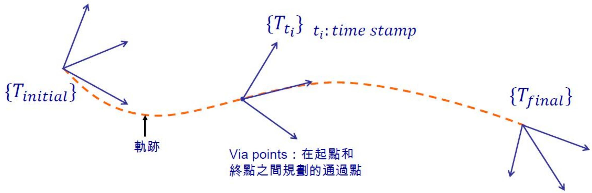
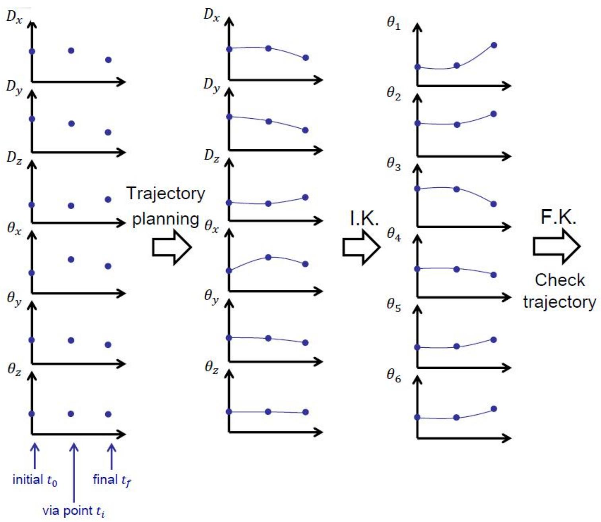
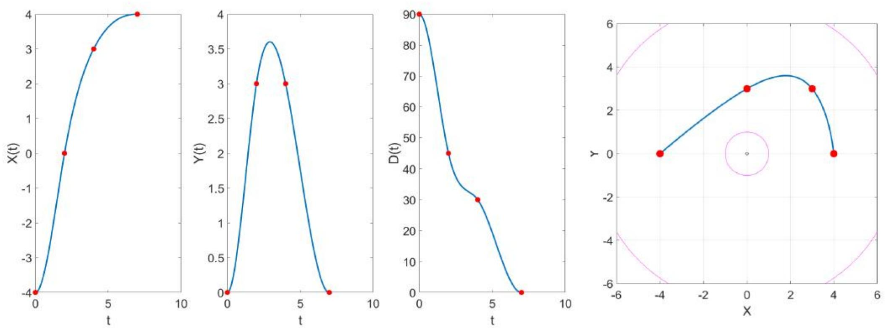

# 轨迹规划（上）：三次多项式与样条插值

> [!abstract] 本章导览
> 轨迹规划 = 计算机械臂在多维空间中**随时间的期望运动**（位置/速度/加速度历程）。
> 1. 轨迹、路径点（via points）、光滑性
> 2. **关节空间 vs 笛卡儿空间**规划
> 3. **三次多项式**单段插值（4 条件）
> 4. 多段 + via 点：速度选取、速度/加速度连续
> 5. **三次样条**（自然/钳位/周期）
> 6. **五次多项式**（含加速度边界）

> [!note] 路径更新速率
> 轨迹点以一定速率被计算并下发，称**路径更新速率**，典型机械臂为 **60 Hz – 2000 Hz**。

---

## 一、轨迹与路径点

> [!note] 定义
> 轨迹 = 末端点（或操作点）的位置、速度、加速度对时间的历程，可定义为 $\{T\}$ 相对 $\{G\}$ 的状态历程（与手臂种类无关，$\{G\}$ 也可随时间变动，如**传送带**）。
> - **理想轨迹**：光滑路径（连续，且一阶导数连续）。
> - **路径点（Via points）**：在起点与终点之间规划的若干通过点，带时间戳 $t_i$。

> [!warning] 各自由度时间戳必须对齐
> via 点在各分量（各自由度）下的**时间戳必须一致**，才能保证 via 点真正被同时通过。

---

## 二、关节空间 vs 笛卡儿空间规划

> [!important] 两条路线对比
>
> | | 笛卡儿空间规划 | 关节空间规划 |
> |---|---|---|
> | 先做 | 在笛卡儿空间对 $^GX_T$ 规划光滑轨迹 | 先 IK 把各 via 点转关节角 |
> | 再做 | 每个轨迹点 IK → 关节角 | 对各关节角规划光滑轨迹 |
> | 校验 | 关节空间可行性 | FK 检查末端轨迹 |
> | 优点 | 物理直观（末端走直线等）| 计算负载低 |
> | 缺点 | **运算负载高（每点都要 IK）**，近奇异点麻烦 | 末端轨迹形状不直观 |
>
> 位姿用 6 参数表达 $^GX_T=\begin{bmatrix}^GP_{Torg}\\ ROT(^G\hat K_T,\theta)\end{bmatrix}$（**不用旋转矩阵**，用位置 + 轴角）。

---

## 三、三次多项式单段插值（Cubic Polynomial）

> [!important] 4 个边界条件 → 三次多项式
> 单段 $t\in[t_i,t_{i+1}]$，令 $\tilde t = t-t_i$，$\Delta t = t_{i+1}-t_i$：
> $$\theta(\tilde t) = a_0 + a_1\tilde t + a_2\tilde t^2 + a_3\tilde t^3 \quad(\text{4 个未知数})$$
> 边界条件（始末位置 + 始末速度）：
> $$\theta_i=a_0,\quad \dot\theta_i=a_1,\quad \theta_{i+1}=a_0+a_1\Delta t+a_2\Delta t^2+a_3\Delta t^3,\quad \dot\theta_{i+1}=a_1+2a_2\Delta t+3a_3\Delta t^2$$

解出系数：
$$a_0=\theta_i,\quad a_1=\dot\theta_i,\quad a_2=\frac{3}{\Delta t^2}(\theta_{i+1}-\theta_i)-\frac{2}{\Delta t}\dot\theta_i-\frac{1}{\Delta t}\dot\theta_{i+1},\quad a_3=-\frac{2}{\Delta t^3}(\theta_{i+1}-\theta_i)+\frac{1}{\Delta t^2}(\dot\theta_{i+1}+\dot\theta_i)$$

> [!note] 矩阵形式
> $\Theta = T_{4\times4}(\Delta t)\,A$，其中 $\det(T_{4\times4})=-\Delta t^4\neq0$（只要 $\Delta t\neq0$），故 $A=T^{-1}\Theta$ 唯一可解。

---

## 四、多段轨迹与 via 点速度选取

> [!important] 中间点速度 $\dot\theta_i$ 怎么定？
> 1. **直接定义**：不论笛卡儿/关节空间——不推荐，过于复杂，尤其轨迹靠近奇异点。
> 2. **自动生成（启发式）**：
>    - 若 $\dot\theta$ 在 $t_i$ 前后**变号**（折返）→ 取 $\dot\theta_i=0$；
>    - 若前后**同号**→ 取相邻平均斜率。
>    - 此法各段三次多项式可**独立求解**。
> 3. **令加速度也连续**：把相邻段三次多项式**联立**求解（充分利用可调变量）。

### 含一个 via 点的联立（加速度连续）

两段各 4 系数 → **8 个未知数**，配 8 个方程：

> [!example] 8 条件 = 4 位置 + 2 端点速度 + 1 速度连续 + 1 加速度连续
> - 位置：$\theta_0,\theta_1$（段 I 两端），$\theta_1,\theta_f$（段 II 两端）
> - 端点速度：$\dot\theta_0,\dot\theta_f$（不一定为 0）
> - via 点**速度连续**：$\dot\theta_I(\Delta t_1)=\dot\theta_{II}(0)$
> - via 点**加速度连续**：$\ddot\theta_I(\Delta t_1)=\ddot\theta_{II}(0)$
>
> 矩阵 $\Theta_{8\times1}=T_{8\times8}A$，$\det(T)=4\Delta t_1^4\Delta t_2^3+4\Delta t_1^3\Delta t_2^4\neq0$（$\Delta t_1,\Delta t_2\neq0$ 且 $\Delta t_1\neq-\Delta t_2$）。

---

## 五、三次样条（Cubic Spline）

> [!note] 一般三次样条
> $N+1$ 个点（1 初始 + (N-1) 途经 + 1 终点）→ $N$ 段三次函数 $s_j(x)=a_j+b_jx+c_jx^2+d_jx^3$，共 **$4N$ 个未知数**。
> - 各段两端**位置**条件：$2N$ 个；
> - via 点**速度与加速度连续**：$2(N-1)$ 个；
> - **还差 2 个条件** → 由边界条件补足。

> [!important] 末尾 2 条件的三种选择
>
> | 类型 | 补充条件 | 名称 |
> |---|---|---|
> | (1) | $\ddot s_1(x_1)=\ddot s_N(x_{N+1})=0$ | **自然样条** Natural |
> | (2) | $\dot s_1(x_1)=u,\ \dot s_N(x_{N+1})=v$ | **钳位样条** Clamped |
> | (3) | $\dot s_1(x_1)=\dot s_N(x_{N+1}),\ \ddot s_1(x_1)=\ddot s_N(x_{N+1})$ | **周期样条** Periodic |
>
> MATLAB 命令：`YY = spline(x, y, XX)`。

---

## 六、RRR 平面臂实例（两种规划路线）

平面 RRR 臂（$l_1=4,l_2=3,l_3=1$），给定 4 个点（initial/via/via/final）的 $(x,y,\theta)$：

| t | x | y | θ |
|---|---|---|---|
| 0 | -4 | 0 | 90° |
| 2 | 0 | 3 | 45° |
| 4 | 3 | 3 | 30° |
| 7 | 4 | 0 | 0° |

> [!note] 方法一（笛卡儿空间）vs 方法二（关节空间）
> - **方法一**：对 $X,Y,\theta$ 三个 DOF 各规划 3 段三次（$12\times1$ 系数），再 IK 求各关节轨迹，FK 校验。末端在笛卡儿空间走光滑曲线。
> - **方法二**：先 IK 求各 via 点的 $(\theta_1,\theta_2,\theta_3)$，再对**关节角**规划三次样条。末端笛卡儿轨迹**不再是直线/平滑曲线**（两法末端轨迹不同！）。

---

## 七、五次多项式（Quintic）

> [!important] 当位置、速度、加速度都需指定
> 三次只能定位置+速度；若**加速度**也要定（始末各 3 个条件，共 6 个），用五次多项式：
> $$\theta(t) = a_0 + a_1 t + a_2 t^2 + a_3 t^3 + a_4 t^4 + a_5 t^5$$
> 系数（始末位置/速度/加速度）：
> $$a_0=\theta_0,\quad a_1=\dot\theta_0,\quad a_2=\tfrac12\ddot\theta_0$$
> $$a_3=\frac{20(\theta_f-\theta_0)-(8\dot\theta_f+12\dot\theta_0)\Delta t-(3\ddot\theta_0-\ddot\theta_f)\Delta t^2}{2\Delta t^3},\ \dots$$

> [!tip] 多项式阶数与可定边界条件
> 阶数 $n$ 的多项式有 $n+1$ 个系数 → 可满足 $n+1$ 个条件。三次（4）=始末位置速度；五次（6）=再加始末加速度。

---

## 本章小结

> [!summary] 核心收束
> - 轨迹 = 位姿/速度/加速度的时间历程；via 点须各 DOF 时间戳对齐。
> - **关节空间**规划省算力，**笛卡儿空间**规划直观但每点要 IK。
> - **三次多项式**：4 条件（始末位置+速度），$\det T=-\Delta t^4$ 唯一可解。
> - 多段 via 点：速度可自动选（变号取 0/同号取平均）或联立保**加速度连续**。
> - **三次样条**差 2 条件 → 自然/钳位/周期三种边界。
> - 要定加速度 → **五次多项式**（6 条件）。

## 自测题

1. via 点为什么要求各自由度时间戳一致？
2. 写出单段三次多项式的 4 个边界条件并解出 $a_2,a_3$。
3. 含一个 via 点、要求加速度连续时，为什么是 8 未知数 8 方程？列出这 8 个条件。
4. 自然样条、钳位样条、周期样条分别补充什么边界条件？
5. 什么时候必须用五次多项式而非三次？它能定哪些边界量？

> 关联：[[理论课08.轨迹规划b_笔记]]（笛卡儿路径几何问题）、[[理论课07.轨迹规划c_笔记]]（直线/圆弧与抛物线过渡）、[[理论课06.操作臂动力学a_笔记]]（轨迹的力矩需求）
