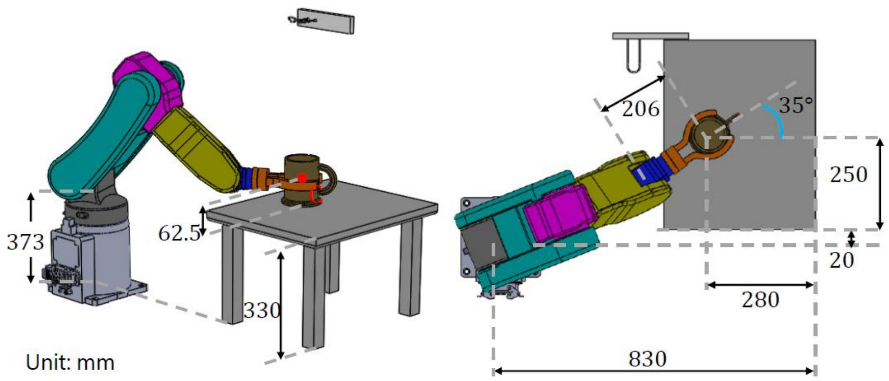
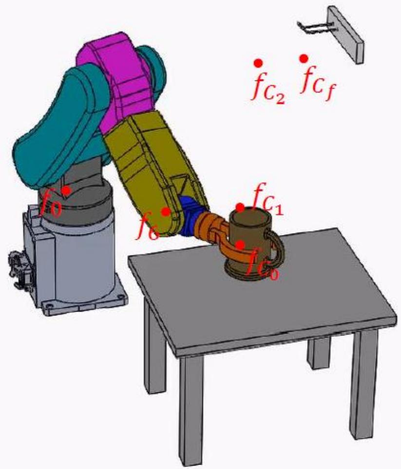

# 轨迹规划（c）：直线+抛物线过渡（LFPB）与课程综合例题

> [!abstract] 本章导览
> 本节是**全课程的综合例题（Capstone）**：6R 机械臂把杯子从桌面拿起、放到墙上杯架，用到了**刚体描述 + 正运动学 + 逆运动学 + 轨迹规划**全部知识点。同时引入第二种轨迹规划法：
> 1. **直线函数 + 抛物线过渡（LFPB）**
> 2. 笛卡儿空间 vs 关节空间两种规划路线
> 3. 完整 6R 夹杯任务流程（位姿表 → 变换矩阵 → IK → 轨迹 → FK 校验 → 仿真）
> 4. 机器人构型分类与冗余自由度

---

## 一、任务设定：6R 臂夹杯放架



任务：把杯子**从桌面拿起 → 放上杯架**整段轨迹，加两个 via 点：
- $P_1$：垂直拿起杯子一小段距离（避免碰桌）；
- $P_2$：到达杯架前调整到合适姿态。



> [!note] 任务位姿表（杯子 $^0_C T$，XYZ 固定角）
>
> | 点 | t/s | X | Y | Z | $\Phi_x$ | $\Phi_y$ | $\Phi_z$ |
> |---|---|---|---|---|---|---|---|
> | $P_0$ | 0 | 550 | 270 | 19.5 | 0 | 0 | 35° |
> | $P_1$ | 2 | 550 | 270 | 79.5 | 0 | 0 | 35° |
> | $P_2$ | 6 | 330 | 372 | 367 | 0 | -60° | 0 |
> | $P_f$ | 9 | 330 | 472 | 367 | 0 | -60° | 0 |
>
> $P_0\to P_1$ 仅 Z 升 60mm（垂直拿起）；$P_2\to P_f$ 仅 Y 移 100mm（推上杯架）。

---

## 二、求解流程（六大步）

> [!summary] 任务 → 关节轨迹 的完整链条
> 1. **设杯子位姿** $^0_C T$（任务定义，与手臂无关）。
> 2. **转末端位姿** $^0_6 T = {}^0_C T\,{}^6_C T^{-1}$（杯子与末端法兰的固定关系）。
> 3. 从 $^0_6 T$ 读出 $^0P_{6org}$ 的位置 + 姿态（如 $P_2$：位置 (227,372,188.6)，XYZ 角 (0,-30°,180°)）。
> 4. 对各 DOF 规划**光滑轨迹**（LFPB 或三次）。
> 5. 对轨迹上每个点做 **IK** 求 6 轴转角。
> 6. **FK 校验** + 仿真，确认末端如期运动。

---

## 三、直线函数 + 抛物线过渡（LFPB）

> [!important] LFPB 的核心思想
> 段内用**匀速直线**（线性），在每个设定点附近用**抛物线（匀加速）过渡**，避免速度突变（加速度无穷大）。N+1 个点 → **2N+1 段**（N 条直线 + N+1 段抛物线），本例 4 点 → **7 段**，每段抛物线时间设为 0.5s。

自绘 LFPB 时空示意（单自由度 $\theta(t)$）：

```
 θ
 │        ┌─────●(P₂)
 │       ╱ 直线  ╲ 抛物线过渡
 │  ●───╯         ╲___●(P_f)
 │(P₀)╲抛物线     直线
 │ 抛物 ●(P₁)
 │ 线  (匀加速)
 └──┬──┬────┬──┬──→ t
   过渡 匀速  过渡
   ← 抛物线段速度连续、加速度有限 →
```

> [!note] 速度/加速度的确定
> 各段直线斜率 = 相邻点位移 / 时间 = **段速度** $V_i$；抛物线段把速度从 $V_{i-1}$ 线性变到 $V_i$，加速度 $a_i=(V_i-V_{i-1})/t_{blend}$。本例对 6 个 DOF 分别建速度表 $V_0\dots V_f$ 与加速度表 $a_0\dots a_f$，再拼出 7 段方程。

> [!warning] 与三次多项式的区别
>
> | | 三次多项式 | LFPB |
> |---|---|---|
> | 段内 | 三次曲线 | 直线（匀速）+ 抛物线（匀加速）|
> | 精确过点 | 过所有 via 点 | **直线段不一定精确过 via 点**（过渡区让路）|
> | 速度 | 连续 | 连续 |
> | 加速度 | 可设连续 | 分段常值（有跳变但有限）|
> | 直观 | 一般 | 速度恒定段很直观、易限幅 |

---

## 四、两种规划路线（本例都做了）

> [!important] 笛卡儿空间 vs 关节空间
>
> | | 方法一：笛卡儿空间 | 方法二：关节空间 |
> |---|---|---|
> | 先规划 | 对 $^0P_{6org}$ 的 6 个 DOF (X,Y,Z,$\Phi_x,\Phi_y,\Phi_z$) 各做 LFPB | 先 IK 求各点 6 轴转角 |
> | 再做 | 每个插值点 IK 求关节角 | 对 $\theta_1\dots\theta_6$ 各做 LFPB |
> | 末端轨迹 | 笛卡儿空间直线/平滑 | **关节空间光滑，但末端笛卡儿轨迹不再是直线** |
> | 计算量 | 大（每点 IK）| 小（只在设定点 IK）|

> [!example] $P_2$ 点 IK 细算（位置层层分离）
> 由 $^2_3T\,{}^3P_{4org}$ 得 $\sqrt{x^2+y^2}=435.79,\ z=188.6$，解 Eq1²+Eq2² 得：
> $$\theta_3=-11.98°\ (\text{或}178.48°),\quad \theta_2=-64.46°\ (\text{或}20.37°),\quad \theta_1=\text{atan2}(y,x)=58.61°$$
> 姿态用 [[欧拉角|Z-Y-Z 欧拉角]]从 $^{3}_6R$ 反解，注意 **DH 与 ZYZ 在 $\theta_4,\theta_6$ 差 $180°$** 需补回：
> $$\theta_4=\alpha+180°=25.30°,\quad \theta_5=\beta=-87.13°,\quad \theta_6=\gamma+180°=-56.19°$$

---

## 五、机器人构型分类与冗余

> [!note] 是否需要 FK/IK 取决于构型
> - **多关节型（Articulated，RRRRRR）**：本课程重点，需完整 FK/IK；SCARA、晶圆机器人是其延伸。
> - **坐标型（Cartesian / 直角坐标）**：各轴正交平移，**不需要 FK/IK**（笛卡儿坐标直接对应轴位移）。
> - **球坐标（Spherical）、柱坐标（Cylindrical）**：移动部分按几何直接算，转动部分用欧拉角。

> [!important] 冗余自由度（Redundant DOF）
> 若手臂自由度 > 任务所需（如 7-DOF 做 6-DOF 任务），轨迹规划与 IK 一般有**无穷多解**，需引入**最优化**（避障、时间最短、最省能等）来选解。

---

## 本章小结

> [!summary] 核心收束
> - 综合例题串起全课程：刚体描述 → FK → IK → 轨迹规划。
> - 任务流程：设杯子位姿 → $^0_6T={}^0_CT\,{}^6_CT^{-1}$ → 读位姿 → 规划 → IK → FK 校验。
> - **LFPB**：直线匀速 + 抛物线过渡，N+1 点 → 2N+1 段；速度连续、加速度分段常值。
> - 笛卡儿空间规划末端走直线但每点要 IK；关节空间规划省算力但末端轨迹不直。
> - 构型决定是否需 FK/IK；冗余自由度需最优化选解。

## 自测题

1. LFPB 由哪两种曲线拼成？为什么直线段之间要用抛物线过渡？
2. N+1 个设定点的 LFPB 共多少段？本例 4 点为什么是 7 段？
3. 写出夹杯任务从「杯子位姿」到「末端位姿」的变换关系。
4. 方法一（笛卡儿）和方法二（关节）规划，末端轨迹形状有何不同？各自计算量如何？
5. 什么是冗余自由度？为什么它使 IK 有无穷多解、需要最优化？

> [!info] 作业（课本第七章）
> 课后题 7.2、7.17；截止 6 月 9 日 23:59，企业微信提交。

> 关联：[[理论课07.轨迹规划a_笔记]]（三次多项式/样条）、[[理论课07.轨迹规划b_笔记]]（笛卡儿路径几何问题）、[[理论课04.操作臂逆运动学_笔记]]（本例 IK 来源）
