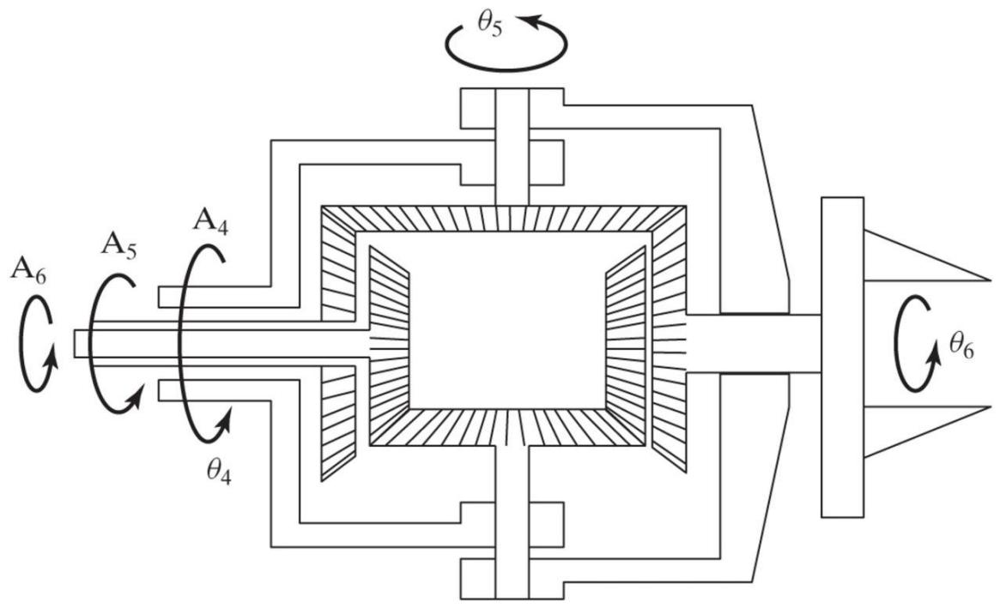
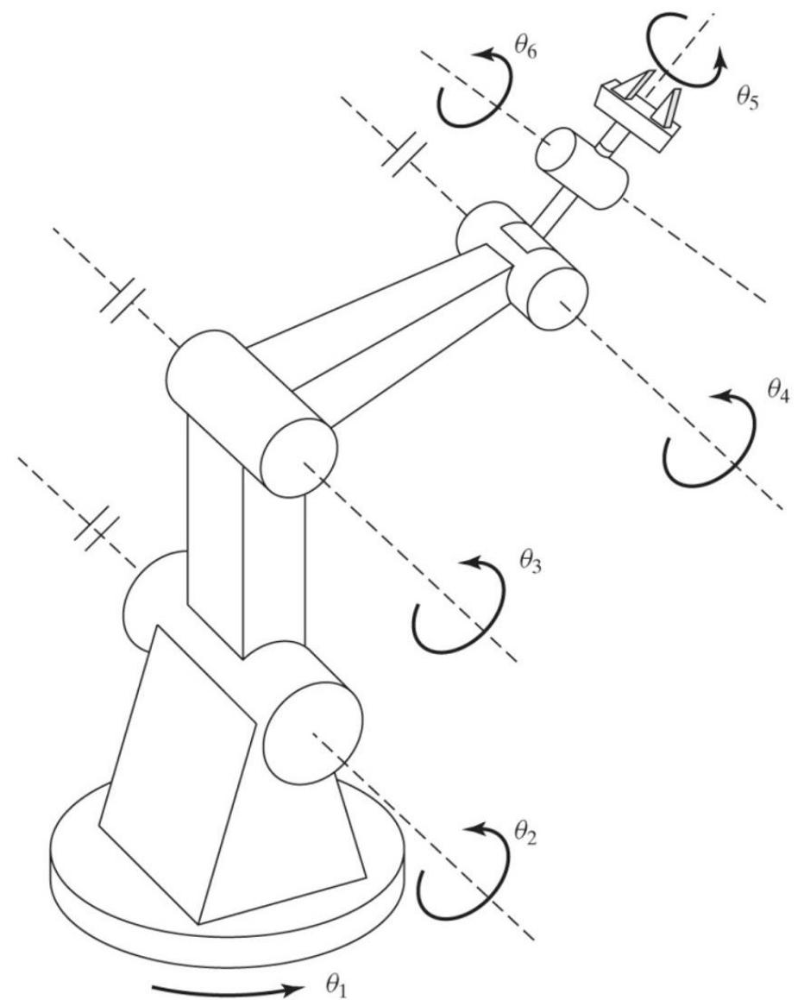
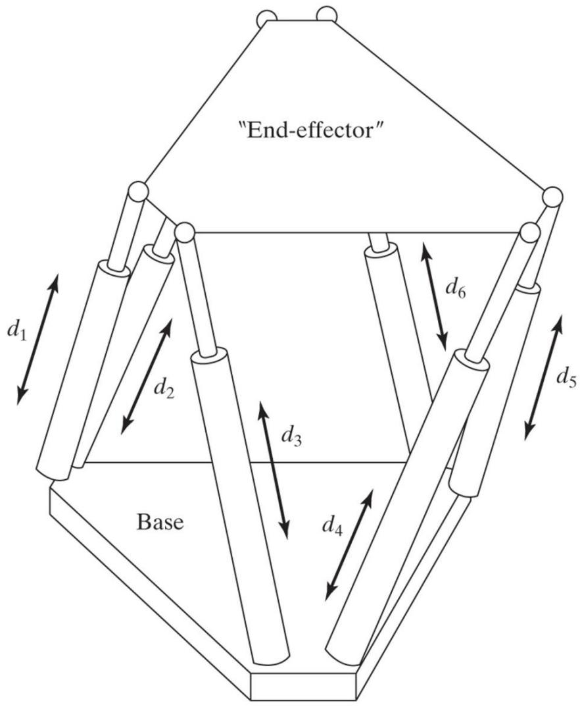
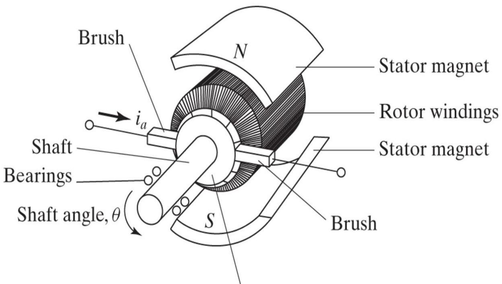

# 操作臂的机构设计

> [!abstract] 本章导览
> 从「分析」转向「设计」：结构如何影响运动学/动力学、能完成什么任务。
> 1. 基于任务需求的设计（自由度、工作空间、负载、速度、精度）
> 2. **运动学构型**：直角坐标 / 铰接 / SCARA / 极坐标 / 圆柱 + 手腕
> 3. 工作空间定量：**结构长度系数 $Q_L$**、**操作度 $\omega$**
> 4. 冗余结构与闭链（**Stewart 平台**）
> 5. 驱动方案、减速传动、刚度变形
> 6. 驱动器、位置检测（光学编码器）、力传感

---

## 一、基于任务需求的设计

> [!note] 机器人应按任务类型设计（经济实用）
> 不是所有任务都要 6 DOF。尺寸、关节数目/布局、驱动器类型、传感器、控制器都随任务大幅变化。

> [!important] 设计五要素
>
> | 要素 | 要点 |
> |---|---|
> | **自由度数目** | 与任务匹配。工具有对称轴（如磨削轮绕 $z_T$ 自由旋转）→ 6 DOF 是**冗余**的；插装电路板元件仅需 4 DOF（x,y,θ + z）；倾斜/转动工作台可提供 2 DOF |
> | **工作空间** | 又称工作体积/包络；要考虑形状、奇异性、自身干涉 |
> | **负载能力** | 取决于结构尺寸、传动、驱动器；含惯性与速度产生的动力载荷 |
> | **速度** | 不只看最大速度，**加减速能力**同样重要（加减速常占大部分周期）|
> | **重复精度 vs 精度** | 高精度开销大；精度多取决于**制造细节与连杆参数已知程度**，而非设计 |

---

## 二、运动学构型

> [!important] 腕部隔离设计（绝大多数工业臂）
> **前 3 关节定位**（确定腕点位置），**后 n-3 关节定姿**（轴相交于腕点）。这类「定位结构 + 手腕」有**封闭运动学解**（[[理论课04.操作臂逆运动学_笔记|Pieper]]）。定位结构常用简单运动学：连杆扭转 $0°$ 或 $\pm90°$、连杆偏距为 0。

按前 3 关节（定位结构）分类：

> [!note] 五种主流构型
>
> | 构型 | 前 3 关节 | 特点 |
> |---|---|---|
> | **直角坐标 Cartesian** | 3 个互相垂直的移动副 (P-P-P) | 刚度高（可造龙门大型机）、解最简单、前三轴无耦合无奇异；但工作空间「内置」、翻新难 |
> | **铰接 Articulated** | 转动 (R-R-R)，拟人/肘型 | PUMA 560、Motoman L-3；结构紧凑、侵入工作空间少、物美价廉 |
> | **SCARA** | 3 平行转动 + 1 移动 | 前 3 关节**不承重**、驱动器可固定在底座做大→高速（Adept One 达 30 ft/s，比关节型快 10 倍）；适合平面任务 |
> | **极坐标 Spherical** | 类铰接，但用移动副代替肘关节 | 杆可沿圆柱面伸缩 |
> | **圆柱坐标 Cylindrical** | 竖直移动 + 绕竖直轴转 + 正交移动 | — |

### 手腕（Wrist）

> [!note] 手腕三类
> 1. **三正交轴**：可达任意方向、有封闭解；但实际难制作不受限的三正交轴。
> 2. **三相交非正交轴**（Cincinnati Milacron「三回转手腕」）：可无限连续旋转，但有不可达姿态（第三轴进不去的锥体）。
> 3. **无相交轴手腕**：本身无封闭解，但装在铰接臂上（第 4 轴平行于第 2、3 轴）或直角坐标机上**仍有封闭解**。

---

## 三、工作空间属性的定量

> [!important] 结构长度系数 $Q_L$（衡量「用料效率」）
> $$L = \sum_{i=1}^N (a_{i-1}+d_i),\qquad Q_L = \frac{L}{\sqrt[3]{\omega}}$$
> $L$ 是连杆长度之和，$\omega$ 是工作空间体积。**$Q_L$ 越小越好**（用更短的连杆生成更大工作空间）。
>
> | 构型 | $Q_L$ |
> |---|---|
> | 直角坐标（三轴等行程）| 最小 **3.0** |
> | 理想铰接型 | $1/\sqrt[3]{4\pi/3}\approx 0.62$ |
>
> 定量印证：**铰接型干涉最小、结构最优**。

> [!important] 操作度 $\omega$（衡量灵巧性，远离奇异）
> 奇异位形 $\det(J(\Theta))=0$ 处损失自由度、无法良好工作。操作度：
> $$\omega = \sqrt{\det\!\big(J(\Theta)J^T(\Theta)\big)},\qquad \text{非冗余时}\ \omega=|\det J(\Theta)|$$
> **$\omega$ 越大、灵巧工作空间越大、越好。** 离奇异越远，各方向运动/施力越均匀。

> [!note] 惯性椭球（Asada）
> 笛卡儿质量矩阵 $M_x(\Theta)=J^{-T}M(\Theta)J^{-1}$，椭球 $X^TM_x X=1$ 描述各方向加速能力。工作空间中**良态点椭球近似圆球**；边界处椭球变扁（某些方向加速困难）。

---

## 四、冗余结构与闭链

> [!important] 闭链与 Stewart 平台
> 闭链优点：**刚度高**；缺点：关节运动范围/工作空间受限。
>
> **Stewart 平台**：6 自由度并联机构，末端位姿由 6 个连接基座的直线驱动器控制（一端 2-DOF 万向节连基座、另一端 3-DOF 球关节连平台）。
> - 共同特点：**刚度好、行程受限**。
> - 有趣的颠倒：**逆运动学简单、正运动学复杂**（有时无闭式解）——与串联臂正好相反！

---

## 五、驱动方案与传动

> [!note] 驱动器位置的权衡
> - **直接驱动**（装在关节上）：无传动元件，精度 = 驱动器精度，设计/控制简单；但驱动器重、低速高扭需减速。
> - **远端安装**（靠近基座）：降低整体惯性、减小驱动器尺寸；但需传动系统，引入摩擦与弹性。

> [!important] 减速传动比
> $$\dot\theta_o = \frac{1}{n}\dot\theta_i,\qquad \tau_o = \eta\,\tau_i$$
> 减速 $n$ 倍 → 速度降 $n$ 倍、扭矩增（含效率 $\eta$）。
>
> | 减速元件 | 特点 |
> |---|---|
> | **齿轮**（直齿/锥齿/蜗轮）| 紧凑、传动比大；缺点是**间隙（backlash）+ 摩擦** |
> | **柔性带/钢缆/皮带** | 有长度弹性，需预紧；过大预紧增摩擦 |
> | **螺杆/滚珠丝杠** | 大传动比、旋转→直线；滚珠丝杠摩擦小、可反驱 |

---

## 六、刚度与变形

> [!important] 刚度为何重要
> 1. 工具位姿由**关节传感器 + 正运动学**算得，臂杆不能因重力/负载下垂（否则 DH 描述失真）。
> 2. 柔性导致**共振**，损害性能（第 9 章详谈）。

> [!note] 各元件刚度估算
>
> | 元件 | 刚度公式 |
> |---|---|
> | 齿轮（输出齿轮）| $k = C_g b r^2$（钢 $C_g=1.34\times10^{10}\,N/m^2$）|
> | 皮带 | $k = AE/l$ |
> | 连杆（悬臂梁，中空圆管）| $k = \dfrac{3\pi E(d_o^4-d_i^4)}{64 l^3}$ |
> | 连杆（中空方梁）| $k = \dfrac{E(w_o^4-w_i^4)}{4 l^3}$ |
>
> 注意：**传动系统通常比连杆变形更大**；任何刚度预测都偏高（漏算轴承/支座柔性）。精确分析用有限元。

---

## 七、驱动器、位置检测、力传感

> [!note] 驱动器类型
>
> | 类型 | 优点 | 缺点 |
> |---|---|---|
> | **液压** | 紧凑、力大、无需减速 | 设备多、脏、密封摩擦影响力控；早期/大型机用 |
> | **气动** | 比液压干净 | 气体可压缩 + 密封高摩擦 → 难精确控制 |
> | **电动机** | 可控性好、接口简单 | 功率重量比不如液/气；中小型臂最常用 |

> [!note] 位置检测：旋转光学编码器
> 最常用。刻线圆盘遮挡光束，光电探测器输出二进制波形；**两通道相位差 90°**：脉冲计数得转角、相对相位定方向；标志脉冲作绝对零位。
> 误差源：径向刻线不完美（微观）、盘心与轴心**偏心**（宏观/一次性误差，转一圈幅值变化）。

> [!note] 力传感的三个安装位置
> 1. **关节驱动器处**：测驱动器/减速器力矩，但难测末端接触力。
> 2. **腕传感器**（末端与最末关节之间）：应变计，测末端 3~6 个力/力矩分量。
> 3. **指尖**：测 1~4 个力分量。
> 多用半导体/金属膜应变计，设计需权衡传感器数目、安装、灵敏度vs刚度、过载保护。

---

## 本章小结

> [!summary] 核心收束
> - 按任务设计：DOF（可冗余）、工作空间、负载、速度（含加减速）、精度。
> - 构型：直角坐标（刚）/铰接（紧凑优）/SCARA（高速平面）/极/圆柱 + 腕部隔离（封闭解）。
> - 定量：$Q_L$ 越小用料越省（铰接 0.62 < 直角 3.0）；操作度 $\omega=\sqrt{\det(JJ^T)}$ 越大越灵巧。
> - 闭链 Stewart：刚度高、IK 易 FK 难（与串联相反）。
> - 驱动：直接 vs 远端；减速 $\dot\theta_o=\dot\theta_i/n,\tau_o=\eta\tau_i$；刚度防下垂防共振。
> - 编码器双通道差 90° 测角定向；力传感三处可装。

## 自测题

1. 为什么磨削/插件等任务可用少于 6 DOF？举例说明冗余自由度。
2. 「腕部隔离」设计为什么能保证封闭运动学解？定位结构常用什么简化？
3. 比较直角坐标、铰接、SCARA 三种构型的优缺点与适用场景。
4. 写出 $Q_L$ 与操作度 $\omega$ 的定义，并解释各自衡量什么。
5. Stewart 平台的正/逆运动学难度为何与串联臂相反？
6. 减速比对速度和扭矩各有什么影响？齿轮传动的主要缺点是什么？

> 关联：[[理论课04.操作臂逆运动学_笔记]]（Pieper 封闭解）、[[理论课05.速度与静力a_笔记]]（雅可比与奇异）、[[理论课09.操作臂的线性控制_笔记]]（共振与刚度对控制的影响）
