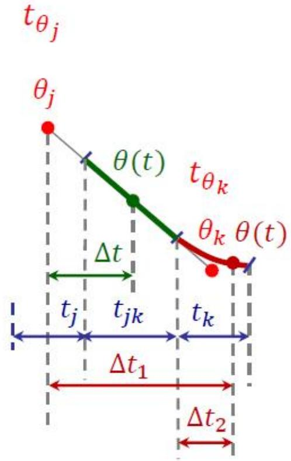
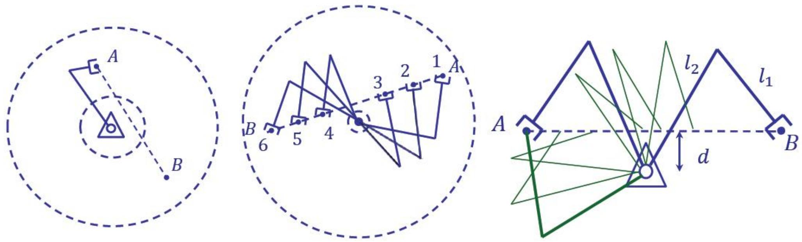

# 轨迹规划（b）：直线+抛物线过渡（LFPB）详解

> [!abstract] 本章导览
> 深入推导 **直线函数 + 抛物线过渡（Linear function with Parabolic Blends, LFPB）**：很多任务需要**直线轨迹**，但多段直线在转折点**速度不连续**，用抛物线把两端「磨圆」即可平滑。
> 1. LFPB 缘由与单段推导
> 2. 过渡时间 $t_b$ 与**最小加速度** $\ddot\theta_{min}$
> 3. 多 via 点：设加速度解时间 / 设时间解加速度
> 4. 首末段特殊处理、伪 via 点
> 5. 真实系统加速度受动力学 $\tau=M\ddot\Theta+V+G$ 限制
> 6. 轨迹不可行的情形

---

## 一、缘由：直线段转折点速度不连续

> [!note] 问题与对策
> 含多直线段的轨迹，**线段间转折点处速度突变**（加速度→∞，物理不可实现）。
> **对策**：把每段直线两端用**二次（抛物线）曲线**修正，使速度轨迹光滑（加速度有限）。

---

## 二、单段 LFPB 推导

> [!important] 两种曲线拼接
> - **直线段（一次）= 匀速**：$\dot\theta = \dfrac{\theta_h-\theta_b}{t_h-t_b}$
> - **抛物线段（二次）= 匀加速**：$\theta(t)=\theta_0+\dot\theta_0 t+\tfrac12\ddot\theta t^2$，$\dot\theta(t)=\dot\theta_0+\ddot\theta t$
>
> 设对称（$\dot\theta_0=\dot\theta_f=0$），中点 $t_h=\tfrac12 t_f$，$\theta_h=\tfrac{\theta_f+\theta_0}{2}$。

自绘 LFPB 位置-速度剖面（梯形速度）：

```
位置 θ(t)            速度 θ̇(t)
 θf┤        ___●       ┤    ____________
   │      ╱(抛物)      │   ╱            ╲   ← 抛物段斜坡(匀加速)
   │   ╱ (直线匀速)    │  ╱  直线段恒速  ╲
 θ0┤●__╱               ┤_╱________________╲_
   └──┬────┬──┬──→ t   └─┬──────────────┬──→ t
     tb        tf-tb     tb            tf-tb
   ←抛物→直线←抛物→      加速  匀速     减速
```

> [!important] 过渡时间 $t_b$（由交界处速度连续解出）
> 令抛物末速 = 直线速度：$\ddot\theta\,t_b = \dfrac{\theta_h-\theta_b}{t_h-t_b}$，整理成二次方程 $\ddot\theta t_b^2 - \ddot\theta t_f t_b + (\theta_f-\theta_0)=0$，得：
> $$t_b = \frac{\ddot\theta t_f - \sqrt{\ddot\theta^2 t_f^2 - 4\ddot\theta(\theta_f-\theta_0)}}{2\ddot\theta}$$

> [!warning] 最小加速度条件（判别式 ≥ 0）
> $t_b$ 为实数要求 $\ddot\theta \ge \dfrac{4(\theta_f-\theta_0)}{t_f^2}$，即：
> $$\boxed{\ddot\theta_{min} = \frac{4(\theta_f-\theta_0)}{t_f^2}}$$
>
> | 情形 | 结果 |
> |---|---|
> | $\ddot\theta=\ddot\theta_{min}$ | $t_b=t_f/2$，**无直线段**，两抛物线直接相连；此时峰值速度 $=2\dfrac{\theta_f-\theta_0}{t_f}$（是无规划直连速度的 2 倍）|
> | $\ddot\theta>\ddot\theta_{min}$ | 有直线段，常规梯形 |
> | $\ddot\theta<\ddot\theta_{min}$ | **加速度不足**，无法在 $t_f$ 内到达，中点 $\theta<\theta_h$ |

---

## 三、多 via 点的 LFPB



对任一段 $[\theta_j,\theta_k]$，先算直线段速度 $\dot\theta_{jk}=\dfrac{\theta_k-\theta_j}{t_{djk}}$，再处理 via 点 $k$ 处的抛物过渡：

> [!important] 两种求解方法
> **方法一：设加速度，解时间**
> $$\ddot\theta_k = \text{sgn}(\dot\theta_{kl}-\dot\theta_{jk})|\ddot\theta_k|,\quad t_k = \frac{\dot\theta_{kl}-\dot\theta_{jk}}{\ddot\theta_k}$$
> **方法二：设时间，解加速度**
> $$\ddot\theta_k = \frac{\dot\theta_{kl}-\dot\theta_{jk}}{t_k}$$
> 直线段净时间：$t_{jk}=t_{djk}-\tfrac12 t_j-\tfrac12 t_k$。

> [!note] 首段 / 末段特殊处理
> - **首段**：$\theta_1$ 视为起点 $\theta_0$ 在时间上**后移** $t_1/2$，引入起始抛物段使速度从 0 连续起步：$t_1=t_{d12}-\sqrt{t_{d12}^2-\dfrac{2(\theta_2-\theta_1)}{\ddot\theta_1}}$。
> - **末段**：$\theta_n$ 视为终点 $\theta_f$ 在时间上**前移** $t_n/2$，对称处理。

### 编程时的分段判定

> [!example] 某时刻 $t$ 属于直线段还是抛物段？
> - **直线段** $t\in[t_{\theta_j}+\tfrac12 t_j,\ t_{\theta_k}-\tfrac12 t_k]$：$\theta(t)=\theta_j+\dot\theta_{jk}(t-t_{\theta_j})$，$\ddot\theta=0$。
> - **抛物段** $t\in[t_{\theta_k}-\tfrac12 t_k,\ t_{\theta_k}+\tfrac12 t_k]$：$\theta(t)=\theta_j+\dot\theta_{jk}\Delta t_1+\tfrac12\ddot\theta_k\Delta t_2^2$，$\ddot\theta=\ddot\theta_k$。

---

## 四、真实系统的加速度限制

> [!warning] 可达加速度取决于动力学
> 实际 $\ddot\theta$ 受限于：**电机规格** + **手臂姿态**（不同姿态各轴承载重力扭矩不同）+ **动态状态**（不同运动下惯性力不同）。即 [[理论课06.操作臂动力学a_笔记|动力学方程]]：
> $$\tau = M(\Theta)\ddot\Theta + V(\Theta,\dot\Theta) + G(\Theta)$$
> 2R 臂的惯量矩阵（随 $\theta_2$ 变）：
> $$M(\Theta)=\begin{bmatrix} l_2^2m_2+2l_1l_2m_2c_2+l_1^2(m_1+m_2) & l_2^2m_2+l_1l_2m_2c_2 \\ l_2^2m_2+l_1l_2m_2c_2 & l_2^2m_2 \end{bmatrix}$$
> 可见同一电机扭矩，在不同 $\Theta$ 下能产生的 $\ddot\Theta$ 不同——轨迹规划须留余量。

---

## 五、LFPB 的局限

> [!important] 轨迹不精确过 via 点
> LFPB 规划后轨迹**一般不精确通过 via 点**（抛物过渡区为速度连续让了路），只有 $\ddot\theta\to\infty$ 才精确过点。
> **若必须过点** → 加**伪 via 点（pseudo via points）**，让原 via 点落在直线段上即可被通过。



> [!warning] 三类不可行情形
> 1. 中间某些段**落在工作空间外**（无法到达）。
> 2. 轨迹需要**极高加减速**（靠近奇异位形）。
> 3. 特定起末姿态间**无法生成连续轨迹**（如图，除非 $l_1-l_2=d$）。

---

## 本章小结

> [!summary] 核心收束
> - LFPB = 直线匀速 + 抛物线匀加速过渡，解决直线段转折点速度突变。
> - 过渡时间 $t_b$ 由速度连续解出；**最小加速度** $\ddot\theta_{min}=4(\theta_f-\theta_0)/t_f^2$。
> - 多 via 点两法：设加速度解时间 / 设时间解加速度；首末段半个抛物段后/前移。
> - 真实加速度受 $\tau=M\ddot\Theta+V+G$ 限制，随姿态/动态变化。
> - LFPB 不精确过 via 点 → 伪 via 点补救；注意工作空间/奇异/连续性不可行情形。

## 自测题

1. 为什么多段直线轨迹需要抛物线过渡？过渡保证了什么连续性？
2. 推导单段 LFPB 的 $t_b$，并写出 $\ddot\theta_{min}$。当 $\ddot\theta=\ddot\theta_{min}$ 时轨迹形状如何？
3. 多 via 点的「设加速度解时间」与「设时间解加速度」分别怎么算 $t_k$ 与 $\ddot\theta_k$？
4. 为什么真实可达加速度随手臂姿态变化？用动力学方程解释。
5. LFPB 为何不精确过 via 点？如何用伪 via 点补救？

> [!info] 作业（课本第五章）
> 课后题 5.1、5.3、5.7、5.10、5.12、5.13、5.18；截止 6 月 2 日 23:59，企业微信提交。

> 关联：[[理论课07.轨迹规划a_笔记]]（三次多项式）、[[理论课07.轨迹规划c_笔记]]（LFPB 在综合例题中的应用）、[[理论课06.操作臂动力学a_笔记]]（加速度的力矩限制）
