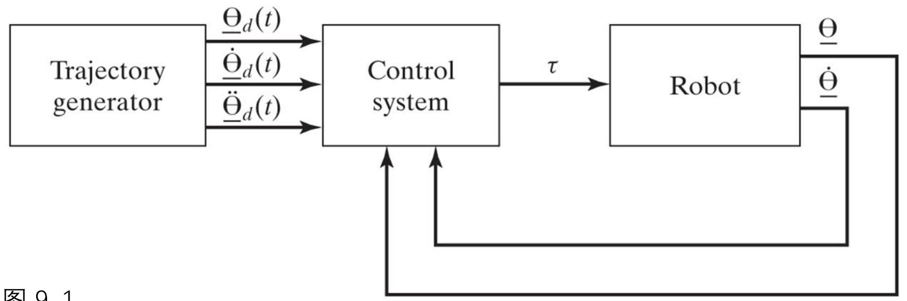
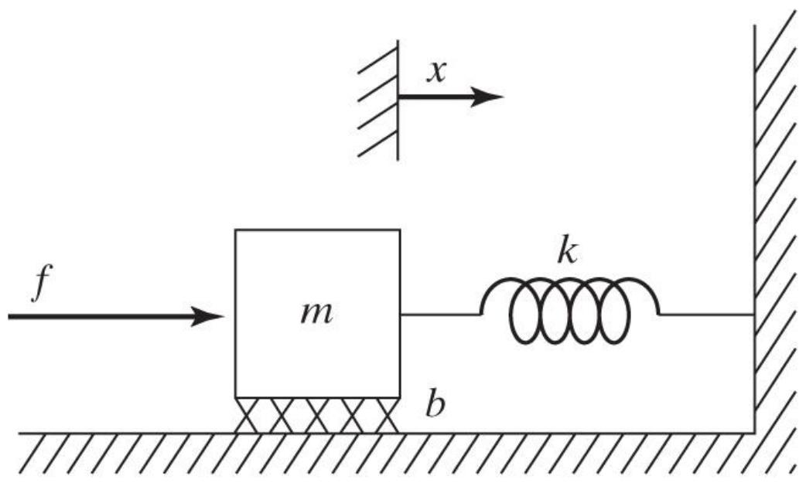
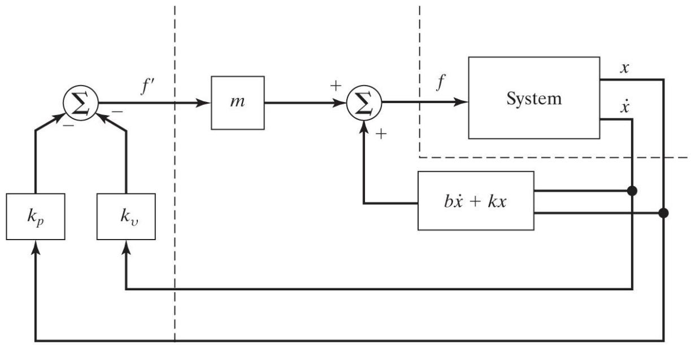
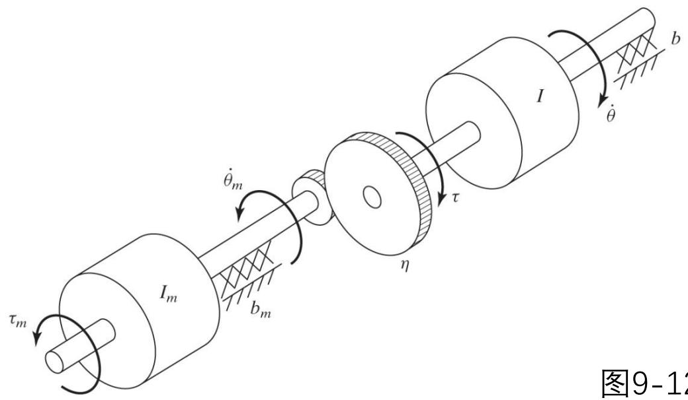
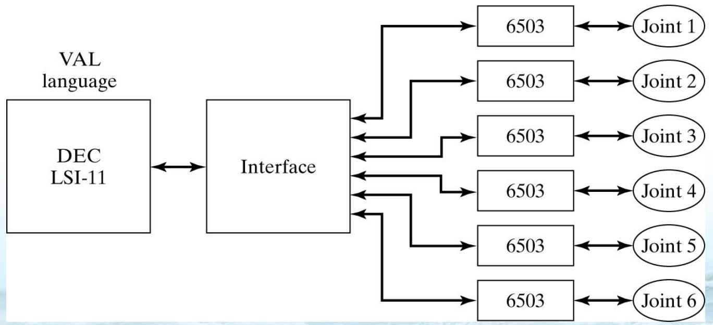

# 操作臂的线性控制

> [!abstract] 本章导览
> 把 [[理论课06.操作臂动力学a_笔记|动力学]]接到「控制」：如何给驱动器算力矩，让关节跟踪期望轨迹。
> 1. 反馈与闭环控制、伺服误差、独立关节 SISO 近似
> 2. **二阶线性系统**：过/欠/临界阻尼
> 3. **二阶系统控制**：PD 位置调节、闭环极点配置
> 4. **控制律分解**（基于模型 + 伺服）
> 5. **轨迹跟踪**、误差空间方程
> 6. **抗扰动**：稳态误差与积分项（PID）
> 7. 单关节建模：DC 电机、有效惯量、共振约束
> 8. 工业机器人控制器架构

---

## 一、反馈与闭环控制



> [!important] 开环 vs 闭环
> - **开环**：用动力学模型直接算 $\tau=M(\Theta_d)\ddot\Theta_d+V(\Theta_d,\dot\Theta_d)+G(\Theta_d)$。模型完美且无干扰时可行，但**不用传感器反馈**，实际不实用。
> - **闭环**：用关节传感器反馈，按**伺服误差**算力矩去减小误差：
> $$E = \Theta_d - \Theta,\qquad \dot E = \dot\Theta_d - \dot\Theta$$
> 设计核心：先保证**稳定**（误差始终"较小"，不发散），再满足性能。

> [!note] MIMO → 独立关节 SISO 近似
> 操作臂是多输入多输出（MIMO）。本章把每个关节当**独立 SISO** 控制（N 关节设计 N 个独立控制器）——这是工业界主流。虽然各关节运动方程高度耦合，但**大传动比**下该近似成立（见后文有效惯量）。

---

## 二、二阶线性系统（被控对象原型）

质量-弹簧-阻尼系统（开环）：
$$m\ddot x + b\dot x + kx = 0$$
特征方程 $ms^2+bs+k=0$，极点（poles）：
$$s_{1,2} = -\frac{b}{2m} \pm \frac{\sqrt{b^2-4mk}}{2m}$$

> [!important] 三种阻尼（由 $b^2$ 与 $4mk$ 比较决定）
>
> | 情况 | 条件 | 极点 | 响应 | 名称 |
> |---|---|---|---|---|
> | 两不等实根 | $b^2>4mk$ | 实、负 | 缓慢无振荡回平衡 | **过阻尼** Overdamped |
> | 复根 | $b^2<4mk$ | 共轭复 | 振荡衰减 | **欠阻尼** Underdamped |
> | 重根 | $b^2=4mk$ | 实、相等 | **最快无振荡**回平衡 | **临界阻尼** Critically damped |
>
> **临界阻尼最理想**：最短时间无振荡归位。

自绘极点位置与时间响应对照：

```
   Im(s)                          x(t)
    │  ×(欠阻尼,复根)        过阻尼 ╲___________   缓慢
    │ ╱                      临界  ╲__________    最快无振荡
────┼────── Re(s)           欠阻尼 ╲╱╲╱‾‾‾‾‾    振荡衰减
    │ ╲ ×                          └──────→ t
    │  × ←实根越靠左衰减越快
  (所有极点须在左半平面 Re<0 才稳定)
```

> [!note] 阻尼比与固有频率（标准参数化）
> 把特征方程写成 $s^2 + 2\zeta\omega_n s + \omega_n^2 = 0$：
> $$\zeta = \frac{b}{2\sqrt{km}}\ (\text{阻尼比}),\qquad \omega_n = \sqrt{k/m}\ (\text{固有频率})$$
> $\lambda=-\zeta\omega_n$（衰减率），$\mu=\omega_n\sqrt{1-\zeta^2}$（阻尼固有频率）。无阻尼 $\zeta=0$，临界阻尼 $\zeta=1$。复根响应 $x(t)=re^{\lambda t}\cos(\mu t-\delta)$。

---

## 三、二阶系统的控制（PD 位置调节）



加驱动力后 $m\ddot x+b\dot x+kx=f$，用 **PD 反馈控制律**：
$$f = -k_p x - k_v \dot x$$

> [!important] 闭环极点可任意配置
> 代入得闭环方程：
> $$m\ddot x + (b+k_v)\dot x + (k+k_p)x = 0 \ \Rightarrow\ m\ddot x + b'\dot x + k'x = 0$$
> **通过选 $k_p,k_v$ 可让闭环呈现任意期望二阶特性**（如临界阻尼 + 期望刚度 $k'$）。
> ⚠️ 若 $b'<0$ 或 $k'<0$ 则**不稳定**（误差发散）。

> [!example] 例 9.4：配置临界阻尼 + 刚度 16
> $m=1,b=1,k=1$，要 $k'=16$、临界阻尼 $b'=2\sqrt{mk'}=8$：
> $$k_p = k'-k = 15,\qquad k_v = b'-b = 7$$

---

## 四、控制律分解（Partitioned Control）

> [!important] 把控制器拆成「基于模型」+「伺服」两部分
> $$f = \alpha f' + \beta,\qquad \alpha = m,\ \beta = b\dot x + kx$$
> 代入后系统**化简为单位质量** $\ddot x = f'$。此时伺服部分设计极简：
> $$f' = -k_v\dot x - k_p x \ \Rightarrow\ \ddot x + k_v\dot x + k_p x = 0$$
> 增益与系统参数**解耦**，临界阻尼条件统一为 $k_v = 2\sqrt{k_p}$。



> [!note] 为何分解？
> 模型参数只进「基于模型」部分；伺服部分永远面对单位质量。本章看似多余，但对 [[理论课06.操作臂动力学a_笔记|非线性机械臂动力学]]（第 10 章）极关键——$\alpha=M(\Theta)$、$\beta=V+G$ 即「计算力矩法」。

---

## 五、轨迹跟踪

不只定点调节，还要跟随轨迹 $x_d(t)$。误差 $e=x_d-x$，伺服律：
$$f' = \ddot x_d + k_v\dot e + k_p e$$
代入 $\ddot x=f'$ 得**误差空间方程**：
$$\ddot e + k_v\dot e + k_p e = 0$$



> [!note] 含义
> 模型正确、无噪声时质量块精确跟踪 $x_d$；存在初始误差时误差按 $\ddot e+k_v\dot e+k_p e=0$ 被抑制（选临界阻尼最快收敛），随后精确跟踪。
> （注：上图实为齿轮减速有效惯量模型，放此处用于说明"基于模型部分"需要的惯量参数来源。）

---

## 六、抗扰动：稳态误差与积分项（→ PID）

加常值扰动 $f_{dist}$，误差方程 $\ddot e+k_v\dot e+k_p e = f_{dist}/m$。

> [!warning] PD 有稳态误差
> 稳态（导数为 0）：$k_p e = f_{dist}/m \Rightarrow e = \dfrac{f_{dist}}{k_p m}\neq 0$。
> **$k_p$ 越大稳态误差越小，但无法消除。**

> [!important] 加积分项消除稳态误差 → PID
> $$f' = \ddot x_d + k_v\dot e + k_p e + k_i\!\int e\,dt$$
> 求导后稳态得 $k_i e = 0 \Rightarrow e = 0$。**积分项彻底消除常值扰动下的稳态误差。** 这就是工业最常用的 **PID** 控制律。

---

## 七、单关节建模与控制

> [!note] DC 力矩电机
> $$\tau_m = k_m i_a\ (\text{转矩}\propto\text{电枢电流}),\qquad v = k_e\dot\theta_m\ (\text{反电势}\propto\text{转速})$$
> 电枢电路一阶方程：$l_a\dot i_a + r_a i_a = v_a - k_e\dot\theta_m$。**假设 1：忽略电枢感抗 $l_a$。**

### 有效惯量（解释大传动比为何能用 SISO）

齿轮减速 $\tau=\eta\tau_m$、$\dot\theta=\dot\theta_m/\eta$（$\eta>1$）。按负载侧写：
$$\tau = (I + \eta^2 I_m)\ddot\theta + (b + \eta^2 b_m)\dot\theta$$

> [!important] 有效惯量 $I + \eta^2 I_m$
> 大传动比 $\eta\gg1$ 时，$\eta^2 I_m$（电机转子惯量放大 $\eta^2$ 倍）**主导**有效惯量，使其近似为**常数**——这正是「独立关节线性控制」成立的依据。
> **例 9.6**：$I_m=0.01,\eta=30$，连杆惯量 $I\in[2,6]$，有效惯量 $\in[11,15]$——减速器把惯量变化从 3 倍压到 1.36 倍。

### 未建模柔性与共振约束

> [!warning] 闭环带宽受结构共振限制（关键设计约束）
> 忽略结构柔性的代价：不能激发共振模态。设最低结构共振频率 $\omega_{res}$，则必须：
> $$\omega_n \le \tfrac12\omega_{res}$$
> 共振频率估算（集中质量模型）：梁用 $0.23m$ 等效质量、轴用 $0.33I$ 等效惯量，$\omega_{res}=\sqrt{k/m_{eff}}$。
> **例 9.9**：连杆 4.347kg、横向刚度 3600 N/m → $m_{eff}=0.23\times4.347\approx1.0$kg → $\omega_{res}=\sqrt{3600}=60$ rad/s ≈ 9.6 Hz。

### 单关节分解控制器（汇总）

> [!important] 三假设 + 控制律
> 假设：①忽略 $l_a$；②大传动比下有效惯量为常数 $I_{max}+\eta^2 I_m$；③忽略结构柔性（除用 $\omega_{res}$ 定增益）。控制器：
> $$\alpha = I_{max}+\eta^2 I_m,\quad \beta = (b+\eta^2 b_m)\dot\theta,\quad \tau' = \ddot\theta_d + k_v\dot e + k_p e$$
> 闭环 $\ddot e+k_v\dot e+k_p e=\tau_{dist}$，增益按共振约束取满：
> $$k_p = \omega_n^2 = \tfrac14\omega_{res}^2,\qquad k_v = 2\sqrt{k_p} = \omega_{res}$$

---

## 八、连续 vs 离散 与工业控制器架构

> [!note] 采样率选取（连续假设何时成立）
> 计算并非无限快，输出是离散阶梯。采样率下限取决于：① 跟踪参考输入（≥带宽 2 倍）；② 抗扰动（采样周期 < 噪声相关时间 1/10）；③ 结构共振（≥共振频率 2 倍）。



> [!note] 典型工业控制器（两级结构）
> - **顶层主机**：高级语言（如 VAL）写程序、算 IK、做轨迹规划、接示教器，按给定值更新速率下发位置指令。
> - **底层关节控制器**（每关节一个）：高伺服周期跑简单 **PID**；光学编码器作位置反馈，**速度由位置数值微分**得到（很少用测速计）。

---

## 本章小结

> [!summary] 核心收束
> - 闭环控制按伺服误差 $E=\Theta_d-\Theta$ 算力矩；MIMO 近似为独立关节 SISO。
> - 二阶系统三阻尼：过阻尼/欠阻尼/**临界阻尼（最优）**；$\zeta=b/2\sqrt{km}$，$\omega_n=\sqrt{k/m}$。
> - **PD** 配置闭环极点（$k'=k+k_p,b'=b+k_v$）；分解控制把系统化为单位质量，$k_v=2\sqrt{k_p}$。
> - 轨迹跟踪误差空间方程 $\ddot e+k_v\dot e+k_p e=0$；常值扰动 PD 有稳态误差 → **加积分（PID）消除**。
> - 大传动比使有效惯量 $\approx I_{max}+\eta^2 I_m$ 近似常数；闭环带宽受共振约束 $\omega_n\le\tfrac12\omega_{res}$。
> - 工业控制器两级：主机算 IK/轨迹，关节控制器跑 PID + 编码器反馈。

## 自测题

1. 开环与闭环控制的本质区别是什么？为什么开环不实用？
2. 二阶系统三种阻尼各对应什么极点位置和响应？为什么临界阻尼最理想？
3. PD 控制如何配置闭环刚度与阻尼？写出例 9.4 的 $k_p,k_v$。
4. 控制律分解的两部分各做什么？为什么对非线性机械臂控制重要？
5. PD 为什么有稳态误差？积分项如何消除它？
6. 解释「有效惯量 $I+\eta^2I_m$」，说明大传动比为何让独立关节控制成立。
7. 共振约束 $\omega_n\le\tfrac12\omega_{res}$ 的来源是什么？如何估算 $\omega_{res}$？

> [!info] 作业
> （本课件未列明确题号）

> 关联：[[理论课06.操作臂动力学a_笔记]]（动力学模型）、[[理论课08.操作臂的机构设计_笔记]]（刚度与共振）、[[理论课07.轨迹规划a_笔记]]（期望轨迹来源）
