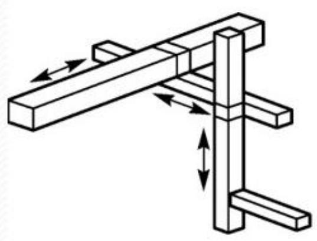
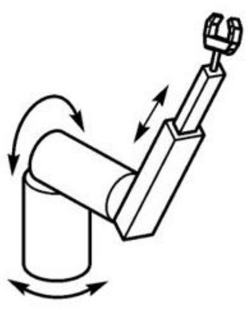
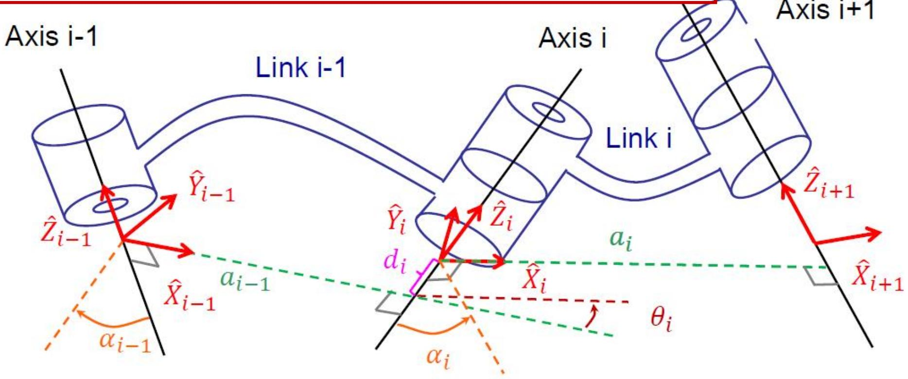
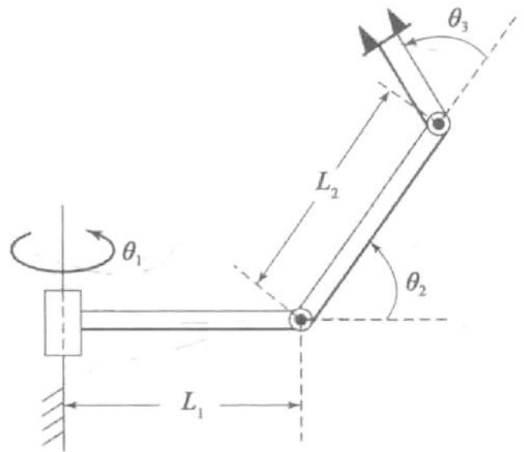
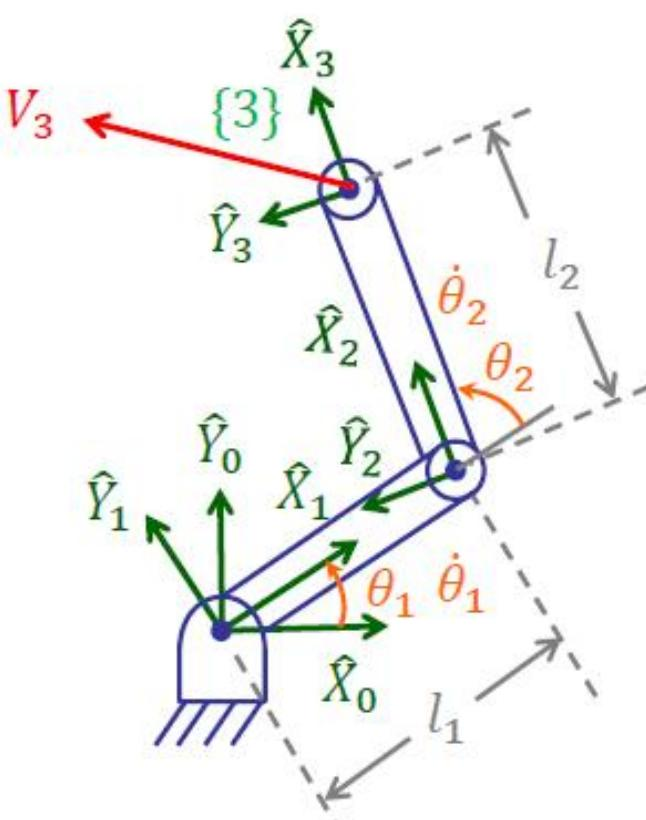
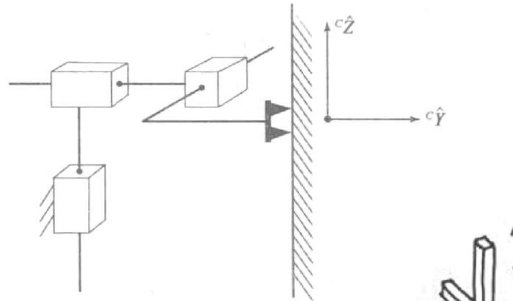
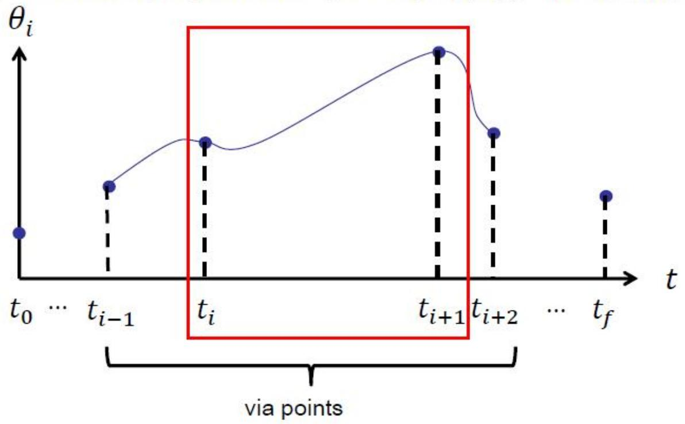
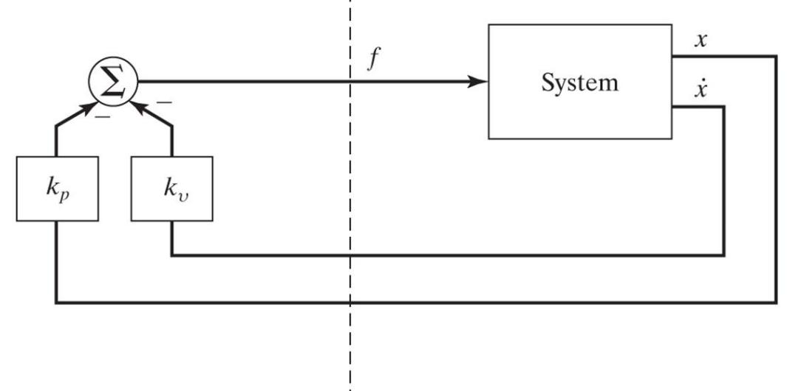
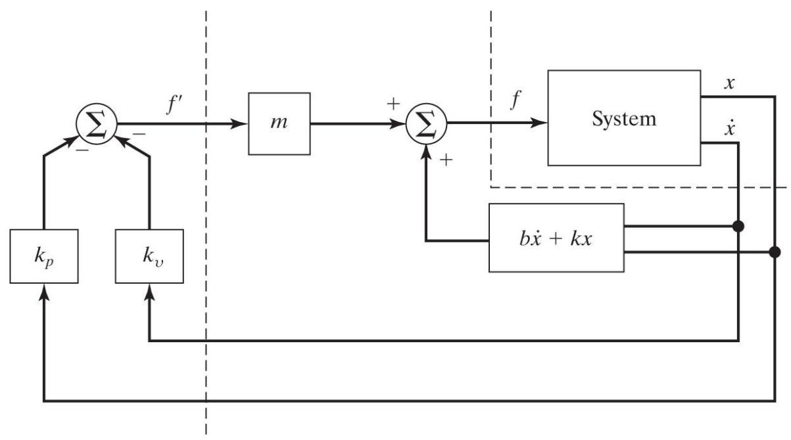

# 🎓 理论课 10 · 复习与习题（全课程总纲）

> [!abstract] 关于本篇
> 本篇是**期末复习课**整理：把 [[00_课程总览_MOC|全课程]] 从**空间描述 → 运动学 → 逆运动学 → 速度静力 → 轨迹规划 → 控制**串成一条复习主线，每一节给出**核心速记**并**反向链接**回对应章节，再把课件中的**例题（2.2 / 3.3 / 2R 雅可比 / 5.7 / 7.2）按原题完整抄录 + 解答**。
> - 配套自测请见 [[机器人原理期末样卷·详解_笔记|期末样卷详解]]。
> - 课件来源：部分内容源自台湾大学林沛群教授课件。

> [!tip] 怎么用这篇笔记
> 顺着七个部分快速扫一遍"速记 + 易错点"，遇到不熟的点击链接回原章节深读；例题先盖住解答自己做，再对答案。

---

## 一、课程全景：从刚体描述到运动控制

> [!summary] 一条主线
> **描述**一个刚体要 6 个自由度（空间：移动 3 + 转动 3）。机器人学就是围绕"如何描述位姿、如何在关节与末端之间换算、如何让它动起来"展开：
> 位姿描述（$R,T$）→ 正运动学（DH 连乘）→ 逆运动学（求关节角）→ 速度/静力（雅可比 $J$）→ 动力学（$\tau=M\ddot\Theta+V+G$）→ 轨迹规划 → 线性控制。

**工业机器人按前 3 轴构型分四类**（决定可达工作空间形状）：

| 直角坐标型（PPP）| 球坐标型（RRP）|
|:---:|:---:|
|  |  |

> 另有**圆柱坐标型**（RPP）与**关节坐标型**（RRR，最常见，如 PUMA）。专用机器人 3 轴定位即可，**通用机器人需 6 轴**（3 定位 + 3 定姿）。构型选择详见 [[理论课08.操作臂的机构设计_笔记#二、运动学构型|机构设计·运动学构型]]。

---

## 二、空间描述与变换

> [!note] 核心速记
> - **旋转矩阵** $^A_BR$：三列 = {B} 三轴在 {A} 中的单位矢量（方向余弦）；正交阵 $R^{-1}=R^T=\,^B_AR$，$\det R=1$，9 个数 - 6 个约束 = **3 DOF**。
> - **三种用法**：① 描述姿态 ② 变换坐标 $^AP=\,^A_BR\,^BP$ ③ 旋转算子。详见 [[理论课02.空间描述和变换a_笔记#五、旋转矩阵的三种用法（本章核心）|旋转矩阵三种用法]]。
> - **固定角 vs 欧拉角**：X-Y-Z 固定角 $(\gamma,\beta,\alpha)$ **左乘**（先转的放后面）；Z-Y-X 欧拉角 $(\alpha,\beta,\gamma)$ **右乘**（先转的放前面）；**两者结果完全相同**。→ [[理论课02.空间描述和变换a_笔记#六、姿态的三参数拆解：固定角 vs 欧拉角|固定角 vs 欧拉角]]
> - **齐次变换** $^A_BT=\begin{bmatrix}R&P\\0&1\end{bmatrix}$：移动+转动一体；可连续相乘 $^A_BT=\,^A_CT\,^C_DT\,^D_BT$。→ [[理论课02.空间描述和变换b_笔记#五、复合变换与逆变换|复合变换与逆变换]]

> [!example] 例 2.2（旋转矩阵复合）
> 矢量 $P$ 绕 $\hat Y$ 旋转 $30^\circ$，然后绕 $\hat X$ 旋转 $45^\circ$。求按以上顺序旋转后得到的旋转矩阵 $R$。

> [!success]- 解答
> 绕**固定轴**先 $Y$ 后 $X$ → 后转的左乘：
> $$R=\operatorname{rot}(\hat x,45^\circ)\,\operatorname{rot}(\hat y,30^\circ)=\begin{bmatrix}1&0&0\\0&.707&-.707\\0&.707&.707\end{bmatrix}\begin{bmatrix}.866&0&.5\\0&1&0\\-.5&0&.866\end{bmatrix}$$
> $$=\begin{bmatrix}.866&0&.5\\.353&.707&-.612\\-.353&.707&.612\end{bmatrix}$$
> ⚠ 易错：绕固定轴 → 左乘；与样卷计算题 2 同理（[[机器人原理期末样卷·详解_笔记#计算题 2：复合旋转矩阵（10 分）|样卷计算题 2]]）。
> 🔗 [[理论课02.空间描述和变换a_笔记#三个主轴旋转矩阵（基本旋转）|基本旋转矩阵]]

---

## 三、操作臂运动学（正运动学）

> [!note] 核心速记
> - **关节/连杆编号**：Link 0 = 地杆（不动），Link i 为第 i 个可动杆；每个转动/移动关节 1 DOF。
> - **DH 四参数（Craig 改进版）**：$\alpha_{i-1}$（绕 $\hat X_{i-1}$ 的扭角）、$a_{i-1}$（沿 $\hat X_{i-1}$ 的杆长）、$d_i$（沿 $\hat Z_i$ 的偏距）、$\theta_i$（绕 $\hat Z_i$ 的关节角）。→ [[理论课03.操作臂运动学a_笔记#三、连杆四参数（DH 参数核心）|DH 四参数]]
> - **正运动学** = 连杆变换连乘 $^0_NT=\,^0_1T\,^1_2T\cdots\,^{N-1}_NT$。→ [[理论课03.操作臂运动学b_笔记#二、3R 平面臂正运动学（完整推导）|3R 正运动学]]

> [!example] 例 3.3（空间 3R 臂的 DH 与正运动学）
> 图 3-29 所示为 3 自由度手臂，关节轴 1 与另外两轴不平行，轴 1 和轴 2 之间的夹角为 $90^\circ$。求解连杆参数和运动学方程 $^B_WT$（注意不需要定义杆 3）。
>
> 

> [!success]- 解答
> **连杆参数表**：
>
> | $i$ | $\alpha_{i-1}$ | $a_{i-1}$ | $d_i$ | $\theta_i$ |
> |:---:|:---:|:---:|:---:|:---:|
> | 1 | $0$ | $0$ | $0$ | $\theta_1$ |
> | 2 | $90^\circ$ | $L_1$ | $0$ | $\theta_2$ |
> | 3 | $0$ | $L_2$ | $0$ | $\theta_3$ |
>
> 各连杆变换（注意 $\alpha_1=90^\circ$ 时第二行出现 $0,0,-1$）：
> $${}^0_1T=\begin{bmatrix}C_1&-S_1&0&0\\S_1&C_1&0&0\\0&0&1&0\\0&0&0&1\end{bmatrix},\ {}^1_2T=\begin{bmatrix}C_2&-S_2&0&L_1\\0&0&-1&0\\S_2&C_2&0&0\\0&0&0&1\end{bmatrix},\ {}^2_3T=\begin{bmatrix}C_3&-S_3&0&L_2\\S_3&C_3&0&0\\0&0&1&0\\0&0&0&1\end{bmatrix}$$
> 连乘得（$C_{23}=\cos(\theta_2+\theta_3)$）：
> $${}^B_WT={}^0_3T=\begin{bmatrix}C_1C_{23}&-C_1S_{23}&S_1&L_1C_1+L_2C_1C_2\\S_1C_{23}&-S_1S_{23}&-C_1&L_1S_1+L_2S_1C_2\\S_{23}&C_{23}&0&L_2S_2\\0&0&0&1\end{bmatrix}$$
> 🔗 [[理论课03.操作臂运动学a_笔记#四、连杆坐标系定义（DH，Craig 版）|连杆坐标系建立]]、[[理论课03.操作臂运动学a_笔记#五、连杆变换矩阵 $^{i-1}_i T$|连杆变换矩阵]]

---

## 四、操作臂逆运动学

> [!note] 核心速记
> - **FK 易、IK 难**：IK 方程是非线性超越方程，存在**有无解、多解**问题；解的有无界定了**工作空间**。
> - **工作空间**：可达工作空间（至少一种姿态能到）⊇ 灵巧工作空间（任意姿态都能到）。2R 臂当 $l_1=l_2$ 时灵巧工作空间退化为一点。→ [[理论课04.操作臂逆运动学_笔记#二、工作空间与解的数目|工作空间与解数]]
> - **多解**：PUMA（6R）对特定工作点有 **8 组解**（前 3 轴 4 种姿态 × 手腕 2 种翻转：$\theta_4'=\theta_4+180^\circ,\ \theta_5'=-\theta_5,\ \theta_6'=\theta_6+180^\circ$）；几何限制会筛掉部分解。
> - **闭式解存在条件**：满足 **Pieper 准则**（相邻三轴交于一点或三轴平行）。→ [[理论课04.操作臂逆运动学_笔记#五、Pieper 准则：三轴交点保证闭式解|Pieper 准则]]
> - **求解套路**：在 $^0_3T$（或 $^0_6T$）中令矩阵元素对应相等，用 `atan2` 逐个解出 $\theta_i$。如 $\theta_1=\operatorname{atan2}(R_{13},-R_{23})$、$\theta_2=\operatorname{atan2}(P_z/L_2,C_2)$、$\theta_3=\operatorname{atan2}(R_{31},R_{32})-\theta_2$。
> - 平面 3R 给定位姿最多 **2 解**（见 [[机器人原理期末样卷·详解_笔记#一、选择题（共 15 题，每题 2 分，共 30 分）|样卷选择题 11]]）。

---

## 五、速度、静力与奇异

> [!note] 核心速记
> - **速度传递**（转动关节）：$^{i+1}\omega_{i+1}=\,^{i+1}_iR\,^i\omega_i+\dot\theta_{i+1}\,^{i+1}\hat Z_{i+1}$；$^{i+1}v_{i+1}=\,^{i+1}_iR(^iv_i+\,^i\omega_i\times\,^iP_{i+1})$。移动关节线速度再加 $\dot d_{i+1}\hat Z$。
> - **雅可比** $\nu=J\dot\Theta$：关节速度 → 末端速度的线性映射，随位形变化；空间运动 $J$ 为 $6\times6$，平面 $3\times3$。换参考系：$^AJ=\begin{bmatrix}^A_BR&0\\0&^A_BR\end{bmatrix}{}^BJ$。→ [[理论课05.速度与静力a_笔记#三、雅可比矩阵（Jacobian）|雅可比]]
> - **奇异**：$\det J=0$，末端在某方向失去运动能力。→ [[理论课05.速度与静力a_笔记#四、奇异（Singularity）|奇异位形]]
> - **静力**：虚功原理 $F\cdot\delta\chi=\Gamma\cdot\delta\Theta\Rightarrow \boxed{\Gamma=J^TF}$（力的传递 = 雅可比转置）。→ [[理论课05.速度与静力b_笔记]]「四、虚功原理 → $\Gamma=J^TF$」

> [!example] 例（2R 平面臂雅可比，两种方法 + 奇异）
> 求下图 2R 平面臂末端的雅可比矩阵，并分析其奇异位形。连杆长 $l_1,l_2$，关节角 $\theta_1,\theta_2$。
>
> 

> [!success]- 解答（两法殊途同归）
> **方法 1 逐杆速度传递** → 在 {3} 系：
> $${}^3\nu=\begin{bmatrix}v_x\\v_y\\\omega\end{bmatrix}=\begin{bmatrix}l_1s_2&0\\l_1c_2+l_2&l_2\\1&1\end{bmatrix}\begin{bmatrix}\dot\theta_1\\\dot\theta_2\end{bmatrix}={}^3J\,\dot\Theta$$
> **方法 2 直接对 FK 求导**（在 {0} 系）：由 $p_x=l_1c_1+l_2c_{12},\ p_y=l_1s_1+l_2s_{12}$ 求导得
> $${}^0J=\begin{bmatrix}-l_1s_1-l_2s_{12}&-l_2s_{12}\\l_1c_1+l_2c_{12}&l_2c_{12}\\1&1\end{bmatrix}$$
> **奇异**：取 $^3J$ 上 $2\times2$ 子块 $\det=l_1l_2s_2=0\Rightarrow \theta_2=0^\circ\ \text{或}\ 180^\circ$（手臂完全伸直/折叠，末端瞬时只能沿一个方向动）。
> 🔗 [[理论课05.速度与静力a_笔记#五、实例：2R 平面臂雅可比|2R 雅可比两法]]

> [!example] 例 5.7（线速度雅可比恒为单位阵的机构）
> 画出一个 3 自由度机构的草图，它的**线速度雅可比矩阵在操作臂所有位形下都是 $3\times3$ 的单位矩阵**。用一两句话描述其运动学。
>
> 

> [!success]- 解答
> 需 $\nu=J\dot\Theta=I\dot\Theta$ 恒成立 ⇒ 机构必须由 **3 个相互正交的移动副**（PPP，笛卡儿/直角坐标型）组成，关节变量 $\dot\Theta=[\dot d_1,\dot d_2,\dot d_3]^T$ 直接等于末端三个方向的线速度，与位形无关。
> 🔗 [[理论课05.速度与静力a_笔记#三、雅可比矩阵（Jacobian）|雅可比]]、[[理论课08.操作臂的机构设计_笔记#二、运动学构型|笛卡儿构型]]

---

## 六、轨迹规划

> [!note] 核心速记
> - **关节空间 vs 笛卡儿空间**：关节空间运算省、不撞奇异但末端轨迹不直观；笛卡儿空间直观但需逐点 IK、运算重、可能遇奇异。
> - **三次多项式**（4 系数）：约束起止**位置、速度** → $a_0=\theta_0,\ a_1=\dot\theta_0,\ a_2=\frac{3}{t_f^2}(\theta_f-\theta_0),\ a_3=-\frac{2}{t_f^3}(\theta_f-\theta_0)$（起止速度为 0 时）。→ [[理论课07.轨迹规划a_笔记#三、三次多项式单段插值（Cubic Polynomial）|三次多项式]]
> - **via 点速度选取**：前后变号取 0，同号取平均。**五次多项式**（6 系数）可再约束加速度。→ [[理论课07.轨迹规划a_笔记#七、五次多项式（Quintic）|五次多项式]]
> - **三次样条**：N 段共 4N 未知，由位置(2N)+via 点速度/加速度连续(2(N-1))+2 个端点条件求解（自然/钳位/周期样条）。→ [[理论课07.轨迹规划a_笔记#五、三次样条（Cubic Spline）|三次样条]]
> - **LFPB（直线+抛物线过渡）**：解过渡时间 $t_1=t_{d}-\sqrt{t_{d}^2-\frac{2(\theta_2-\theta_1)}{\ddot\theta}}$；规划后轨迹**不通过** via 点，需 via 点必经时用伪 via 点。→ [[理论课08.轨迹规划b_笔记#三、多 via 点的 LFPB|多 via 点 LFPB]]

> [!example] 例 7.2（三次曲线系数）
> 一个单连杆转动关节机器人静止在关节角 $\theta=-5^\circ$ 处。希望在 4 秒内平滑地将关节转动到 $\theta=80^\circ$。求出完成此运动并且使其停在目标点的三次曲线的系数，并画出位置、速度和加速度的时间函数。

> [!success]- 解答
> 边界条件：$\theta_0=-5^\circ,\ \theta_f=80^\circ,\ \dot\theta_0=\dot\theta_f=0,\ t_f=4$，$\Delta\theta=85^\circ$。
> $$a_0=\theta_0=-5,\quad a_1=0,\quad a_2=\frac{3}{t_f^2}\Delta\theta=\frac{3\times85}{16}=15.94,\quad a_3=-\frac{2}{t_f^3}\Delta\theta=-\frac{85}{32}=-2.656$$
> $$\theta(t)=-5+15.94\,t^2-2.656\,t^3$$
> $$\dot\theta(t)=31.875\,t-7.969\,t^2,\qquad \ddot\theta(t)=31.875-15.94\,t$$
> 校验：$\theta(4)=-5+255-170=80^\circ$ ✓，$\dot\theta(4)=127.5-127.5=0$ ✓。
> 曲线形态：位置 S 形、速度抛物线（中点 $t=2$ 达峰 $\dot\theta=31.9^\circ/s$）、加速度由 $+31.9$ 线性降到 $-31.9$。
> 🔗 [[理论课07.轨迹规划a_笔记#三、三次多项式单段插值（Cubic Polynomial）|三次多项式系数推导]]

---

## 七、操作臂的线性控制

> [!note] 核心速记
> - **二阶系统** $m\ddot x+b\dot x+kx=f$，特征根 $s_{1,2}=\frac{-b\pm\sqrt{b^2-4mk}}{2m}$：$b^2>4mk$ 过阻尼、$<$ 欠阻尼（振荡）、$=$ **临界阻尼（最快无振荡，期望状态）**。→ [[理论课09.操作臂的线性控制_笔记#二、二阶线性系统（被控对象原型）|二阶系统]]
> - **PD 位置调节**：$f=-k_px-k_v\dot x$ ⇒ 闭环 $m\ddot x+(b+k_v)\dot x+(k+k_p)x=0$，调 $k_p,k_v$ 设定刚度与阻尼。→ [[理论课09.操作臂的线性控制_笔记#三、二阶系统的控制（PD 位置调节）|PD 控制]]
> - **PID 的 I 项**：消除（重力等常值扰动引起的）**稳态误差**。

> [!important] 控制律分解（Partitioned Control）——必考
> 取 $f=\alpha f'+\beta$，令
> $$\alpha=m,\qquad \beta=b\dot x+kx\ \Rightarrow\ \ddot x=f'\ (\text{单位质量系统})$$
> 再设伺服律 $f'=-k_v\dot x-k_px$，得闭环 $\ddot x+k_v\dot x+k_px=0$，**临界阻尼**时 $\boxed{k_v=2\sqrt{k_p}}$——增益设定与系统参数**解耦**。
> → [[理论课09.操作臂的线性控制_笔记#四、控制律分解（Partitioned Control）|控制律分解]]

> [!warning] 未建模柔性与共振约束（样卷计算题 4 考点）
> 减速器/轴/连杆的有限刚度带来未建模共振 $\omega_{\mathrm{res}}=\sqrt{k/m}$。为不激发共振，**经验法则限定闭环固有频率**
> $$\omega_n\le \tfrac12\,\omega_{\mathrm{res}}$$
> 故"允许最大闭环刚度"对应 $\omega_n=\tfrac12\omega_{\mathrm{res}}$，$k_p=\omega_n^2$，$k_v=2\sqrt{k_p}$（见 [[机器人原理期末样卷·详解_笔记#计算题 4：分解控制器与共振约束（10 分）|样卷计算题 4]]）。
> → [[理论课09.操作臂的线性控制_笔记#未建模柔性与共振约束|共振约束]]

---

## 本章小结

> [!summary] 全课程考点地图（按章定位）
>
> | 部分 | 必会 | 章节 |
> |---|---|---|
> | 空间描述 | 基本旋转矩阵、固定角=反序欧拉角、$T$ 复合/逆 | [[理论课02.空间描述和变换a_笔记]]、[[理论课02.空间描述和变换b_笔记]] |
> | 正运动学 | DH 四参数、连杆变换连乘 | [[理论课03.操作臂运动学a_笔记]]、[[理论课03.操作臂运动学b_笔记]] |
> | 逆运动学 | atan2 逐解、工作空间、PUMA 8 解、Pieper | [[理论课04.操作臂逆运动学_笔记]] |
> | 速度静力 | 雅可比两法、奇异 $\det J=0$、$\Gamma=J^TF$ | [[理论课05.速度与静力a_笔记]]、[[理论课05.速度与静力b_笔记]] |
> | 动力学 | 牛顿-欧拉外推/内推 | [[理论课06.操作臂动力学a_笔记]] |
> | 轨迹规划 | 三次/五次系数、样条、LFPB $t_b$ | [[理论课07.轨迹规划a_笔记]]、[[理论课08.轨迹规划b_笔记]]、[[理论课07.轨迹规划c_笔记]] |
> | 机构设计 | 构型分类、工作空间、自由度 | [[理论课08.操作臂的机构设计_笔记]] |
> | 线性控制 | 二阶系统、PD/PID、分解控制、共振约束 | [[理论课09.操作臂的线性控制_笔记]] |

## 自测题

> [!question] 自测（先做后翻链接）
> 1. 写出 X-Y-Z 固定角的合成矩阵，并说明它为何等于 Z-Y-X 欧拉角。（→ [[理论课02.空间描述和变换a_笔记]]）
> 2. 对例 3.3 的 3R 空间臂，若给定末端位姿，简述如何用 atan2 逐个解出 $\theta_1,\theta_2,\theta_3$。（→ [[理论课04.操作臂逆运动学_笔记]]）
> 3. 2R 平面臂（$l_1=l_2=1$）在 $\theta_2=0$ 时雅可比是否奇异？末端此时不能沿哪个方向运动？（→ [[理论课05.速度与静力a_笔记#四、奇异（Singularity）|奇异]]）
> 4. 单关节 $\theta_0=10^\circ\to\theta_f=70^\circ$，$t_f=3\,\mathrm{s}$，起止速度为 0，求三次曲线系数。（仿例 7.2）
> 5. $m=1,b=4,k=0$ 的系统设计分解控制器，求临界阻尼、闭环刚度 $k_p=25$ 时的 $\alpha,\beta,k_v,k_p$。（→ [[理论课09.操作臂的线性控制_笔记#四、控制律分解（Partitioned Control）|分解控制]]）

---

> [!note] 相关章节
> 全课程章节见 [[00_课程总览_MOC|课程总览 MOC]]；综合检验见 [[机器人原理期末样卷·详解_笔记|期末样卷详解]]。
