# 第1章 贝叶斯分析简介和基本概念

> [!abstract] 本章导览
> 本章回答三个问题：**什么是统计**、**什么是贝叶斯分析（Bayesian Analysis）**、以及**怎么做贝叶斯分析**。核心思想是：贝叶斯推理就是「**根据观测到的数据，不断重新分配各种可能性的可信度**」的过程。最后给出贝叶斯分析的 5 个标准步骤。

---

## 1. 从机器学习说起：为什么学贝叶斯？

> [!note] 核心观点
> **"Machine learning is statistics + linear algebra."** 机器学习从统计学发展而来，贝叶斯分析是统计学中一套强大且自洽的推理框架。

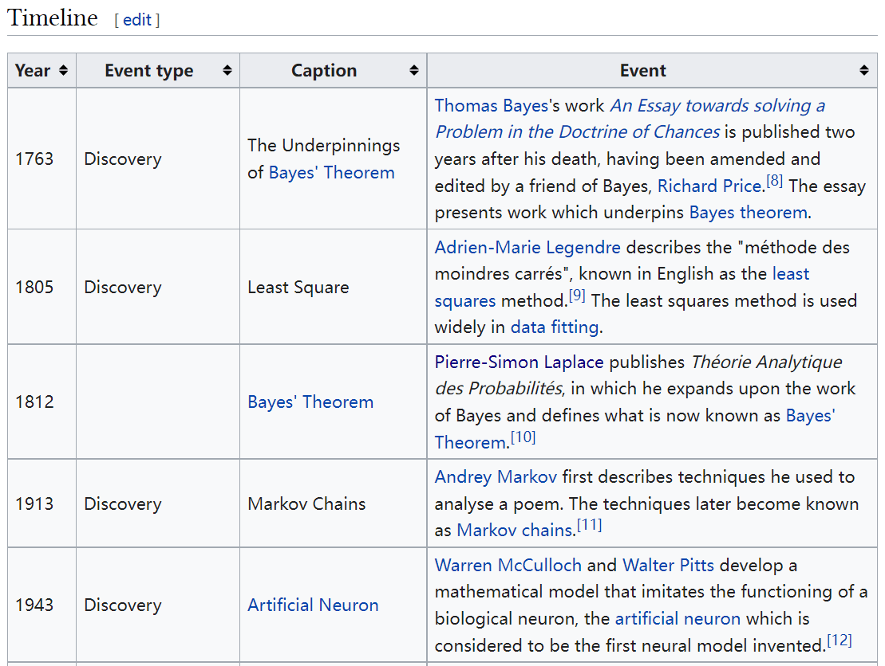

---

## 2. 什么是统计（Statistics）？

要理解统计，先要把它和[[概率论]]区分开：

| 方向 | 过程 | 例子 |
| --- | --- | --- |
| **概率论（Probability）** | 模型 → 数据 | 给定一个正常骰子（模型），掷出 1 点（数据）的概率是 $\frac{1}{6}$ |
| **统计（Statistics）** | 数据 → 模型参数 | 给定骰子多次结果（数据），估计每个点数的概率（模型） |

- 给定高斯分布 $X \sim N(\mu, \sigma^2)$（模型），$x$ 落在 $[\mu-\sigma,\ \mu+\sigma]$ 的概率约为 **68.27%**——这是概率论方向。
- 反过来，**从数据估计模型参数**就是统计。

> [!info] 历史小知识
> 统计在早期被称为**逆概率论（inverse probability theory）**，因为它正是概率论的逆过程。

---

## 3. 什么是贝叶斯分析（Bayesian Analysis）？

- 贝叶斯分析是统计学的一种分析方法，一种**基于[[贝叶斯定理]]（Bayes' Theorem）的方法**。
- 统计学主要有两大学派：

> [!note] 统计学两大学派
> 1. **贝叶斯学派（Bayesian）**
> 2. **频率学派（Frequentist）**

---

## 4. 贝叶斯推理的核心思想：重新分配可信度

### 4.1 引例一：人行道为什么是湿的？

早上走在路上，发现人行道是湿的，可能的原因有很多：刚下过雨、草坪刚浇水、地下水喷出、污水管破了、行人饮料洒了……

- 对每一种可能原因，我们基于以往知识都有一个**先验可信度（prior credibility）**，比如直觉上「刚下过雨」最有可能。
- 继续行走、获得新观测后，会**重新分配可信度**：
  - 若发现树和汽车也湿了 → 更确信「刚下过雨」；
  - 若只有一小块湿、旁边有空饮料杯 → 转而相信「饮料洒了」。

> [!summary] 贝叶斯推理的核心
> **根据观察（数据）重新分配各种假设的可信度（credibility），就是贝叶斯推理的核心思想。**

### 4.2 引例二：福尔摩斯的推理

> "How often have I said to you that when you have eliminated the impossible, whatever remains, however improbable, must be the truth?"
> —— (Doyle, 1890, chap. 6)

福尔摩斯通过观察、收集证据来排除不可能的情况，剩下的即使再不可能也是真相。这正是一次「重分配可信度」的过程：

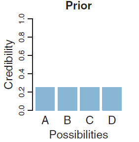
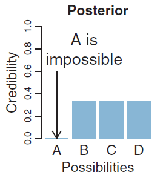

- 左图：收集证据**之前**各假设的可信度，称为**先验概率分布（prior distribution）**。
- 右图：根据证据重分配**之后**的可信度，称为**后验概率分布（posterior distribution）**。

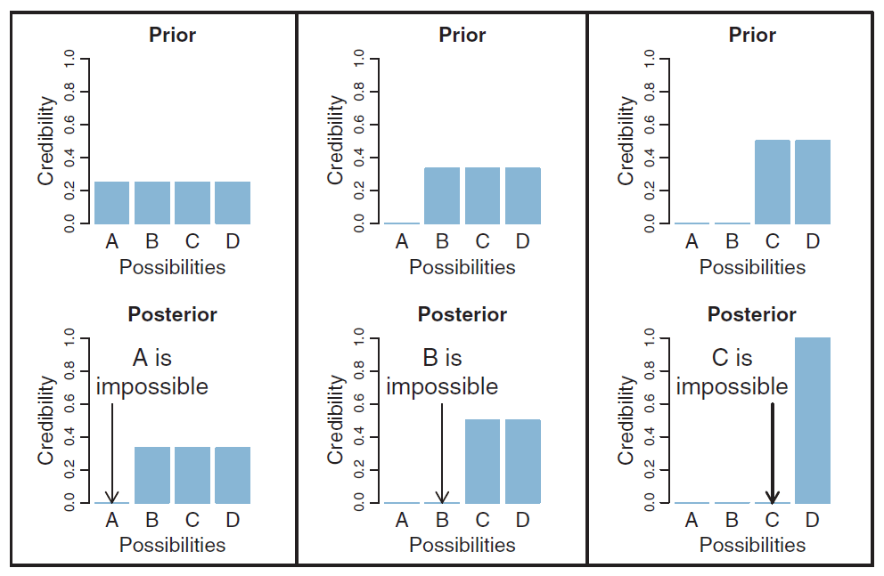

> [!note] 两个关键术语
> - **先验分布 [[先验概率分布]]（prior distribution）**：看到数据之前对参数/假设的可信度分布。
> - **后验分布 [[后验概率分布]]（posterior distribution）**：结合数据之后更新得到的可信度分布。

---

## 5. 数据是有噪声的，推理是有不确定性的

### 5.1 数据天然带噪声

福尔摩斯发现脚印就能精确推出鞋码，但**现实中测量并不准确**，只能推测一个范围。

以「测试新药能否降血压」为例：

- 实验组吃新药，控制组吃安慰剂；
- 血压受运动、压力、饮食等影响，测量方法本身也有浮动，不同人血压不同；
- 结果：**每组数据波动都很大，两组之间还会大量重叠**。

> [!warning] 关键认识
> 我们拿到的数据都带有「**噪声（noise）**」。**贝叶斯分析正是一种从噪声数据中推理可能性的方法。**

### 5.2 例子：弹力球工厂

一个工厂生产 4 种大小的弹力球（1、2、3、4），但制造有误差：生产「3」的球实际可能是 1.8 或 4.2，**均值仍为 3**。现取到 3 个球，大小为 **1.77、2.23、2.70**。问：生产的是哪种大小的球？

**第一步——先验概率分布**：假设各大小生产概率相同，均为 0.25；由于误差，每种球大小呈以 1/2/3/4 为中心的「钟形」分布。

$$P(\text{大小}=1)=P(\text{大小}=2)=P(\text{大小}=3)=P(\text{大小}=4)=0.25$$

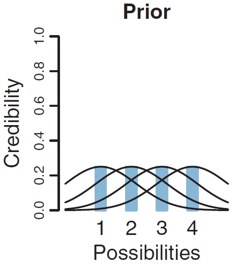

**第二步——后验概率分布**：根据数据 1.77、2.23、2.70 重分配概率，由贝叶斯推理得：

$$P(\text{大小}=2\mid D)=0.56,\quad P(\text{大小}=3\mid D)=0.31$$
$$P(\text{大小}=1\mid D)=0.11,\quad P(\text{大小}=4\mid D)=0.02$$

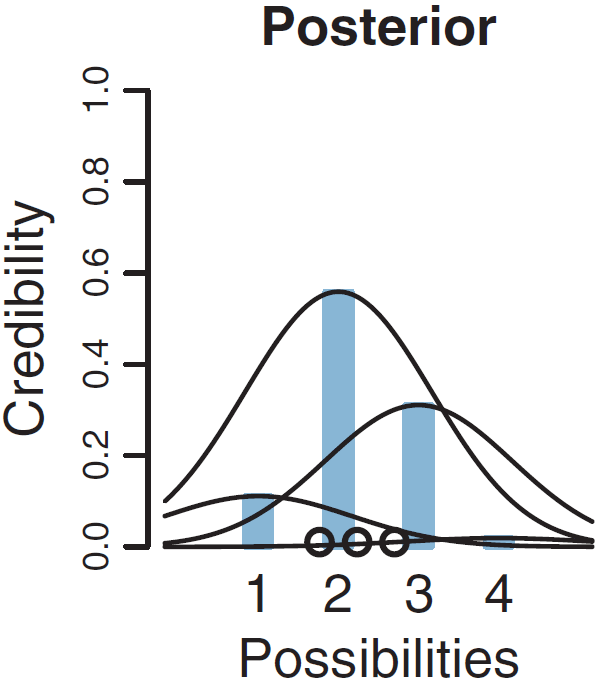

> [!summary] 结论
> 数据最支持「大小 = 2」（可信度从先验 0.25 升到后验 0.56），但其他大小并未被完全排除——这正体现了**推理的不确定性**。

---

## 6. 回顾：正态分布（Normal / Gaussian Distribution）

概率密度函数：

$$p(x)=\frac{1}{\sqrt{2\pi\sigma^2}}\exp\!\left(-\frac{1}{2}\frac{(x-\mu)^2}{\sigma^2}\right)$$

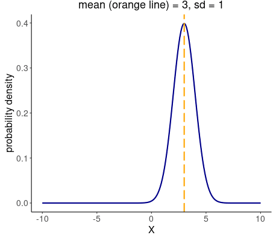

> [!note] 两个参数
> - $\mu$ 是**均值**，称为**位置参数（location parameter）**——决定钟形曲线的中心位置。
> - $\sigma$ 是**标准差**，称为**尺度参数（scale parameter）**——决定钟形曲线的胖瘦。
> - 形状为**钟形（bell-shaped）**。正态分布又称[[高斯分布]]（Gaussian distribution）。

---

## 7. 模型与参数

> [!tip] 数据分析的第一步
> 找一个能描述数据的**模型（model）**，模型由数学公式表达；公式中通常含有可变的**参数（parameters）**，用来控制模型形状以适配不同数据。

例如正态分布有 2 个参数：均值与标准差。给定数据后，贝叶斯推理要做的是：**对每个参数，计算它取不同值的可能性。**

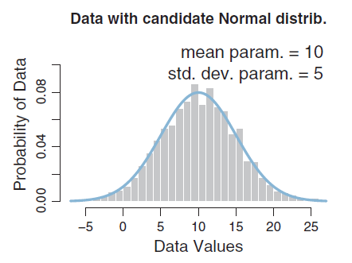

> [!note] 好模型的两个条件
> 1. **足够强的描述能力**——「看起来和数据很像」。
> 2. **有意义的参数**——参数能被解释。

---

## 8. 贝叶斯分析的 5 个步骤 ⭐

> [!important] 贝叶斯分析标准流程（务必记牢）
> 1. **确定**与问题相关的**数据**。
> 2. **确定**适合数据的**模型**和相应的**参数**。
> 3. 给要估计的参数指定一个**先验概率分布（prior）**。
> 4. 根据数据，用**贝叶斯推理重分配**参数概率，得到参数的**后验概率分布（posterior）**。
> 5. **检验**后验分布能否准确描述数据；若不行，**换一个模型**。

### 实例：用身高预测体重

**步骤 1：确定数据**——收集身高、体重数据。

**步骤 2：确定模型与参数**——数据看起来体重与身高成正比，设线性关系并加随机扰动：

$$\hat{y}=\beta_1 x+\beta_0,\qquad y\sim \mathrm{normal}(\hat{y},\ \sigma)$$

模型共 3 个参数：$\beta_1$（斜率）、$\beta_0$（截距）、$\sigma$（噪声标准差）。

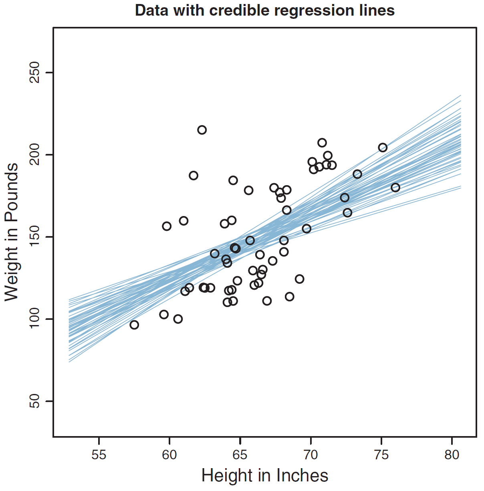

**步骤 3：指定先验**——假设对三个参数都没有先验知识，采用「**不明确的先验（uninformative prior）**」，即所有取值概率相同。

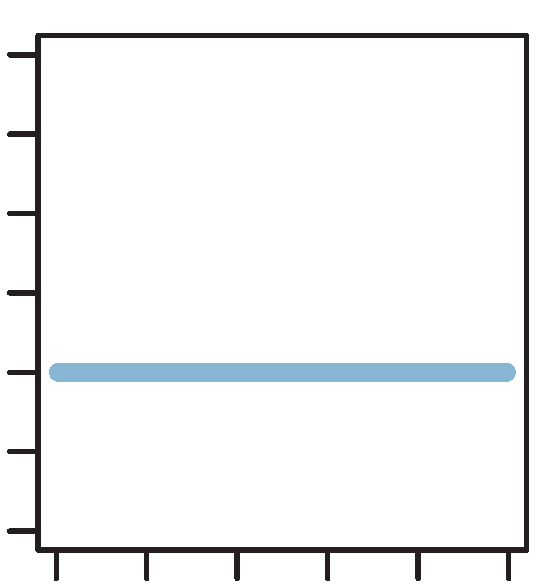

**步骤 4：得到后验**——（暂略推理过程）得到参数后验分布：

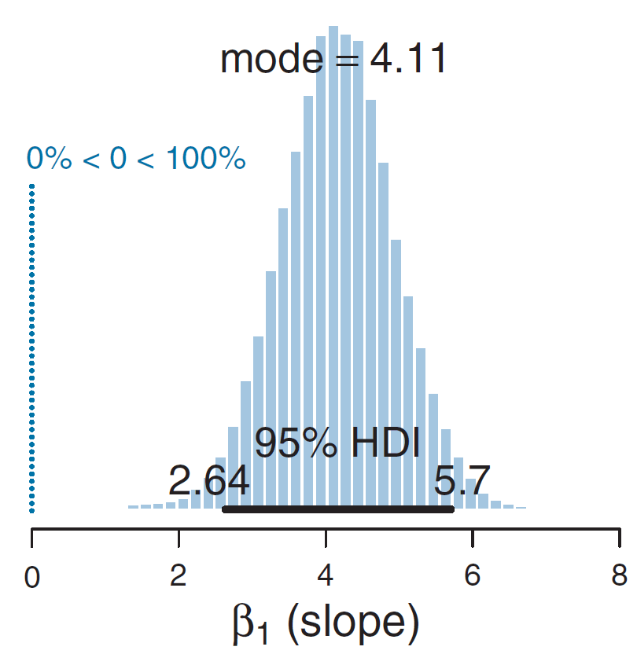

- **众数（mode）** = 4.11；
- **95% 最高密度区间（Highest Density Interval, HDI）** = $[2.64,\ 5.70]$。

> [!note] HDI（最高密度区间）
> [[最高密度区间]]是后验分布中概率密度最高、且总概率为指定比例（如 95%）的区间，是贝叶斯方法刻画参数不确定性的常用工具。

**步骤 5：检验模型**——画出模型预测与实际数据对比。

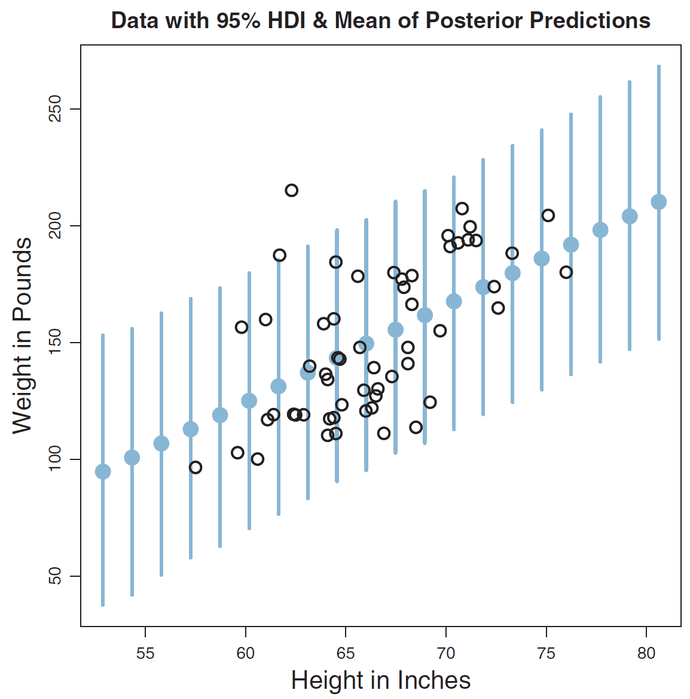

- 蓝色点：预测的均值；
- 蓝色线条：95% HDI（不确定性范围）。

---

## 9. 本章小结

> [!summary] 必须掌握的概念
> - **统计 [[统计]]**：从数据估计模型参数（与概率论方向相反）。
> - **先验概率分布 [[先验概率分布]]（prior）**：看数据前的可信度分布。
> - **后验概率分布 [[后验概率分布]]（posterior）**：结合数据后更新的可信度分布。
> - **贝叶斯分析 [[贝叶斯定理]]**：基于贝叶斯定理、从噪声数据中重分配可信度进行推理的方法。
> - **贝叶斯分析的 5 个步骤**：定数据 → 定模型 → 设先验 → 求后验 → 验模型。

> [!question] 自测
> 1. 用一句话说明概率论与统计的方向区别。
> 2. 「重新分配可信度」具体指什么？先验和后验分别对应哪个阶段？
> 3. 默写贝叶斯分析的 5 个步骤。
> 4. 正态分布的位置参数和尺度参数分别是什么？

---

**相关章节**：[[第2章_概率论回顾_笔记]] · [[第3章_极大似然估计与贝叶斯估计_笔记]]
