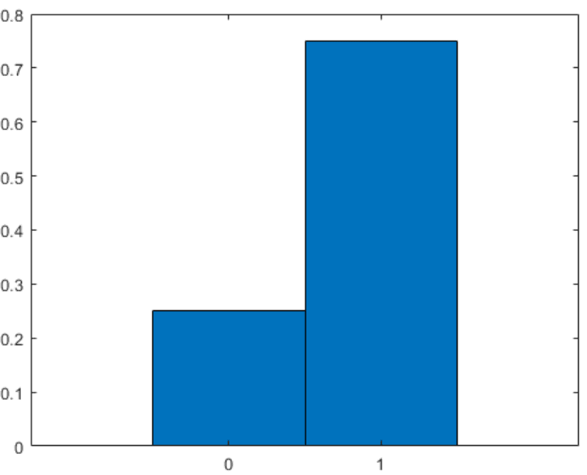
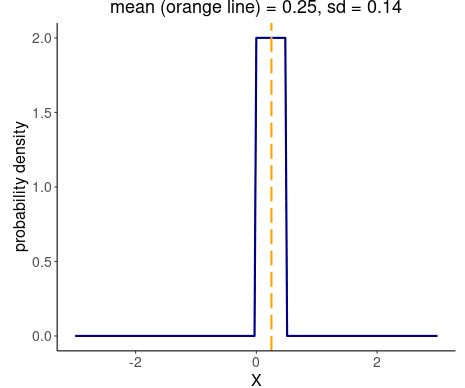
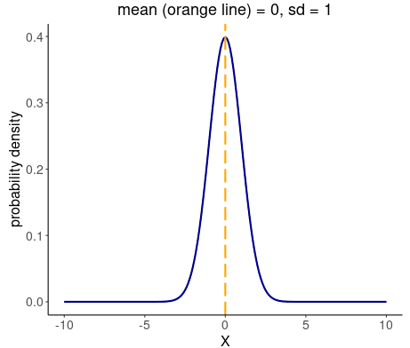
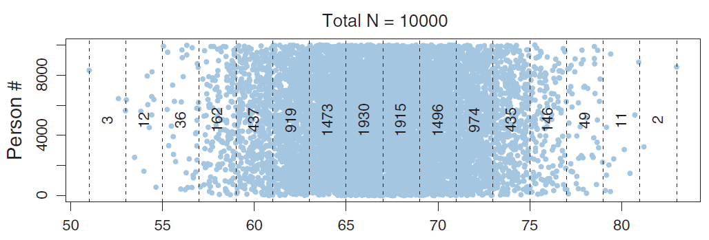
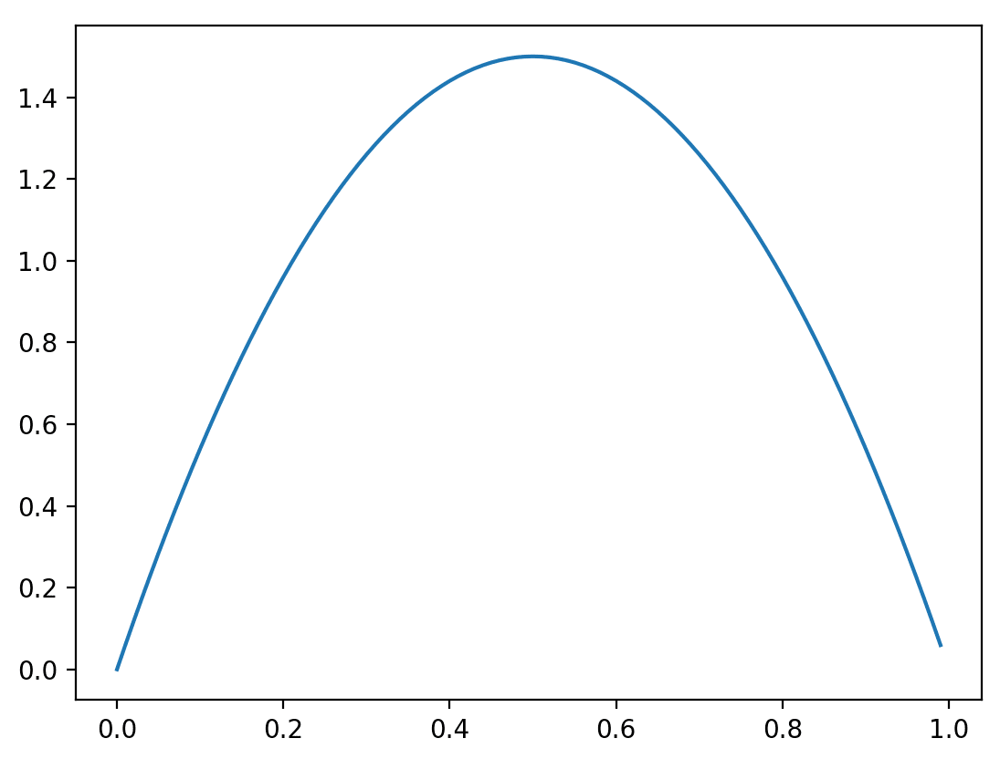
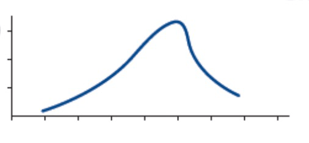
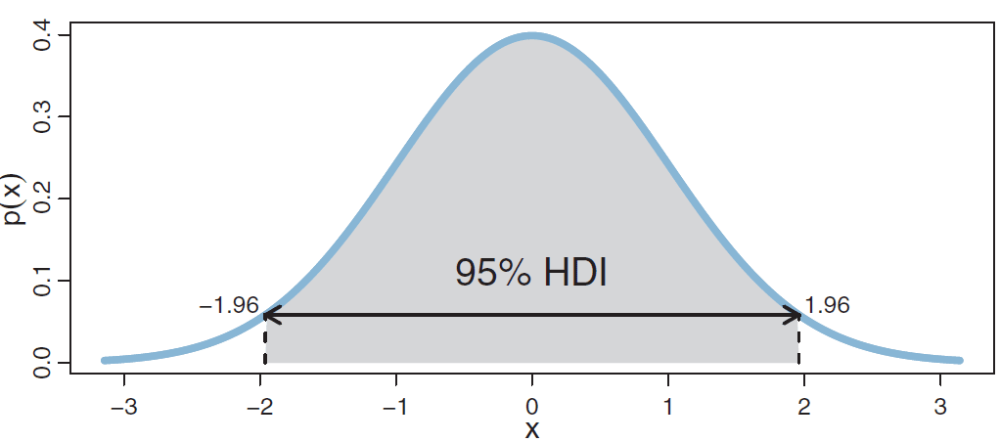
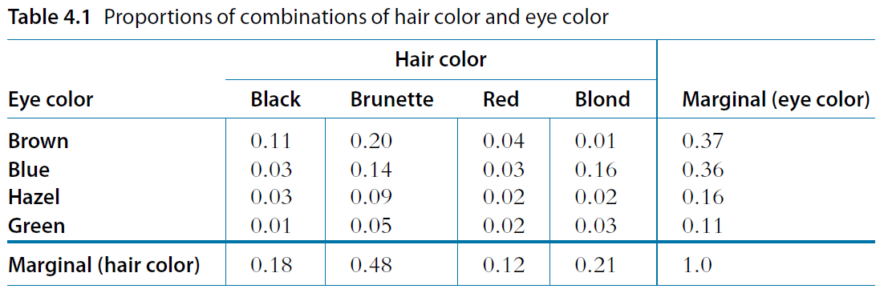

# 第2章 概率论回顾

> [!abstract] 本章导览
> 本章系统回顾贝叶斯分析所需的概率论基础：**概率与概率分布**（离散/连续）、**均值与方差**、**集中趋势**（均值/中位数/众数）、**最高密度区间 HDI**、**双因素分布**（联合/边缘/条件概率）、**独立性与条件独立性**，最后导出贯穿全课的**贝叶斯定理（Bayes' Rule）**及其四大要素（先验、似然、后验、证据）。

---

## 1. 什么是概率（Probability）？

- 随机事件发生的可能性，用**概率（probability）**来衡量其**不确定性（uncertainty）**。
- 随机事件所有可能结果的集合称为**样本空间（sample space）**。
- 例：抛硬币 $X$，样本空间为 $\{\text{正面}, \text{反面}\}$，$P(X=\text{正面})=0.5$。记号 $P(X=x)$ 简写为 $p_X(x)$ 或 $p(x)$。

### 参数表示：用 $\theta$ 刻画硬币偏向性

- 给定抛硬币结果，想推理硬币「正面的偏向性」。由于 $p(\text{正面})+p(\text{反面})=1$，只需推理其一。
- 用参数 $\theta$ 表示正面偏向性：$p(\text{正面})=\theta$。
  - $\theta=0.5$ 表示正面偏向性为 0.5；
  - $p(\theta=0.5)=0.9$ 表示「偏向性是 0.5」这件事的概率为 0.9。
- 我们要推理的就是 $\theta$ 所有可能取值的概率，即 **$\theta$ 的概率分布**；$\theta$ 的样本空间是 $[0,1]$。

> [!tip] 抛硬币是一类问题的代表
> 抛硬币代表所有「样本空间为 2 种」的随机事件：心脏手术后存活是否超一年、服药是否头痛、两候选人选举谁胜、大脑左/右偏侧性……

---

## 2. 概率分布（Probability Distribution）

> [!note] 定义
> **概率分布**是随机事件所有结果与其对应概率值的集合，分为**离散分布**与**连续分布**。

### 2.1 离散分布（Discrete Distribution）

- 样本空间取离散值（可能无穷多个，如泊松分布）。
- 每个结果的概率值称为**概率质量（probability mass）**，且总和为 1：

$$\sum_x p(x)=1$$

**伯努利分布（Bernoulli Distribution）**：样本空间 $\{Y=1, Y=0\}$，$P(Y=1)=\theta$，$P(Y=0)=1-\theta$，可合并为：

$$p(y\mid\theta)=\theta^{y}(1-\theta)^{1-y}$$

### 2.2 连续分布（Continuous Distribution）

- 样本空间取连续值时为连续分布，单点用**概率密度（probability density）**表示——相当于概率质量与区间长度之比。

> [!warning] 易错点
> - 连续分布中**任意单点的概率质量为 0**。
> - **概率密度值可以大于 1**（它不是概率，是密度）！

归一化与区间概率：

$$\int p(x)\,dx=1,\qquad P(a\le X\le b)=\int_{a}^{b} p(x)\,dx$$

**正态分布（Normal Distribution）**：

$$p(x)=\frac{1}{\sqrt{2\pi\sigma^2}}\exp\!\left(-\frac{1}{2}\frac{(x-\mu)^2}{\sigma^2}\right)$$

- $\mu$：均值，**位置参数（location parameter）**；$\sigma$：标准差，**尺度参数（scale parameter）**。详见 [[第1章_贝叶斯分析简介和基本概念_笔记]]。

### 2.3 离散化（Discretize）

连续值也可切分成区间，转换为离散分布。例：把身高切成若干区间，某区间样本数 1473/10000，则该区间概率为 0.1473。

---

## 3. 均值与方差

> [!note] 均值（Mean / 期望 Expected Value）
> $$E[x]=\sum_x p(x)\,x \quad(\text{离散}),\qquad E[x]=\int p(x)\,x\,dx \quad(\text{连续})$$

- 例：6 面均匀骰子，$E[x]=\frac{1}{6}(1+2+3+4+5+6)=3.5$。
- 例（连续）：$p(x)=6x(1-x),\ x\in[0,1]$，可积分求得其均值。

> [!note] 方差（Variance）与标准差
> $$\mathrm{var}(x)=\int p(x)\big(x-E[x]\big)^2 dx$$
> - 方差是 $x$ 与均值平方误差的均值，即**均方误差（Mean Squared Deviation, MSD）**。
> - 衡量分布相对均值的**离散程度**：方差越大越分散，越小越集中。
> - **标准差（standard deviation）= 方差的平方根**。

---

## 4. 集中趋势（Central Tendency）

集中趋势表示分布的中心位置或代表值，包括均值、中位数、众数。

### 均值、众数、中位数

> [!note] 三种集中趋势
> - **均值（mean）**：$E[x]=\int p(x)\,x\,dx$。
> - **众数（mode）**：概率密度最大处。离散：$\arg\max_M p(x=M)$；连续：$p'(M)=0$ 且 $p''(M)<0$（局部极大）。众数有时叫「峰值」，但不严谨。
> - **中位数（median）**：$P(x\le M)=P(x\ge M)=\frac{1}{2}$。

按峰的个数，分布分为**单峰（unimodal）**、**双峰（bimodal）**、**多峰（multimodal）**。

> [!tip] 对称分布的重要性质
> - 分布**对称** ⟹ 中位数 = 均值；
> - 分布**对称且单峰** ⟹ 中位数 = 均值 = 众数。

### 最高密度区间（Highest Density Interval, HDI）

> [!important] HDI 定义
> 最高密度区间指占据指定概率质量（如 95%）的区间，且**区间内每个点的概率密度都大于区间外的点**。
> $$\int_{\text{HDI}} p(x)\,dx = 0.95$$

> [!note] HDI vs 等尾区间
> 对于偏态分布，HDI 与「左右各切 2.5%」的等尾区间不同；HDI 给出的是**最可信、最窄**的那段区间。

---

## 5. 双因素分布（Two-way Distribution）

两个随机事件结合的概率分布。以**眼睛颜色 $e$、头发颜色 $h$** 的交叉表为例：

### 5.1 联合概率（Joint Probability）

两事件同时发生的概率 $p(e, h)$，满足 $\sum_e\sum_h p(e,h)=1$。例 $p(e=\text{Brown}, h=\text{Black})$。

### 5.2 边缘概率（Marginal Probability）

从联合分布求子集的概率分布——「**对另一个变量求和/积分**」：

$$p(e)=\sum_h p(e,h)\quad\text{或}\quad p(e)=\int p(e,h)\,dh$$

例：绿眼睛的概率 $=0.01+0.05+0.02+0.03=0.11$。

### 5.3 条件概率（Conditional Probability）

> [!note] 定义
> 在 $Y=y$ 已发生条件下 $X=x$ 的概率：
> $$p(x\mid y)=\frac{p(x,y)}{p(y)}=\frac{p(x,y)}{\sum_{x^*}p(x^*,y)}$$

例：蓝眼睛的人里金发概率 $=\dfrac{0.16}{0.36}=0.45$。

> [!important] 链式法则（Chain Rule）
> $$p(x,y)=p(x\mid y)\,p(y)$$
> $$p(x,y,z)=p(x\mid y,z)\,p(y\mid z)\,p(z)$$

---

## 6. 独立性与条件独立性

> [!note] 独立性（Independence）$x\perp y$
> 若对任意 $x,y$ 有 $p(x\mid y)=p(x)$（即 $y$ 的取值不影响 $x$ 的概率），则 $x,y$ **独立**：
> $$p(x,y)=p(x)\,p(y)$$

> [!note] 条件独立性（Conditional Independence）$x\perp y\mid z$
> 给定 $z$，若对任意 $x,y$ 有 $p(x\mid y,z)=p(x\mid z)$，则 $x,y$ **条件独立**：
> $$p(x,y\mid z)=p(x\mid z)\,p(y\mid z)$$

> [!example] 暴雨与晚饭的例子
> $X$=张三是否准时回家，$Y$=李四是否准时回家，$Z$=是否有暴雨。
> - **不知是否暴雨时**：「张三没准时」可能因暴雨，从而提升「李四没准时」的概率 ⟹ $X,Y$ **不独立**。
> - **已知有暴雨时**：「张三没准时」不再帮助判断李四 ⟹ $X\perp Y\mid Z$。
>
> 直觉：当 $X,Y$ 都依赖共因 $Z$ 时，二者通过 $Z$ 互相影响；一旦 $Z$ 给定，这条通路被「阻断」，二者条件独立。

---

## 7. 贝叶斯法则（Bayes' Rule）⭐

由条件概率定义 $p(x\mid y)=\dfrac{p(x,y)}{p(y)}$ 与 $p(y\mid x)=\dfrac{p(x,y)}{p(x)}$，得 $p(x\mid y)p(y)=p(y\mid x)p(x)$，于是：

> [!important] 贝叶斯法则
> $$p(x\mid y)=\frac{p(y\mid x)\,p(x)}{p(y)}=\frac{p(y\mid x)\,p(x)}{\sum_{x^*}p(y\mid x^*)\,p(x^*)}$$

### 用于「模型参数 $\theta$ 与数据 $D$」

当 $x$ 是参数 $\theta$、$y$ 是数据 $D$ 时：

$$\boxed{\,p(\theta\mid D)=\dfrac{p(D\mid\theta)\,p(\theta)}{p(D)}\,}$$

> [!important] 贝叶斯公式四大要素（核心记忆点）
> - $p(\theta)$：**先验（prior）**——看数据前对参数的信念。
> - $p(D\mid\theta)$：**似然（likelihood）**——参数取某值时数据出现的可能性。
> - $p(\theta\mid D)$：**后验（posterior）**——结合数据后更新的信念。
> - $p(D)$：**证据（evidence）**，又称**边缘似然（marginal likelihood）**：$p(D)=\sum_{\theta^*}p(D\mid\theta^*)p(\theta^*)$ 或 $\int p(D\mid\theta)p(\theta)\,d\theta$。
>
> 一句话：**后验 ∝ 似然 × 先验**，证据 $p(D)$ 是归一化常数。

---

## 8. 经典例子：抗原检测中的贝叶斯推理

> [!example] 题目
> 抗原检测准确率（敏感度）$p(T{=}1\mid\theta{=}1)=87\%$，假阳性率 $p(T{=}1\mid\theta{=}0)=3\%$。设先验患病概率 $p(\theta{=}1)=0.1\%$。某人检测阳性，求 $p(\theta{=}1\mid T{=}1)$。

$$p(\theta{=}1\mid T{=}1)=\frac{p(T{=}1\mid\theta{=}1)\,p(\theta{=}1)}{p(T{=}1\mid\theta{=}1)\,p(\theta{=}1)+p(T{=}1\mid\theta{=}0)\,p(\theta{=}0)}$$

$$=\frac{0.87\times 0.001}{0.87\times 0.001+0.03\times 0.999}\approx 0.028$$

> [!warning] 反直觉结论
> 即使检测**阳性**，真正患病概率也只有约 **2.8%**！原因是先验患病率极低（0.1%），假阳性的绝对数量远超真阳性。**解决办法：多次检测。**

**改变先验**：若某人所住楼栋已有确诊，先验升为 $p(\theta{=}1)=0.05$：

$$p(\theta{=}1\mid T{=}1)=\frac{0.87\times 0.05}{0.87\times 0.05+0.03\times 0.95}\approx 0.60$$

> [!summary] 启示
> 同样的阳性结果，先验从 0.1% 提到 5%，后验从 2.8% 飙升到 60%。**先验对后验影响巨大**——这正是贝叶斯思维的精髓。

---

## 9. 本章小结

> [!summary] 知识脉络
> - **概率分布**：离散（概率质量，和为 1）/ 连续（概率密度，可 >1，积分为 1）。
> - **描述统计量**：均值、方差/标准差；集中趋势（均值/中位数/众数）；最高密度区间 HDI。
> - **多变量关系**：联合 → 边缘（求和/积分消元）→ 条件（$p(x\mid y)=p(x,y)/p(y)$）；链式法则。
> - **（条件）独立性**：$p(x,y)=p(x)p(y)$；共因结构下「给定共因即条件独立」。
> - **贝叶斯定理**：$p(\theta\mid D)=\dfrac{p(D\mid\theta)p(\theta)}{p(D)}$，要素=先验/似然/后验/证据。

> [!question] 自测
> 1. 概率质量与概率密度有何区别？为什么密度可以大于 1？
> 2. 写出由联合分布求边缘分布、条件分布的公式。
> 3. 默写贝叶斯公式，并说明四个部分的名称。
> 4. 抗原检测例子说明了什么关于「先验」的重要道理？

---

**相关章节**：[[第1章_贝叶斯分析简介和基本概念_笔记]] · [[第3章_极大似然估计与贝叶斯估计_笔记]]
